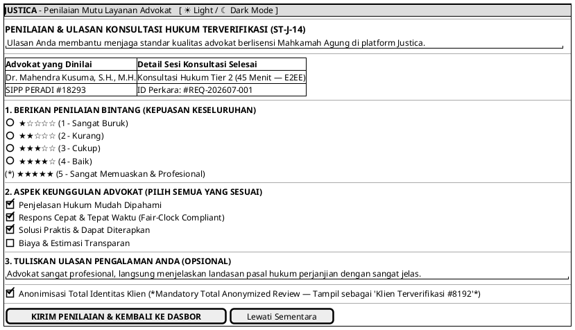

# MOCK-J-CL-07 [ORI]: Blocking Modal Rating & Ulasan Advokat Justica

## 1. METADATA SPESIFIKASI (ENGINEERING EDITION)
| Atribut | Nilai Spesifikasi |
| :--- | :--- |
| **ID Mockup** | `MOCK-J-CL-07` |
| **Nama Halaman** | Modal Wajib Penilaian Mutu & Ulasan Layanan Advokat (`client.justica.id/feedback/{session_id}`) |
| **Aktor Target** | Klien Hukum Terverifikasi (*Verified Legal Client*) |
| **Ref. Use Case** | `J-UC06` (`ST-J-14`: Memberikan Ulasan & Rating Advokat - Blocking Modal & Total Client Anonymization) |
| **Peta Navigasi (`from` -> `to`)** | `MOCK-J-CL-04` / `MOCK-J-CL-05` / `MOCK-J-CL-06` -> `MOCK-J-CL-07` -> `MOCK-J-CL-02A` (Dasbor Saya) |
| **Kepatuhan Keamanan** | WORM Quality Audit Trail, Total Client Anonymization Guard (`ST-J-14`), Anti-Spam NLP Filter |

---

## 2. DIAGRAM WIREFRAME LOGIS (PLANTUML SALT)

---

## 3. KAMUS DATA & ELEMEN UI (DATA FIELD DICTIONARY)
| ID Elemen | Nama Komponen UI | Tipe Data | Wajib? | Aturan Validasi Logis & Batasan Kepatuhan |
| :--- | :--- | :--- | :---: | :--- |
| `RAT-NAV-01`| `Toggle Theme Mode` | Action Button | Ya | Mengubah tema visual antarmuka Light/Dark Mode di local storage. |
| `RAT-RAD-01`| `Penilaian Bintang` | Radio 1-5  | Ya | Nilai integer `1 <= rating <= 5`. |
| `RAT-CHK-01`| `Aspek Keunggulan`  | Checkbox   | Tidak | Pilihan ganda kriteria profesionalitas advokat. |
| `RAT-TXT-01`| `Ulasan Tertulis`   | Textarea   | Tidak | Sanitasi HTML/XSS, maksimal 1.000 karakter, disaring filter NLP anti-spam. |
| `RAT-CHK-02`| `Anonymous Review`  | Boolean    | Tidak | Nilai default `false`. Jika `true`, nama di halaman profil publik disamarkan menjadi `"Klien Terverifikasi"`. |
| `RAT-BTN-01`| `Kirim Penilaian`   | Action Button | Ya | Merekam penilaian ke database reputasi advokat dan mengalihkan ke dasbor. |
| `RAT-BTN-02`| `Lewati Sementara`  | Action Button | Ya | Menunda penilaian selama 24 jam dan langsung mengembalikan ke dasbor klien `MOCK-J-CL-02A`. |

---

## 4. MATRIKS EVENT HANDLER & TRANSISI LOGIKA
| Event Trigger | Komponen UI | Kondisi Guard (*Pre-Condition*) | Aksi Sistem (*System Response*) | Transisi Layar (*Target*) |
| :--- | :--- | :--- | :--- | :--- |
| `onClick` | Tombol `[ KIRIM PENILAIAN ]`| `Rating >= 1` | Simpan ulasan ke WORM Audit Trail, hitung ulang skor rata-rata advokat. | -> `MOCK-J-CL-02A` (Dasbor Saya) |
| `onClick` | Tombol `[ LEWATI SEMENTARA ]`| Tidak ada | Tunda modal penilaian selama 24 jam dan kembali ke dasbor utama. | -> `MOCK-J-CL-02A` (Dasbor Saya) |
| `onClick` | Tombol `[ ☀ / ☾ Mode ]`     | Tidak ada | Mengganti tema visual antarmuka Light/Dark Mode. | Tetap di `MOCK-J-CL-07` |

---

## 5. KONTRAK INTEGRASI API & DATA BINDING (*API BINDING CONTRACT*)
| Aksi UI | HTTP Method & Endpoint | Payload Request JSON | Struktur Response JSON |
| :--- | :--- | :--- | :--- |
| Submit Rating & Review | `POST /api/v2/client/feedback/submit` | `{"session_id": "ROOM-091", "rating": 5, "tags": ["CLEAR_EXPLANATION"], "review": "Advokat profesional...", "is_anonymous": true}` | `201 Created: {"status": "RECORDED", "advocate_new_rating": 4.91}` |

---

## 6. MATRIKS PENANGANAN ERROR & CATATAN ARSITEKTUR TEKNIS
| Kode HTTP / Error | Skenario Pemicu Kegagalan | Pesan UI ke Pengguna (*User-Facing Message*) | Mekanisme Pemulihan / Fallback |
| :--- | :--- | :--- | :--- |
| `400 Bad Content` | Ulasan mengandung kata kasar atau fitnah | `"Ulasan tidak dapat diterbitkan karena melanggar pedoman komunitas hukum Justica."` | Klien diminta memperbaiki redaksi ulasan sebelum mengirimkan kembali. |
| `409 Duplicate`   | Klien sudah menilai sesi yang sama sebelumnya | `"Sesi ini telah menerima penilaian resmi dari Anda sebelumnya."` | Modal ditutup secara otomatis dan dialihkan ke dasbor. |

### Catatan Arsitektur Teknis:
1. **Immutable Rating Audit:** Penilaian bintang yang masuk tidak dapat diubah atau dihapus secara sepihak oleh advokat maupun admin tanpa putusan sidang etik resmi.
2. **Verified Client Tag:** Sistem hanya mengizinkan klien yang benar-benar telah menyelesaikan transaksi Escrow (`COMPLETED`) untuk meninggalkan ulasan (*anti-fake reviews*).
