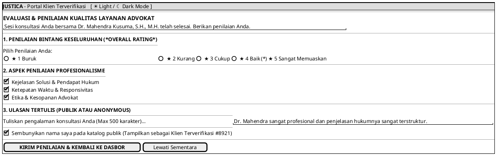

# MOCK-J-CL-07 [ORI]: Blocking Modal Rating & Ulasan Advokat Justica

## 1. METADATA SPESIFIKASI (ENGINEERING EDITION)
| Atribut | Nilai Spesifikasi |
| :--- | :--- |
| **ID Mockup** | `MOCK-J-CL-07` |
| **Nama Halaman** | Blocking Modal Evaluasi & Ulasan Kinerja Advokat (`client.justica.id/feedback/REQ-003`) |
| **Aktor Target** | Klien Hukum Terverifikasi (*Client*) |
| **Ref. Use Case** | `J-UC16` (Penilaian Kinerja & Ulasan Kualitas Advokat) |
| **Peta Navigasi (`from` -> `to`)** | `MOCK-J-CL-04` / `CL-05` / `CL-06` -> `MOCK-J-CL-07` -> `MOCK-J-CL-02A` (Dasbor Utama Klien) |
| **Kepatuhan Keamanan** | Verified Client Feedback Only (Anti-Review Manipulation), SHA-256 Feedback Hash |

---

## 2. DIAGRAM WIREFRAME LOGIS (PLANTUML SALT)

---

## 3. KAMUS DATA & ELEMEN UI (DATA FIELD DICTIONARY)
| ID Elemen | Nama Komponen UI | Tipe Data | Wajib? | Aturan Validasi Logis & Batasan Kepatuhan |
| :--- | :--- | :--- | :---: | :--- |
| `RAT-RAD-01` | `Penilaian Bintang`| Radio Integer | Ya | Nilai integer dari 1 sampai 5. |
| `RAT-CHK-01` | `Aspek Penilaian`  | Checkbox Group| Tidak| Pilihan multi-aspek keunggulan advokat. |
| `RAT-TXT-01` | `Ulasan Tertulis`  | Text Area     | Tidak| Maksimal 500 karakter dengan sanitasi XSS. |
| `RAT-CHK-02` | `Ulasan Anonymous` | Boolean       | Tidak| Nilai default `false`. Jika `true`, nama klien disamarkan pada tampilan publik. |
| `RAT-BTN-01` | `Kirim Penilaian`  | Action Button | Ya   | Merekam ulasan terverifikasi dan mengalkulasi ulang nilai rata-rata advokat. |

---

## 4. MATRIKS EVENT HANDLER & TRANSISI LOGIKA
| Event Trigger | Komponen UI | Kondisi Guard (*Pre-Condition*) | Aksi Sistem (*System Response*) | Transisi Layar (*Target*) |
| :--- | :--- | :--- | :--- | :--- |
| `onClick` | Tombol `[ KIRIM PENILAIAN ]`| `Rating >= 1` | Simpan ulasan ke database, perbarui rating advokat, tutup modal. | -> `MOCK-J-CL-02A` (Dasbor Klien) |
| `onClick` | Tombol `[ LEWATI SEMENTARA ]`| Tidak ada | Menutup modal sementara (akan muncul lagi saat sesi berikutnya selesai). | -> `MOCK-J-CL-02A` (Dasbor Klien) |

---

## 5. KONTRAK INTEGRASI API & DATA BINDING (*API BINDING CONTRACT*)
| Aksi UI | HTTP Method & Endpoint | Payload Request JSON | Struktur Response JSON |
| :--- | :--- | :--- | :--- |
| Submit Rating | `POST /api/v2/client/feedback/REQ-003` | `{"rating": 5, "aspects": ["CLEAR_SOLUTION", "PUNCTUAL"], "comment": "Sangat profesional", "anonymous": false}` | `201 Created: {"status": "FEEDBACK_RECORDED", "new_advocate_avg_rating": 4.91}` |

---

## 6. MATRIKS PENANGANAN ERROR & CATATAN ARSITEKTUR TEKNIS
| Kode HTTP / Error | Skenario Pemicu Kegagalan | Pesan UI ke Pengguna (*User-Facing Message*) | Mekanisme Pemulihan / Fallback |
| :--- | :--- | :--- | :--- |
| `400 Bad Request`| Mengklik tombol kirim tanpa memilih bintang | `"Mohon pilih penilaian bintang (1-5) terlebih dahulu sebelum mengirim."` | Sorot bagian bintang dengan animasi getar (*shake animation*). |

### Catatan Arsitektur Teknis:
1. **Verified Client Feedback Only:** Hanya klien yang telah menyelesaiakan sesi Escrow (`COMPLETED`) yang memiliki hak akses untuk memberikan ulasan.
