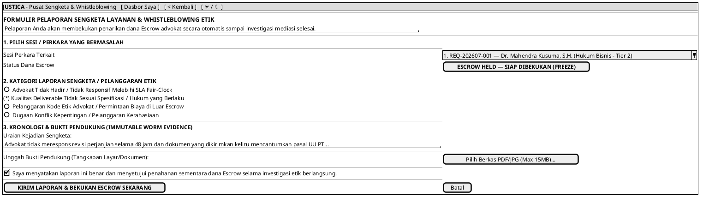

# MOCK-J-CL-08 [ORI]: Form Whistleblowing Etik & Pelaporan Sengketa Layanan Justica

## 1. METADATA SPESIFIKASI (ENGINEERING EDITION)
| Atribut | Nilai Spesifikasi |
| :--- | :--- |
| **ID Mockup** | `MOCK-J-CL-08` |
| **Nama Halaman** | Formulir Pelaporan Sengketa Layanan & Whistleblowing Pelanggaran Etik Advokat (`client.justica.id/dispute/new`) |
| **Aktor Target** | Klien Hukum Terverifikasi (*Verified Legal Client*) |
| **Ref. Use Case** | `J-UC15` (Pengajuan Sengketa Escrow & Laporan Etik Advokat) |
| **Peta Navigasi (`from` -> `to`)** | `MOCK-J-CL-04` / `MOCK-J-CL-05` / `MOCK-J-CL-06` -> `MOCK-J-CL-08` -> `MOCK-J-CL-09` (Pusat Pemantauan Dispute), `MOCK-J-CL-02A` (Dasbor Saya) |
| **Kepatuhan Keamanan** | Escrow Freeze Trigger (Immediate Mutex Lock), WORM Dispute Evidence Archive, KMS AES-256 Confidentiality |

---

## 2. DIAGRAM WIREFRAME LOGIS (PLANTUML SALT)

---

## 3. KAMUS DATA & ELEMEN UI (DATA FIELD DICTIONARY)
| ID Elemen | Nama Komponen UI | Tipe Data | Wajib? | Aturan Validasi Logis & Batasan Kepatuhan |
| :--- | :--- | :--- | :---: | :--- |
| `DISP-NAV-01`| `Tautan Dasbor Saya` | Navigation Link | Ya | Kembali ke dasbor utama klien `MOCK-J-CL-02A`. |
| `DISP-NAV-02`| `Tombol Kembali`     | Action Button   | Ya | Kembali ke halaman sesi sebelumnya (`CL-04`/`CL-05`/`CL-06`). |
| `DISP-NAV-03`| `Toggle Theme Mode`  | Action Button   | Ya | Mengubah tema visual antarmuka Light/Dark Mode di local storage. |
| `DISP-SEL-01`| `Pilih Sesi Perkara` | Dropdown | Ya | Menampilkan daftar sesi dengan status `ACTIVE` atau `PENDING_DELIVERABLE`. |
| `DISP-RAD-01`| `Kategori Laporan`   | Radio Selection | Ya | Pilihan tunggal alasan sengketa/pelanggaran etik. |
| `DISP-TXT-01`| `Kronologi Sengketa` | Textarea | Ya | Minimal 50 karakter, maksimal 2.000 karakter ter-sanitasi XSS. |
| `DISP-UP-01` | `Unggah Bukti`       | File Binary | Ya | Berkas `.pdf`/`.jpg`/`.png` maksimal 15MB, di-hash SHA-256 untuk WORM. |
| `DISP-CHK-01`| `Consent Pernyataan` | Boolean | Ya | Wajib `true` untuk mengirimkan laporan sengketa. |
| `DISP-BTN-01`| `Kirim Laporan`      | Action Button | Ya | Memicu pembekuan status Escrow (`ESCROW_FROZEN`) dan membuat nomor tiket dispute. |
| `DISP-BTN-02`| `Tombol Batal`       | Action Button | Ya | Membatalkan pengisian form dan kembali ke dasbor. |

---

## 4. MATRIKS EVENT HANDLER & TRANSISI LOGIKA
| Event Trigger | Komponen UI | Kondisi Guard (*Pre-Condition*) | Aksi Sistem (*System Response*) | Transisi Layar (*Target*) |
| :--- | :--- | :--- | :--- | :--- |
| `onClick` | Tombol `[ KIRIM LAPORAN ]` | Form lengkap & `Consent == true` | Buat tiket dispute (`DSP-001`), ubah status Escrow menjadi `FROZEN`, kirim notifikasi ke Admin Kepatuhan. | -> `MOCK-J-CL-09` (Pusat Pemantauan Dispute) |
| `onClick` | Tombol `[ Batal ]`         | Tidak ada | Batalkan pengajuan laporan dan kembali ke dasbor utama. | -> `MOCK-J-CL-02A` |
| `onClick` | Header `[ Dasbor Saya ]`   | Sesi Klien Aktif | Kembali ke halaman dasbor utama klien. | -> `MOCK-J-CL-02A` |
| `onClick` | Tombol `[ < Kembali ]`     | Tidak ada | Navigasi kembali ke halaman sesi/ruang kerja sebelumnya. | -> `MOCK-J-CL-04` / `CL-05` / `CL-06` |
| `onClick` | Tombol `[ ☀ / ☾ Mode ]`    | Tidak ada | Mengganti tema visual antarmuka Light/Dark Mode. | Tetap di `MOCK-J-CL-08` |

---

## 5. KONTRAK INTEGRASI API & DATA BINDING (*API BINDING CONTRACT*)
| Aksi UI | HTTP Method & Endpoint | Payload Request JSON | Struktur Response JSON |
| :--- | :--- | :--- | :--- |
| Submit Dispute & Freeze | `POST /api/v2/dispute/submit` | `{"session_id": "REQ-001", "category": "SUBSTANDARD_DELIVERABLE", "chronology": "...", "evidence_sha256": "e3b0c4..."}` | `201 Created: {"dispute_id": "DSP-202607-001", "escrow_status": "ESCROW_FROZEN", "mediator_assigned": "ADMIN_COMPLIANCE"}` |

---

## 6. MATRIKS PENANGANAN ERROR & CATATAN ARSITEKTUR TEKNIS
| Kode HTTP / Error | Skenario Pemicu Kegagalan | Pesan UI ke Pengguna (*User-Facing Message*) | Mekanisme Pemulihan / Fallback |
| :--- | :--- | :--- | :--- |
| `409 Conflict`    | Sesi perkara sudah selesai / Escrow sudah dicairkan | `"Perkara ini telah selesai dan dana Escrow telah dicairkan. Laporan diteruskan ke Dewan Etik."` | Alihkan laporan ke alur investigasi etik pasca-sesi tanpa freeze escrow. |
| `413 Payload Too Large`| Ukuran bukti lampiran melebihi 15MB | `"Ukuran berkas bukti melebihi batas 15MB. Silakan kompres berkas Anda."` | Tampilkan pesan peringatan inline dan minta pengunggahan ulang. |

### Catatan Arsitektur Teknis:
1. **Immediate Escrow Freeze:** Segera setelah laporan sengketa dikirim, mekanisme *database trigger* mengubah status rekening Escrow dari `PAID_ESCROW_HELD` menjadi `ESCROW_FROZEN` sehingga advokat tidak dapat melakukan pencairan dana.
2. **Immutable Evidence Ledger:** Seluruh lampiran bukti sengketa dicatat dengan *hash SHA-256* ke dalam penyimpanan WORM agar tidak bisa dimodifikasi selama proses mediasi.
