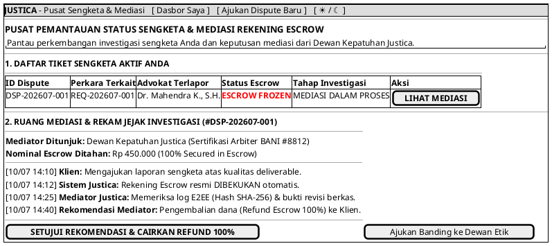

# MOCK-J-CL-09 [ORI]: Pusat Pemantauan Status Dispute & Mediasi Escrow Justica

## 1. METADATA SPESIFIKASI (ENGINEERING EDITION)
| Atribut | Nilai Spesifikasi |
| :--- | :--- |
| **ID Mockup** | `MOCK-J-CL-09` |
| **Nama Halaman** | Dasbor Pusat Pemantauan Sengketa & Mediasi Escrow Klien (`client.justica.id/disputes/{id}`) |
| **Aktor Target** | Klien Hukum Terverifikasi (*Verified Legal Client*) & Admin Kepatuhan Justica |
| **Ref. Use Case** | `J-UC21` (`ST-J-19`: Investigasi & Mediasi Pelanggaran Etik Advokat) |
| **Peta Navigasi (`from` -> `to`)** | `MOCK-J-CL-08` -> `MOCK-J-CL-09` -> `MOCK-J-CL-02A` (Dasbor Saya) |
| **Kepatuhan Keamanan** | Audit Trail Immutable SHA-256, Multi-Party Mediator Sign-off, Escrow Freeze / Refund Control |

---

## 2. DIAGRAM WIREFRAME LOGIS (PLANTUML SALT)

---

## 3. KAMUS DATA & ELEMEN UI (DATA FIELD DICTIONARY)
| ID Elemen | Nama Komponen UI | Tipe Data | Wajib? | Aturan Validasi Logis & Batasan Kepatuhan |
| :--- | :--- | :--- | :---: | :--- |
| `MON-NAV-01` | `Tautan Dasbor Saya`| Navigation Link | Ya | Kembali ke dasbor utama klien `MOCK-J-CL-02A`. |
| `MON-NAV-02` | `Ajukan Dispute Baru`| Action Button  | Ya | Membuka formulir pelaporan sengketa baru `MOCK-J-CL-08`. |
| `MON-NAV-03` | `Toggle Theme Mode` | Action Button   | Ya | Mengubah tema visual antarmuka Light/Dark Mode di local storage. |
| `MON-TBL-01` | `Tabel Dispute`     | Data Grid       | Ya | Menampilkan seluruh tiket dispute dengan status `FROZEN`, `UNDER_REVIEW`, atau `RESOLVED`. |
| `MON-ACT-01` | `Lihat Mediasi`     | Action Button   | Ya | Memuat rincian log investigasi untuk tiket dispute yang dipilih. |
| `MON-BTN-01` | `Setujui Refund`    | Action Button   | Ya | Memicu pelepasan pengembalian dana 100% ke rekening asal klien. |
| `MON-BTN-02` | `Ajukan Banding`    | Action Button   | Ya | Meneruskan sengketa ke tingkatan arbitrase/dewan etik lanjutan. |

---

## 4. MATRIKS EVENT HANDLER & TRANSISI LOGIKA
| Event Trigger | Komponen UI | Kondisi Guard (*Pre-Condition*) | Aksi Sistem (*System Response*) | Transisi Layar (*Target*) |
| :--- | :--- | :--- | :--- | :--- |
| `onClick` | Tombol `[ SETUJUI REKOMENDASI & REFUND ]` | `Recommendation == REFUND_100` | Cairkan dana Escrow kembali ke klien (`ESCROW_REFUNDED`), tutup tiket dispute. | -> `MOCK-J-CL-02A` (Dasbor Saya) |
| `onClick` | Tombol `[ Ajukan Banding ]`             | Tiket dispute terbuka | Kirim eskalasi kasus ke Dewan Etik Advokat & peninjauan senior. | Tetap (Status `ESCALATED`) |
| `onClick` | Tombol `[ LIHAT MEDIASI ]`              | Tiket valid | Menampilkan riwayat kronologi dan putusan mediator. | Tetap di `MOCK-J-CL-09` |
| `onClick` | Header `[ Ajukan Dispute Baru ]`        | Sesi Klien Aktif | Mengarahkan ke formulir pelaporan sengketa baru. | -> `MOCK-J-CL-08` |
| `onClick` | Header `[ Dasbor Saya ]`                | Sesi Klien Aktif | Kembali ke halaman dasbor utama klien. | -> `MOCK-J-CL-02A` |
| `onClick` | Tombol `[ ☀ / ☾ Mode ]`                 | Tidak ada | Mengganti tema visual antarmuka Light/Dark Mode. | Tetap di `MOCK-J-CL-09` |

---

## 5. KONTRAK INTEGRASI API & DATA BINDING (*API BINDING CONTRACT*)
| Aksi UI | HTTP Method & Endpoint | Payload Request JSON | Struktur Response JSON |
| :--- | :--- | :--- | :--- |
| Setujui Refund Escrow | `POST /api/v2/dispute/DSP-001/accept-refund` | `{"dispute_id": "DSP-202607-001", "client_consent_sha256": "e3b0c4..."}` | `200 OK: {"dispute_status": "RESOLVED_REFUNDED", "refund_transaction_id": "RFD-9012"}` |

---

## 6. MATRIKS PENANGANAN ERROR & CATATAN ARSITEKTUR TEKNIS
| Kode HTTP / Error | Skenario Pemicu Kegagalan | Pesan UI ke Pengguna (*User-Facing Message*) | Mekanisme Pemulihan / Fallback |
| :--- | :--- | :--- | :--- |
| `403 Forbidden`   | Klien mencoba menyetujui keputusan sebelum rekomendasi resmi keluar | `"Putusan mediasi belum diterbitkan oleh Dewan Kepatuhan."` | Tombol persetujuan dinonaktifkan sampai status investigasi selesai. |

### Catatan Arsitektur Teknis:
1. **Multi-Party Sign-off:** Pencairan Escrow akibat sengketa membutuhkan tanda tangan digital (*multi-sig*) dari Mediator Justica dan persetujuan Klien.
2. **Immutable Investigation Log:** Seluruh langkah mediasi direkam dengan *hash SHA-256* dalam database WORM agar transparan dan dapat dipertanggungjawabkan di pengadilan jika diperlukan.
