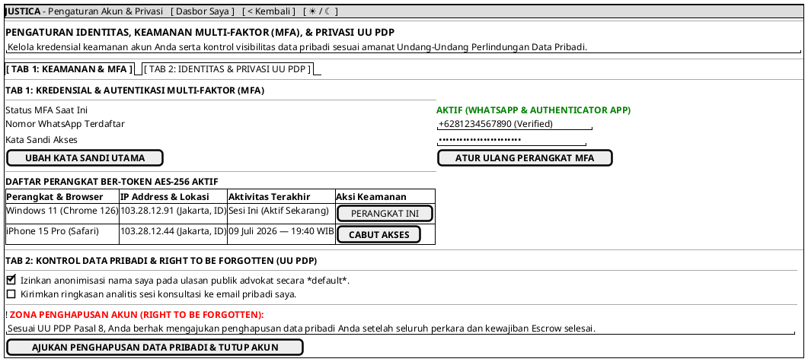

# MOCK-J-CL-10 [ORI]: Pengaturan Akun, Keamanan MFA, & Manajemen Privasi Klien Justica

## 1. METADATA SPESIFIKASI (ENGINEERING EDITION)
| Atribut | Nilai Spesifikasi |
| :--- | :--- |
| **ID Mockup** | `MOCK-J-CL-10` |
| **Nama Halaman** | Pengaturan Keamanan MFA, Profil Identitas, & Privasi Data Klien (`client.justica.id/settings`) |
| **Aktor Target** | Klien Hukum Terverifikasi (*Verified Legal Client*) |
| **Ref. Use Case** | `J-UC16` (Manajemen Profil & Keamanan MFA), `J-UC17` (Pengaturan Privasi UU PDP) |
| **Peta Navigasi (`from` -> `to`)** | `MOCK-J-CL-02A` -> `MOCK-J-CL-10` -> `MOCK-J-CL-02A` (Dasbor Saya) |
| **Kepatuhan Keamanan** | Mandatory MFA Device Management, Right to be Forgotten (UU PDP Art. 8), AES-256 Key Rotation |

---

## 2. DIAGRAM WIREFRAME LOGIS (PLANTUML SALT)

---

## 3. KAMUS DATA & ELEMEN UI (DATA FIELD DICTIONARY)
| ID Elemen | Nama Komponen UI | Tipe Data | Wajib? | Aturan Validasi Logis & Batasan Kepatuhan |
| :--- | :--- | :--- | :---: | :--- |
| `SET-NAV-01` | `Tautan Dasbor Saya`| Navigation Link | Ya | Kembali ke dasbor utama klien `MOCK-J-CL-02A`. |
| `SET-NAV-02` | `Tombol Kembali`    | Action Button   | Ya | Kembali ke halaman sebelumnya. |
| `SET-NAV-03` | `Toggle Theme Mode` | Action Button   | Ya | Mengubah tema visual antarmuka Light/Dark Mode di local storage. |
| `SET-TAB-01` | `Selector Tab Mode` | Tab Control     | Ya | Peralihan antara `TAB_SECURITY` dan `TAB_PRIVACY`. |
| `SET-BTN-01` | `Ubah Kata Sandi`   | Action Button   | Ya | Membuka modal verifikasi kata sandi lama dan penggantian sandi baru. |
| `SET-BTN-02` | `Atur Ulang MFA`    | Action Button   | Ya | Meminta verifikasi OTP sebelum menampilkan rahasia QR TOTP baru. |
| `SET-BTN-03` | `Cabut Akses Perangkat`| Action Button| Ya | Menghapus token AES-256 perangkat dari daftar sesi aktif di Redis. |
| `SET-CHK-01` | `Anonimisasi Ulasan`| Boolean         | Ya | Nilai default `true` untuk melindungi identitas klien. |
| `SET-CHK-02` | `Email Ringkasan`   | Boolean         | Ya | Pilihan opt-in pengiriman analitik ke email. |
| `SET-BTN-04` | `Hapus Data Pribadi`| Action Button   | Ya | Memicu audit kelayakan penghapusan data sesuai UU PDP. |

---

## 4. MATRIKS EVENT HANDLER & TRANSISI LOGIKA
| Event Trigger | Komponen UI | Kondisi Guard (*Pre-Condition*) | Aksi Sistem (*System Response*) | Transisi Layar (*Target*) |
| :--- | :--- | :--- | :--- | :--- |
| `onClick` | Tab `[ Keamanan ] / [ Privasi ]`| Tidak ada | Mengganti tampilan panel pengaturan aktif. | Tetap di `MOCK-J-CL-10` |
| `onClick` | Tombol `[ UBAH KATA SANDI ]`   | Autentikasi ulang aktif | Membuka modal penggantian kata sandi dengan verifikasi sandi lama. | Modal Ubah Sandi |
| `onClick` | Tombol `[ CABUT AKSES ]`       | `device.id != current_device`| Hapus sesi JWT/AES di Redis, cabut hak akses perangkat terkait. | Tetap di `MOCK-J-CL-10` |
| `onClick` | Tombol `[ HAPUS DATA PRIBADI ]`| `active_cases == 0` & `escrow == 0`| Ajukan tiket penghapusan data pribadi (*Right to be Forgotten*) ke Admin. | Modal Konfirmasi Penghapusan |
| `onClick` | Header `[ Dasbor Saya ]`       | Sesi Klien Aktif | Kembali ke halaman dasbor utama klien. | -> `MOCK-J-CL-02A` |
| `onClick` | Tombol `[ < Kembali ]`         | Tidak ada | Kembali ke halaman dasbor utama klien. | -> `MOCK-J-CL-02A` |
| `onClick` | Tombol `[ ☀ / ☾ Mode ]`        | Tidak ada | Mengganti tema visual antarmuka Light/Dark Mode. | Tetap di `MOCK-J-CL-10` |

---

## 5. KONTRAK INTEGRASI API & DATA BINDING (*API BINDING CONTRACT*)
| Aksi UI | HTTP Method & Endpoint | Payload Request JSON | Struktur Response JSON |
| :--- | :--- | :--- | :--- |
| Cabut Sesi Perangkat | `DELETE /api/v2/client/security/sessions/{session_id}` | *Headers: `Authorization: Bearer <jwt>`* | `200 OK: {"status": "REVOKED", "remaining_sessions": 1}` |

---

## 6. MATRIKS PENANGANAN ERROR & CATATAN ARSITEKTUR TEKNIS
| Kode HTTP / Error | Skenario Pemicu Kegagalan | Pesan UI ke Pengguna (*User-Facing Message*) | Mekanisme Pemulihan / Fallback |
| :--- | :--- | :--- | :--- |
| `409 Active Case Exists`| Klien meminta penghapusan akun saat ada perkara aktif | `"Penghapusan data tidak dapat diproses: Anda masih memiliki perkara atau dana Escrow aktif."` | Klien diarahkan untuk menyelesaikan seluruh perkara terlebih dahulu. |

### Catatan Arsitektur Teknis:
1. **UU PDP Article 8 Compliance:** Hak penghapusan data (*Right to be Forgotten*) memisahkan data pribadi dari log transaksi hukum WORM (nama klien dianonimkan menjadi UUID unik).
2. **Session Revocation:** Pencabutan akses perangkat langsung membatalkan *refresh token* di Redis sehingga perangkat asing keluar otomatis dalam <1 detik.
