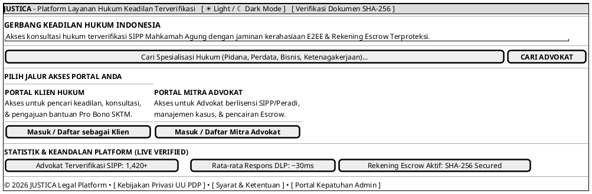

# MOCK-J-GATEWAY-01 [ORI]: Gerbang Utama & Pemilihan Peran (*Root Gateway*) Justica

## 1. METADATA SPESIFIKASI (ENGINEERING EDITION)
| Atribut | Nilai Spesifikasi |
| :--- | :--- |
| **ID Mockup** | `MOCK-J-GATEWAY-01` |
| **Nama Halaman** | Gerbang Depan & Pemilihan Peran Platform Justica (`justica.id`) |
| **Aktor Target** | Pengguna Publik, Calon Klien, Mitra Advokat, Admin Kepatuhan |
| **Ref. Use Case** | `J-UC01` (Registrasi Klien), `J-UC07` (Registrasi Advokat), `J-UC14` (Verifikasi Dokumen) |
| **Peta Navigasi (`from` -> `to`)** | `MOCK-J-GATEWAY-01` -> `MOCK-J-CL-01` (Klien Login), `MOCK-J-AD-01` (Advokat Login), `MOCK-J-PUBLIC-VERIFY` (Verifikasi SHA-256) |
| **Kepatuhan Keamanan** | HSTS Strict Transport, TLS 1.3 Mandatory, Client-Side Role Isolation, Rate Limiting 100 req/min |

---

## 2. DIAGRAM WIREFRAME LOGIS (PLANTUML SALT)

---

## 3. CATATAN ARSITEKTUR TEKNIS & COMPLIANCE HOOKS
1. **Pemisahan Domain/Subdomain:** Tombol Klien mengarah ke `client.justica.id` (`CL-01`), tombol Advokat mengarah ke `advocate.justica.id` (`AD-01`).
2. **Pelacakan Integritas Integritas:** Setiap sesi publik diberikan token *Zero-Trust CSRF* sebelum memasuki gerbang autentikasi.
