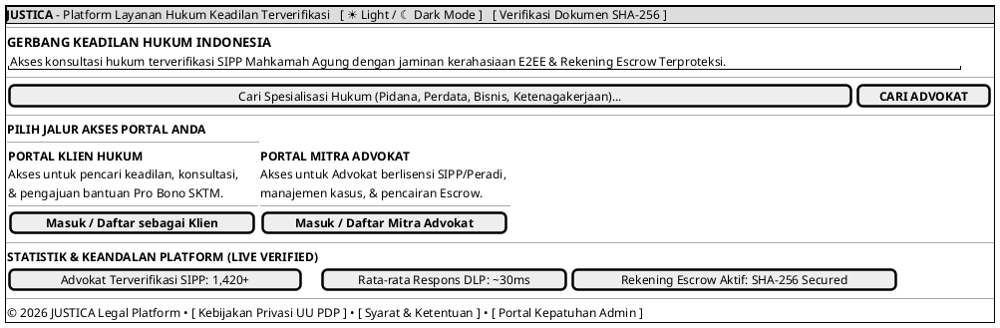

# MOCK-J-GATEWAY-01 [ORI]: Gerbang Utama & Pemilihan Peran (*Root Gateway*) Justica

## 1. METADATA SPESIFIKASI (ENGINEERING EDITION)
| Atribut | Nilai Spesifikasi |
| :--- | :--- |
| **ID Mockup** | `MOCK-J-GATEWAY-01` |
| **Nama Halaman** | Gerbang Depan & Pemilihan Peran Platform Justica (`justica.id`) |
| **Aktor Target** | Pengguna Publik, Calon Klien, Mitra Advokat, Admin Kepatuhan |
| **Ref. Use Case** | `J-UC01` (Registrasi Klien), `J-UC07` (Registrasi Advokat), `J-UC14` (Verifikasi Dokumen) |
| **Peta Navigasi (`from` -> `to`)** | `MOCK-J-GATEWAY-01` -> `MOCK-J-CL-01` (Klien Login), `MOCK-J-AD-01` (Advokat Login), `MOCK-J-PUBLIC-VERIFY` (Verifikasi SHA-256) |
| **Kepatuhan Keamanan** | HSTS Strict Transport, TLS 1.3 Mandatory, Client-Side Role Isolation, Rate Limiting 100 req/min |

---

## 2. DIAGRAM WIREFRAME LOGIS (PLANTUML SALT)

---

## 3. KAMUS DATA & ELEMEN UI (DATA FIELD DICTIONARY)
| ID Elemen | Nama Komponen UI | Tipe Data | Wajib? | Aturan Validasi Logis & Batasan Kepatuhan |
| :--- | :--- | :--- | :---: | :--- |
| `GW01-IN-01` | `Cari Spesialisasi` | String | Tidak | Filter teks pencarian elastis (alphanumeric `^[a-zA-Z0-9\s]{0,50}$`), sanitasi input SQLi/XSS. |
| `GW01-BTN-01`| `Tombol Cari Advokat` | Action Button | Ya | Mengarahkan ke direktori dengan parameter string pencarian terenkripsi URL. |
| `GW01-BTN-02`| `Portal Klien Hukum` | Role Button | Ya | Membuka subdomain `client.justica.id` (`CL-01`) dengan isolasi token sesi klien. |
| `GW01-BTN-03`| `Portal Mitra Advokat`| Role Button | Ya | Membuka subdomain `advocate.justica.id` (`AD-01`) dengan protokol keamanan advokat. |
| `GW01-BTN-04`| `Verifikasi SHA-256` | Utility Button| Ya | Membuka `verify.justica.id` (`PUBLIC-VERIFY`) tanpa memerlukan login/autentikasi. |

---

## 4. MATRIKS EVENT HANDLER & TRANSISI LOGIKA
| Event Trigger | Komponen UI | Kondisi Guard (*Pre-Condition*) | Aksi Sistem (*System Response*) | Transisi Layar (*Target*) |
| :--- | :--- | :--- | :--- | :--- |
| `onClick` | Tombol `[ Masuk sebagai Klien ]` | SSL/TLS Validated | Inisiasi CSRF Zero-Trust Token untuk portal klien. | -> `MOCK-J-CL-01` (Portal Login Klien) |
| `onClick` | Tombol `[ Masuk Mitra Advokat ]` | SSL/TLS Validated | Inisiasi isolasi sesi untuk portal mitra advokat. | -> `MOCK-J-AD-01` (Portal Login Advokat) |
| `onClick` | Tombol `[ Verifikasi Dokumen ]` | Tidak ada | Membuka endpoint verifikasi publik e-Meterai. | -> `MOCK-J-PUBLIC-VERIFY` |
| `onSubmit`| Kolom `Cari Spesialisasi` | `query.length <= 50` | Meneruskan *search query* ke parameter URL katalog advokat. | -> `MOCK-J-CL-02` (Katalog Advokat) |

---

## 5. CATATAN ARSITEKTUR TEKNIS & COMPLIANCE HOOKS
1. **Subdomain Isolation:** Platform memisahkan arus *Client*, *Advocate*, dan *Admin* pada level DNS & Reverse Proxy untuk mencegah *horizontal privilege escalation*.
2. **Zero-Trust CSRF Token:** Setiap pengunjung gerbang utama menerima token CSRF sekali pakai sebelum masuk ke formulir autentikasi.
