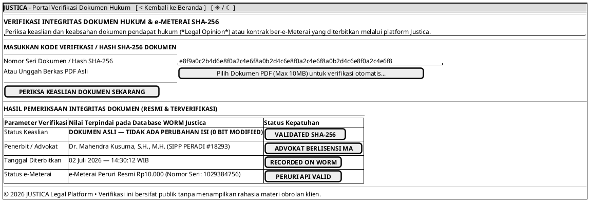

# MOCK-J-PUBLIC-VERIFY [ORI]: Portal Publik Verifikasi Keaslian Dokumen SHA-256 Justica

## 1. METADATA SPESIFIKASI (ENGINEERING EDITION)
| Atribut | Nilai Spesifikasi |
| :--- | :--- |
| **ID Mockup** | `MOCK-J-PUBLIC-VERIFY` |
| **Nama Halaman** | Portal Verifikasi Keaslian Dokumen Hukum & e-Meterai (`verify.justica.id`) |
| **Aktor Target** | Pihak Ketiga Publik (Hakim, Notaris, Instansi Pemerintah, Auditor, HRD) |
| **Ref. Use Case** | `J-UC14` (`ST-J-12`: Pemeriksaan Keabsahan & Hash SHA-256 Dokumen e-Meterai Peruri) |
| **Peta Navigasi (`from` -> `to`)** | `MOCK-J-GATEWAY-01` -> `MOCK-J-PUBLIC-VERIFY` -> `MOCK-J-GATEWAY-01` (Kembali ke Beranda) |
| **Kepatuhan Keamanan** | Anonymous Public Read-Only Endpoint, Rate Limiting (20 req/min/IP), WORM Immutable Cross-Check |

---

## 2. DIAGRAM WIREFRAME LOGIS (PLANTUML SALT)

---

## 3. KAMUS DATA & ELEMEN UI (DATA FIELD DICTIONARY)
| ID Elemen | Nama Komponen UI | Tipe Data | Wajib? | Aturan Validasi Logis & Batasan Kepatuhan |
| :--- | :--- | :--- | :---: | :--- |
| `VER-BTN-02` | `Kembali ke Beranda`| Action Button | Ya | Mengarahkan kembali ke halaman utama `MOCK-J-GATEWAY-01`. |
| `VER-NAV-01` | `Toggle Theme Mode` | Action Button | Ya | Mengubah tema visual antarmuka Light/Dark Mode di local storage. |
| `VER-IN-01`  | `Input Hash SHA-256` | String | Ya* | Tepat 64 karakter hex (`^[a-fA-F0-9]{64}$`). *Wajib jika berkas PDF tidak diunggah. |
| `VER-UP-01`  | `Unggah Berkas PDF` | File Binary | Ya* | Format berkas `.pdf` berukuran maksimal 10MB. Sistem menghitung hash SHA-256 lokal di browser. |
| `VER-BTN-01` | `Tombol Periksa` | Action Button | Ya | Membaca hash masukan atau file browser, lalu mengirim *read-only query* ke tabel WORM. |
| `VER-OUT-01` | `Status Keaslian` | Output Field | N/A | Menampilkan `VALIDATED SHA-256` jika tepat cocok 100% atau `TAMPERED DETECTED` jika berbeda 1 bit pun. |

---

## 4. MATRIKS EVENT HANDLER & TRANSISI LOGIKA
| Event Trigger | Komponen UI | Kondisi Guard (*Pre-Condition*) | Aksi Sistem (*System Response*) | Transisi Layar (*Target*) |
| :--- | :--- | :--- | :--- | :--- |
| `onClick` | Tombol `[ PERIKSA KEASLIAN ]` | `Hash == 64 Hex chars` OR `PDF File loaded` | Hitung/cocokkan hash dengan log immutable WORM Justica & Peruri API. | Tetap di `PUBLIC-VERIFY` (Tampilkan Tabel Hasil) |
| `onClick` | Tombol `[ < Kembali ke Beranda ]`| Tidak ada | Kembali ke halaman beranda utama Justica. | -> `MOCK-J-GATEWAY-01` |
| `onClick` | Tombol `[ ☀ / ☾ ]` | Tidak ada | Mengganti kelas CSS tema dan menyimpan preferensi ke localStorage. | Tetap di `MOCK-J-PUBLIC-VERIFY` |

---

## 5. KONTRAK INTEGRASI API & DATA BINDING (*API BINDING CONTRACT*)
| Aksi UI | HTTP Method & Endpoint | Payload Request JSON | Struktur Response JSON |
| :--- | :--- | :--- | :--- |
| Periksa Hash SHA-256 | `POST /api/v2/verify/document-hash` | `{"sha256_hash": "e8f9a0c2b4d6e8f0..."}` | `200 OK: {"valid": true, "issuer": "Dr. Mahendra Kusuma", "sipp": "18293", "issued_at": "2026-07-02T14:30:12Z", "emeterai_serial": "1029384756"}` |

---

## 6. MATRIKS PENANGANAN ERROR & CATATAN ARSITEKTUR TEKNIS
| Kode HTTP / Error | Skenario Pemicu Kegagalan | Pesan UI ke Pengguna (*User-Facing Message*) | Mekanisme Pemulihan / Fallback |
| :--- | :--- | :--- | :--- |
| `404 Not Found` | Hash dokumen tidak terdaftar di WORM | `"DOKUMEN TIDAK TERDAFTAR — Dokumen ini tidak diterbitkan melalui sistem resmi Justica."` | Tampilkan panel merah (*Warning Alert*) dan saran verifikasi fisik ke penerbit. |
| `409 Conflict`  | Hash berbeda dari versi dokumen asli | `"PERINGATAN MANIPULASI (TAMPERED) — Isi dokumen telah diubah setelah penandatanganan."` | Tampilkan rincian hash asli di server vs hash berkas yang diunggah. |
| `502 Bad Gateway`| Peruri e-Meterai API Timeout | `"Verifikasi e-Meterai sedang tertunda. Keaslian kriptografi SHA-256 Justica tetap VALID."` | Tampilkan status parsial (Hash Justica = VALID, e-Meterai = PENDING SYNC). |

### Catatan Arsitektur Teknis:
1. **Zero-Leak Public Verification:** Halaman ini hanya mengembalikan status keaslian hash (`VALID/INVALID`) dan metadata penandatanganan, **tanpa pernah menampilkan isi teks materi obrolan hukum** jika penguji tidak memiliki berkas fisiknya.
2. **Client-Side SHA-256 Hashing:** Saat pengguna mengunggah PDF, proses *hashing* dilakukan di memori browser lokal (*WebCrypto API*) sehingga berkas rahasia tidak dikirim mentah ke server.
