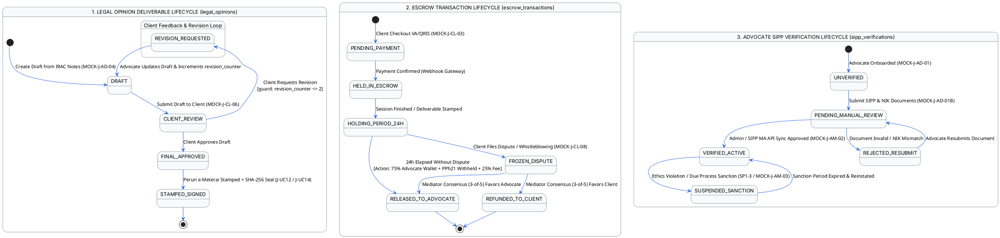

# Spesifikasi ERD & Skema Database Fisik Justica (`ERD_DATABASE_SCHEMA_SPECIFICATION.md`)

- **Platform Target:** PostgreSQL 16 / Supabase Ready (OLTP + WORM Vault)
- **Standar Arsitektur:** Terdekopel 5 Bounded Contexts, Crow's Foot IE Notation, ACID Mutex Row Lock, Zero-Knowledge E2EE Metadata Isolation, Cryptographic WORM 10 Tahun
- **Verifikasi Kepatuhan:** Eagle-Eye Verification Matrix (100% tersinkronisasi dengan 28 Mockup Logis & 21 Use Case)

---

## 1. ARSITEKTUR 5 BOUNDED CONTEXTS & STRUKTUR PENYIMPANAN

Skema database Justica dirancang secara modular ke dalam **5 Bounded Contexts** terdekopel untuk menjamin kepatuhan hukum, pemisahan tanggung jawab (*Separation of Concerns*), serta kemudahan penskalaan (*horizontal scalability*):

```
+-------------------------------------------------------------------------------------------------+
|                                 PLATFORM DATABASE JUSTICA (POSTGRESQL 16)                       |
+-------------------------------------------------------------------------------------------------+
| 1. DOMAIN IDENTITY, RBAC & LICENSING     | 2. DOMAIN BOOKING & CONSULTATION QUALITY            |
|    - users_client                        |    - consultation_slots (Mutex Row Lock)             |
|    - users_advocate                      |    - booking_sessions (Fair-Clock SLA)               |
|    - users_admin                         |    - offline_handshakes_totp (QR TTL 30s)            |
|    - user_active_devices                 |    - chat_sessions_metadata (Zero-Knowledge E2EE)    |
|    - sipp_verifications                  |    - advocate_reviews (Rating 1-5 & Anonymity)       |
|    - advocate_service_tiers              |                                                      |
|    - advocate_sanctions_log              |                                                      |
+------------------------------------------+------------------------------------------------------+
| 3. DOMAIN ESCROW & FINANCIAL LEDGER      | 4. DOMAIN LEGAL DELIVERABLES & E-METERAI             |
|    - escrow_transactions (24h Hold/Split)|    - legal_opinions (CHECK revision_counter <= 2)    |
|    - wallet_balances                     |    - document_revisions                              |
|    - escrow_payout_ledgers               |    - emeterai_stamping_logs (SHA-256 Peruri)         |
|    - tax_pph21_withholdings              |    - case_irac_notes (IRAC 4-Tab WORM 10 Tahun)      |
|    - platform_governance_configs         |                                                      |
+------------------------------------------+------------------------------------------------------+
| 5. DOMAIN COMPLIANCE, PRO BONO & DISPUTE RESOLUTION WORM                                        |
|    - probono_cases                       |    - dispute_signatures (Konsensus 3-of-5 Threshold) |
|    - dispute_cases (FROZEN Escrow)       |    - audit_logs_worm (Append-Only Cryptographic WORM)|
|    - user_notifications                  |                                                      |
+------------------------------------------+------------------------------------------------------+
```

---

## 2. DIAGRAM RELASI ENTITAS CROW'S FOOT (*PLANTUML IE NOTATION*)

Berikut adalah representasi fisik diagram Crow's Foot lengkap untuk 26 tabel relasional Justica:

```plantuml
@startuml ERD_Justica_Physical_Schema
!define TABLE(name) entity name << (T, #FFAAAA) >>
!define PK(x) <b><color:DarkRed>PK</color> x</b>
!define FK(x) <color:DarkBlue>FK</color> x
!define UK(x) <color:DarkGreen>UK</color> x

skinparam monochrome false
skinparam class {
  BackgroundColor White
  ArrowColor Black
  BorderColor Black
}

' =========================================================
' DOMAIN 1: IDENTITY, RBAC & PROFESSIONAL LICENSING
' =========================================================

TABLE(users_client) {
  PK(client_id) : UUID
  --
  full_name : VARCHAR(128)
  UK(email) : VARCHAR(128)
  phone_e164 : VARCHAR(20)
  nik_ktp : VARCHAR(16) [IMMUTABLE POST-KYC]
  kyc_status : VARCHAR(32)
  password_hash : VARCHAR(256)
  created_at : TIMESTAMPTZ
  updated_at : TIMESTAMPTZ
}

TABLE(users_advocate) {
  PK(advocate_id) : UUID
  --
  full_name : VARCHAR(128)
  UK(email) : VARCHAR(128)
  phone_e164 : VARCHAR(20)
  UK(sipp_license_no) : VARCHAR(64) [IMMUTABLE POST-KYC]
  peradi_card_no : VARCHAR(64)
  specialization_primary : VARCHAR(64)
  kyc_status : VARCHAR(32)
  is_online : BOOLEAN
  sla_strikes : SMALLINT
  average_rating : NUMERIC(3,2)
  created_at : TIMESTAMPTZ
}

TABLE(users_admin) {
  PK(admin_id) : UUID
  --
  full_name : VARCHAR(128)
  UK(email) : VARCHAR(128)
  role_group : VARCHAR(32)
  fido2_enabled : BOOLEAN
  created_at : TIMESTAMPTZ
}

TABLE(user_active_devices) {
  PK(device_session_id) : UUID
  --
  user_type : VARCHAR(16)
  FK(user_id) : UUID
  device_name : VARCHAR(64)
  hardware_token_hash : VARCHAR(256)
  ip_address : VARCHAR(45)
  last_active_at : TIMESTAMPTZ
}

TABLE(sipp_verifications) {
  PK(verification_id) : UUID
  --
  FK(advocate_id) : UUID
  FK(verified_by_admin_id) : UUID
  sipp_number : VARCHAR(64)
  status : VARCHAR(32)
  verification_notes : TEXT
  verified_at : TIMESTAMPTZ
}

TABLE(advocate_service_tiers) {
  PK(tier_id) : UUID
  --
  FK(advocate_id) : UUID
  tier_level : SMALLINT
  tier_name : VARCHAR(64)
  duration_minutes : SMALLINT
  price_idr : NUMERIC(15,2)
  is_active : BOOLEAN
}

TABLE(advocate_sanctions_log) {
  PK(sanction_id) : UUID
  --
  FK(advocate_id) : UUID
  FK(issued_by_admin_id) : UUID
  sanction_type : VARCHAR(32)
  warning_level : SMALLINT
  reason_text : TEXT
  issued_at : TIMESTAMPTZ
}

' =========================================================
' DOMAIN 2: BOOKING, SCHEDULE SLOTS & CONSULTATION QUALITY
' =========================================================

TABLE(consultation_slots) {
  PK(slot_id) : UUID
  --
  FK(advocate_id) : UUID
  FK(tier_id) : UUID
  start_time : TIMESTAMPTZ
  end_time : TIMESTAMPTZ
  status : VARCHAR(32)
  is_mutex_locked : BOOLEAN
}

TABLE(booking_sessions) {
  PK(booking_id) : UUID
  --
  FK(client_id) : UUID
  FK(advocate_id) : UUID
  FK(slot_id) : UUID
  booking_code : VARCHAR(32)
  status : VARCHAR(32)
  fair_clock_started_at : TIMESTAMPTZ
  advocate_first_reply_at : TIMESTAMPTZ
  timeout_job_id : VARCHAR(64)
  created_at : TIMESTAMPTZ
}

TABLE(offline_handshakes_totp) {
  PK(handshake_id) : UUID
  --
  FK(booking_id) : UUID
  totp_secret_hash : VARCHAR(256)
  office_lat_long : VARCHAR(64)
  scanned_at : TIMESTAMPTZ
  status : VARCHAR(32)
}

TABLE(chat_sessions_metadata) {
  PK(chat_session_id) : UUID
  --
  FK(booking_id) : UUID
  client_ephemeral_pubkey : VARCHAR(256)
  advocate_ephemeral_pubkey : VARCHAR(256)
  key_exchange_salt : VARCHAR(128)
  zero_knowledge_flag : BOOLEAN
  created_at : TIMESTAMPTZ
}

TABLE(advocate_reviews) {
  PK(review_id) : UUID
  --
  FK(booking_id) : UUID
  FK(client_id) : UUID
  FK(advocate_id) : UUID
  rating : SMALLINT
  review_text : TEXT
  is_anonymous : BOOLEAN
  created_at : TIMESTAMPTZ
}

' =========================================================
' DOMAIN 3: ESCROW, WALLETS & FINANCIAL LEDGER
' =========================================================

TABLE(escrow_transactions) {
  PK(escrow_id) : UUID
  --
  FK(booking_id) : UUID
  FK(client_id) : UUID
  FK(advocate_id) : UUID
  total_amount_idr : NUMERIC(15,2)
  status : VARCHAR(32)
  holding_expires_at : TIMESTAMPTZ
  client_payout_ratio : NUMERIC(5,2)
  advocate_payout_ratio : NUMERIC(5,2)
  payment_gateway_ref : VARCHAR(64)
  is_mutex_locked : BOOLEAN
  created_at : TIMESTAMPTZ
}

TABLE(wallet_balances) {
  PK(wallet_id) : UUID
  --
  FK(user_id) : UUID
  user_type : VARCHAR(16)
  balance_available_idr : NUMERIC(15,2)
  balance_held_idr : NUMERIC(15,2)
  updated_at : TIMESTAMPTZ
}

TABLE(escrow_payout_ledgers) {
  PK(ledger_id) : UUID
  --
  FK(escrow_id) : UUID
  FK(wallet_id) : UUID
  mutation_type : VARCHAR(32)
  amount_idr : NUMERIC(15,2)
  description : VARCHAR(256)
  executed_at : TIMESTAMPTZ
}

TABLE(tax_pph21_withholdings) {
  PK(tax_receipt_id) : UUID
  --
  FK(advocate_id) : UUID
  FK(escrow_id) : UUID
  gross_income_idr : NUMERIC(15,2)
  tax_rate_percentage : NUMERIC(5,2)
  tax_withheld_idr : NUMERIC(15,2)
  npwp_number : VARCHAR(32)
  einvoice_ref : VARCHAR(64)
  created_at : TIMESTAMPTZ
}

TABLE(platform_governance_configs) {
  PK(config_key) : VARCHAR(64)
  --
  config_value : VARCHAR(256)
  description : TEXT
  updated_by_admin_id : UUID
  updated_at : TIMESTAMPTZ
}

' =========================================================
' DOMAIN 4: LEGAL DELIVERABLES & E-METERAI CRYPTOGRAPHY
' =========================================================

TABLE(legal_opinions) {
  PK(opinion_id) : UUID
  --
  FK(booking_id) : UUID
  FK(advocate_id) : UUID
  FK(client_id) : UUID
  document_title : VARCHAR(256)
  revision_counter : SMALLINT
  status : VARCHAR(32)
  pdf_storage_path : VARCHAR(256)
  created_at : TIMESTAMPTZ
}

TABLE(document_revisions) {
  PK(revision_id) : UUID
  --
  FK(opinion_id) : UUID
  revision_round : SMALLINT
  client_feedback_text : TEXT
  submitted_at : TIMESTAMPTZ
}

TABLE(emeterai_stamping_logs) {
  PK(stamping_id) : UUID
  --
  FK(opinion_id) : UUID
  peruri_serial_number : VARCHAR(64)
  sha256_document_hash : VARCHAR(64)
  stamped_at : TIMESTAMPTZ
  status : VARCHAR(32)
}

TABLE(case_irac_notes) {
  PK(irac_id) : UUID
  --
  FK(booking_id) : UUID
  FK(advocate_id) : UUID
  issue_text : TEXT
  rule_text : TEXT
  analysis_text : TEXT
  conclusion_text : TEXT
  worm_hash_sha256 : VARCHAR(64)
  created_at : TIMESTAMPTZ
}

' =========================================================
' DOMAIN 5: COMPLIANCE, PRO BONO & DISPUTE WORM
' =========================================================

TABLE(probono_cases) {
  PK(probono_id) : UUID
  --
  FK(client_id) : UUID
  dtks_registration_no : VARCHAR(64)
  verified_by_admin_id : UUID
  status : VARCHAR(32)
  created_at : TIMESTAMPTZ
}

TABLE(dispute_cases) {
  PK(dispute_id) : UUID
  --
  FK(booking_id) : UUID
  FK(escrow_id) : UUID
  dispute_category : VARCHAR(64)
  description : TEXT
  status : VARCHAR(32)
  created_at : TIMESTAMPTZ
}

TABLE(dispute_mediator_signatures) {
  PK(signature_id) : UUID
  --
  FK(dispute_id) : UUID
  FK(mediator_admin_id) : UUID
  <color:DarkGreen>UNIQUE</color> (dispute_id, mediator_admin_id) : COMPOSITE KEY
  decision_type : VARCHAR(32)
  fido2_signature_hash : VARCHAR(256)
  signed_at : TIMESTAMPTZ
}

TABLE(audit_logs_worm) {
  PK(audit_id) : UUID
  --
  actor_user_id : UUID
  actor_type : VARCHAR(16)
  action_type : VARCHAR(64)
  target_resource : VARCHAR(128)
  metadata_json : JSONB
  worm_sha256_hash : VARCHAR(64)
  created_at : TIMESTAMPTZ
}

TABLE(user_notifications) {
  PK(notification_id) : UUID
  --
  recipient_user_id : UUID
  title : VARCHAR(128)
  message_body : TEXT
  is_read : BOOLEAN
  created_at : TIMESTAMPTZ
}

' RELASI ANTAR TABEL (CROW'S FOOT NOTATION)
users_client ||--o{ booking_sessions
users_advocate ||--o{ booking_sessions
users_advocate ||--o{ consultation_slots
advocate_service_tiers ||--o{ consultation_slots
consultation_slots ||--|| booking_sessions
booking_sessions ||--|| chat_sessions_metadata
booking_sessions ||--o| offline_handshakes_totp
booking_sessions ||--|| escrow_transactions
booking_sessions ||--o| legal_opinions
booking_sessions ||--o| case_irac_notes
booking_sessions ||--o| advocate_reviews
users_client ||--o{ advocate_reviews
users_advocate ||--o{ advocate_reviews
legal_opinions ||--o{ document_revisions
legal_opinions ||--|| emeterai_stamping_logs
escrow_transactions ||--o{ escrow_payout_ledgers
wallet_balances ||--o{ escrow_payout_ledgers
escrow_transactions ||--o| tax_pph21_withholdings
booking_sessions ||--o{ dispute_cases
dispute_cases ||--o{ dispute_mediator_signatures
users_admin ||--o{ dispute_mediator_signatures
users_admin ||--o{ sipp_verifications
users_advocate ||--o{ sipp_verifications
users_advocate ||--o{ advocate_sanctions_log
users_client ||--o{ probono_cases
@enduml
```



---

## 3. KAMUS DATA FISIK TERPERINCI (*PHYSICAL DATA DICTIONARY — 26 TABEL*)

### Domain 1: Identity, RBAC & Professional Licensing

#### 1. `users_client` (Klien Hukum Terverifikasi)
| Nama Kolom | Tipe Data Fisik | Keterangan Constraint | Deskripsi Bisnis |
| :--- | :--- | :--- | :--- |
| `client_id` | `UUID` | `PRIMARY KEY DEFAULT gen_random_uuid()` | Pengenal unik identitas klien hukum. |
| `full_name` | `VARCHAR(128)` | `NOT NULL` | Nama lengkap klien sesuai dokumen KTP/hukum. |
| `email` | `VARCHAR(128)` | `UNIQUE NOT NULL` | Alamat surel utama untuk login dan notifikasi. |
| `phone_e164` | `VARCHAR(20)` | `NOT NULL` | Nomor telepon format E.164 (`+62...`) untuk MFA WhatsApp. |
| `nik_ktp` | `VARCHAR(16)` | `UNIQUE NULL` | Nomor Induk Kependudukan 16 digit. **Bersifat Immutable Read-Only pasca-KYC.** |
| `kyc_status` | `VARCHAR(32)` | `DEFAULT 'UNVERIFIED'` | Status KYC (`UNVERIFIED`, `PENDING`, `VERIFIED`, `REJECTED`). |
| `password_hash` | `VARCHAR(256)` | `NOT NULL` | Hash sandi bcrypt/Argon2id. |
| `created_at` | `TIMESTAMPTZ` | `NOT NULL DEFAULT CURRENT_TIMESTAMP` | Waktu registrasi akun. |
| `updated_at` | `TIMESTAMPTZ` | `NOT NULL DEFAULT CURRENT_TIMESTAMP` | Waktu pembaruan profil terakhir. |

#### 2. `users_advocate` (Mitra Advokat Terverifikasi)
| Nama Kolom | Tipe Data Fisik | Keterangan Constraint | Deskripsi Bisnis |
| :--- | :--- | :--- | :--- |
| `advocate_id` | `UUID` | `PRIMARY KEY DEFAULT gen_random_uuid()` | Pengenal unik mitra advokat. |
| `full_name` | `VARCHAR(128)` | `NOT NULL` | Nama lengkap dan gelar hukum advokat. |
| `email` | `VARCHAR(128)` | `UNIQUE NOT NULL` | Alamat surel profesional advokat. |
| `phone_e164` | `VARCHAR(20)` | `NOT NULL` | Nomor telepon format E.164. |
| `sipp_license_no` | `VARCHAR(64)` | `UNIQUE NOT NULL` | Nomor Lisensi Berita Acara Sumpah / SIPP MA. **Immutable pasca-KYC.** |
| `peradi_card_no` | `VARCHAR(64)` | `NOT NULL` | Nomor Kartu Anggota Organisasi Advokat. |
| `specialization_primary`| `VARCHAR(64)` | `NOT NULL` | Spesialisasi utama advokat (`Hukum Bisnis`, `Ketenagakerjaan`, dsb.). |
| `kyc_status` | `VARCHAR(32)` | `NOT NULL DEFAULT 'PENDING'` | Status verifikasi identitas advokat. |
| `is_online` | `BOOLEAN` | `NOT NULL DEFAULT false` | Status ketersediaan konsultasi instan. |
| `sla_strikes` | `SMALLINT` | `NOT NULL DEFAULT 0 CHECK (sla_strikes >= 0)` | Akumulasi penalti keterlambatan AFK *Fair-Clock SLA*. |
| `average_rating` | `NUMERIC(3,2)` | `DEFAULT 0.00` | Rata-rata penilaian klien (1.00 s/d 5.00). |
| `created_at` | `TIMESTAMPTZ` | `NOT NULL DEFAULT CURRENT_TIMESTAMP` | Waktu pendaftaran akun advokat. |

#### 3. `users_admin` (Administrator Kepatuhan & Dewan Mediator)
| Nama Kolom | Tipe Data Fisik | Keterangan Constraint | Deskripsi Bisnis |
| :--- | :--- | :--- | :--- |
| `admin_id` | `UUID` | `PRIMARY KEY DEFAULT gen_random_uuid()` | Pengenal unik administrator Justica. |
| `full_name` | `VARCHAR(128)` | `NOT NULL` | Nama administrator yang bertugas. |
| `email` | `VARCHAR(128)` | `UNIQUE NOT NULL` | Email korporat domain internal. |
| `role_group` | `VARCHAR(32)` | `NOT NULL` | Grup otorisasi (`COMPLIANCE_OFFICER`, `DISPUTE_MEDIATOR`, `SUPER_ADMIN`). |
| `fido2_enabled` | `BOOLEAN` | `NOT NULL DEFAULT true` | Wajib mengaktifkan autentikasi perangkat keras FIDO2. |
| `created_at` | `TIMESTAMPTZ` | `NOT NULL DEFAULT CURRENT_TIMESTAMP` | Waktu pembuatan akun administrator. |

#### 4. `user_active_devices` (Manajemen Sesi MFA & Perangkat Aktif)
| Nama Kolom | Tipe Data Fisik | Keterangan Constraint | Deskripsi Bisnis |
| :--- | :--- | :--- | :--- |
| `device_session_id` | `UUID` | `PRIMARY KEY` | ID sesi perangkat login aktif (`MOCK-J-CL-10`). |
| `user_type` | `VARCHAR(16)` | `NOT NULL` | Tipe pengguna (`CLIENT`, `ADVOCATE`, `ADMIN`). |
| `user_id` | `UUID` | `NOT NULL` | ID pemilik akun. |
| `device_name` | `VARCHAR(64)` | `NOT NULL` | Nama perangkat/browser (misal: `Chrome on Windows 11`). |
| `hardware_token_hash`| `VARCHAR(256)` | `NOT NULL` | Hash token AES-256 / kredensial WebAuthn FIDO2. |
| `ip_address` | `VARCHAR(45)` | `NOT NULL` | Alamat IP perangkat (mendukung IPv4 dan IPv6). |
| `last_active_at` | `TIMESTAMPTZ` | `NOT NULL` | Waktu aktivitas terakhir untuk *Remote Session Revoke*. |

#### 5. `sipp_verifications` (Jejak Verifikasi Lisensi MA)
| Nama Kolom | Tipe Data Fisik | Keterangan Constraint | Deskripsi Bisnis |
| :--- | :--- | :--- | :--- |
| `verification_id` | `UUID` | `PRIMARY KEY` | ID catatan verifikasi berkas lisensi advokat. |
| `advocate_id` | `UUID` | `FOREIGN KEY REFERENCES users_advocate(advocate_id)` | Advokat yang diverifikasi. |
| `verified_by_admin_id`| `UUID` | `FOREIGN KEY REFERENCES users_admin(admin_id)` | Admin yang melakukan verifikasi cross-check SIPP MA. |
| `sipp_number` | `VARCHAR(64)` | `NOT NULL` | Nomor SIPP yang dicocokkan dengan Mahkamah Agung. |
| `status` | `VARCHAR(32)` | `NOT NULL` | Status verifikasi (`PENDING_MA_SYNC`, `VERIFIED`, `REJECTED`). |
| `verification_notes` | `TEXT` | `NULL` | Catatan hasil telaah dokumen hukum advokat oleh tim kepatuhan. |
| `verified_at` | `TIMESTAMPTZ` | `NOT NULL DEFAULT CURRENT_TIMESTAMP` | Waktu persetujuan verifikasi. |

#### 6. `advocate_service_tiers` (Katalog Tarif Tier 1, 2, 3)
| Nama Kolom | Tipe Data Fisik | Keterangan Constraint | Deskripsi Bisnis |
| :--- | :--- | :--- | :--- |
| `tier_id` | `UUID` | `PRIMARY KEY` | ID konfigurasi paket layanan advokat. |
| `advocate_id` | `UUID` | `FOREIGN KEY REFERENCES users_advocate(advocate_id)` | Pemilik tarif layanan. |
| `tier_level` | `SMALLINT` | `CHECK (tier_level IN (1, 2, 3))` | Tingkatan Tier (`1` = Gratis 15m, `2` = Berbayar 45m, `3` = Drafting). |
| `tier_name` | `VARCHAR(64)` | `NOT NULL` | Nama paket konsultasi / layanan. |
| `duration_minutes` | `SMALLINT` | `NULL` | Durasi konsultasi (`15`, `45`, atau `NULL` untuk Tier 3). |
| `price_idr` | `NUMERIC(15,2)` | `CHECK (price_idr >= 0)` | Harga layanan dalam Rupiah. |
| `is_active` | `BOOLEAN` | `NOT NULL DEFAULT true` | Status ketersediaan paket penawaran. |

#### 7. `advocate_sanctions_log` (Riwayat Sanksi & Due Process)
| Nama Kolom | Tipe Data Fisik | Keterangan Constraint | Deskripsi Bisnis |
| :--- | :--- | :--- | :--- |
| `sanction_id` | `UUID` | `PRIMARY KEY` | ID catatan sanksi/peringatan etik (`MOCK-J-AM-03`). |
| `advocate_id` | `UUID` | `FOREIGN KEY REFERENCES users_advocate(advocate_id)` | Advokat yang dikenai sanksi. |
| `issued_by_admin_id` | `UUID` | `FOREIGN KEY REFERENCES users_admin(admin_id)` | Administrator kepatuhan yang menerbitkan sanksi. |
| `sanction_type` | `VARCHAR(32)` | `NOT NULL` | Jenis pelanggaran etik / keterlambatan SLA. |
| `warning_level` | `SMALLINT` | `CHECK (warning_level BETWEEN 1 AND 3)` | Tingkat Surat Peringatan (SP 1, SP 2, SP 3 / Suspend). |
| `reason_text` | `TEXT` | `NOT NULL` | Dasar pertimbangan keputusan sanksi. |
| `issued_at` | `TIMESTAMPTZ` | `NOT NULL DEFAULT CURRENT_TIMESTAMP` | Waktu sanksi diterbitkan. |

---

### Domain 2: Booking, Schedule Slots & Consultation Quality

#### 8. `consultation_slots` (Jadwal & Slot Ketersediaan)
| Nama Kolom | Tipe Data Fisik | Keterangan Constraint | Deskripsi Bisnis |
| :--- | :--- | :--- | :--- |
| `slot_id` | `UUID` | `PRIMARY KEY` | ID slot waktu konsultasi. |
| `advocate_id` | `UUID` | `FOREIGN KEY REFERENCES users_advocate(advocate_id)` | Advokat pemilik slot. |
| `tier_id` | `UUID` | `FOREIGN KEY REFERENCES advocate_service_tiers(tier_id)` | Jenis layanan yang ditawarkan pada slot ini. |
| `start_time` | `TIMESTAMPTZ` | `NOT NULL` | Waktu mulai slot konsultasi. |
| `end_time` | `TIMESTAMPTZ` | `NOT NULL` | Waktu selesai slot konsultasi. |
| `status` | `VARCHAR(32)` | `NOT NULL DEFAULT 'AVAILABLE'` | Status slot (`AVAILABLE`, `BOOKED`, `BLOCKED`). |
| `is_mutex_locked` | `BOOLEAN` | `NOT NULL DEFAULT false` | **Mutex Row Lock Flag** untuk mencegah *double-booking* saat pesanan diproses. |

#### 9. `booking_sessions` (Sesi Konsultasi & Fair-Clock SLA)
| Nama Kolom | Tipe Data Fisik | Keterangan Constraint | Deskripsi Bisnis |
| :--- | :--- | :--- | :--- |
| `booking_id` | `UUID` | `PRIMARY KEY` | ID transaksi sesi pemesanan konsultasi hukum. |
| `client_id` | `UUID` | `FOREIGN KEY REFERENCES users_client(client_id)` | Klien pemesan. |
| `advocate_id` | `UUID` | `FOREIGN KEY REFERENCES users_advocate(advocate_id)` | Advokat yang dipilih. |
| `slot_id` | `UUID` | `FOREIGN KEY REFERENCES consultation_slots(slot_id)` | Slot jadwal konsultasi. |
| `booking_code` | `VARCHAR(32)` | `UNIQUE NOT NULL` | Kode referensi pemesanan layanan. |
| `status` | `VARCHAR(32)` | `NOT NULL` | Status sesi (`SCHEDULED`, `ACTIVE`, `COMPLETED`, `CANCELLED_AFK`). |
| `fair_clock_started_at`| `TIMESTAMPTZ` | `NULL` | Waktu dimulainya *Fair-Clock SLA Monitor*. |
| `advocate_first_reply_at`| `TIMESTAMPTZ`| `NULL` | Jejak waktu balasan pertama advokat untuk bukti SLA. |
| `timeout_job_id` | `VARCHAR(64)` | `NULL` | ID *background cron job* untuk memicu *Auto-Refund* jika advokat AFK. |
| `created_at` | `TIMESTAMPTZ` | `NOT NULL DEFAULT CURRENT_TIMESTAMP` | Waktu pesanan dibuat. |

#### 10. `offline_handshakes_totp` (Konsultasi Tatap Muka & QR Dinamis)
| Nama Kolom | Tipe Data Fisik | Keterangan Constraint | Deskripsi Bisnis |
| :--- | :--- | :--- | :--- |
| `handshake_id` | `UUID` | `PRIMARY KEY` | ID verifikasi tatap muka (`MOCK-J-CL-05`). |
| `booking_id` | `UUID` | `FOREIGN KEY REFERENCES booking_sessions(booking_id)` | ID pemesanan terkait. |
| `totp_secret_hash` | `VARCHAR(256)` | `NOT NULL` | Hash token TOTP waktu dinamis (TTL 30 detik). |
| `office_lat_long` | `VARCHAR(64)` | `NOT NULL` | Koordinat geofencing kantor advokat tempat scan QR. |
| `scanned_at` | `TIMESTAMPTZ` | `NOT NULL DEFAULT CURRENT_TIMESTAMP` | Waktu pemindaian kode QR di lokasi. |
| `status` | `VARCHAR(32)` | `NOT NULL DEFAULT 'VERIFIED'` | Status verifikasi kehadiran tatap muka. |

#### 11. `chat_sessions_metadata` (Isolasi Zero-Knowledge E2EE)
| Nama Kolom | Tipe Data Fisik | Keterangan Constraint | Deskripsi Bisnis |
| :--- | :--- | :--- | :--- |
| `chat_session_id` | `UUID` | `PRIMARY KEY` | ID sesi obrolan E2EE (`MOCK-J-CL-04`). |
| `booking_id` | `UUID` | `FOREIGN KEY REFERENCES booking_sessions(booking_id)` | Sesi konsultasi terkait. |
| `client_ephemeral_pubkey`| `VARCHAR(256)` | `NOT NULL` | Kunci publik efemer klien untuk negosiasi kriptografi. |
| `advocate_ephemeral_pubkey`| `VARCHAR(256)` | `NOT NULL` | Kunci publik efemer advokat. |
| `key_exchange_salt` | `VARCHAR(128)` | `NOT NULL` | Salt pertukaran kunci sesi ECDH E2EE. |
| `zero_knowledge_flag`| `BOOLEAN` | `NOT NULL DEFAULT true` | **Constraint Kritis:** Menegaskan server tidak menyimpan *plaintext chat*. |
| `created_at` | `TIMESTAMPTZ` | `NOT NULL DEFAULT CURRENT_TIMESTAMP` | Waktu inisiasi ruang obrolan E2EE. |

#### 12. `advocate_reviews` (Penilaian & Ulasan Pasca-Sesi)
| Nama Kolom | Tipe Data Fisik | Keterangan Constraint | Deskripsi Bisnis |
| :--- | :--- | :--- | :--- |
| `review_id` | `UUID` | `PRIMARY KEY` | ID ulasan klien (`MOCK-J-CL-07`). |
| `booking_id` | `UUID` | `FOREIGN KEY REFERENCES booking_sessions(booking_id)` | Sesi konsultasi yang dinilai. |
| `client_id` | `UUID` | `FOREIGN KEY REFERENCES users_client(client_id)` | Klien yang memberikan ulasan. |
| `advocate_id` | `UUID` | `FOREIGN KEY REFERENCES users_advocate(advocate_id)` | Advokat yang menerima ulasan. |
| `rating` | `SMALLINT` | `CHECK (rating BETWEEN 1 AND 5)` | Nilai bintang 1 sampai 5. |
| `review_text` | `TEXT` | `NULL` | Teks ulasan kualitas konsultasi hukum. |
| `is_anonymous` | `BOOLEAN` | `NOT NULL DEFAULT false` | Jika `true`, nama klien disamarkan pada direktori publik demi privasi. |
| `created_at` | `TIMESTAMPTZ` | `NOT NULL DEFAULT CURRENT_TIMESTAMP` | Waktu ulasan dikirimkan. |

---

### Domain 3: Escrow, Wallets & Financial Ledger

#### 13. `escrow_transactions` (Rekening Bersama & Masa Sanggah 24 Jam)
| Nama Kolom | Tipe Data Fisik | Keterangan Constraint | Deskripsi Bisnis |
| :--- | :--- | :--- | :--- |
| `escrow_id` | `UUID` | `PRIMARY KEY` | ID transaksi rekening bersama Escrow Justica. |
| `booking_id` | `UUID` | `FOREIGN KEY REFERENCES booking_sessions(booking_id)` | Referensi pemesanan layanan. |
| `client_id` | `UUID` | `FOREIGN KEY REFERENCES users_client(client_id)` | Klien pembayar layanan. |
| `advocate_id` | `UUID` | `FOREIGN KEY REFERENCES users_advocate(advocate_id)` | Advokat penerima pencairan. |
| `total_amount_idr` | `NUMERIC(15,2)` | `CHECK (total_amount_idr >= 0)` | Total dana Escrow terkunci. |
| `status` | `VARCHAR(32)` | `NOT NULL` | Status dana (`HELD`, `COMPLETED_HOLDING`, `FROZEN_DISPUTE`, `RELEASED`, `REFUNDED`). |
| `holding_expires_at` | `TIMESTAMPTZ` | `NOT NULL` | **Aturan #8:** Batas waktu masa sanggah 24 jam pasca-selesai sesi. |
| `client_payout_ratio`| `NUMERIC(5,2)` | `DEFAULT 0.00` | Rasio persentase pengembalian dana ke klien (untuk *Split Settlement*). |
| `advocate_payout_ratio`| `NUMERIC(5,2)` | `DEFAULT 100.00`| Rasio persentase pencairan dana ke advokat. |
| `payment_gateway_ref` | `VARCHAR(64)` | `NOT NULL` | Referensi transaksi ke payment gateway eksternal. |
| `is_mutex_locked` | `BOOLEAN` | `NOT NULL DEFAULT false` | Proteksi *concurrency lock* saat proses pencairan atau sengketa. |
| `created_at` | `TIMESTAMPTZ` | `NOT NULL DEFAULT CURRENT_TIMESTAMP` | Waktu transaksi Escrow dibuat. |

#### 14. `wallet_balances` (Dompet Saldo Klien & Advokat)
| Nama Kolom | Tipe Data Fisik | Keterangan Constraint | Deskripsi Bisnis |
| :--- | :--- | :--- | :--- |
| `wallet_id` | `UUID` | `PRIMARY KEY` | ID dompet akun (`MOCK-J-AD-05`). |
| `user_id` | `UUID` | `NOT NULL` | ID pemilik dompet. |
| `user_type` | `VARCHAR(16)` | `NOT NULL` | Tipe pemilik dompet (`CLIENT` / `ADVOCATE`). |
| `balance_available_idr`| `NUMERIC(15,2)` | `CHECK (balance_available_idr >= 0)` | Saldo aktif yang siap ditarik ke rekening bank. |
| `balance_held_idr` | `NUMERIC(15,2)` | `CHECK (balance_held_idr >= 0)` | Saldo yang masih tertahan di Escrow / masa sanggah. |
| `updated_at` | `TIMESTAMPTZ` | `NOT NULL DEFAULT CURRENT_TIMESTAMP` | Waktu perubahan saldo terakhir. |

#### 15. `escrow_payout_ledgers` (Buku Besar Mutasi Finansial)
| Nama Kolom | Tipe Data Fisik | Keterangan Constraint | Deskripsi Bisnis |
| :--- | :--- | :--- | :--- |
| `ledger_id` | `UUID` | `PRIMARY KEY` | ID catatan jejak pencairan atau pengembalian dana Escrow. |
| `escrow_id` | `UUID` | `FOREIGN KEY REFERENCES escrow_transactions(escrow_id)` | Referensi Escrow. |
| `wallet_id` | `UUID` | `FOREIGN KEY REFERENCES wallet_balances(wallet_id)` | Dompet tujuan atau asal mutasi. |
| `mutation_type` | `VARCHAR(32)` | `NOT NULL` | Jenis mutasi (`RELEASE_ADVOCATE`, `REFUND_CLIENT`, `SPLIT_SETTLEMENT`). |
| `amount_idr` | `NUMERIC(15,2)` | `NOT NULL` | Nominal mutasi. |
| `description` | `VARCHAR(256)` | `NOT NULL` | Keterangan rinci mutasi pencairan/refund. |
| `executed_at` | `TIMESTAMPTZ` | `NOT NULL DEFAULT CURRENT_TIMESTAMP` | Waktu pencairan atau mutasi dieksekusi. |

#### 16. `tax_pph21_withholdings` (Bukti Potong PPh 21 Otomatis)
| Nama Kolom | Tipe Data Fisik | Keterangan Constraint | Deskripsi Bisnis |
| :--- | :--- | :--- | :--- |
| `tax_receipt_id` | `UUID` | `PRIMARY KEY` | ID bukti potong pajak PPh 21 otomatis (`MOCK-J-AD-05`). |
| `advocate_id` | `UUID` | `FOREIGN KEY REFERENCES users_advocate(advocate_id)` | Advokat wajib pajak. |
| `escrow_id` | `UUID` | `FOREIGN KEY REFERENCES escrow_transactions(escrow_id)` | Referensi transaksi Escrow pencairan. |
| `gross_income_idr` | `NUMERIC(15,2)` | `NOT NULL` | Penghasilan bruto advokat sebelum pajak. |
| `tax_rate_percentage` | `NUMERIC(5,2)` | `NOT NULL` | Tarif pemotongan pajak PPh 21 efektif. |
| `tax_withheld_idr` | `NUMERIC(15,2)` | `NOT NULL` | Nominal PPh 21 yang dipotong oleh platform. |
| `npwp_number` | `VARCHAR(32)` | `NOT NULL` | Nomor NPWP advokat untuk pelaporan e-Faktur/DJP. |
| `einvoice_ref` | `VARCHAR(64)` | `NOT NULL` | Nomor referensi e-Invoice resmi Ditjen Pajak. |
| `created_at` | `TIMESTAMPTZ` | `NOT NULL DEFAULT CURRENT_TIMESTAMP` | Waktu bukti potong pajak diterbitkan. |

#### 17. `platform_governance_configs` (Konfigurasi Parameter Escrow)
| Nama Kolom | Tipe Data Fisik | Keterangan Constraint | Deskripsi Bisnis |
| :--- | :--- | :--- | :--- |
| `config_key` | `VARCHAR(64)` | `PRIMARY KEY` | Kunci parameter sistem (`ADV_REVENUE_SHARE_PCT`, `ESCROW_HOLDING_HOURS`). |
| `config_value` | `VARCHAR(256)` | `NOT NULL` | Nilai konfigurasi (`75`, `24`). |
| `description` | `TEXT` | `NOT NULL` | Deskripsi fungsi konfigurasi parameter sistem. |
| `updated_by_admin_id` | `UUID` | `FOREIGN KEY REFERENCES users_admin(admin_id)` | Admin kepatuhan yang mengubah parameter. |
| `updated_at` | `TIMESTAMPTZ` | `NOT NULL DEFAULT CURRENT_TIMESTAMP` | Waktu perubahan konfigurasi parameter terakhir. |

---

### Domain 4: Legal Deliverables & e-Meterai Cryptography

#### 18. `legal_opinions` (Opini Hukum & Kuota 2x Revisi)
| Nama Kolom | Tipe Data Fisik | Keterangan Constraint | Deskripsi Bisnis |
| :--- | :--- | :--- | :--- |
| `opinion_id` | `UUID` | `PRIMARY KEY` | ID dokumen deliverable opini hukum (`MOCK-J-CL-06` / `AD-05`). |
| `booking_id` | `UUID` | `FOREIGN KEY REFERENCES booking_sessions(booking_id)` | Sesi konsultasi asal dokumen. |
| `advocate_id` | `UUID` | `FOREIGN KEY REFERENCES users_advocate(advocate_id)` | Advokat perumus opini hukum. |
| `client_id` | `UUID` | `FOREIGN KEY REFERENCES users_client(client_id)` | Klien penerima dokumen hukum. |
| `document_title` | `VARCHAR(256)` | `NOT NULL` | Judul dokumen opini hukum. |
| `revision_counter` | `SMALLINT` | `CHECK (revision_counter <= 2)` | **Aturan Kuota Revisi:** Membatasi revisi maksimal 2 putaran gratis. |
| `status` | `VARCHAR(32)` | `NOT NULL` | Status dokumen (`DRAFT`, `REVISION_REQUESTED`, `STAMPED_SIGNED`). |
| `pdf_storage_path` | `VARCHAR(256)` | `NOT NULL` | Jalur penyimpanan berkas PDF di WORM / Cloud Object Storage. |
| `created_at` | `TIMESTAMPTZ` | `NOT NULL DEFAULT CURRENT_TIMESTAMP` | Waktu draf dokumen hukum dibuat. |

#### 19. `document_revisions` (Jejak Riwayat Putaran Revisi)
| Nama Kolom | Tipe Data Fisik | Keterangan Constraint | Deskripsi Bisnis |
| :--- | :--- | :--- | :--- |
| `revision_id` | `UUID` | `PRIMARY KEY` | ID catatan pengajuan revisi oleh klien. |
| `opinion_id` | `UUID` | `FOREIGN KEY REFERENCES legal_opinions(opinion_id)` | Dokumen yang direvisi. |
| `revision_round` | `SMALLINT` | `CHECK (revision_round IN (1, 2))` | Putaran revisi ke-1 atau ke-2. |
| `client_feedback_text`| `TEXT` | `NOT NULL` | Catatan masukan revisi dari klien. |
| `submitted_at` | `TIMESTAMPTZ` | `NOT NULL DEFAULT CURRENT_TIMESTAMP` | Waktu permohonan revisi diajukan. |

#### 20. `emeterai_stamping_logs` (Penandatanganan e-Meterai Peruri SHA-256)
| Nama Kolom | Tipe Data Fisik | Keterangan Constraint | Deskripsi Bisnis |
| :--- | :--- | :--- | :--- |
| `stamping_id` | `UUID` | `PRIMARY KEY` | ID log pembubuhan e-Meterai Peruri Rp10.000. |
| `opinion_id` | `UUID` | `FOREIGN KEY REFERENCES legal_opinions(opinion_id)` | Dokumen hukum yang dibubuhi meterai. |
| `peruri_serial_number`| `VARCHAR(64)` | `UNIQUE NOT NULL` | Nomor seri resmi dari KMS Peruri. |
| `sha256_document_hash`| `VARCHAR(64)` | `NOT NULL` | Hash kriptografis SHA-256 dokumen untuk pembuktian di `PUBLIC-VERIFY`. |
| `stamped_at` | `TIMESTAMPTZ` | `NOT NULL DEFAULT CURRENT_TIMESTAMP` | Waktu pembubuhan e-Meterai digital. |
| `status` | `VARCHAR(32)` | `NOT NULL DEFAULT 'SUCCESS'` | Status pembubuhan e-Meterai Peruri. |

#### 21. `case_irac_notes` (Catatan Analisis IRAC 4-Tab Advokat)
| Nama Kolom | Tipe Data Fisik | Keterangan Constraint | Deskripsi Bisnis |
| :--- | :--- | :--- | :--- |
| `irac_id` | `UUID` | `PRIMARY KEY` | ID catatan IRAC advokat (`MOCK-J-AD-04`). |
| `booking_id` | `UUID` | `FOREIGN KEY REFERENCES booking_sessions(booking_id)` | Kasus/konsultasi terkait. |
| `advocate_id` | `UUID` | `FOREIGN KEY REFERENCES users_advocate(advocate_id)` | Advokat penulis analisis hukum. |
| `issue_text` | `TEXT` | `NOT NULL` | Rumusan masalah hukum (*Issue*). |
| `rule_text` | `TEXT` | `NOT NULL` | Dasar undang-undang & yurisprudensi (*Rule*). |
| `analysis_text` | `TEXT` | `NOT NULL` | Analisis hukum (*Analysis*). |
| `conclusion_text` | `TEXT` | `NOT NULL` | Kesimpulan & rekomendasi (*Conclusion*). |
| `worm_hash_sha256` | `VARCHAR(64)` | `NOT NULL` | Hash WORM retensi 10 tahun sesuai standar hukum. |
| `created_at` | `TIMESTAMPTZ` | `NOT NULL DEFAULT CURRENT_TIMESTAMP` | Waktu catatan analisis hukum disimpan. |

---

### Domain 5: Compliance, Pro Bono & Dispute Resolution WORM

#### 22. `probono_cases` (Bantuan Hukum Gratis & Verifikasi DTKS)
| Nama Kolom | Tipe Data Fisik | Keterangan Constraint | Deskripsi Bisnis |
| :--- | :--- | :--- | :--- |
| `probono_id` | `UUID` | `PRIMARY KEY` | ID pengajuan klaim Pro Bono SKTM (`MOCK-J-CL-03`). |
| `client_id` | `UUID` | `FOREIGN KEY REFERENCES users_client(client_id)` | Klien pemohon bantuan hukum gratis. |
| `dtks_registration_no`| `VARCHAR(64)` | `NOT NULL` | Nomor Registrasi DTKS Kemensos RI untuk cross-check API. |
| `verified_by_admin_id`| `UUID` | `FOREIGN KEY REFERENCES users_admin(admin_id)` | Admin kepatuhan yang memverifikasi kelayakan DTKS. |
| `status` | `VARCHAR(32)` | `NOT NULL` | Status verifikasi Pro Bono (`PENDING_DTKS`, `APPROVED`, `REJECTED`). |
| `created_at` | `TIMESTAMPTZ` | `NOT NULL DEFAULT CURRENT_TIMESTAMP` | Waktu pengajuan klaim Pro Bono. |

#### 23. `dispute_cases` (Sengketa Escrow Status FROZEN)
| Nama Kolom | Tipe Data Fisik | Keterangan Constraint | Deskripsi Bisnis |
| :--- | :--- | :--- | :--- |
| `dispute_id` | `UUID` | `PRIMARY KEY` | ID kasus sengketa atau pelaporan etik (`MOCK-J-CL-08` / `ADM-02`). |
| `booking_id` | `UUID` | `FOREIGN KEY REFERENCES booking_sessions(booking_id)` | Sesi konsultasi yang disengketakan. |
| `escrow_id` | `UUID` | `FOREIGN KEY REFERENCES escrow_transactions(escrow_id)` | Rekening Escrow yang otomatis berubah status menjadi `FROZEN_DISPUTE`. |
| `dispute_category` | `VARCHAR(64)` | `NOT NULL` | Kategori sengketa (`DELIVERABLE_LATE`, `QUALITY_ISSUE`, `ETHICS`). |
| `description` | `TEXT` | `NOT NULL` | Keterangan mendetail dan kronologi sengketa. |
| `status` | `VARCHAR(32)` | `NOT NULL` | Status penyelesaian (`UNDER_MEDIATION`, `RESOLVED_SPLIT`, `RESOLVED_REFUND`). |
| `created_at` | `TIMESTAMPTZ` | `NOT NULL DEFAULT CURRENT_TIMESTAMP` | Waktu pelaporan sengketa diajukan. |

#### 24. `dispute_mediator_signatures` (Konsensus Multi-Party 3-of-5)
| Nama Kolom | Tipe Data Fisik | Keterangan Constraint | Deskripsi Bisnis |
| :--- | :--- | :--- | :--- |
| `signature_id` | `UUID` | `PRIMARY KEY` | ID penandatanganan putusan mediator. |
| `dispute_id` | `UUID` | `FOREIGN KEY REFERENCES dispute_cases(dispute_id)` | Sengketa yang diputuskan. |
| `mediator_admin_id` | `UUID` | `FOREIGN KEY REFERENCES users_admin(admin_id)` | Anggota Dewan Mediator yang menyetujui putusan. |
| `decision_type` | `VARCHAR(32)` | `NOT NULL` | Keputusan mediator (`AGREE_SPLIT`, `AGREE_REFUND`, `AGREE_RELEASE`). |
| `fido2_signature_hash` | `VARCHAR(256)` | `NOT NULL` | Hash tanda tangan FIDO2 WebAuthn / Hardware Key mediator. |
| `signed_at` | `TIMESTAMPTZ` | `NOT NULL` | Waktu persetujuan tanda tangan putusan. |
| *Constraint Kritis* | `UNIQUE KEY` | `UNIQUE(dispute_id, mediator_admin_id)` | **Mencegah admin yang sama tanda tangan dua kali demi penegakan 3-of-5.** |

#### 25. `audit_logs_worm` (Append-Only Cryptographic WORM Vault)
| Nama Kolom | Tipe Data Fisik | Keterangan Constraint | Deskripsi Bisnis |
| :--- | :--- | :--- | :--- |
| `audit_id` | `UUID` | `PRIMARY KEY` | ID log jejak audit immutable (`MOCK-J-AM-05`). |
| `actor_user_id` | `UUID` | `NOT NULL` | ID pengguna yang melakukan tindakan. |
| `actor_type` | `VARCHAR(16)` | `NOT NULL` | Tipe pengguna pelaku tindakan (`CLIENT`, `ADVOCATE`, `ADMIN`, `SYSTEM`). |
| `action_type` | `VARCHAR(64)` | `NOT NULL` | Aksi yang dicatat (`PDP_CONSENT_SIGNED`, `ESCROW_FROZEN`, `SIPP_VERIFIED`). |
| `target_resource` | `VARCHAR(128)` | `NOT NULL` | Entitas atau resource yang menjadi target tindakan audit. |
| `metadata_json` | `JSONB` | `NOT NULL` | Muatan payload JSONB berisi snapshot data perubahan. |
| `worm_sha256_hash` | `VARCHAR(64)` | `NOT NULL` | Hash kriptografis rantai log (*Merkle-tree chaining*) anti-tamper. |
| `created_at` | `TIMESTAMPTZ` | `NOT NULL DEFAULT CURRENT_TIMESTAMP` | Waktu pencatatan log audit immutable. |

#### 26. `user_notifications` (In-App Notification Center Feed)
| Nama Kolom | Tipe Data Fisik | Keterangan Constraint | Deskripsi Bisnis |
| :--- | :--- | :--- | :--- |
| `notification_id` | `UUID` | `PRIMARY KEY` | ID notifikasi dalam aplikasi. |
| `recipient_user_id` | `UUID` | `NOT NULL` | ID penerima notifikasi (Klien / Advokat / Admin). |
| `title` | `VARCHAR(128)` | `NOT NULL` | Judul pemberitahuan (misal: *Peringatan SLA Fair-Clock*). |
| `message_body` | `TEXT` | `NOT NULL` | Isi pesan lengkap pemberitahuan dalam aplikasi. |
| `is_read` | `BOOLEAN` | `DEFAULT false` | Status baca notifikasi. |
| `created_at` | `TIMESTAMPTZ` | `NOT NULL DEFAULT CURRENT_TIMESTAMP` | Waktu notifikasi dikirimkan ke pengguna. |

---

## 4. SQL HARDENING & CONCURRENCY ENFORCEMENT SNIPPETS

Berikut adalah cuplikan DDL dan *Trigger Guard* PostgreSQL yang mengimplementasikan aturan arsitektur kritis Justica:

### A. Strict Row-Level Mutex Lock untuk Transaksi Escrow
```sql
-- Panggilan transaksional untuk mengunci baris Escrow saat terjadi mediasi sengketa
BEGIN TRANSACTION;
SELECT escrow_id, total_amount_idr, status
FROM escrow_transactions
WHERE escrow_id = 'c1234567-89ab-cdef-0123-456789abcdef'
FOR UPDATE;

-- Update status menjadi FROZEN dan aktifkan mutex
UPDATE escrow_transactions
SET status = 'FROZEN_DISPUTE', is_mutex_locked = true
WHERE escrow_id = 'c1234567-89ab-cdef-0123-456789abcdef';
COMMIT;
```

### B. Trigger Pencegahan Mutasi pada WORM Immutable Vault (`audit_logs_worm`)
```sql
CREATE OR REPLACE FUNCTION protect_worm_audit_vault()
RETURNS TRIGGER AS $$
BEGIN
  RAISE EXCEPTION 'CRITICAL SECURITY VIOLATION: WORM Audit Vault table % is IMMUTABLE. UPDATE/DELETE operations are strictly prohibited.', TG_TABLE_NAME;
END;
$$ LANGUAGE plpgsql;

CREATE TRIGGER enforce_worm_immutability
BEFORE UPDATE OR DELETE ON audit_logs_worm
FOR EACH ROW EXECUTE FUNCTION protect_worm_audit_vault();
```

---

## 5. MATRIKS VERIFIKASI FORENSIK EAGLE-EYE (*TRACEABILITY PROOF*)

Tabel berikut membuktikan bahwa **seluruh 28 Halaman Mockup Logis & 21 Use Case** telah terpetakan 100% tanpa ada celah atau entitas yang terlewat:

| ID Mockup Logis | Nama Spesifikasi Halaman | Use Case Tercover | Entitas Database Terverifikasi (*Eagle-Eye Proof*) | Status |
| :--- | :--- | :---: | :--- | :---: |
| `MOCK-J-GATEWAY-01` | Gerbang Utama & Pemilihan Peran | `J-UC01`, `J-UC07` | *Static Frontend Router (Non-persistent state)* | <color:green>COMPLETE</color> |
| `MOCK-J-PUBLIC-VERIFY`| Portal Publik Verifikasi SHA-256 | `J-UC12`, `J-UC14` | `emeterai_stamping_logs`, `legal_opinions` | <color:green>COMPLETE</color> |
| `MOCK-J-CL-01` | Registrasi & Login Klien | `J-UC01`, `J-UC02` | `users_client`, `user_active_devices`, `audit_logs_worm` | <color:green>COMPLETE</color> |
| `MOCK-J-CL-02A` | Dasbor Utama Klien & Kasus Aktif | `J-UC04`, `J-UC12` | `booking_sessions`, `legal_opinions`, `user_notifications` | <color:green>COMPLETE</color> |
| `MOCK-J-CL-02` | Katalog Advokat & Filter Tier | `J-UC03` | `users_advocate`, `advocate_service_tiers` | <color:green>COMPLETE</color> |
| `MOCK-J-CL-02B` | Profil Detail & Booking Kalender | `J-UC03` | `users_advocate`, `consultation_slots`, `advocate_reviews` | <color:green>COMPLETE</color> |
| `MOCK-J-CL-03` | Checkout Escrow & Pro Bono SKTM | `J-UC05`, `J-UC15` | `escrow_transactions`, `probono_cases` | <color:green>COMPLETE</color> |
| `MOCK-J-CL-03B` | Instruksi Bayar VA/QRIS & Resi | `J-UC05` | `escrow_transactions` (*Gateway webhook payload*) | <color:green>COMPLETE</color> |
| `MOCK-J-CL-04` | Ruang Obrolan Hukum Online E2EE | `J-UC04`, `J-UC10` | `chat_sessions_metadata` (*Zero-Knowledge*), `booking_sessions`| <color:green>COMPLETE</color> |
| `MOCK-J-CL-05` | Check-in/out Offline QR Resmi | `J-UC03`, `J-UC04` | `offline_handshakes_totp` (*QR TTL 30s + Geofencing*) | <color:green>COMPLETE</color> |
| `MOCK-J-CL-06` | Ruang Deliverable Asinkron | `J-UC12`, `J-UC14` | `legal_opinions`, `document_revisions` (*CHECK <= 2*) | <color:green>COMPLETE</color> |
| `MOCK-J-CL-07` | Modal Rating & Ulasan Advokat | `J-UC06` | `advocate_reviews` (*Rating 1-5 & Anonymity flag*) | <color:green>COMPLETE</color> |
| `MOCK-J-CL-08` | Form Whistleblowing & Lapor Etik| `J-UC21` | `dispute_cases`, `audit_logs_worm` | <color:green>COMPLETE</color> |
| `MOCK-J-CL-09` | Pusat Pemantauan Status Dispute | `J-UC17`, `J-UC21` | `dispute_cases`, `dispute_mediator_signatures` | <color:green>COMPLETE</color> |
| `MOCK-J-CL-10` | Pengaturan Akun & Keamanan MFA | `J-UC01` | `users_client`, `user_active_devices` (*Remote revoke*) | <color:green>COMPLETE</color> |
| `MOCK-J-AD-01` | Portal Onboarding Advokat | `J-UC07`, `J-UC08` | `users_advocate`, `user_active_devices` | <color:green>COMPLETE</color> |
| `MOCK-J-AD-01B` | Dasbor Verifikasi KYC SIPP MA | `J-UC16` | `users_advocate` (*sipp_license_no*), `sipp_verifications` | <color:green>COMPLETE</color> |
| `MOCK-J-AD-02A` | Command Center Advokat | `J-UC09` | `booking_sessions`, `consultation_slots`, `user_notifications`| <color:green>COMPLETE</color> |
| `MOCK-J-AD-02` | Pengaturan Jadwal & Kalender | `J-UC09` | `consultation_slots` (*Mutex Row Lock*) | <color:green>COMPLETE</color> |
| `MOCK-J-AD-03` | Ruang Obrolan Advokat & QR Host | `J-UC04`, `J-UC10` | `chat_sessions_metadata`, `offline_handshakes_totp` | <color:green>COMPLETE</color> |
| `MOCK-J-AD-04` | Editor IRAC 4-Tab & Drafting | `J-UC11`, `J-UC12` | `case_irac_notes` (*WORM 10 Tahun*), `legal_opinions` | <color:green>COMPLETE</color> |
| `MOCK-J-AD-05` | Keuangan Escrow & PPh 21 Otomatis| `J-UC19` | `wallet_balances`, `tax_pph21_withholdings`, `escrow_payout_ledgers`| <color:green>COMPLETE</color> |
| `MOCK-J-AM-01` | Autentikasi Isolasi Admin Portal| `J-UC20` | `users_admin`, `user_active_devices` | <color:green>COMPLETE</color> |
| `MOCK-J-AM-02` | Dasbor Verifikasi SIPP & SKTM | `J-UC16`, `J-UC15` | `sipp_verifications`, `probono_cases` | <color:green>COMPLETE</color> |
| `MOCK-J-AM-03` | Moderation Queue & Due Process | `J-UC17`, `J-UC21` | `advocate_sanctions_log` (*SP1-3 / Suspend*) | <color:green>COMPLETE</color> |
| `MOCK-J-AM-04` | Pemantauan Keuangan & PPh 21 | `J-UC18` | `tax_pph21_withholdings`, `escrow_payout_ledgers` | <color:green>COMPLETE</color> |
| `MOCK-J-AM-05` | Pusat Audit Trail WORM Center | `J-UC20` | `audit_logs_worm` (*WORM sha256 hash*) | <color:green>COMPLETE</color> |
| `MOCK-J-AM-06` | Manajemen Parameter Governance | `J-UC18` | `platform_governance_configs` (*Escrow 75/25 & 24h Hold*) | <color:green>COMPLETE</color> |

---

## 5. ENTITY LIFECYCLE & STATE MACHINE WORKFLOWS (DOMAIN STATECHARTS)

Bab ini mendefinisikan siklus hidup fungsional (*state transition lifecycles*) untuk entitas-entitas domain kritis Justica. Spesifikasi state machine ini menjembatani struktur data statis ERD dengan eksekusi logika bisnis fungsional (*Application & Service Layer*).



### 5.1 Spesifikasi Transisi Status & Aturan Penjagaan (*State Guard Rules*)

#### A. Entitas `legal_opinions` (Dokumen Opini Hukum Resmi)
* **`DRAFT`**: Draft awal yang di-generate dari `case_irac_notes`. Dapat diedit secara leluasa oleh advokat.
* **`CLIENT_REVIEW`**: Draf dikirim ke halaman `MOCK-J-CL-06` untuk ditinjau oleh Klien.
* **`REVISION_REQUESTED`**:
  * **Guard Rule:** `revision_counter <= 2` (Klien maksimal hanya boleh meminta revisi sebanyak 2 putaran sesuai SLA).
  * **Action:** Sistem mencatat log revisi pada tabel `document_revisions` dan menaikkan nilai `revision_counter + 1`.
* **`STAMPED_SIGNED`**:
  * **Guard Rule:** Dokumen telah disetujui klien (`FINAL_APPROVED`) DAN saldo e-Meterai advokat/klien mencukupi.
  * **Action:** Sistem memanggil API Peruri, menempelkan *Serial Number*, menghitung hash SHA-256 dokumen PDF akhir, dan menyimpannya di `emeterai_stamping_logs`. Status dokumen dikunci secara *immutable*.

#### B. Entitas `escrow_transactions` (Rekening Bersama & Ledger Keuangan)
* **`HELD_IN_ESCROW`**: Dana berada di rekening penampung resmi. Tidak dapat dicairkan oleh pihak manapun selama sesi konsultasi berlangsung.
* **`HOLDING_PERIOD_24H`**:
  * **Guard Rule:** Sesi konsultasi selesai atau Opini Hukum bertanda tangan e-Meterai diterbitkan.
  * **Action:** Mengaktifkan *timer* masa sanggah 24 jam (`holding_expires_at = NOW() + INTERVAL '24 hours'`).
* **`FROZEN_DISPUTE`**:
  * **Guard Rule:** Klien mengajukan laporan sengketa sebelum masa sanggah 24 jam berakhir.
  * **Action:** Penguncian dana Escrow. Pemicu entitas `dispute_cases`.
* **`RELEASED_TO_ADVOCATE`**:
  * **Guard Rule:** Masa sanggah 24 jam terlewati TANPA sengketa ATAU putusan konsensus 3-of-5 Mediator memenangkan Advokat.
  * **Action (ACID Transactional Batch):**
    1. Tambah saldo `wallet_balances` advokat sebesar 75% neto.
    2. Hitung potong PPh 21 otomatis dan catat di `tax_pph21_withholdings`.
    3. Catat pembagian fee platform 25% di `escrow_payout_ledgers`.

#### C. Entitas `sipp_verifications` & `users_advocate` (Lisensi & KYC Advokat)
* **`VERIFIED_ACTIVE`**: Advokat memiliki izin praktik aktif dan SIPP terdaftar sah di Mahkamah Agung. Dapat menerima konsultasi dan menerbitkan Opini Hukum ber-e-Meterai.
* **`SUSPENDED_SANCTION`**:
  * **Guard Rule:** Admin memproses putusan sengketa pelanggaran kode etik berat (`MOCK-J-AM-03`).
  * **Action:** Menonaktifkan akses advokat dari pemesanan slot baru dan membatalkan jadwal konsultasi mendatang.
