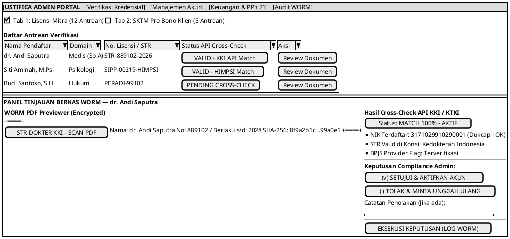
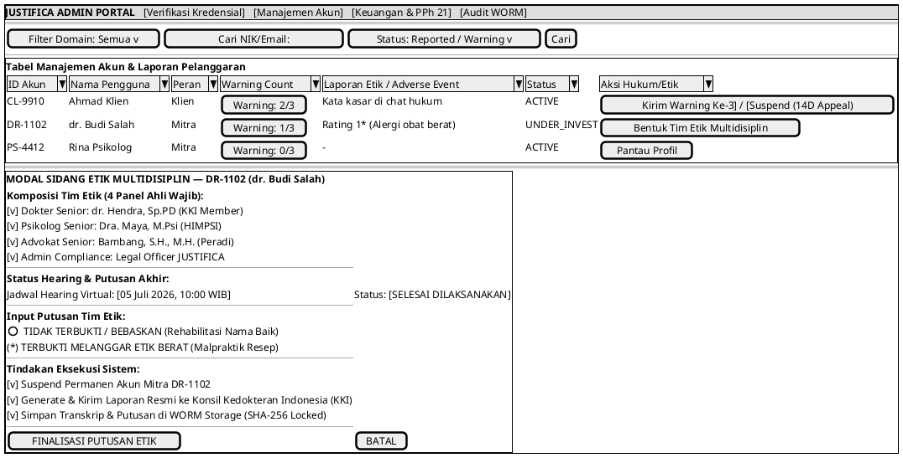
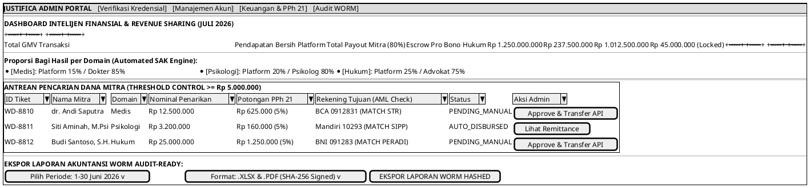
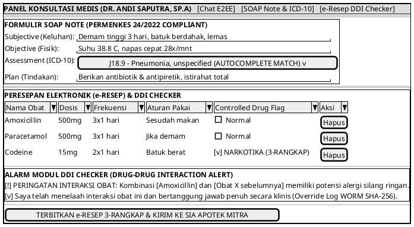
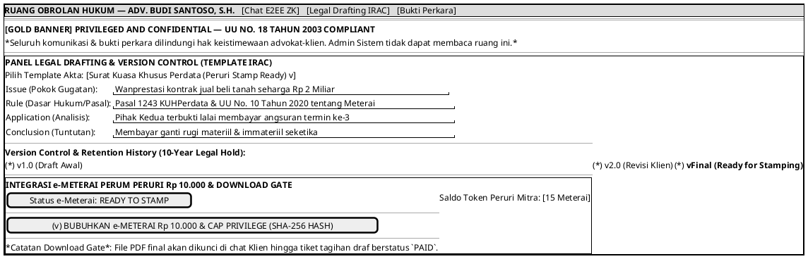

```plantuml
@startsalt
{+
  {* **MODUL KLIEN PSIKOLOGI & ASESMEN KLINIS** | [Mood Tracker] | [Asesmen DASS-21] | [Audio Meditasi] }
  ==
  {+
    **WIDGET MOOD TRACKER & PROACTIVE WELLNESS BANNER**
    Grafik Tren 7 Hari Terakhir: [Sedih] -> [Cemas] -> [Panik] -> [Sedih] -> [Sedih] -> [Sedih] -> [Panik]
    --
    {
      **[EMERALD ALERT] PROACTIVE MENTAL HEALTH BANNER**
      *Kami memperhatikan 7 hari terakhir terasa sangat berat bagi Anda. Anda tidak sendiri. Mari berbicara dengan konselor.*
      [ PESAN SESI KONSULING SEKARANG (DISKON SUBSIDI 50%) ] | [ PUTAR AUDIO GROUNDING 5-4-3-2-1 ]
    }
  }
  ==
  {+
    **SIMULASI HASIL ASESMEN DASS-21 (DEPRESSION, ANXIETY, STRESS SCALE)**
    Skor Depression: [28 - SEVERE] | Skor Anxiety: [22 - EXTREMELY SEVERE] | Skor Stress: [18 - MODERATE]
    --
    {+
      **[URGENT RED MODAL] MANDATORY CRISIS INTERVENTION PROTOCOL (HIMPSI COMPLIANT)**
      +-----------------------------------------------------------------------------------+
      | PERINGATAN DARURAT KRISIS KESEHATAN MENTAL                                        |
      | Skor asesmen Anda menunjukkan tingkat kecemasan & depresi yang memerlukan         |
      | pertolongan medis/klinis segera. Demi keselamatan Anda, protokol krisis aktif:    |
      |                                                                                   |
      | 1. HOTLINE KRISIS NASIONAL 24/7 (KEMENKES & LBH MENTAL HEALTH):                   |
      |    >> TELEPON SEKARANG: 119 Ekstensi 8 atau (021) 500-454 <<                      |
      |                                                                                   |
      | 2. SISTEM TELAH MENGIRIM ALERT DARURAT KE SUPERVISOR KLINIS PSIKOLOGI JUSTIFICA   |
      | 3. ANTREAN ANDA DI-PRIORITASKAN KHUSUS KEPADA PSIKOLOG KLINIS SPESIALIS TRAUMA    |
      |                                                                                   |
      | [ Tombol Tutup / Close dinonaktifkan sistem selama hitung mundur: 00:07 detik ]   |
      +-----------------------------------------------------------------------------------+
    }
  }
}
@endsalt
```

# Spesifikasi Desain & Wireframe UI/UX Mockup (Admin & Modul Domain)

Dokumen ini mendefinisikan spesifikasi arsitektur antarmuka (*UI/UX Specification*) dan rancangan tata letak visual (*PlantUML Wireframes / Salt Syntax*) untuk **3 Halaman Admin Sistem** dan **3 Modul Update Domain Spesifik (Kesehatan, Hukum, Psikologi)** pada platform JUSTIFICA 3-in-1.

---

## 1. DESIGN SYSTEM & VISUAL COMPLIANCE TOKENS
Sesuai arahan arsitektur modern (*Rich Aesthetics, Glassmorphism, Dynamic Micro-animations*), antarmuka menggunakan palet warna kurasi berbasis kepatuhan domain dan regulasi:
* **Primary Brand (Deep Navy & Cyber Blue)**: `hsl(215, 85%, 25%)` hingga `hsl(210, 100%, 50%)` — Melambangkan keandalan sistem dan profesionalisme.
* **Medical Domain Token (Clinical Blue & Teal)**: `hsl(190, 85%, 45%)` — Menenangkan, bersih, dan klinis.
* **Psychology Domain Token (Calming Emerald & Sage)**: `hsl(150, 65%, 40%)` — Empati, relaksasi, dan psikoedukasi.
* **Legal Domain Token (Privilege Gold & Deep Amber)**: `hsl(40, 90%, 45%)` — Melambangkan kerahasiaan (*Advocate-Client Privilege*), kewibawaan akta hukum, dan e-Meterai.
* **Crisis & Compliance Alert Token (Urgent Red)**: `hsl(0, 85%, 50%)` — Untuk peringatan DDI Checker, bahaya obat narkotika, dan *Mandatory Crisis Protocol DASS-21* (Hotline 119 ext 8).
* **WORM & Audit Trail Badge (Slate Gray & Monospace Font)**: `font-family: 'Roboto Mono', monospace; background: #2D3748; color: #00FF66;` — Untuk penanda *cryptographic hash SHA-256* dan status dokumen *Read-Only*.

---

## 2. SPESIFIKASI & WIREFRAME 3 HALAMAN ADMIN SISTEM

### Halaman Admin 1: Verifikasi Kredensial & SKTM Pro Bono (ST-022 / UC-13)
* **Tujuan**: Memfasilitasi Admin Compliance untuk memverifikasi lisensi mitra (STR/SIPP/Peradi) dan SKTM klien Pro Bono dengan integrasi API nasional.
* **Komponen Utama**:
  1. **Tab Navigation**: Switcher antara *Tab Verifikasi Mitra Profesional* dan *Tab Verifikasi SKTM Pro Bono (Klien)*.
  2. **Document Viewer**: Jendela WORM PDF Previewer di sisi kiri layar dengan proteksi anti-download.
  3. **Cross-Check API Panel**: Panel kanan dengan tombol aksi cepat panggilan API nasional (KKI/KTKI, HIMPSI, Peradi, Dukcapil, DTKS Kemensos).
  4. **Action Gates**: Tombol *"Setujui / Approve"* (hijau) dan *"Tolak / Reject"* (merah dengan modal wajib alasan penolakan).
* **PlantUML Wireframe**:

---

### Halaman Admin 2: Manajemen Akun & Laporan Pelanggaran (ST-023, ST-024 / UC-14, UC-15)
* **Tujuan**: Menangani pelanggaran ketentuan layanan oleh klien maupun mitra dengan prinsip *Due Process of Law* (Warning 1/2/3, banding 14 hari) dan *Ethics Committee Flow* (Sidang Etik Multidisiplin).
* **Komponen Utama**:
  1. **User Table & Warning Badge**: Tabel daftar akun dengan indikator warna *Warning Count* (0 = Hijau, 1-2 = Kuning, 3 = Merah/Suspend).
  2. **Due Process Suspension Modal**: Form penjatuhan suspend dengan otomatisasi surat pembekuan dan argo hitung mundur masa banding 14 hari kerja.
  3. **Ethics Committee Panel**: Panel khusus pembentukan Tim Etik Multidisiplin (1 Dokter, 1 Psikolog, 1 Advokat, 1 Admin) dan penjadwalan *Hearing Etik Virtual*.
* **PlantUML Wireframe**:

---

### Halaman Admin 3: Laporan Keuangan & Rekonsiliasi Transaksi (ST-025, ST-026 / UC-16, UC-17)
* **Tujuan**: Memantau volume transaksi (GMV), mengalkulasi bagi hasil proporsional per domain (Medis 15% / Psi 20% / Huk 25%), menangani antrean pencairan manual (>= Rp 5 Juta), dan mengekspor laporan WORM ber-hash SHA-256.
* **Komponen Utama**:
  1. **GMV & Revenue Share Cards**: Visualisasi kartu metrik keuangan real-time.
  2. **Disbursement Approval Queue**: Tabel antrean pencairan mitra dengan filter threshold (< 5 Juta Auto-Disburse, >= 5 Juta butuh tombol *Approve Transfer*).
  3. **WORM Export Tool**: Modul pembuatan dokumen akuntansi (XLSX/PDF) dengan penyematan *checksum hash SHA-256* di footer file.
* **PlantUML Wireframe**:

---

## 3. SPESIFIKASI & WIREFRAME 3 MODUL UPDATE DOMAIN

### Modul Update 1: Domain Kesehatan Medis (ST-011, ST-012, ST-013 / UC-11, UC-12, Kes-UC01)
* **Fitur Kunci**: Form e-Resep dengan modul *Drug-Drug Interaction (DDI) Checker* real-time, protokol resep 3 rangkap untuk obat Narkotika/Psikotropika (*Controlled Drugs*), dan penulisan SOAP Note dengan *auto-complete* kode diagnosis ICD-10.
* **PlantUML Wireframe**:

---

### Modul Update 2: Domain Hukum (ST-008, ST-010, ST-019 / UC-04, Huk-UC01, Huk-UC02)
* **Fitur Kunci**: Ruang obrolan berarsitektur *Zero-Knowledge* dengan spanduk emas *"PRIVILEGED AND CONFIDENTIAL"*, panel *Legal Drafting* metode IRAC dengan *Version Control* (v1/v2/Final), pembubuhan e-Meterai Peruri Rp 10.000, dan mekanisme *Download Gate*.
* **PlantUML Wireframe**:

---

### Modul Update 3: Domain Psikologi (ST-011, ST-016, ST-018 / UC-11, Psi-UC01, Psi-UC03)
* **Fitur Kunci**: DAP Note dengan pengukur Level Risiko klinis, Asesmen DASS-21 dengan *Mandatory Crisis Protocol pop-up 119 ext 8* (mengunci layar 10 detik, tombol close dimatikan), dan Mood Tracker dengan *Proactive Wellness Banner*.
* **PlantUML Wireframe**:

