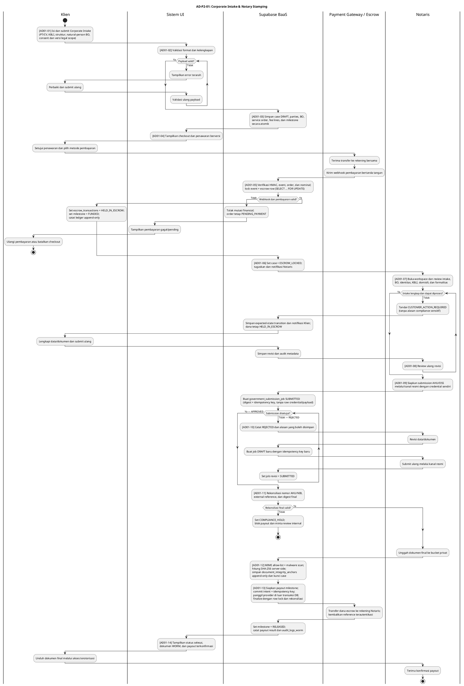
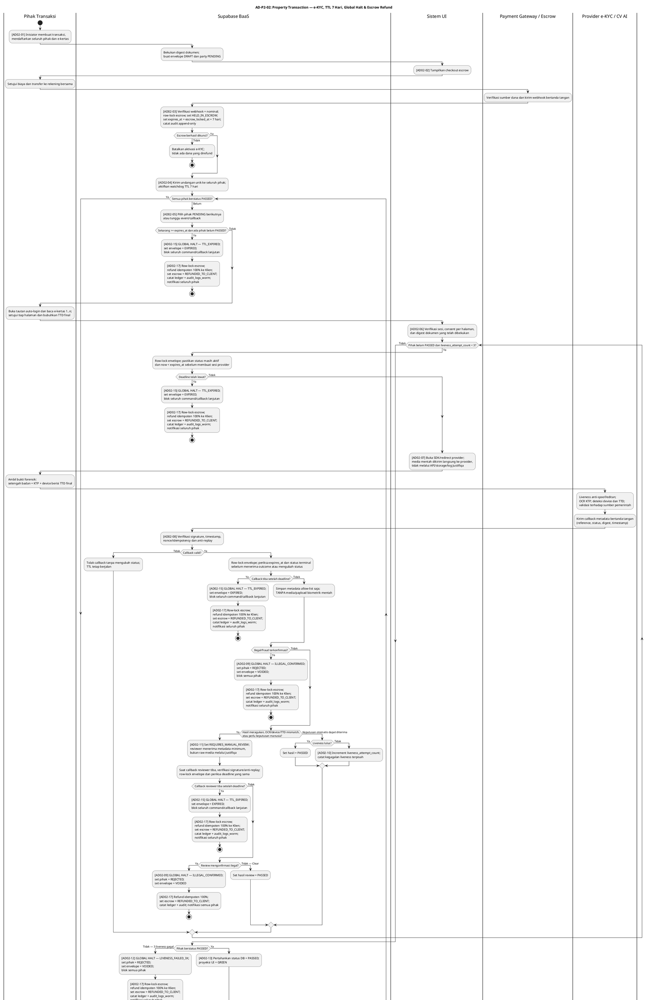

# Phase 2 Activity Diagrams — Business Logic Tracking

Dokumen ini memuat Activity Diagram PlantUML untuk dua workflow Phase 2 Justifiqa. Diagram memakai ID aktivitas stabil agar setiap aktivitas, keputusan, loop, dan terminal state dapat dipetakan 1-to-1 ke Sequence Diagram BCE di `PHASE_2_SEQUENCE_DIAGRAMS.md`.

> **Konvensi:** `Supabase BaaS` adalah backend aktif (controller, domain service, scheduler, provider adapter, repository, trigger, dan RLS), bukan database pasif. Operasi provider eksternal tidak menyimpan credential atau payload mentah di database workflow.

## Cara import ke Draw.io

1. Buka Draw.io (`app.diagrams.net`).
2. Pilih **Arrange → Insert → Advanced → PlantUML**.
3. Tempel kode PlantUML, lalu pilih **Insert**.

---

## AD-P2-01: Corporate Intake & Notary Stamping

Alur ini mencakup intake PT/CV, validasi berulang, order dan milestone, escrow, review Notaris, submission AHU/OSS yang dapat ditolak berulang, WORM anchoring, serta payout idempoten. Klien hanya menerima status netral; detail internal PMPJ/compliance tidak ditampilkan.

---

## AD-P2-02: High-Stakes Property Transaction — e-KYC Forensik Multi-Pihak

Escrow harus terkunci sebelum undangan e-KYC aktif. TTL global adalah **7 × 24 jam sejak `escrow_locked_at`**. Scheduler dan setiap command/callback memeriksa deadline yang sama. Satu pihak yang terbukti ilegal, gagal liveness pada percobaan ketiga, atau tidak merespons sampai TTL berakhir memicu **Global Halt**: envelope dibatalkan untuk semua pihak dan escrow dikembalikan penuh secara idempoten.

---

## Keputusan arsitektur dan status kanonik

1. **Corporate rejection loop diperbaiki:** `REJECTED → DRAFT → SUBMITTED` kini kembali ke keputusan approval, bukan jatuh otomatis ke jalur `APPROVED`.
2. **Payout Notaris tidak memakai fungsi payout Advokat:** diagram memakai port payout role-aware dengan prepare/commit → external call → finalize/reconcile. `fn_release_escrow_to_advocate_mutex` tidak diklaim dapat membayar Notaris.
3. **e-KYC zero raw biometric:** browser berinteraksi langsung dengan SDK/provider. Justifiqa hanya menerima callback metadata yang telah diverifikasi.
4. **Status e-KYC:** status database adalah `PENDING | PASSED | REJECTED | REQUIRES_MANUAL_REVIEW`; warna **GREEN** hanya proyeksi UI untuk `PASSED`.
5. **Global Halt:** `VOIDED` digunakan untuk ilegal/fraud atau tiga kegagalan liveness; `EXPIRED` untuk TTL; histori individual tidak dihapus.
6. **Escrow:** sukses e-KYC tidak otomatis mencairkan uang. Dana tetap `HELD_IN_ESCROW`; semua terminal Global Halt menghasilkan `REFUNDED_TO_CLIENT`.
7. **Gap implementasi yang disengaja terlihat:** migrasi saat ini belum memiliki aggregate property transaction dan kolom deadline khusus yang mengikat envelope ke escrow. Diagram ini adalah kontrak target Batch 2; remediasi SQL berada di luar kewenangan batch ini.

## Tabel terkait yang benar-benar tersedia

| Diagram | Tabel utama |
| --- | --- |
| AD-P2-01 | `corporate_service_cases`, `corporate_parties`, `beneficial_owners`, `service_orders`, `service_fee_lines`, `payment_milestones`, `escrow_transactions`, `payout_idempotency_keys`, `government_submission_jobs`, `document_integrity_anchors`, `audit_logs_worm`, `user_notifications` |
| AD-P2-02 | `ekyc_verification_logs`, `signing_envelopes`, `signing_envelope_parties`, `escrow_transactions`, `payment_milestones`, `escrow_payout_ledgers`, `audit_logs_worm`, `user_notifications` |
