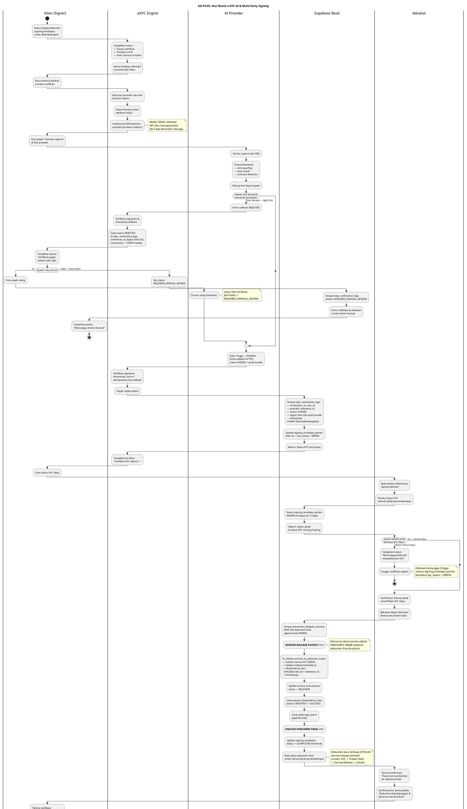

# Phase 2 Activity Diagrams — Business Logic Tracking (PlantUML Swimlanes)

Dokumen ini berisi Activity Diagram PlantUML dengan **swimlanes** untuk dua fitur utama Phase 2 Justifiqa. Setiap diagram di-derive 1-to-1 dari Sequence Diagram di `PHASE_2_USE_CASES_AND_DIAGRAMS.md` dan diperkaya dengan percabangan bisnis dari Legal Matrix terkait.

> **Konvensi:** Penomoran menggunakan `AD-P2-xx` (Activity Diagram — Phase 2). Swimlane memisahkan tanggung jawab aktor/komponen secara visual. `Supabase BaaS` merepresentasikan Backend-as-a-Service (PostgREST/RPC/Trigger/RLS), bukan database pasif.

---

## Cara Import ke Draw.io
1. Buka Draw.io (`app.diagrams.net`).
2. Pada toolbar bagian atas, klik tombol **+ (Insert)** atau pilih menu **Arrange -> Insert**.
3. Pilih **Advanced -> PlantUML...**.
4. Salin dan tempel kode di bawah ini, lalu klik **Insert**.

---

## AD-P2-01: Alur Bisnis Corporate Intake & Notary Stamping

*Diagram alur bisnis pengisian data pendirian badan usaha (PT/CV), validasi form, **pembayaran escrow milestone**, penyimpanan via Supabase BaaS, review notaris, input NIB & SK Kemenkumham, penguncian WORM, dan **pencairan dana escrow ke Notaris**. Derived dari SD: "Alur Corporate Intake dan Notary Stamping" di `PHASE_2_USE_CASES_AND_DIAGRAMS.md`.*

**Referensi domain:**
- `CORPORATE_CONCIERGE_LEGAL_AND_PARTNER_MATRIX.md` — Responsibility Matrix (Bab 3), Escrow & Biaya (Bab 3 baris Escrow)
- `NOTARY_AND_KEMENKUMHAM_LEGAL_MATRIX.md` — State & Kontrak Pengajuan (Bab 5)
- `PAYMENT_ESCROW_AND_BIFAST_SECURITY_MATRIX.md` — Rekening Bersama, Zero Double-Payout, Row-Level Mutex
- Tabel: `corporate_service_cases`, `corporate_parties`, `beneficial_owners`, `service_orders`, `service_fee_lines`, `payment_milestones`, `escrow_transactions`, `government_submission_jobs`, `document_integrity_anchors`

```plantuml
@startuml
title AD-P2-01: Alur Bisnis Corporate Intake & Notary Stamping

|Klien|
start
:Buka halaman Corporate Intake;
:Pilih jenis badan usaha\n(PT_ORDINARY / PT_INDIVIDUAL_UMK / CV);
:Isi formulir data pendirian:\n— Nama usulan, domisili, KBLI\n— Modal, pendiri/pemegang saham\n— Direksi/komisaris (PT) atau\n  sekutu aktif/pasif (CV)\n— Deklarasi Beneficial Owner\n  (orang perseorangan);
:Klik Submit Intake;

|Sistem UI|
:Terima payload form Klien;
if (Apakah data form valid?\n— Format, kelengkapan,\n  natural-person BO) then (Tidak Valid)
  :Tampilkan error validasi\nke Klien;
  |Klien|
  :Perbaiki data input;
  :Klik Submit Intake ulang;
  |Sistem UI|
  :Terima payload form\nyang diperbaiki;
  note right
    Loop validasi hingga
    data memenuhi syarat
  end note
endif

|Supabase BaaS|
:(Ya — Valid)\nSimpan corporate_service_cases\n(status: DRAFT);
:Simpan corporate_parties\n& beneficial_owners;
:Catat consent & legal_scope_version;
:Buat service_orders &\nservice_fee_lines\n(consent versi penawaran);
:Buat payment_milestones\n(milestone notarial);
:Return: Intake & order tersimpan;

|Sistem UI|
:Tampilkan halaman Checkout:\n— Rincian biaya (fee lines)\n— Milestone pembayaran\n— Metode pembayaran;

|Klien|
:Review rincian biaya &\nsetujui penawaran;
:Pilih metode pembayaran\n(Payment Gateway);
:Transfer dana ke\nrekening bersama (Escrow);

|Supabase BaaS|
:Terima webhook pembayaran\n(verifikasi HMAC SHA-256);
:fn_webhook_settle_escrow_mutex:\n— Validasi signature, tipe,\n  ownership, nominal\n— Kunci escrow_transactions\n  (SELECT ... FOR UPDATE);
:Update escrow_transactions\nstatus -> HELD_IN_ESCROW;
:Update service_orders\nstatus -> PAID_ESCROW_LOCKED;
note right
  Dana terkunci di rekening
  bersama. Bukan kas bebas
  Justifiqa. (Escrow Legal Buffer)
end note

|Sistem UI|
:Tampilkan konfirmasi:\n"Pembayaran diterima,\ndana terkunci di Escrow.\nMenunggu review Notaris";

|Supabase BaaS|
:Publikasikan Case ke\nNotary Workspace\n(status: ESCROW_LOCKED);
:Kirim notifikasi ke\nNotaris yang ditugaskan\n(via user_notifications);

|Notaris|
:Terima notifikasi penugasan;
:Buka workspace kasus\n(NotaryCaseWorkspacePanel);
:Tarik data corporate intake\ndari Supabase BaaS;

|Supabase BaaS|
:Return: Data intake lengkap\n(RLS: assigned_notary_id\n= auth.uid());

|Notaris|
:Review kelengkapan data:\n— Identitas penghadap\n— Struktur BO\n— KBLI & domisili\n— Kesesuaian bentuk usaha;

if (Apakah data intake\nlengkap & valid?) then (Tidak Valid)
  :Tandai status:\nCUSTOMER_ACTION_REQUIRED;
  |Supabase BaaS|
  :Update corporate_service_cases\nstatus -> CUSTOMER_ACTION_REQUIRED;
  :Kirim notifikasi ke Klien:\n"Dokumen tambahan diperlukan";
  |Klien|
  :Terima notifikasi;
  :Lengkapi / perbaiki data;
  :Submit ulang;
  |Supabase BaaS|
  :Update data yang diperbaiki;
  |Notaris|
  :Review ulang data yang diperbaiki;
  note right
    Loop review hingga
    data memenuhi syarat.
    Dana tetap terkunci
    di Escrow selama proses.
  end note
endif

|Notaris|
:(Ya — Valid)\nInput data resmi:\n— NIB (dari OSS RBA)\n— SK Kemenkumham (dari AHU);
:Unggah dokumen final\nke bucket privat;

|Supabase BaaS|
:Server-side: scan malware,\nhitung SHA-256 dari byte final;
:Simpan document_integrity_anchors\n(append-only WORM)\n— sha256_hash, case_id,\n  document_type, serial;
:Simpan government_submission_jobs\n(idempotency_key, status: SUBMITTED);

if (Apakah submission\nberhasil?) then (Ditolak — REJECTED)
  |Supabase BaaS|
  :Update job status -> REJECTED;
  :Catat alasan penolakan;
  |Notaris|
  :Revisi data & buat\njob baru (idempotency baru);
  note right
    State: REJECTED -> DRAFT
    (revisi eksplisit)
  end note
  |Supabase BaaS|
  :Simpan job revisi;
else (Disetujui — APPROVED)
endif

|Supabase BaaS|
:Update government_submission_jobs\nstatus -> APPROVED;
:Catat nomor registrasi eksternal\n(AHU/NIB);
:Trigger WORM: kunci status\ncorporate_service_cases;

|Supabase BaaS|
:=== ESCROW RELEASE PAYOUT ===;
:fn_release_escrow_to_advocate_mutex:\n— Validasi milestone terpenuhi\n— idempotency_key =\n  SHA256(order_id + milestone_id\n  + timestamp);
:Update escrow_transactions\nstatus -> RELEASED;
:Update payment_milestones\nstatus -> COMPLETED;
:Catat payout_idempotency_keys\n(status: INITIATED -> SUCCESS);
:Catat audit_logs_worm\n(append-only);
note right
  Dana dicairkan dari rekening
  bersama ke rekening Notaris.
  Zero double-payout dijamin
  oleh idempotency key unik.
end note

|Sistem UI|
:Kirim notifikasi status\nstamping & pencairan ke Klien;

|Klien|
:Terima notifikasi:\n"Notary stamping selesai,\ndokumen terkunci WORM,\ndana escrow telah dicairkan";
:Lihat status & dokumen final\ndi dashboard;

|Notaris|
:Terima konfirmasi:\n"Dana milestone telah\ndicairkan ke rekening Anda";
stop
@enduml
```

---

## AD-P2-02: Alur Bisnis e-KYC AI & Multi-Party Signing

*Diagram alur bisnis verifikasi identitas biometrik AI (liveness check), pencatatan status KYC, pemantauan dasbor advokat, **pencairan dana escrow sebagai prasyarat**, hingga rilis dokumen final. Derived dari SD: "Alur e-KYC AI dan Multi-Party Signing" di `PHASE_2_USE_CASES_AND_DIAGRAMS.md`.*

**Referensi domain:**
- `EKYC_AND_MULTIPARTY_SIGNING_LEGAL_MATRIX.md` — Alur Minimum & Kontrol Kegagalan (Bab 4)
- Zero Raw Biometric Storage (Bab 3): Justica **DILARANG** menyimpan foto/selfie/video/template biometrik
- `PAYMENT_ESCROW_AND_BIFAST_SECURITY_MATRIX.md` — Escrow Legal Buffer, Zero Double-Payout
- Tabel: `ekyc_verification_logs`, `signing_envelopes`, `signing_envelope_parties`, `escrow_transactions`, `payout_idempotency_keys`, `document_integrity_anchors`, `audit_logs_worm`

---

## Catatan Teknis

1. **Traceabilitas:** Kedua diagram di atas di-derive 1-to-1 dari Sequence Diagram di [`PHASE_2_USE_CASES_AND_DIAGRAMS.md`](PHASE_2_USE_CASES_AND_DIAGRAMS.md), diperkaya dengan percabangan bisnis dari Legal Matrix masing-masing domain.

2. **Perubahan Arsitektural (v2):**
   - **Swimlane `Database` → `Supabase BaaS`**: Menegaskan bahwa layer backend bukan database pasif, melainkan Backend-as-a-Service aktif (PostgREST/RPC/Trigger/RLS).
   - **Injeksi Escrow Lifecycle**: Kedua diagram kini memiliki alur pembayaran lengkap — dari *Checkout/Payment Gateway* → *HELD_IN_ESCROW* → deliverable → *RELEASED (Payout)*.

3. **Kepatuhan Domain:**
   - **AD-P2-01:** Mengikuti state machine `DRAFT -> PAID_ESCROW_LOCKED -> SUBMITTED -> APPROVED` dan `REJECTED -> DRAFT (revisi eksplisit)` dari `NOTARY_AND_KEMENKUMHAM_LEGAL_MATRIX.md`. Klien hanya menerima status netral (`CUSTOMER_ACTION_REQUIRED`), tidak pernah menerima detail PMPJ/compliance (anti-tipping-off). Escrow release menggunakan `fn_release_escrow_to_advocate_mutex` dengan idempotency key unik (zero double-payout).
   - **AD-P2-02:** Mematuhi Zero Raw Biometric Storage — hanya menyimpan `reference_id`, status, digest SHA-256, dan timestamp. Status `REJECTED` tidak sepenuhnya otomatis (ada retry + jalur `REQUIRES_MANUAL_REVIEW`). **Pencairan escrow adalah prasyarat wajib sebelum dokumen final di-unlock** (urutan: KYC → Freeze Hash → Escrow Release → Unlock Dokumen). Status `COMPLETED` bersifat terminal/append-only.

4. **Tabel Database Terkait:**
   | Diagram | Tabel Utama |
   |---|---|
   | AD-P2-01 | `corporate_service_cases`, `corporate_parties`, `beneficial_owners`, `service_orders`, `service_fee_lines`, `payment_milestones`, `escrow_transactions`, `payout_idempotency_keys`, `government_submission_jobs`, `document_integrity_anchors`, `audit_logs_worm`, `user_notifications` |
   | AD-P2-02 | `ekyc_verification_logs`, `signing_envelopes`, `signing_envelope_parties`, `escrow_transactions`, `payout_idempotency_keys`, `document_integrity_anchors`, `audit_logs_worm` |
