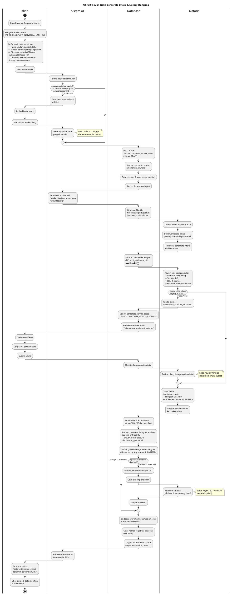
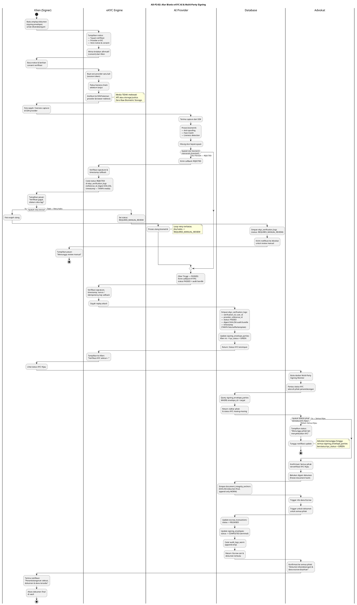

# Phase 2 Activity Diagrams — Business Logic Tracking (PlantUML Swimlanes)

Dokumen ini berisi Activity Diagram PlantUML dengan **swimlanes** untuk dua fitur utama Phase 2 Justifiqa. Setiap diagram di-derive 1-to-1 dari Sequence Diagram di `PHASE_2_USE_CASES_AND_DIAGRAMS.md` dan diperkaya dengan percabangan bisnis dari Legal Matrix terkait.

> **Konvensi:** Penomoran menggunakan `AD-P2-xx` (Activity Diagram — Phase 2). Swimlane memisahkan tanggung jawab aktor/komponen secara visual.

---

## Cara Import ke Draw.io
1. Buka Draw.io (`app.diagrams.net`).
2. Pada toolbar bagian atas, klik tombol **+ (Insert)** atau pilih menu **Arrange -> Insert**.
3. Pilih **Advanced -> PlantUML...**.
4. Salin dan tempel kode di bawah ini, lalu klik **Insert**.

---

## AD-P2-01: Alur Bisnis Corporate Intake & Notary Stamping

*Diagram alur bisnis pengisian data pendirian badan usaha (PT/CV), validasi form, penyimpanan database, review notaris, input NIB & SK Kemenkumham, hingga penguncian WORM. Derived dari SD: "Alur Corporate Intake dan Notary Stamping" di `PHASE_2_USE_CASES_AND_DIAGRAMS.md`.*

**Referensi domain:**
- `CORPORATE_CONCIERGE_LEGAL_AND_PARTNER_MATRIX.md` — Responsibility Matrix (Bab 3)
- `NOTARY_AND_KEMENKUMHAM_LEGAL_MATRIX.md` — State & Kontrak Pengajuan (Bab 5)
- Tabel: `corporate_service_cases`, `corporate_parties`, `beneficial_owners`, `government_submission_jobs`, `document_integrity_anchors`

---

## AD-P2-02: Alur Bisnis e-KYC AI & Multi-Party Signing

*Diagram alur bisnis verifikasi identitas biometrik AI (liveness check), pencatatan status KYC, pemantauan dasbor advokat, hingga rilis dana escrow dan dokumen. Derived dari SD: "Alur e-KYC AI dan Multi-Party Signing" di `PHASE_2_USE_CASES_AND_DIAGRAMS.md`.*

**Referensi domain:**
- `EKYC_AND_MULTIPARTY_SIGNING_LEGAL_MATRIX.md` — Alur Minimum & Kontrol Kegagalan (Bab 4)
- Zero Raw Biometric Storage (Bab 3): Justica **DILARANG** menyimpan foto/selfie/video/template biometrik
- Tabel: `ekyc_verification_logs`, `signing_envelopes`, `signing_envelope_parties`, `escrow_transactions`

---

## Catatan Teknis

1. **Traceabilitas:** Kedua diagram di atas di-derive 1-to-1 dari Sequence Diagram di [`PHASE_2_USE_CASES_AND_DIAGRAMS.md`](PHASE_2_USE_CASES_AND_DIAGRAMS.md), diperkaya dengan percabangan bisnis dari Legal Matrix masing-masing domain.

2. **Kepatuhan Domain:**
   - **AD-P2-01:** Mengikuti state machine `DRAFT -> SUBMITTED -> APPROVED` dan `REJECTED -> DRAFT (revisi eksplisit)` dari `NOTARY_AND_KEMENKUMHAM_LEGAL_MATRIX.md`. Klien hanya menerima status netral (`CUSTOMER_ACTION_REQUIRED`), tidak pernah menerima detail PMPJ/compliance (anti-tipping-off).
   - **AD-P2-02:** Mematuhi Zero Raw Biometric Storage — hanya menyimpan `reference_id`, status, digest SHA-256, dan timestamp. Status `REJECTED` tidak sepenuhnya otomatis (ada retry + jalur `REQUIRES_MANUAL_REVIEW`). Status `COMPLETED` bersifat terminal/append-only.

3. **Tabel Database Terkait:**
   | Diagram | Tabel Utama |
   |---|---|
   | AD-P2-01 | `corporate_service_cases`, `corporate_parties`, `beneficial_owners`, `government_submission_jobs`, `document_integrity_anchors`, `user_notifications` |
   | AD-P2-02 | `ekyc_verification_logs`, `signing_envelopes`, `signing_envelope_parties`, `escrow_transactions`, `document_integrity_anchors`, `audit_logs_worm` |
