# Phase 2 Sequence Diagrams — BCE 5-Lifeline

Sequence Diagram berikut mengimplementasikan standar kanonik:

`Actor → Boundary Client → Boundary Server → Control → Entity`

Tepat lima lifeline digunakan pada setiap diagram. Provider pembayaran, AHU/OSS, CV AI, Dukcapil, scheduler, dan provider manual review dipanggil melalui port milik Control dan tidak dijadikan lifeline keenam. Lifeline Entity hanya menangani repository/DB/WORM dan operasi persisten atomik. Callback eksternal ditandai sebagai entry pada Boundary Server, bukan seolah-olah berasal dari Entity. Setiap pesan lintas seam memakai pasangan aktivasi, sedangkan ID `[ADxx-yy]` membuktikan pemetaan 1-to-1 ke Activity Diagram.

---

## SD-P2-01: Corporate Intake & Notary Stamping

```plantuml
@startuml
title SD-P2-01: Corporate Intake & Notary Stamping — BCE 5 Lifeline

actor "Klien / Notaris Terdaftar" as Actor
boundary "CorporateIntakeUI\n<<Boundary Client>>" as FE
boundary "CorporateController\n<<Boundary Server>>" as CTRL
control "CorporateEscrowNotaryService\n<<Control>>" as SVC
entity "CorporateRepository + DB\n+ WORM Vault <<Entity>>" as REPO

activate Actor

loop Sampai payload intake valid
  Actor -> FE ++ : [AD01-01][Klien] Isi dan submit intake
  FE -> CTRL ++ : POST /api/v1/corporate/intakes
  CTRL -> SVC ++ : createIntake(command)
  SVC -> SVC : [AD01-02] Validasi format, BO orang perseorangan,\nconsent dan legal scope
  alt [AD01-02] Payload tidak valid
    SVC --> CTRL -- : ValidationErrors
    CTRL --> FE -- : HTTP 422
    FE --> Actor : Tampilkan error terarah
    deactivate FE
  else [AD01-03] Payload valid
    SVC -> REPO ++ : saveCaseOrderAndMilestoneAtomic()
    REPO --> SVC -- : caseId, orderId, milestoneId
    SVC --> CTRL -- : IntakeCreated
    CTRL --> FE -- : HTTP 201
    FE --> Actor : Intake dan order tersimpan
    deactivate FE
  end
end

Actor -> FE ++ : [AD01-04][Klien] Setujui penawaran dan checkout
FE -> CTRL ++ : POST /api/v1/corporate/orders/{orderId}/checkout
CTRL -> SVC ++ : prepareEscrowPayment(orderId)
SVC -> REPO ++ : createPaymentIntent()
REPO --> SVC -- : providerRedirect, paymentRef
SVC --> CTRL -- : CheckoutPrepared
CTRL --> FE -- : HTTP 200
FE --> Actor : Redirect/instruksi pembayaran
deactivate FE

note right of CTRL
  [AD01-05] Payment provider memanggil
  POST /api/v1/payment-webhooks.
  Boundary membalas HTTP 204 jika diterima,
  atau HTTP 400/401 jika ditolak.
end note
activate CTRL
CTRL -> SVC ++ : settleEscrow(signedWebhook)
SVC -> REPO ++ : verifyHmacAndLockEventAndEscrow()
alt Webhook/signature/order/nominal tidak valid
  break Checkout berhenti — ulangi pembayaran atau batalkan
    REPO --> SVC -- : RejectedNoMutation
    SVC --> CTRL -- : WebhookRejected
    CTRL -> FE ++ : Realtime order PENDING_PAYMENT
    FE --> CTRL -- : Ack
    deactivate CTRL
  end
else Valid dan idempoten
  REPO -> REPO : SELECT ... FOR UPDATE;\nHELD_IN_ESCROW; milestone FUNDED;\nappend ledger
  REPO --> SVC -- : EscrowLocked
  SVC -> REPO ++ : [AD01-06] assignNotaryAndNotify()
  REPO --> SVC -- : assignedNotaryId
  SVC --> CTRL -- : Settled
  CTRL -> FE ++ : Realtime escrow locked
  FE --> CTRL -- : Ack
  deactivate CTRL
end

loop Sampai intake dapat diproses
  Actor -> FE ++ : [AD01-07][Notaris] Buka workspace dan review
  FE -> CTRL ++ : GET /api/v1/corporate/cases/{caseId}
  CTRL -> SVC ++ : getAssignedCase(caseId, actorId)
  SVC -> REPO ++ : findByAssignedNotaryWithRls()
  REPO --> SVC -- : CaseProjection
  SVC --> CTRL -- : CaseProjection
  CTRL --> FE -- : HTTP 200
  alt Data belum lengkap
    Actor -> FE : [Notaris] Minta perbaikan
    FE -> CTRL ++ : PATCH /api/v1/corporate/cases/{caseId}/requirements
    CTRL -> SVC ++ : [AD01-08] requireCustomerAction(reasonCode)
    SVC -> REPO ++ : expectedStateTransitionAndNotify()
    REPO --> SVC -- : CUSTOMER_ACTION_REQUIRED
    SVC --> CTRL -- : Updated
    CTRL --> FE -- : HTTP 200
    FE --> Actor : [Klien] Status netral; revisi diperlukan
    deactivate FE
    Actor -> FE ++ : [Klien] Lengkapi dan submit revisi
    FE -> CTRL ++ : PUT /api/v1/corporate/cases/{caseId}/intake
    CTRL -> SVC ++ : saveCustomerRevision(command)
    SVC -> REPO ++ : persistRevisionAndAuditMetadata()
    REPO --> SVC -- : RevisionSaved
    SVC --> CTRL -- : RevisionAccepted
    CTRL --> FE -- : HTTP 200
    FE --> Actor : Revisi tersimpan; Notaris dinotifikasi
    deactivate FE
  else Data lengkap
    FE --> Actor : Review selesai
    deactivate FE
  end
end

loop Sampai submission APPROVED
  Actor -> FE ++ : [AD01-09][Notaris] Submit melalui kanal resmi
  FE -> CTRL ++ : POST /api/v1/corporate/cases/{caseId}/submissions
  CTRL -> SVC ++ : submitGovernmentJob(command)
  SVC -> REPO ++ : createIdempotentSubmissionJob()
  REPO --> SVC -- : submissionJob
  SVC -> SVC : invokeOfficialSubmissionPortOutsideTransaction()
  SVC -> REPO ++ : finalizeSubmittedWithExternalReference()
  REPO --> SVC -- : SUBMITTED + externalReference
  SVC --> CTRL -- : SubmissionAccepted
  CTRL --> FE -- : HTTP 202
  FE --> Actor : Submission diterima
  deactivate FE
  note right of CTRL
    AHU/OSS adapter memanggil
    POST /api/v1/government-submission-webhooks.
    Boundary membalas HTTP 204 jika tercatat,
    atau HTTP 409 jika rekonsiliasi mismatch.
  end note
  activate CTRL
  alt Callback REJECTED
    CTRL -> SVC ++ : [AD01-10] recordRejection(signedCallback)
    SVC -> REPO ++ : setRejectedAndOpenNewDraft()
    REPO --> SVC -- : REJECTED -> DRAFT
    SVC --> CTRL -- : Recorded
    CTRL -> FE ++ : Realtime revisi diperlukan
    FE --> CTRL -- : Ack
    deactivate CTRL
  else Callback APPROVED
    CTRL -> SVC ++ : [AD01-11] reconcileApproval(signedCallback)
    SVC -> REPO ++ : verifyReferenceAndFinalDigest()
    alt Rekonsiliasi mismatch
      break COMPLIANCE_HOLD — payout dan alur downstream berhenti
        REPO --> SVC -- : Mismatch
        SVC -> REPO ++ : setComplianceHoldAndBlockPayout()
        REPO --> SVC -- : COMPLIANCE_HOLD
        SVC --> CTRL -- : ReviewRequired
        CTRL -> FE ++ : Realtime COMPLIANCE_HOLD
        FE --> CTRL -- : Ack
        deactivate CTRL
      end
    else Rekonsiliasi valid
      REPO --> SVC -- : APPROVED
      SVC --> CTRL -- : Approved
      CTRL -> FE ++ : Realtime APPROVED
      FE --> CTRL -- : Ack
      deactivate CTRL
    end
  end
end

Actor -> FE ++ : [Notaris] Unggah dokumen final
FE -> CTRL ++ : POST /api/v1/corporate/cases/{caseId}/documents
CTRL -> SVC ++ : [AD01-12] anchorFinalDocument(uploadRef)
SVC -> REPO ++ : scanHashAndAppendIntegrityAnchor()
REPO --> SVC -- : documentId, sha256, serial
SVC --> CTRL -- : DocumentAnchored
CTRL --> FE -- : HTTP 201
FE --> Actor : Dokumen final terkunci WORM
deactivate FE

Actor -> FE ++ : [Notaris] Ajukan payout milestone
FE -> CTRL ++ : POST /api/v1/corporate/cases/{caseId}/payouts
CTRL -> SVC ++ : [AD01-13] releaseNotaryMilestone(command)
SVC -> REPO ++ : prepareIntentWithRowLockAndIdempotency()
REPO --> SVC -- : payoutIntent
SVC -> SVC : invokePayoutPortOutsideTransaction()
SVC -> REPO ++ : finalizeWithAuthenticatedReference()
REPO --> SVC -- : RELEASED
SVC -> REPO ++ : appendPayoutAuditWorm()
REPO --> SVC -- : auditId
SVC --> CTRL -- : PayoutReleased
CTRL --> FE -- : HTTP 202
FE --> Actor : [AD01-14] Status selesai dan payout terkonfirmasi
deactivate FE

deactivate Actor
@enduml
```

---

## SD-P2-02: Property Transaction e-KYC, TTL, Global Halt & Refund

```plantuml
@startuml
title SD-P2-02: Property e-KYC — TTL 7 Hari, Global Halt & Refund — BCE 5 Lifeline

actor "Pihak Transaksi" as Actor
boundary "PropertySigningUI\n<<Boundary Client>>" as FE
boundary "PropertyKycController\n<<Boundary Server>>" as CTRL
control "PropertyKycEscrowService\n<<Control>>" as SVC
entity "KycEscrowRepository + DB\n+ WORM Vault <<Entity>>" as REPO

activate Actor
Actor -> FE ++ : [AD02-01] Buat transaksi, pihak, dan e-kertas
FE -> CTRL ++ : POST /api/v1/property-transactions
CTRL -> SVC ++ : initializeTransaction(command)
SVC -> REPO ++ : freezeDigestAndCreateEnvelopeAndParties()
REPO --> SVC -- : transactionId, envelopeId, partyIds
SVC --> CTRL -- : TransactionDrafted
CTRL --> FE -- : HTTP 201
FE --> Actor : Draft dan checkout tersedia
deactivate FE

Actor -> FE ++ : [AD02-02] Setujui biaya dan checkout
FE -> CTRL ++ : POST /api/v1/property-transactions/{id}/checkout
CTRL -> SVC ++ : prepareEscrowFunding(id)
SVC -> REPO ++ : createPaymentIntent()
REPO --> SVC -- : paymentRedirect
SVC --> CTRL -- : CheckoutPrepared
CTRL --> FE -- : HTTP 200
FE --> Actor : Redirect/instruksi pembayaran
deactivate FE

note right of CTRL
  [AD02-03] Provider memanggil
  POST /api/v1/payment-webhooks.
  Boundary membalas HTTP 204 jika diterima,
  atau HTTP 400/409 jika funding ditolak.
end note
activate CTRL
CTRL -> SVC ++ : lockEscrow(signedWebhook)
SVC -> REPO ++ : verifyAndLockEscrowRow()
alt Escrow gagal dikunci
  break Funding berhenti — e-KYC tidak diaktifkan
    REPO --> SVC -- : RejectedNoMutation
    SVC --> CTRL -- : FundingRejected
    CTRL -> FE ++ : Realtime funding failed
    FE --> CTRL -- : Ack
    deactivate CTRL
  end
else Escrow HELD_IN_ESCROW
  REPO -> REPO : Persist escrow_locked_at;\nexpires_at = +7 days;\nappend ledger + audit
  REPO --> SVC -- : EscrowLocked(expiresAt)
  SVC -> REPO ++ : [AD02-04] inviteAllPartiesAndScheduleWatchdog()
  REPO --> SVC -- : invitationIds
  SVC --> CTRL -- : FundingAccepted
  CTRL -> FE ++ : Realtime invitations active
  FE --> CTRL -- : Ack
  deactivate CTRL
end

loop Untuk setiap pihak sampai semua PASSED
  Actor -> FE ++ : Buka invitation auto-login
  FE -> CTRL ++ : GET /api/v1/ekyc/invitations/{token}
  CTRL -> SVC ++ : [AD02-05] resolveInvitation(token, now)
  SVC -> REPO ++ : loadEnvelopePartyAndDeadline()
  alt [AD02-15] TTL habis dan masih ada PENDING
    break Global Halt — TTL_EXPIRED
      REPO --> SVC -- : ExpiredSnapshot
      SVC -> REPO ++ : [AD02-17] haltGlobally(TTL_EXPIRED)
      REPO -> REPO : Row lock; envelope EXPIRED;\nrefund idempoten 100%;\nREFUNDED_TO_CLIENT;\nledger + WORM audit + notify all
      REPO --> SVC -- : GlobalHaltCompleted
      SVC --> CTRL -- : Expired
      CTRL --> FE -- : HTTP 410
      FE --> Actor : Seluruh transaksi batal; escrow direfund
      deactivate FE
    end
  else Deadline aktif
    REPO --> SVC -- : InvitationProjection
    SVC --> CTRL -- : InvitationReady
    CTRL --> FE -- : HTTP 200
    FE --> Actor : [AD02-06] Consent halaman dan TTD final

    loop Maksimal 3 capture sampai PASSED
      Actor -> FE : [AD02-07] Mulai capture forensik
      FE -> FE : Provider SDK/redirect;\nraw media langsung ke provider
      FE -> CTRL ++ : POST /api/v1/ekyc/sessions
      CTRL -> SVC ++ : createProviderSession(partyId, frozenDigest)
      SVC -> REPO ++ : assertDeadlineAndEnvelopeActiveWithLock(now)
      alt [AD02-15] Deadline lewat / envelope terminal
        break Global Halt — TTL_EXPIRED
          REPO --> SVC -- : ExpiredSnapshot
          SVC -> REPO ++ : [AD02-17] haltGlobally(TTL_EXPIRED)
          REPO --> SVC -- : EXPIRED + REFUNDED_TO_CLIENT
          SVC --> CTRL -- : ExpiredAndRefunded
          CTRL --> FE -- : HTTP 410
          FE --> Actor : Seluruh transaksi batal; escrow direfund
          deactivate FE
        end
      else Deadline aktif
        REPO --> SVC -- : ActiveEnvelope
        SVC -> SVC : invokeProviderSessionPortOutsideTransaction()
        SVC -> REPO ++ : persistOpaqueSessionReference()
        REPO --> SVC -- : sessionReference, providerRedirect
        SVC --> CTRL -- : ProviderSession
        CTRL --> FE -- : HTTP 201
        FE --> Actor : Capture setengah badan + KTP + device/TTD
        deactivate FE
      end

      note right of CTRL
        [AD02-08] Provider callback:
        POST /api/v1/ekyc/provider-callbacks.
        Hanya metadata; tanpa media mentah.
        Boundary membalas HTTP 204 jika diterima,
        HTTP 401 jika invalid, atau HTTP 410 jika expired.
      end note
      activate CTRL
      CTRL -> SVC ++ : processSignedCallback(headers, metadata)
      SVC -> REPO ++ : verifySignatureTimestampNonceAndReplay()
      alt Callback tidak valid
        REPO --> SVC -- : InvalidCallbackNoMutation
        SVC --> CTRL -- : Rejected
        CTRL -> FE ++ : Callback ditolak; TTL tetap berjalan
        FE --> CTRL -- : Ack
        deactivate CTRL
      else Signature dan anti-replay valid
        REPO --> SVC -- : VerifiedAllowListedMetadata
        SVC -> REPO ++ : lockAndCheckDeadlineAndEnvelopeState(now)
        alt [AD02-15] Callback tiba setelah deadline
          break Global Halt — TTL_EXPIRED
            REPO --> SVC -- : ExpiredSnapshot
            SVC -> REPO ++ : [AD02-17] haltGlobally(TTL_EXPIRED)
            REPO --> SVC -- : EXPIRED + REFUNDED_TO_CLIENT
            SVC --> CTRL -- : ExpiredAndRefunded
            CTRL -> FE ++ : Realtime global halt TTL
            FE --> CTRL -- : Ack
            deactivate CTRL
          end
        else Deadline aktif
          REPO --> SVC -- : ActiveEnvelope
          alt [AD02-09] ILEGAL_CONFIRMED
            break Global Halt — ILLEGAL_CONFIRMED
              SVC -> REPO ++ : [AD02-17] haltGlobally(ILLEGAL_CONFIRMED)
              REPO -> REPO : party REJECTED; envelope VOIDED;\nrow-lock refund 100%;\nREFUNDED_TO_CLIENT;\nledger + WORM audit + notify all
              REPO --> SVC -- : GlobalHaltCompleted
              SVC --> CTRL -- : VoidedAndRefunded
              CTRL -> FE ++ : Realtime global halt
              FE --> CTRL -- : Ack
              deactivate CTRL
            end
          else [AD02-11] OCR/device/TTD mismatch atau perlu manusia
            SVC -> REPO ++ : persistAllowListedMetadataAndRequestReview()
            REPO --> SVC -- : REQUIRES_MANUAL_REVIEW, reviewReference
            SVC -> SVC : invokeManualReviewPortOutsideTransaction()
            SVC --> CTRL -- : ManualReviewQueued
            CTRL -> FE ++ : Realtime manual review
            FE --> CTRL -- : Ack
            deactivate CTRL
          else [AD02-10] Liveness gagal
            SVC -> REPO ++ : appendLivenessFailureAndIncrement()
            alt liveness_attempt_count < 3
              REPO --> SVC -- : RetryAllowed
              SVC --> CTRL -- : RetryRequired
              CTRL -> FE ++ : Retry liveness; remainingAttempts
              FE --> CTRL -- : Ack
              deactivate CTRL
            else [AD02-12] liveness_attempt_count = 3
              break Global Halt — LIVENESS_FAILED_3X
                REPO --> SVC -- : RetryLimitReached
                SVC -> REPO ++ : [AD02-17] haltGlobally(LIVENESS_FAILED_3X)
                REPO -> REPO : party REJECTED; envelope VOIDED;\nrefund idempoten 100%;\nledger + WORM audit + notify all
                REPO --> SVC -- : GlobalHaltCompleted
                SVC --> CTRL -- : VoidedAndRefunded
                CTRL -> FE ++ : Realtime global halt
                FE --> CTRL -- : Ack
                deactivate CTRL
              end
            end
          else [AD02-13] Verifikasi lulus
            SVC -> REPO ++ : persistPASSEDAndProjectGREEN()
            REPO --> SVC -- : PASSED
            SVC --> CTRL -- : PartyPassed
            CTRL -> FE ++ : Realtime PASSED/GREEN
            FE --> CTRL -- : Ack
            deactivate CTRL
          end
        end
      end
    end

    opt [AD02-11] Callback untuk pihak REQUIRES_MANUAL_REVIEW
      note right of CTRL
        Reviewer memanggil
        POST /api/v1/ekyc/manual-review-callbacks.
        Boundary menerapkan signature, anti-replay,
        dan guard deadline yang sama; balasan HTTP 204,
        HTTP 401 jika invalid, atau HTTP 410 jika expired.
      end note
      activate CTRL
      CTRL -> SVC ++ : processManualReviewCallback(headers, outcome)
      SVC -> REPO ++ : verifyReviewerSignatureTimestampNonceAndReplay()
      alt Callback reviewer tidak valid
        REPO --> SVC -- : InvalidCallbackNoMutation
        SVC --> CTRL -- : Rejected
        deactivate CTRL
      else Signature dan anti-replay valid
        REPO --> SVC -- : VerifiedReviewOutcome
        SVC -> REPO ++ : lockAndCheckDeadlineAndEnvelopeState(now)
        alt [AD02-15] Deadline lewat saat manual review
          break Global Halt — TTL_EXPIRED
            REPO --> SVC -- : ExpiredSnapshot
            SVC -> REPO ++ : [AD02-17] haltGlobally(TTL_EXPIRED)
            REPO --> SVC -- : EXPIRED + REFUNDED_TO_CLIENT
            SVC --> CTRL -- : ExpiredAndRefunded
            CTRL -> FE ++ : Realtime global halt TTL
            FE --> CTRL -- : Ack
            deactivate CTRL
          end
        else Reviewer mengonfirmasi ilegal
          break Global Halt — ILLEGAL_CONFIRMED
            REPO --> SVC -- : ActiveEnvelope + IllegalConfirmed
            SVC -> REPO ++ : [AD02-09, AD02-17] haltGlobally(ILLEGAL_CONFIRMED)
            REPO --> SVC -- : VOIDED + REFUNDED_TO_CLIENT
            SVC --> CTRL -- : VoidedAndRefunded
            CTRL -> FE ++ : Realtime global halt
            FE --> CTRL -- : Ack
            deactivate CTRL
          end
        else Reviewer clear
          REPO --> SVC -- : ActiveEnvelope + Clear
          SVC -> REPO ++ : [AD02-13] setVerificationPassed()
          REPO --> SVC -- : PASSED
          SVC --> CTRL -- : PartyPassed
          CTRL -> FE ++ : Realtime PASSED/GREEN
          FE --> CTRL -- : Ack
          deactivate CTRL
        end
      end
    end

    Actor -> FE ++ : Refresh status seluruh pihak
    FE -> CTRL ++ : GET /api/v1/ekyc/envelopes/{id}/status
    CTRL -> SVC ++ : [AD02-14] synchronizeAllParties(envelopeId)
    SVC -> REPO ++ : allPartiesPassed()
    alt Masih ada PENDING
      REPO --> SVC -- : false
      SVC -> REPO ++ : rescheduleSameDeadlineWatchdog()
      REPO --> SVC -- : scheduled
      SVC --> CTRL -- : WaitingForOtherParties
      CTRL --> FE -- : HTTP 200; pending
      FE --> Actor : Menunggu pihak lain
      deactivate FE
    else [AD02-16] Semua PASSED
      REPO --> SVC -- : true
      SVC -> REPO ++ : markKycPhaseCompleteKeepEscrowHeld()
      REPO --> SVC -- : readyForSigning
      SVC --> CTRL -- : KycCompleted
      CTRL --> FE -- : HTTP 200; all GREEN
      FE --> Actor : Lanjut signing; escrow tetap HELD_IN_ESCROW
      deactivate FE
    end
  end
end

note over SVC, REPO
  Watchdog memanggil POST /internal/v1/ekyc/expiry-sweeps
  dan menerima HTTP 204 setelah expireOverdueEnvelopes(now).
  Handler memakai [AD02-15, AD02-17] yang sama, row lock,
  dan idempotency key refund yang sama dengan command/callback path.
end note

deactivate Actor
@enduml
```

---

## Matriks verifikasi forensik Eagle-Eye

| Upstream AD | Downstream SD | Bukti lokasi | Status | Catatan |
| --- | --- | --- | :---: | --- |
| AD01-01..03 | SD-P2-01 intake loop | `createIntake` → `saveCaseOrderAndMilestoneAtomic` | COMPLETE | Validasi dan persist atomik |
| AD01-04..05 | SD-P2-01 checkout/webhook alt | Endpoint checkout + payment webhook | COMPLETE | HMAC, nominal, row lock, no-mutation failure |
| AD01-06 | SD-P2-01 assignment | `assignNotaryAndNotify` | COMPLETE | Assignment setelah escrow lock |
| AD01-07..08 | SD-P2-01 review loop | GET case + requirements PATCH | COMPLETE | CUSTOMER_ACTION_REQUIRED netral |
| AD01-09..10 | SD-P2-01 submission loop | POST submission + callback alt | COMPLETE | REJECTED kembali ke DRAFT/SUBMITTED |
| AD01-11 | SD-P2-01 approval reconciliation | `reconcileApproval` alt | COMPLETE | Mismatch memblok payout |
| AD01-12 | SD-P2-01 WORM anchoring | `anchorFinalDocument` | COMPLETE | Scan, server hash, append-only |
| AD01-13..14 | SD-P2-01 payout/notification | POST payouts → status | COMPLETE | External I/O di luar DB transaction |
| AD02-01..04 | SD-P2-02 initialization/funding | create transaction + webhook | COMPLETE | Escrow lock mendahului invitation; TTL 7 hari |
| AD02-05..06 | SD-P2-02 invitation/consent | invitation GET + consent | COMPLETE | Deadline diperiksa sebelum capture |
| AD02-07..08 | SD-P2-02 provider session/callback | SDK note + signed callback | COMPLETE | Zero raw biometric; anti-replay; deadline dijaga sebelum sesi dan setiap callback |
| AD02-09 | SD-P2-02 illegal branches | `haltGlobally(ILLEGAL_CONFIRMED)` | COMPLETE | Immediate global halt |
| AD02-10..12 | SD-P2-02 retry/manual/limit alts | liveness attempt loop + review alt | COMPLETE | Hanya kegagalan liveness dihitung hingga 3; mismatch lain masuk manual review |
| AD02-13..14 | SD-P2-02 PASSED/sync | persist PASSED + synchronize | COMPLETE | GREEN hanya proyeksi UI |
| AD02-15 | SD-P2-02 expiry alts + watchdog note | invitation, session, provider/manual callback, dan sweep | COMPLETE | Semua entry memakai deadline global yang sama; no-response satu pihak membatalkan semua |
| AD02-16 | SD-P2-02 all-PASSED alt | `markKycPhaseCompleteKeepEscrowHeld` | COMPLETE | Sukses KYC tidak mencairkan escrow |
| AD02-17 | Semua terminal halt SD-P2-02 | shared idempotent refund handler | COMPLETE | VOIDED/EXPIRED + REFUNDED_TO_CLIENT |

**Rekonsiliasi himpunan:**

`S_AD − S_SD = ∅` dan `S_SD − S_AD = ∅` untuk ID `AD01-01..14` dan `AD02-01..17`.
Hasil audit: **0 omission / 0 orphan activity ID / 0 lifeline tambahan**.
