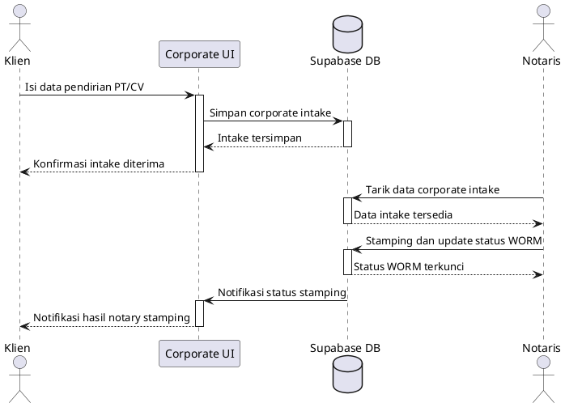
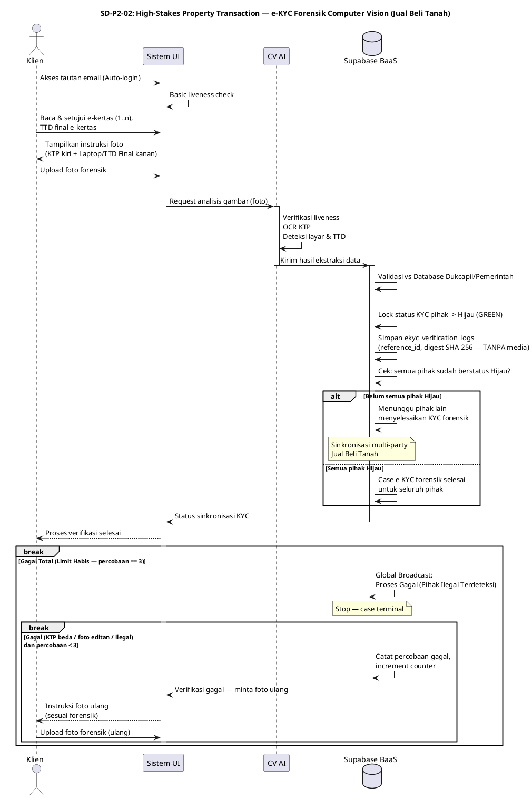

# Phase 2 Use Cases and UML Sequence Diagrams

## Bagian A: Pembaruan Use Case dan Aktor

### Aktor Baru

| Aktor | Peran |
| --- | --- |
| Notaris Terdaftar | Memverifikasi berkas pendirian badan usaha, memberi cap notaris, dan mengunci status dokumen legal. |
| Computer Vision AI (Forensic Verification) | Mesin AI forensik yang mengekstraksi liveness (anti-editan), OCR KTP, dan mendeteksi TTD di layar laptop/device — semuanya dianalisis secara bersamaan dalam satu frame foto pembuktian. |

### Use Case Baru

| Use Case | Aktor Utama | Hasil Sistem |
| --- | --- | --- |
| Mendirikan PT/CV berstandar PPATK | Klien, Notaris Terdaftar | Data corporate intake tersimpan, diverifikasi notaris, dan diaudit oleh WORM Trigger. |
| Menandatangani Dokumen via Verifikasi Biometrik AI Liveness | Klien, Computer Vision AI (Forensic Verification) | Dalam alur **Forensik Jual Beli Tanah**, identitas pihak tervalidasi hanya setelah Klien memegang KTP dan laptop/device berisi TTD final secara fisik dalam satu foto pembuktian — mencapai tingkat *Absolute Non-Repudiation* sebelum status KYC pihak dikunci Hijau dan dokumen disahkan multi-party. |

## Bagian B: Sequence Diagram

### Alur Corporate Intake dan Notary Stamping

### Alur e-KYC Forensik Computer Vision — High-Stakes Property Transaction (Jual Beli Tanah)

*Sequence Diagram 1-to-1 dengan AD-P2-02 di `PHASE_2_ACTIVITY_DIAGRAMS.md`. Fokus forensik identitas multi-pihak; **tidak mencakup alur escrow pembayaran**.*

