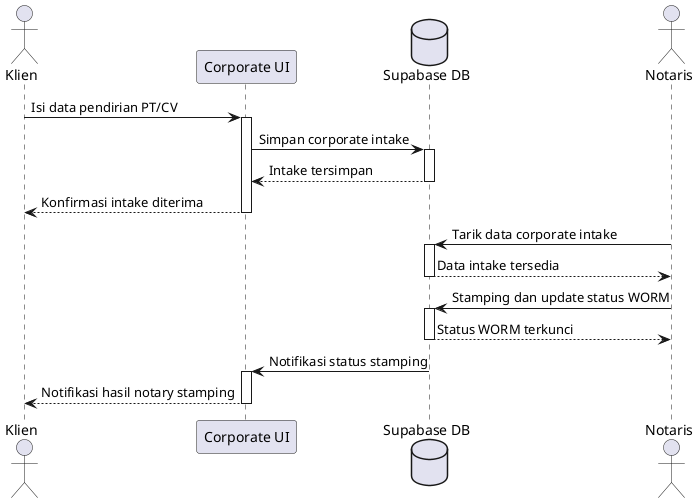
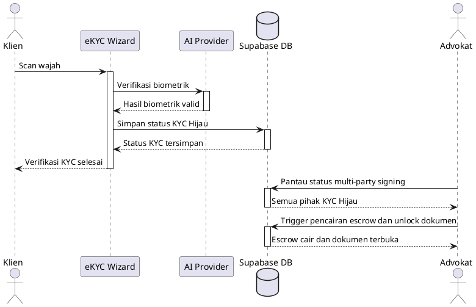

# Phase 2 Use Cases and UML Sequence Diagrams

## Bagian A: Pembaruan Use Case dan Aktor

### Aktor Baru

| Aktor | Peran |
| --- | --- |
| Notaris Terdaftar | Memverifikasi berkas pendirian badan usaha, memberi cap notaris, dan mengunci status dokumen legal. |
| Sistem e-KYC AI (Provider) | Menjalankan liveness check, biometrik wajah, dan mencatat hasil verifikasi identitas. |

### Use Case Baru

| Use Case | Aktor Utama | Hasil Sistem |
| --- | --- | --- |
| Mendirikan PT/CV berstandar PPATK | Klien, Notaris Terdaftar | Data corporate intake tersimpan, diverifikasi notaris, dan diaudit oleh WORM Trigger. |
| Menandatangani Dokumen via Verifikasi Biometrik AI Liveness | Klien, Sistem e-KYC AI (Provider), Advokat | Identitas pihak tervalidasi sebelum signing envelope dibuka untuk tanda tangan multi-party. |

## Bagian B: Sequence Diagram

### Alur Corporate Intake dan Notary Stamping

### Alur e-KYC AI dan Multi-Party Signing

