# Kumpulan Kode PlantUML: Activity Diagrams - 100% Siloed Architecture (Justifiqa & Qualifa)

Dokumen ini berisi kumpulan kode PlantUML untuk seluruh Activity Diagram pada dua aplikasi mandiri yang **100% terisolasi dan berdiri sendiri (*Siloed Architecture*)**: **Justifiqa** (Domain Hukum) dan **Qualifa** (Domain Psikologi). Penomoran diagram telah distandarisasi menggunakan pengenal spesifik aplikasi: **`AD-J-xx`** untuk Justifiqa dan **`AD-Q-xx`** untuk Qualifa.

---

> **⚠️ STATUS: TARGET ARCHITECTURE**
>
> Diagram dalam dokumen ini mendeskripsikan **arsitektur target / alur bisnis utama yang dimaksudkan**. Aktivitas yang ditampilkan murni berupa keputusan bisnis, swimlane peran, dan alur pengulangan/exception handling. Diagram ini **bukan as-built documentation** dan tidak menegaskan bahwa setiap adapter/seam saat ini telah ada.
>
> Implementasi aktual (as-built) menggunakan **Supabase BaaS** (PostgREST, GoTrue, Storage, Realtime, Edge Functions). Pemetaan target capability dan status implementasi aktual **hanya** ada di `MarkDown/TRACEABILITY_MATRIX.md`.
>
> **Untuk presentasi:** diagram AMAN dipamerkan sebagai representasi alur bisnis target. Setiap penyebutan `API Mekari Sign`, `Payment Gateway`, `WORM Storage` di AD adalah referensi dependency eksternal target, bukan endpoint internal yang sudah ter-deploy.

---

## Cara Import ke Draw.io
1. Buka Draw.io (`app.diagrams.net`).
2. Pada toolbar bagian atas, klik tombol **+ (Insert)** atau pilih menu **Arrange -> Insert**.
3. Pilih **Advanced -> PlantUML...**.
4. Salin dan tempel kode di bawah ini, lalu klik **Insert**.

---

## BAGIAN I: ACTIVITY DIAGRAMS - APLIKASI MANDIRI JUSTIFIQA (DOMAIN HUKUM)

### AD-J-01: Registrasi Akun Klien & Advokat (J-UC01, J-UC07)
*Diagram alur pendaftaran akun mandiri Klien (verifikasi NIK Dukcapil) dan Advokat/Notaris (verifikasi SIPP Peradi) di platform Justifiqa.*

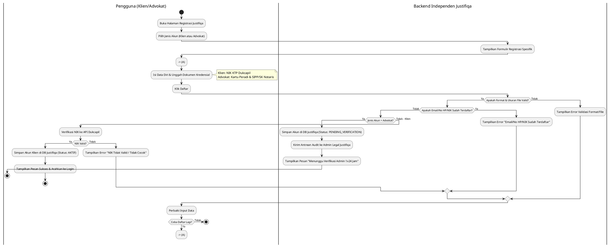

---

### AD-J-02: Login Akun Klien & Advokat (J-UC02, J-UC08)
*Diagram alur masuk (login) independen beserta verifikasi Multi-Factor Authentication (MFA / 2FA).*


---

### AD-J-03: Konsultasi Hukum & Pembayaran Escrow (J-UC03, J-UC04, J-UC05, J-UC10)
*Diagram alur reservasi, pembayaran escrow yang ditahan sistem Justifiqa, pelaksanaan sesi chat E2EE, hingga pelepasan dana setelah sesi selesai.*

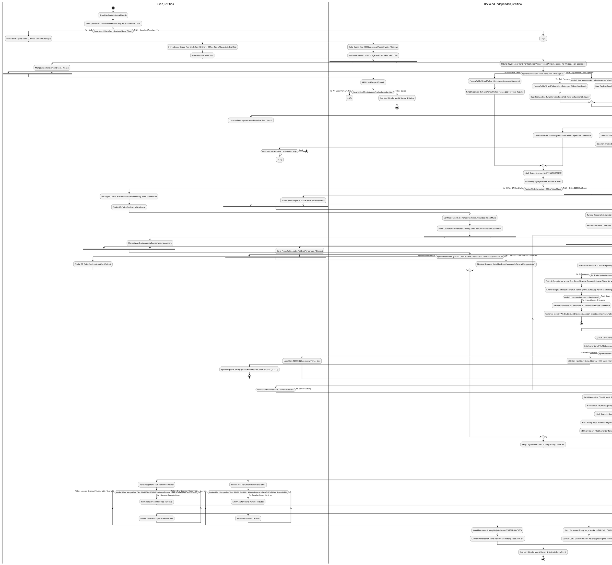

---

### AD-J-04: Mengatur Status Ketersediaan Praktik Advokat (J-UC09)
*Diagram alur pengaturan jadwal praktik dan toggle ketersediaan real-time advokat.*

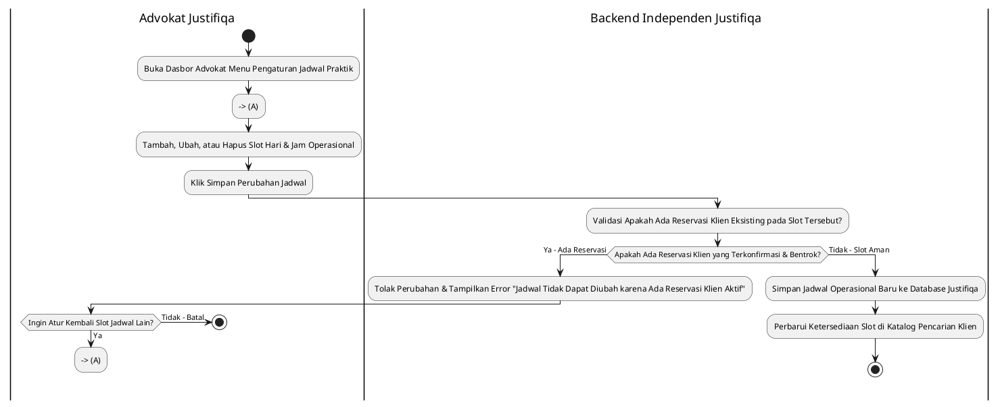

---

### AD-J-05: Mengunggah Berkas Perkara E2EE Zero-Knowledge (J-UC13)
*Diagram alur pengunggahan bukti perkara yang dienkripsi sebelum meninggalkan perangkat klien agar tidak dapat dibaca oleh server maupun pihak ketiga.*

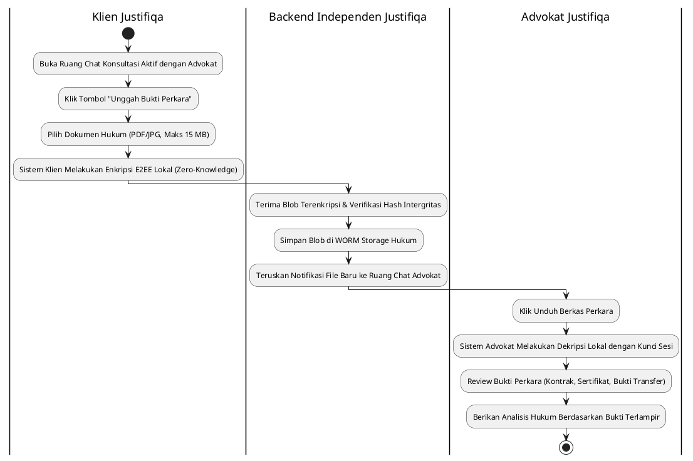

---

### AD-J-06: Membuat & Memfinalisasi Draf Kontrak Hukum Bermeterai (J-UC12, J-UC14)
*Diagram alur pembuatan opini hukum, surat somasi, atau kontrak kerja sama oleh advokat menggunakan generator klausul pintar dan finalisasi pembubuhan e-Meterai resmi Peruri yang difasilitasi platform (*Platform-Facilitated Stamping*) dengan pemotongan saldo dompet advokat.*

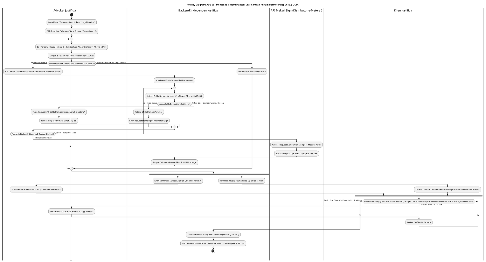

---

### AD-J-07: Konsultasi Pro Bono SKTM (J-UC15)
*Diagram alur pengajuan bantuan hukum cuma-cuma (Pro Bono) melalui verifikasi Surat Keterangan Tidak Mampu (SKTM) Dukcapil dengan mekanisme pemilihan katalog mandiri.*

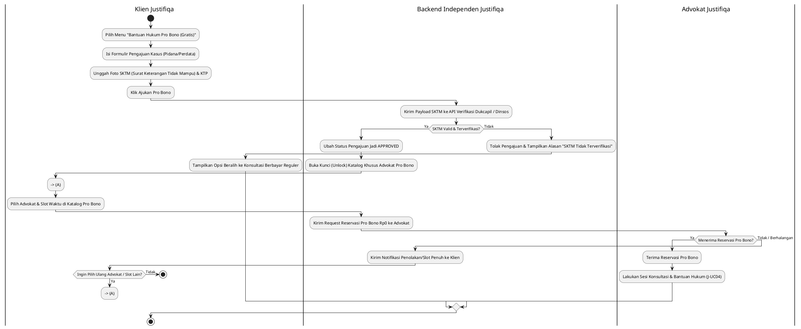

---

### AD-J-08: Membuat Catatan Sesi IRAC Note Advokat (J-UC11)
*Diagram alur pembuatan catatan terstruktur metode IRAC (Issue, Rule, Application, Conclusion) oleh advokat.*

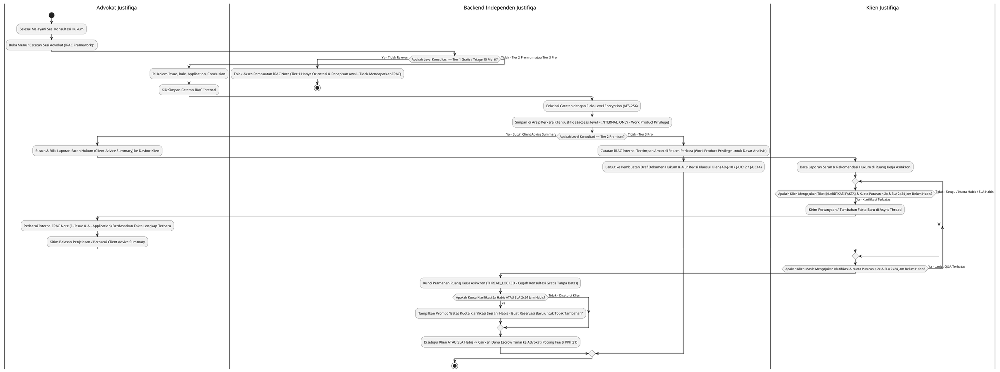

---

### AD-J-09: Verifikasi Kredensial & Sanitasi Profil/Media 3-Lapisan Advokat Mitra (J-UC16)
*Diagram alur verifikasi kredensial profesi Peradi serta pertahanan 3-Lapisan sanitasi profil/media anti-bypass kontak pribadi.*

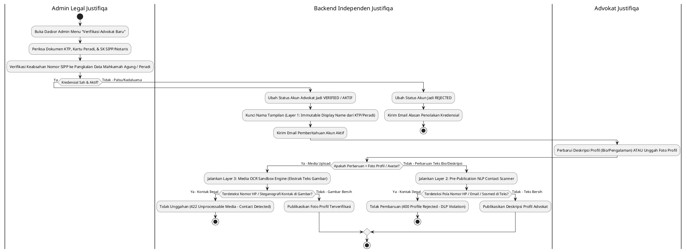

---

### AD-J-10: Moderasi Akun & Due Process Suspend Admin Justifiqa (J-UC17)
*Diagram alur penanganan laporan pelanggaran kode etik, investigasi Due Process of Law, pengajuan sanggahan, dan putusan akhir akun advokat.*

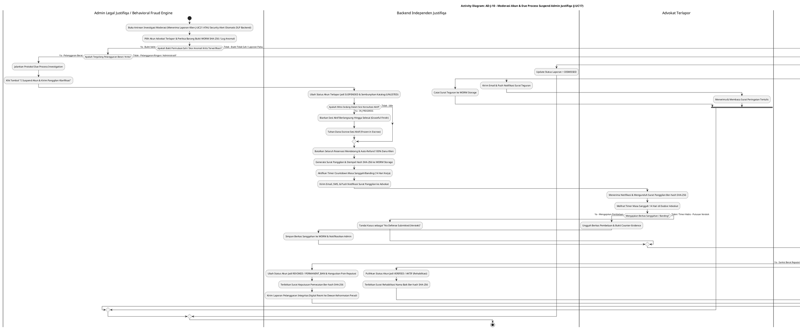

---

### AD-J-11: Pencairan Dana Escrow & Perhitungan PPh 21 Advokat (J-UC19)
*Diagram alur penarikan dana honorarium advokat dari dompet digital ke rekening bank pribadi, pemotongan pajak PPh 21 otomatis, dan auto-rollback jika transfer gagal.*

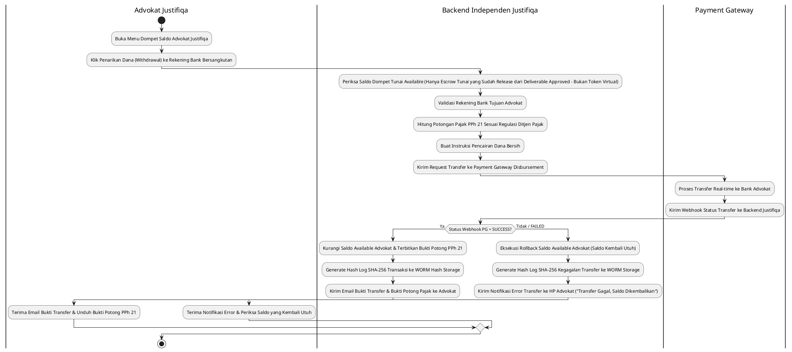

---

### AD-J-12: Memantau Laporan Keuangan Escrow & Audit WORM (J-UC18)
*Diagram alur pengawasan buku besar escrow, verifikasi bagi hasil platform (25%/75%), dan eksport bukti pajak PPh 21 ber-hash WORM SHA-256 oleh Admin Justifiqa.*

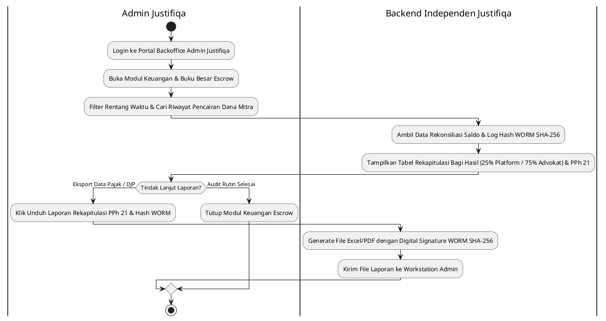

---

### AD-J-13: Memberikan Ulasan & Rating Advokat (J-UC06)
*Diagram alur pemberian penilaian pasca-sesi konsultasi dengan proteksi privasi anonimisasi nama publik sesuai UU PDP dan kalkulasi agregat rating otomatis.*

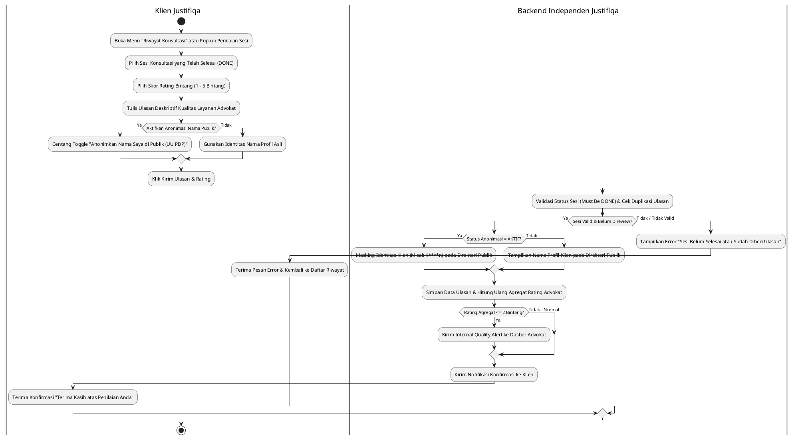

---

### AD-J-14: [DILEBUR KE DALAM AD-J-06]
*Catatan: Skenario J-UC14 (Pembubuhan e-Meterai Peruri) telah ditiadakan sebagai diagram mandiri dan dilebur seutuhnya ke dalam **AD-J-06 (J-UC12, J-UC14)** sebagai alur kerja terpadu perumusan dan finalisasi dokumen bermeterai yang difasilitasi platform (*Platform-Facilitated Stamping*) dengan pemotongan saldo dompet advokat.*

### AD-J-21: Melaporkan Dugaan Pelanggaran Etik Advokat (J-UC21)
*Diagram alur pengajuan laporan dugaan pelanggaran kode etik, kerahasiaan, atau wanprestasi advokat oleh klien beserta lampiran barang bukti digital terverifikasi SHA-256.*

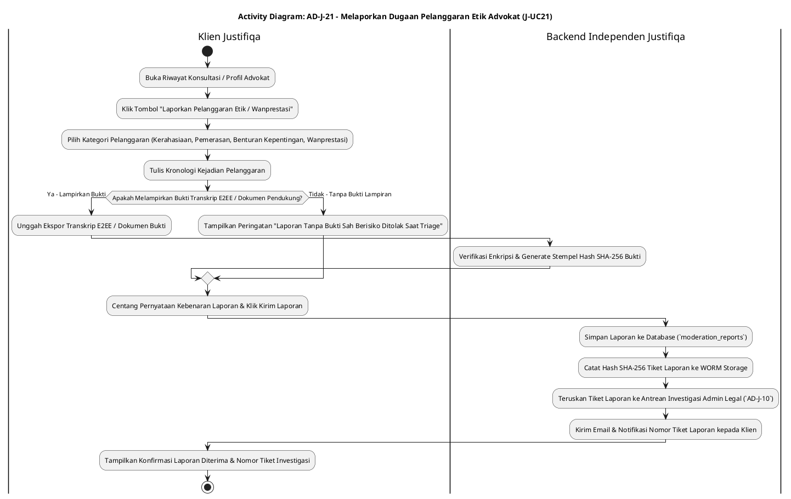

---

### AD-J-22: Mengisi Saldo Dompet Advokat (Top-Up / Cash-In - J-UC22)
*Diagram alur pengisian saldo dompet digital advokat melalui Payment Gateway (Snap / QRIS / VA) untuk membayar layanan berbayar platform tanpa potongan pajak PPh 21.*

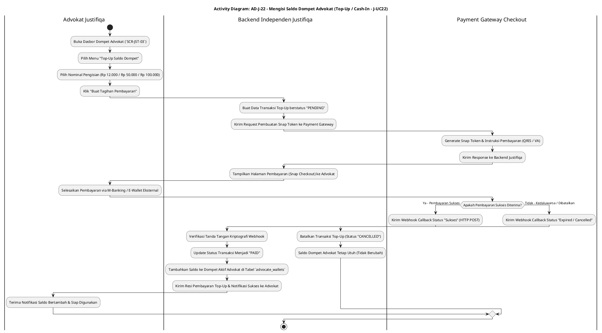

---

### AD-J-20: Autentikasi Portal Backoffice Admin Justifiqa (TOTP 2FA - J-UC20)
*Diagram alur autentikasi tingkat lanjut untuk Admin Justifiqa melalui portal backoffice terisolasi (`admin.justifiqa.com`) dengan IP Whitelisting, verifikasi kredensial internal, dan otentikasi ganda TOTP Authenticator.*

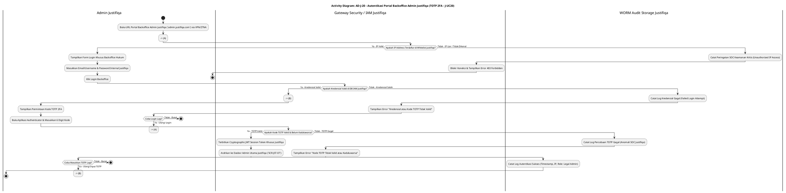

---

## BAGIAN II: ACTIVITY DIAGRAMS - APLIKASI MANDIRI QUALIFA (DOMAIN PSIKOLOGI)

### AD-Q-01: Registrasi Akun Klien & Psikolog Klinis (Q-UC01, Q-UC07)
*Diagram alur pendaftaran akun mandiri Klien dan Psikolog Klinis (verifikasi STR & SIPP HIMPSI) di platform Qualifa.*

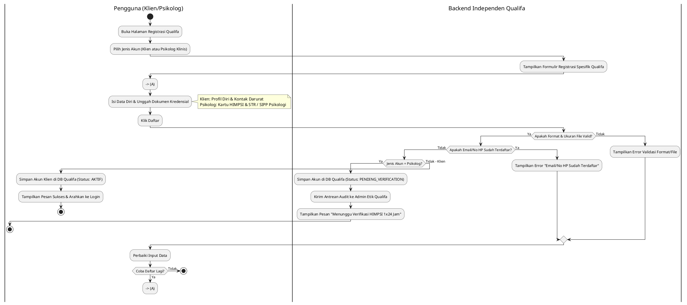

---

### AD-Q-02: Login Akun Klien & Psikolog Klinis (Q-UC02, Q-UC08)
*Diagram alur masuk (login) independen beserta verifikasi Multi-Factor Authentication (MFA / 2FA).*

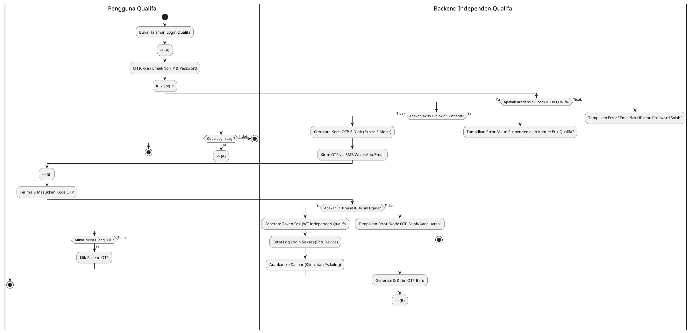

---

### AD-Q-03: Sesi Konseling Klinis & Pembayaran (Q-UC03, Q-UC04, Q-UC05, Q-UC10)
*Diagram alur reservasi psikolog, pembayaran konseling, pelaksanaan sesi terapi (chat/audio/video), dan penyelesaian sesi.*

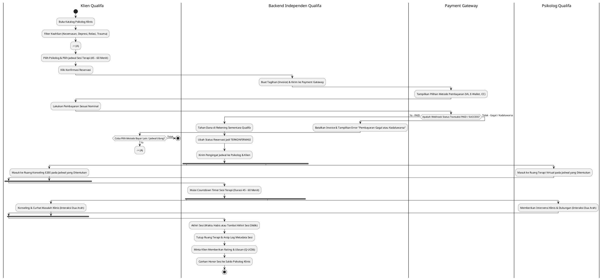

---

### AD-Q-04: Mengatur Status Ketersediaan & Buffer 30 Mnt (Q-UC09)
*Diagram alur pengaturan jadwal praktik psikolog dengan aturan wajib jeda istirahat emosional (buffer rule) 30 menit antar sesi.*

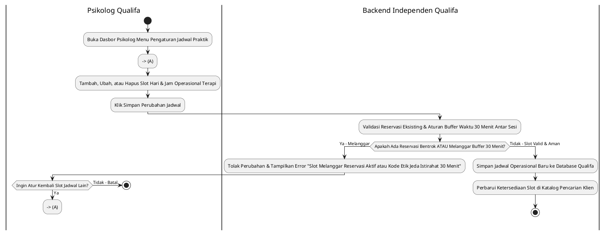

---

### AD-Q-05: Mengisi Jurnal Mood Tracker Harian Proactive Alert (Q-UC13)
*Diagram alur pengisian jurnal emosi harian yang dilengkapi sistem pendeteksi risiko penurunan kesehatan mental otomatis.*

```plantuml
@startuml
|Klien Qualifa|
start
:Buka Widget "Jurnal Mood Harian (Mood Tracker)";
:Pilih Emotikon Emosi Hari Ini (Senang, Tenang, Cemas, Sedih, Panik);
:Pilih Faktor Pemicu (Pekerjaan, Keluarga, Keuangan, Relasi);
:Tulis Catatan Jurnal Pribadi (Opsional);
:Klik Simpan Jurnal;

|Backend Independen Qualifa|
:Enkripsi Catatan Jurnal & Simpan di DB Qualifa;
:Analisis Tren Emosi 7 Hari Terakhir Klien;
if (Apakah Terdeteksi Tren Sedih/Cemas Ekstrem Selama 5 Hari Beruntun?) then (Ya)
  :Trigger Proactive Wellness Alert System;
  :Munculkan Pop-up Psikoedukasi & Rekomendasi Konseling;
  :Kirim Notifikasi Peringatan Lembut via Email/Push Notif;
else (Tidak)
  :Perbarui Grafik Tren Emosi di Dasbor Klien;
endif
stop
@enduml
```

---

### AD-Q-06: Mengakses Streaming Audio Meditasi & Relaksasi (Q-UC14)
*Diagram alur pemutaran trek audio terapi relaksasi dengan penyesuaian kualitas bitrate adaptif.*

```plantuml
@startuml
|Klien Qualifa|
start
:Buka Menu "Relaksasi & Audio Meditasi Qualifa";
:Pilih Kategori Meditasi (Tidur Nyenyak, Redakan Cemas, Mindfulness);
:Pilih Trek Audio & Klik Tombol Play;

|Backend Independen Qualifa|
:Periksa Kecepatan Koneksi Internet Klien;
if (Koneksi Cepat / Wi-Fi?) then (Ya)
  :Streaming Audio Bitrate Tinggi (320 kbps High Quality);
else (Tidak - Koneksi Seluler/Lambat)
  :Streaming Audio Bitrate Adaptif (128 kbps Smooth);
endif

|Klien Qualifa|
:Dengarkan Audio Meditasi;
:Sistem Mencatat Durasi Latihan di Riwayat Wellness Klien;
stop
@enduml
```

---

### AD-Q-07: Mengisi Asesmen DASS-21 & Protokol Crisis Button 119 (Q-UC15)
*Diagram alur pengisian tes stres klinis DASS-21 yang memicu protokol kedaruratan bunuh diri/krisis 119 jika skor berada pada tingkat bahaya ekstrem.*

```plantuml
@startuml
|Klien Qualifa|
start
:Buka Menu "Tes Asesmen Klinis DASS-21";
:Jawab 21 Pertanyaan Skala Intensitas Stres, Kecemasan, & Depresi;
:Klik Submit Jawaban;

|Backend Independen Qualifa|
:Hitung Skor Sub-Skala Depresi, Anxiety, & Stress;
if (Apakah Skor Depresi/Anxiety Masuk Kategori EXTREME / RISK OF SELF-HARM?) then (Ya)
  :Aktifkan Protokol Kedaruratan Krisis (Crisis 119 Protocol);
  :Munculkan Layar Peringatan Merah & Tombol "Hubungi Hotline Krisis 119 Sekarang";
  :Kirim Notifikasi Darurat ke Nomor Kontak Darurat Terdaftar Klien;
  :Tawarkan Sesi Konseling Darurat Gratis/Prioritas dengan Psikolog Klinis Siaga;
else (Tidak - Normal / Sedang)
  :Tampilkan Hasil Skor & Penjelasan Psikoedukasi Klinis;
  :Rekomendasikan Artikel Kesehatan Mental & Audio Meditasi yang Relevan;
endif
stop
@enduml
```

---

### AD-Q-08: Membuat Catatan Terapi DAP Note & Worksheet CCBT (Q-UC11, Q-UC12)
*Diagram alur pembuatan catatan klinis metode DAP (Data, Assessment, Plan) dan penugasan lembar kerja terapi perilaku kognitif (CCBT).*

```plantuml
@startuml
|Psikolog Qualifa|
start
:Selesai Melayani Sesi Konseling Klinis;
:Buka Menu "Catatan Klinis Psikolog (DAP Note Framework)";
:Isi Kolom Data (Observasi Perilaku & Keluhan Klien);
:Isi Kolom Assessment (Analisis Klinis & Dinamika Psikologis);
:Isi Kolom Plan (Rencana Intervensi & Target Terapi Lanjutan);
:Klik Simpan Catatan DAP Note;

|Backend Independen Qualifa|
:Enkripsi Catatan Klinis dengan Field-Level Encryption;
:Simpan di Arsip Terapi Klien Qualifa (Sangat Rahasia);
if (Perlu Berikan Tugas Terapi CCBT ke Klien?) then (Ya)
  |Psikolog Qualifa|
  :Buka Menu "Generator Worksheet CCBT";
  :Pilih Template Tugas (Thought Record / Behavioral Activation);
  :Kirim Tugas ke Dasbor Klien;
  |Backend Independen Qualifa|
  :Kirim Notifikasi Tugas Baru ke Aplikasi Klien;
  |Klien Qualifa|
  :Mengerjakan Worksheet CCBT di Aplikasi Sebelum Sesi Berikutnya;
else (Tidak)
  |Psikolog Qualifa|
  :Selesai;
endif
stop
@enduml
```

---

### AD-Q-09: Verifikasi STR/HIMPSI & Moderasi Komite Etik Admin Qualifa (Q-UC16, Q-UC17)
*Diagram alur audit keabsahan surat tanda registrasi psikolog klinis serta penanganan laporan kode etik.*

```plantuml
@startuml
|Admin Etik Qualifa|
start
:Buka Dasbor Admin Menu "Verifikasi Psikolog Baru";
:Periksa Dokumen STR Klinis, SIPP, & Kartu Anggota HIMPSI;
:Verifikasi Nomor STR ke Pangkalan Data HIMPSI / Kemenkes;
if (Kredensial Sah & STR Masih Berlaku?) then (Ya)
  |Backend Independen Qualifa|
  :Ubah Status Akun Psikolog Jadi VERIFIED / AKTIF;
  :Kirim Email Selamat Datang & Panduan Kode Etik Qualifa;
else (Tidak - STR Kadaluarsa / Tidak Sah)
  |Backend Independen Qualifa|
  :Ubah Status Akun Jadi REJECTED;
  :Kirim Email Alasan Penolakan Kredensial;
endif

|Admin Etik Qualifa|
:Buka Menu "Moderasi & Komite Etik Psikologi";
if (Ada Laporan Pelanggaran Kode Etik / Malpraktik?) then (Ya)
  :Jalankan Protokol Pemeriksaan Komite Etik Qualifa;
  :Ubah Status Akun Terlapor Jadi SUSPENDED (Sementara);
  :Kirim Surat Panggilan Klarifikasi Komite Etik;
else (Tidak)
  :Arsip Laporan sebagai Clear;
endif
stop
@enduml
```

---

### AD-Q-10: Pencairan Honor Psikolog & Perhitungan PPh 21 (Q-UC19)
*Diagram alur penarikan honor sesi konseling klinis oleh psikolog dari dompet digital ke rekening bank, pemotongan pajak PPh 21 otomatis, dan auto-rollback jika transfer gagal.*

```plantuml
@startuml
|Psikolog Qualifa|
start
:Buka Menu Dompet Saldo Psikolog Qualifa;
:Klik Penarikan Honor (Withdrawal) ke Rekening Bank Bersangkutan;

|Backend Independen Qualifa|
:Periksa Saldo Available & Validasi Rekening Bank Tujuan;
:Hitung Potongan Pajak PPh 21 Sesuai Regulasi Ditjen Pajak;
:Buat Instruksi Pencairan Honor Bersih;
:Kirim Request Transfer ke Payment Gateway Disbursement;

|Payment Gateway|
:Proses Transfer Real-time ke Bank Psikolog;
:Kirim Webhook Status Transfer ke Backend Qualifa;

|Backend Independen Qualifa|
if (Status Webhook PG = SUCCESS?) then (Ya)
  :Kurangi Saldo Psikolog & Simpan Bukti Potong PPh 21;
  :Generate Hash Log SHA-256 Transaksi ke WORM Hash Storage;
  :Kirim Email Bukti Transfer & Detail Honor ke Psikolog;
  |Psikolog Qualifa|
  :Terima Email Bukti Transfer & Unduh Detail Honor / PPh 21;
else (Tidak / FAILED)
  |Backend Independen Qualifa|
  :Eksekusi Rollback Saldo Available Psikolog (Saldo Kembali Utuh);
  :Generate Hash Log SHA-256 Kegagalan Transfer ke WORM Storage;
  :Kirim Notifikasi Error Transfer ke HP Psikolog ("Transfer Gagal, Saldo Dikembalikan");
  |Psikolog Qualifa|
  :Terima Notifikasi Error & Periksa Saldo yang Kembali Utuh;
endif
stop
@enduml
```

---

### AD-Q-11: Memantau Laporan Keuangan Qualifa & Audit WORM (Q-UC18)
*Diagram alur pengawasan buku besar honorarium, verifikasi bagi hasil platform (20%/80%), dan eksport bukti pajak PPh 21 ber-hash WORM SHA-256 oleh Admin Qualifa.*

```plantuml
@startuml
|Admin Qualifa|
start
:Login ke Portal Backoffice Admin Qualifa;
:Buka Modul Keuangan & Buku Besar Honorarium;
:Filter Rentang Waktu & Cari Riwayat Pencairan Honor Mitra;

|Backend Independen Qualifa|
:Ambil Data Rekonsiliasi Saldo & Log Hash WORM SHA-256;
:Tampilkan Tabel Rekapitulasi Bagi Hasil (20% Platform / 80% Psikolog) & PPh 21;

|Admin Qualifa|
if (Tindak Lanjut Laporan?) then (Eksport Data Pajak / DJP)
  :Klik Unduh Laporan Rekapitulasi PPh 21 & Hash WORM;
  
  |Backend Independen Qualifa|
  :Generate File Excel/PDF dengan Digital Signature WORM SHA-256;
  :Kirim File Laporan ke Workstation Admin;
else (Audit Rutin Selesai)
  |Admin Qualifa|
  :Tutup Modul Keuangan Honorarium;
endif
stop
@enduml
```

---

### AD-Q-20: Autentikasi Portal Backoffice Admin Qualifa (TOTP 2FA - Q-UC20)
*Diagram alur autentikasi tingkat lanjut untuk Admin Qualifa melalui portal backoffice terisolasi (`admin.qualifa.com`) dengan IP Whitelisting, verifikasi kredensial internal, dan otentikasi ganda TOTP Authenticator.*

```plantuml
@startuml
title Activity Diagram: AD-Q-20 - Autentikasi Portal Backoffice Admin Qualifa (TOTP 2FA - Q-UC20)
|Admin Qualifa|
start
:Buka URL Portal Backoffice Admin Qualifa (`admin.qualifa.com`) via VPN/ZTNA;
--> (A)

|Gateway Security / IAM Qualifa|
if (Apakah IP Address Terdaftar di Whitelist Qualifa?) then (Ya - IP Valid)
  |Admin Qualifa|
  :Tampilkan Form Login Khusus Backoffice Psikologi;
  :Masukkan Email/Username & Password Internal Qualifa;
  :Klik Login Backoffice;
  
  |Gateway Security / IAM Qualifa|
  if (Apakah Kredensial Valid di DB IAM Qualifa?) then (Ya - Kredensial Valid)
    --> (B)
    |Admin Qualifa|
    :Tampilkan Permintaan Kode TOTP 2FA;
    :Buka Aplikasi Authenticator & Masukkan 6 Digit Kode;
    
    |Gateway Security / IAM Qualifa|
    if (Apakah Kode TOTP Valid & Belum Kadaluwarsa?) then (Ya - TOTP Valid)
      :Terbitkan Cryptographic JWT Session Token Khusus Qualifa;
      :Arahkan ke Dasbor Admin Utama Qualifa (`SCR-QLF-07`);
      
      |WORM Audit Storage Qualifa|
      :Catat Log Autentikasi Sukses (Timestamp, IP, Role: Ethics Committee / Admin);
      
      |Admin Qualifa|
      stop
    else (Tidak - TOTP Gagal)
      |WORM Audit Storage Qualifa|
      :Catat Log Percobaan TOTP Gagal (Anomali SOC Qualifa);
      
      |Gateway Security / IAM Qualifa|
      :Tampilkan Error "Kode TOTP Tidak Valid atau Kadaluwarsa";
      
      |Admin Qualifa|
      if (Coba Masukkan TOTP Lagi?) then (Ya - Ulangi Input TOTP)
        --> (B)
        detach
      else (Tidak - Batal)
        stop
      endif
    endif
  else (Tidak - Kredensial Salah)
    |WORM Audit Storage Qualifa|
    :Catat Log Kredensial Gagal (Failed Login Attempt);
    
    |Gateway Security / IAM Qualifa|
    :Tampilkan Error "Kredensial atau Kode TOTP Tidak Valid";
    
    |Admin Qualifa|
    if (Coba Login Lagi?) then (Ya - Ulangi Login)
      --> (A)
      detach
    else (Tidak - Batal)
      stop
    @enduml
```

---

## BAGIAN III: ACTIVITY DIAGRAMS - PHASE 2 (CORPORATE INTAKE & E-KYC FORENSIK)

### AD-P2-01: Corporate Intake & Notary Stamping
*Alur ini mencakup intake PT/CV, validasi berulang, order dan milestone, escrow, review Notaris, submission AHU/OSS yang dapat ditolak berulang, WORM anchoring, serta payout idempoten. Klien hanya menerima status netral; detail internal PMPJ/compliance tidak ditampilkan.*

```plantuml
@startuml
title AD-P2-01: Corporate Intake & Notary Stamping

|Klien|
start
:[AD01-01] Isi dan submit Corporate Intake\n(PT/CV, KBLI, struktur, natural-person BO,\nconsent dan versi legal scope);

|Sistem UI|
:[AD01-02] Validasi format dan kelengkapan;
while (Payload valid?) is (Tidak)
  :Tampilkan error terarah;
  |Klien|
  :Perbaiki dan submit ulang;
  |Sistem UI|
  :Validasi ulang payload;
endwhile (Ya)

|Supabase BaaS|
:[AD01-03] Simpan case DRAFT, parties, BO,\nservice order, fee lines, dan milestone\nsecara atomik;

|Sistem UI|
:[AD01-04] Tampilkan checkout dan penawaran berversi;
|Klien|
:Setujui penawaran dan pilih metode pembayaran;

|Payment Gateway / Escrow|
:Terima transfer ke rekening bersama;
:Kirim webhook pembayaran bertanda tangan;

|Supabase BaaS|
:[AD01-05] Verifikasi HMAC, event, order, dan nominal;\nlock event + escrow row (SELECT ... FOR UPDATE);
if (Webhook dan pembayaran valid?) then (Tidak)
  :Tolak mutasi finansial;\norder tetap PENDING_PAYMENT;
  |Sistem UI|
  :Tampilkan pembayaran gagal/pending;
  |Klien|
  :Ulangi pembayaran atau batalkan checkout;
  stop
else (Ya)
  :Set escrow_transactions = HELD_IN_ESCROW;\nset milestone = FUNDED;\ncatat ledger append-only;
endif

|Supabase BaaS|
:[AD01-06] Set case = ESCROW_LOCKED;\ntugaskan dan notifikasi Notaris;

|Notaris|
:[AD01-07] Buka workspace dan review intake,\nBO, identitas, KBLI, domisili, dan formalitas;
while (Intake lengkap dan dapat diproses?) is (Tidak)
  :Tandai CUSTOMER_ACTION_REQUIRED\n(tanpa alasan compliance sensitif);
  |Supabase BaaS|
  :Simpan expected-state transition dan notifikasi Klien;\ndana tetap HELD_IN_ESCROW;
  |Klien|
  :Lengkapi data/dokumen dan submit ulang;
  |Supabase BaaS|
  :Simpan revisi dan audit metadata;
  |Notaris|
  :[AD01-08] Review ulang revisi;
endwhile (Ya)

|Notaris|
:[AD01-09] Siapkan submission AHU/OSS\nmelalui kanal resmi dengan credential sendiri;

|Supabase BaaS|
:Buat government_submission_job SUBMITTED\n(digest + idempotency key, tanpa raw credential/payload);
while (Submission disetujui?) is (Tidak — REJECTED)
  :[AD01-10] Catat REJECTED dan alasan yang boleh disimpan;
  |Notaris|
  :Revisi data/dokumen;
  |Supabase BaaS|
  :Buat job DRAFT baru dengan idempotency key baru;
  |Notaris|
  :Submit ulang melalui kanal resmi;
  |Supabase BaaS|
  :Set job revisi = SUBMITTED;
endwhile (Ya — APPROVED)

|Supabase BaaS|
:[AD01-11] Rekonsiliasi nomor AHU/NIB,\nexternal reference, dan digest final;
if (Rekonsiliasi final valid?) then (Tidak)
  :Set COMPLIANCE_HOLD;\nblok payout dan minta review internal;
  stop
else (Ya)
endif

|Notaris|
:Unggah dokumen final ke bucket privat;
|Supabase BaaS|
:[AD01-12] MIME allow-list + malware scan;\nhitung SHA-256 server-side;\nsimpan document_integrity_anchors\nappend-only dan kunci case;

:[AD01-13] Siapkan payout milestone;\ncommit intent + idempotency key;\npanggil provider di luar transaksi DB;\nfinalize dengan row lock dan rekonsiliasi;
|Payment Gateway / Escrow|
:Transfer dana escrow ke rekening Notaris;\nkembalikan reference terautentikasi;
|Supabase BaaS|
:Set milestone = RELEASED;\ncatat payout result dan audit_logs_worm;

|Sistem UI|
:[AD01-14] Tampilkan status selesai,\ndokumen WORM, dan payout terkonfirmasi;
|Klien|
:Unduh dokumen final melalui akses terotorisasi;
|Notaris|
:Terima konfirmasi payout;
stop
@enduml
```

---

### AD-P2-02: High-Stakes Property Transaction — e-KYC Forensik Multi-Pihak
*Escrow harus terkunci sebelum undangan e-KYC aktif. TTL global adalah **7 × 24 jam sejak `escrow_locked_at`**. Scheduler dan setiap command/callback memeriksa deadline yang sama. Satu pihak yang terbukti ilegal, gagal liveness pada percobaan ketiga, atau tidak merespons sampai TTL berakhir memicu **Global Halt**: envelope dibatalkan untuk semua pihak dan escrow dikembalikan penuh secara idempoten.*

```plantuml
@startuml
title AD-P2-02: Property Transaction — e-KYC, TTL 7 Hari, Global Halt & Escrow Refund

|Pihak Transaksi|
start
:[AD02-01] Inisiator membuat transaksi,\nmendaftarkan seluruh pihak dan e-kertas;

|Supabase BaaS|
:Bekukan digest dokumen;\nbuat envelope DRAFT dan party PENDING;
|Sistem UI|
:[AD02-02] Tampilkan checkout escrow;
|Pihak Transaksi|
:Setujui biaya dan transfer ke rekening bersama;
|Payment Gateway / Escrow|
:Verifikasi sumber dana dan kirim webhook bertanda tangan;
|Supabase BaaS|
:[AD02-03] Verifikasi webhook + nominal;\nrow-lock escrow; set HELD_IN_ESCROW;\nset expires_at = escrow_locked_at + 7 hari;\ncatat audit append-only;
if (Escrow berhasil dikunci?) then (Tidak)
  :Batalkan aktivasi e-KYC;\ntidak ada dana yang direfund;
  stop
else (Ya)
endif

:[AD02-04] Kirim undangan unik ke seluruh pihak;\naktifkan watchdog TTL 7 hari;

while (Semua pihak berstatus PASSED?) is (Belum)
  :[AD02-05] Pilih pihak PENDING berikutnya\natau tunggu event/callback;
  if (Sekarang >= expires_at dan ada pihak belum PASSED?) then (Ya)
    :[AD02-15] GLOBAL HALT — TTL_EXPIRED;\nset envelope = EXPIRED;\nblok seluruh command/callback lanjutan;
    :[AD02-17] Row-lock escrow;\nrefund idempoten 100% ke Klien;\nset escrow = REFUNDED_TO_CLIENT;\ncatat ledger + audit_logs_worm;\nnotifikasi seluruh pihak;
    stop
  else (Tidak)
  endif

  |Pihak Transaksi|
  :Buka tautan auto-login dan baca e-kertas 1..n;\nsetujui tiap halaman dan bubuhkan TTD final;
  |Sistem UI|
  :[AD02-06] Verifikasi sesi, consent per halaman,\ndan digest dokumen yang telah dibekukan;

  while (Pihak belum PASSED dan liveness_attempt_count < 3?) is (Ya)
    |Supabase BaaS|
    :Row-lock envelope; pastikan status masih aktif\ndan now < expires_at sebelum membuat sesi provider;
    if (Deadline telah lewat?) then (Ya)
      :[AD02-15] GLOBAL HALT — TTL_EXPIRED;\nset envelope = EXPIRED;\nblok seluruh command/callback lanjutan;
      :[AD02-17] Row-lock escrow;\nrefund idempoten 100% ke Klien;\nset escrow = REFUNDED_TO_CLIENT;\ncatat ledger + audit_logs_worm;\nnotifikasi seluruh pihak;
      stop
    else (Tidak)
    endif
    |Sistem UI|
    :[AD02-07] Buka SDK/redirect provider;\nmedia mentah dikirim langsung ke provider,\ntidak melalui API/storage/log Justifiqa;
    |Pihak Transaksi|
    :Ambil bukti forensik:\nsetengah badan + KTP + device berisi TTD final;
    |Provider e-KYC / CV AI|
    :Liveness anti-spoof/editan;\nOCR KTP; deteksi device dan TTD;\nvalidasi terhadap sumber pemerintah;
    :Kirim callback metadata bertanda tangan\n(reference, status, digest, timestamp);
    |Supabase BaaS|
    :[AD02-08] Verifikasi signature, timestamp,\nnonce/idempotency dan anti-replay;
    if (Callback valid?) then (Tidak)
      :Tolak callback tanpa mengubah status;\nTTL tetap berjalan;
    else (Ya)
      :Row-lock envelope; periksa expires_at dan status terminal\nsebelum menerima outcome atau mengubah status;
      if (Callback tiba setelah deadline?) then (Ya)
        :[AD02-15] GLOBAL HALT — TTL_EXPIRED;\nset envelope = EXPIRED;\nblok seluruh command/callback lanjutan;
        :[AD02-17] Row-lock escrow;\nrefund idempoten 100% ke Klien;\nset escrow = REFUNDED_TO_CLIENT;\ncatat ledger + audit_logs_worm;\nnotifikasi seluruh pihak;
        stop
      else (Tidak)
        :Simpan metadata allow-list saja;\nTANPA media/payload biometrik mentah;
      endif

      if (Ilegal/fraud terkonfirmasi?) then (Ya)
        :[AD02-09] GLOBAL HALT — ILLEGAL_CONFIRMED;\nset pihak = REJECTED;\nset envelope = VOIDED;\nblok semua pihak;
        :[AD02-17] Row-lock escrow;\nrefund idempoten 100% ke Klien;\nset escrow = REFUNDED_TO_CLIENT;\ncatat ledger + audit_logs_worm;\nnotifikasi seluruh pihak;
        stop
      else (Tidak)
      endif

      if (Hasil meragukan, OCR/device/TTD mismatch,\natau perlu keputusan manusia?) then (Ya)
        :[AD02-11] Set REQUIRES_MANUAL_REVIEW;\nreviewer menerima metadata minimum,\nbukan raw media melalui Justifiqa;
        :Saat callback reviewer tiba, verifikasi signature/anti-replay;\nrow-lock envelope dan periksa deadline yang sama;
        if (Callback reviewer tiba setelah deadline?) then (Ya)
          :[AD02-15] GLOBAL HALT — TTL_EXPIRED;\nset envelope = EXPIRED;\nblok seluruh command/callback lanjutan;
          :[AD02-17] Row-lock escrow;\nrefund idempoten 100% ke Klien;\nset escrow = REFUNDED_TO_CLIENT;\ncatat ledger + audit_logs_worm;\nnotifikasi seluruh pihak;
          stop
        else (Tidak)
        endif
        if (Review mengonfirmasi ilegal?) then (Ya)
          :[AD02-09] GLOBAL HALT — ILLEGAL_CONFIRMED;\nset pihak = REJECTED;\nset envelope = VOIDED;
          :[AD02-17] Refund idempoten 100%;\nset escrow = REFUNDED_TO_CLIENT;\ncatat ledger + audit; notifikasi semua pihak;
          stop
        else (Tidak — Clear)
          :Set hasil review = PASSED;
        endif
      else (Keputusan otomatis dapat diterima)
        if (Liveness lulus?) then (Ya)
          :Set hasil = PASSED;
        else (Tidak)
          :[AD02-10] Increment liveness_attempt_count;\ncatat kegagalan liveness terpisah;
        endif
      endif
    endif
  endwhile (Tidak)

  if (Pihak berstatus PASSED?) then (Tidak — 3 liveness gagal)
    :[AD02-12] GLOBAL HALT — LIVENESS_FAILED_3X;\nset pihak = REJECTED;\nset envelope = VOIDED;\nblok semua pihak;
    :[AD02-17] Row-lock escrow;\nrefund idempoten 100% ke Klien;\nset escrow = REFUNDED_TO_CLIENT;\ncatat ledger + audit_logs_worm;\nnotifikasi seluruh pihak;
    stop
  else (Ya)
    :[AD02-13] Pertahankan status DB = PASSED;\nproyeksi UI = GREEN;
  endif

  :[AD02-14] Cek ulang seluruh pihak;\nreschedule watchdog bila masih PENDING;
endwhile (Ya)

:[AD02-16] Tandai fase e-KYC selesai;\nenvelope dapat lanjut ke fase signing;\nescrow tetap HELD_IN_ESCROW sampai\nmilestone berikutnya terpenuhi;
|Sistem UI|
:Tampilkan semua pihak GREEN dan deadline selesai;
|Pihak Transaksi|
:Lanjut ke fase signing/milestone berikutnya;
stop
@enduml
```

---

## Keputusan arsitektur dan status kanonik

1. **Corporate rejection loop diperbaiki:** `REJECTED → DRAFT → SUBMITTED` kini kembali ke keputusan approval, bukan jatuh otomatis ke jalur `APPROVED`.
2. **Payout Notaris tidak memakai fungsi payout Advokat:** diagram memakai port payout role-aware dengan prepare/commit → external call → finalize/reconcile. `fn_release_escrow_to_advocate_mutex` tidak diklaim dapat membayar Notaris.
3. **e-KYC zero raw biometric:** browser berinteraksi langsung dengan SDK/provider. Justifiqa hanya menerima callback metadata yang telah diverifikasi.
4. **Status e-KYC:** status database adalah `PENDING | PASSED | REJECTED | REQUIRES_MANUAL_REVIEW`; warna **GREEN** hanya proyeksi UI untuk `PASSED`.
5. **Global Halt:** `VOIDED` digunakan untuk ilegal/fraud atau tiga kegagalan liveness; `EXPIRED` untuk TTL; histori individual tidak dihapus.
6. **Escrow:** sukses e-KYC tidak otomatis mencairkan uang. Dana tetap `HELD_IN_ESCROW`; semua terminal Global Halt menghasilkan `REFUNDED_TO_CLIENT`.
7. **Gap implementasi yang disengaja terlihat:** migrasi saat ini belum memiliki aggregate property transaction dan kolom deadline khusus yang mengikat envelope ke escrow. Diagram ini adalah kontrak target Batch 2; remediasi SQL berada di luar kewenangan batch ini.

## Tabel terkait yang benar-benar tersedia

| Diagram | Tabel utama |
| --- | --- |
| AD-P2-01 | `corporate_service_cases`, `corporate_parties`, `beneficial_owners`, `service_orders`, `service_fee_lines`, `payment_milestones`, `escrow_transactions`, `payout_idempotency_keys`, `government_submission_jobs`, `document_integrity_anchors`, `audit_logs_worm`, `user_notifications` |
| AD-P2-02 | `ekyc_verification_logs`, `signing_envelopes`, `signing_envelope_parties`, `escrow_transactions`, `payment_milestones`, `escrow_payout_ledgers`, `audit_logs_worm`, `user_notifications` |
```

