# Kumpulan Kode PlantUML: Activity Diagrams - LifeQ SuperApp

Dokumen ini berisi kumpulan kode PlantUML untuk seluruh Activity Diagram pada sistem **LifeQ SuperApp** (17 Core Use Case + 9 Domain Use Case + Admin Flow).

---

## Cara Import ke Draw.io
1. Buka Draw.io (pp.diagrams.net).
2. Pada toolbar bagian atas, klik tombol **+ (Insert)** atau pilih menu **Arrange -> Insert**.
3. Pilih **Advanced -> PlantUML...**.
4. Salin dan tempel kode di bawah ini, lalu klik **Insert**.

---

### 1. Activity Diagram: Registrasi Klien (UC-01)
*Diagram alur pendaftaran akun Klien baru.*

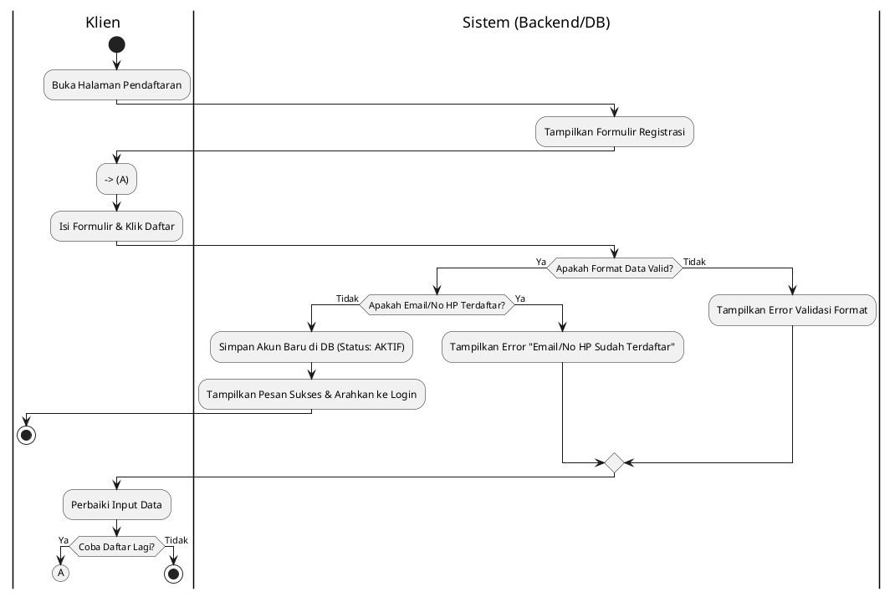
```plantuml
@startuml
|Klien|
start
:Buka Halaman Pendaftaran;

|Sistem (Backend/DB)|
:Tampilkan Formulir Registrasi;

|Klien|
--> (A)
:Isi Formulir & Klik Daftar;

|Sistem (Backend/DB)|
if (Apakah Format Data Valid?) then (Ya)
  if (Apakah Email/No HP Terdaftar?) then (Tidak)
    :Simpan Akun Baru di DB (Status: AKTIF);
    :Tampilkan Pesan Sukses & Arahkan ke Login;
    |Klien|
    stop
  else (Ya)
    |Sistem (Backend/DB)|
    :Tampilkan Error "Email/No HP Sudah Terdaftar";
  endif
else (Tidak)
  |Sistem (Backend/DB)|
  :Tampilkan Error Validasi Format;
endif

|Klien|
:Perbaiki Input Data;
if (Coba Daftar Lagi?) then (Ya)
  (A)
  detach
else (Tidak)
  stop
endif
@enduml
```

---

### 2. Activity Diagram: Melakukan Login (UC-02 & UC-08)
*Diagram alur masuk Klien dan Mitra Profesional dengan verifikasi OTP.*

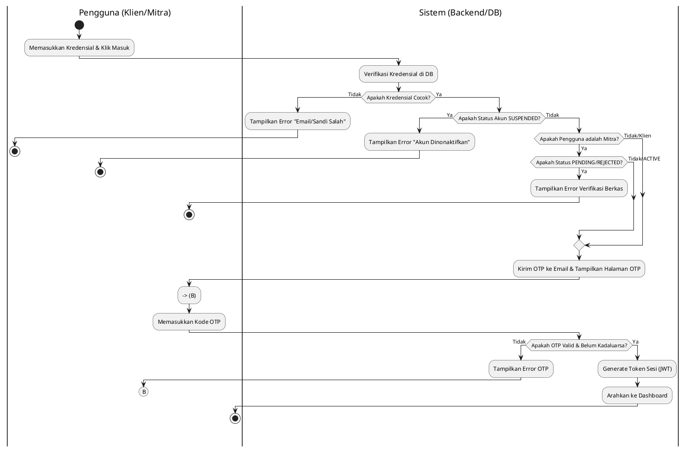
```plantuml
@startuml
|Pengguna (Klien/Mitra)|
start
:Memasukkan Kredensial & Klik Masuk;

|Sistem (Backend/DB)|
:Verifikasi Kredensial di DB;
if (Apakah Kredensial Cocok?) then (Tidak)
  :Tampilkan Error "Email/Sandi Salah";
  |Pengguna (Klien/Mitra)|
  stop
else (Ya)
  |Sistem (Backend/DB)|
  if (Apakah Status Akun SUSPENDED?) is (Ya) then
    :Tampilkan Error "Akun Dinonaktifkan";
    |Pengguna (Klien/Mitra)|
    stop
  else (Tidak)
    |Sistem (Backend/DB)|
    if (Apakah Pengguna adalah Mitra?) then (Ya)
      if (Apakah Status PENDING/REJECTED?) is (Ya) then
        :Tampilkan Error Verifikasi Berkas;
        |Pengguna (Klien/Mitra)|
        stop
      else (Tidak/ACTIVE)
      endif
    else (Tidak/Klien)
    endif
    
    |Sistem (Backend/DB)|
    :Kirim OTP ke Email & Tampilkan Halaman OTP;
    
    |Pengguna (Klien/Mitra)|
    --> (B)
    :Memasukkan Kode OTP;
    
    |Sistem (Backend/DB)|
    if (Apakah OTP Valid & Belum Kadaluarsa?) then (Tidak)
      :Tampilkan Error OTP;
      |Pengguna (Klien/Mitra)|
      (B)
      detach
    else (Ya)
      |Sistem (Backend/DB)|
      :Generate Token Sesi (JWT);
      :Arahkan ke Dashboard;
      |Pengguna (Klien/Mitra)|
      stop
    endif
  endif
endif
@enduml
```

---

### 3. Activity Diagram: Melakukan Konsultasi (UC-04 & UC-10)
*Diagram alur utama sesi obrolan (chat) real-time antara Klien dan Mitra Profesional.*

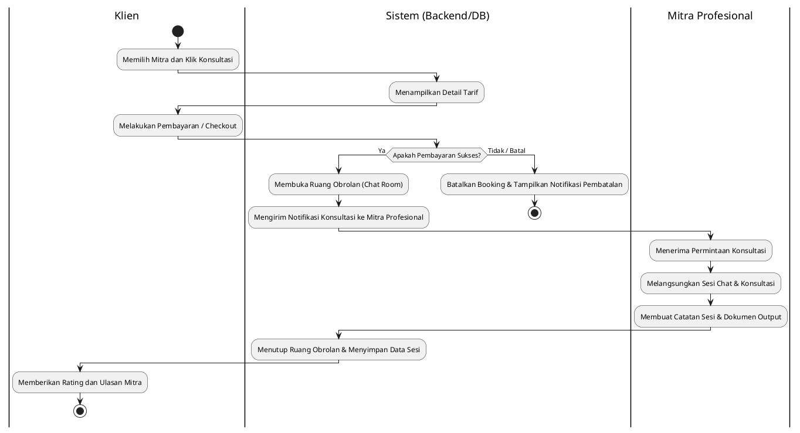
```plantuml
@startuml
|Klien|
start
:Memilih Mitra dan Klik Konsultasi;

|Sistem (Backend/DB)|
:Menampilkan Detail Tarif;

|Klien|
:Melakukan Pembayaran / Checkout;

|Sistem (Backend/DB)|
if (Apakah Pembayaran Sukses?) is (Ya) then
  :Membuka Ruang Obrolan (Chat Room);
  :Mengirim Notifikasi Konsultasi ke Mitra Profesional;
  
  |Mitra Profesional|
  :Menerima Permintaan Konsultasi;
  :Melangsungkan Sesi Chat & Konsultasi;
  :Membuat Catatan Sesi & Dokumen Output;
  
  |Sistem (Backend/DB)|
  :Menutup Ruang Obrolan & Menyimpan Data Sesi;
  
  |Klien|
  :Memberikan Rating dan Ulasan Mitra;
  stop
else (Tidak / Batal)
  |Sistem (Backend/DB)|
  :Batalkan Booking & Tampilkan Notifikasi Pembatalan;
  stop
endif
@enduml
```

---

### 4. Activity Diagram: Melakukan Pembayaran (UC-05)
*Diagram integrasi pembayaran digital antara Klien, Sistem, dan Payment Gateway.*

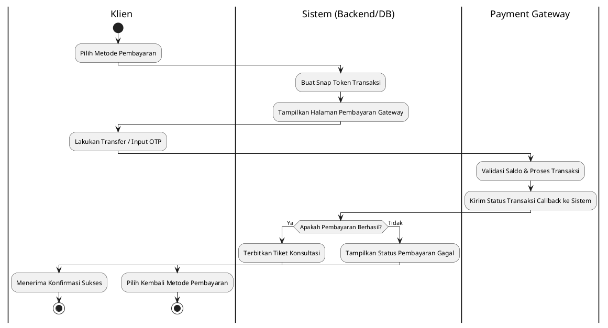
```plantuml
@startuml
|Klien|
start
:Pilih Metode Pembayaran;

|Sistem (Backend/DB)|
:Buat Snap Token Transaksi;
:Tampilkan Halaman Pembayaran Gateway;

|Klien|
:Lakukan Transfer / Input OTP;

|Payment Gateway|
:Validasi Saldo & Proses Transaksi;
:Kirim Status Transaksi Callback ke Sistem;

|Sistem (Backend/DB)|
if (Apakah Pembayaran Berhasil?) is (Ya) then
  :Terbitkan Tiket Konsultasi;
  |Klien|
  :Menerima Konfirmasi Sukses;
  stop
else (Tidak)
  |Sistem (Backend/DB)|
  :Tampilkan Status Pembayaran Gagal;
  |Klien|
  :Pilih Kembali Metode Pembayaran;
  stop
endif
@enduml
```

---

### 5. Activity Diagram: Registrasi & Verifikasi Kredensial Mitra (UC-07 & UC-13)
*Diagram onboarding untuk Calon Mitra Profesional baru (Dokter/Advokat/Psikolog) beserta peninjauan dokumen resmi oleh Admin.*

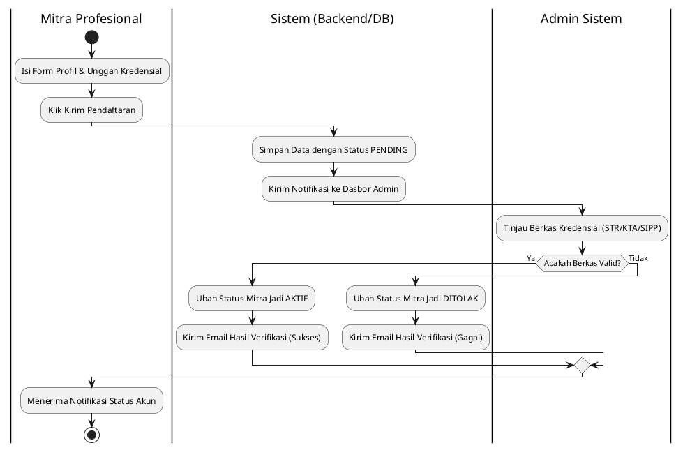
```plantuml
@startuml
|Mitra Profesional|
start
:Isi Form Profil & Unggah Kredensial;
:Klik Kirim Pendaftaran;

|Sistem (Backend/DB)|
:Simpan Data dengan Status PENDING;
:Kirim Notifikasi ke Dasbor Admin;

|Admin Sistem|
:Tinjau Berkas Kredensial (STR/KTA/SIPP);
if (Apakah Berkas Valid?) then (Ya)
  |Sistem (Backend/DB)|
  :Ubah Status Mitra Jadi AKTIF;
  :Kirim Email Hasil Verifikasi (Sukses);
else (Tidak)
  |Sistem (Backend/DB)|
  :Ubah Status Mitra Jadi DITOLAK;
  :Kirim Email Hasil Verifikasi (Gagal);
endif

|Mitra Profesional|
:Menerima Notifikasi Status Akun;
stop
@enduml
```

---

### 6. Activity Diagram: Membuat Catatan Sesi & Output Konsultasi (UC-11 & UC-12)
*Menggambarkan pengisian ringkasan sesi oleh Mitra Profesional beserta opsi pemberian dokumen output (Resep/Telaah Kontrak/Lembar Tugas) secara opsional (<<extend>>).*

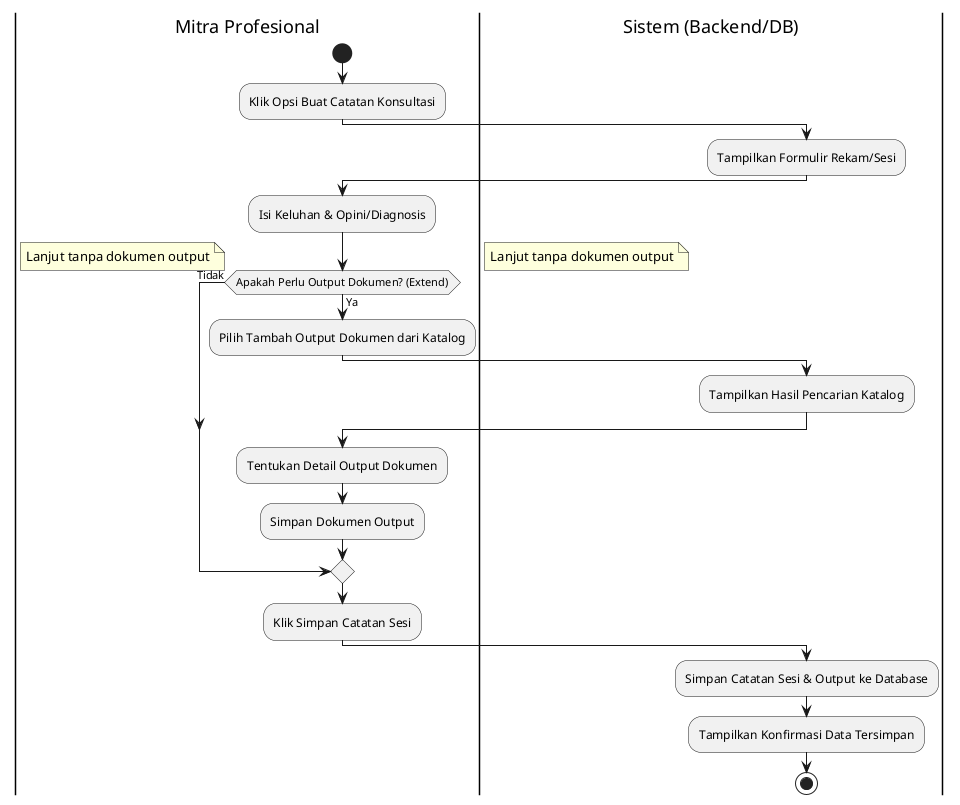
```plantuml
@startuml
|Mitra Profesional|
start
:Klik Opsi Buat Catatan Konsultasi;

|Sistem (Backend/DB)|
:Tampilkan Formulir Rekam/Sesi;

|Mitra Profesional|
:Isi Keluhan & Opini/Diagnosis;
if (Apakah Perlu Output Dokumen? (Extend)) then (Ya)
  :Pilih Tambah Output Dokumen dari Katalog;
  |Sistem (Backend/DB)|
  :Tampilkan Hasil Pencarian Katalog;
  |Mitra Profesional|
  :Tentukan Detail Output Dokumen;
  :Simpan Dokumen Output;
else (Tidak)
  note right: Lanjut tanpa dokumen output
endif

|Mitra Profesional|
:Klik Simpan Catatan Sesi;

|Sistem (Backend/DB)|
:Simpan Catatan Sesi & Output ke Database;
:Tampilkan Konfirmasi Data Tersimpan;
stop
@enduml
```

---

### 7. Activity Diagram: Memantau Laporan Transaksi (UC-16)
*Menampilkan peninjauan transaksi keuangan dan penarikan laporan Excel/PDF oleh Admin Sistem.*

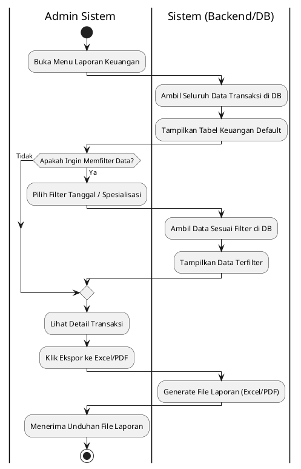
```plantuml
@startuml
|Admin Sistem|
start
:Buka Menu Laporan Keuangan;

|Sistem (Backend/DB)|
:Ambil Seluruh Data Transaksi di DB;
:Tampilkan Tabel Keuangan Default;

|Admin Sistem|
if (Apakah Ingin Memfilter Data?) then (Ya)
  :Pilih Filter Tanggal / Spesialisasi;
  |Sistem (Backend/DB)|
  :Ambil Data Sesuai Filter di DB;
  :Tampilkan Data Terfilter;
else (Tidak)
endif

|Admin Sistem|
:Lihat Detail Transaksi;
:Klik Ekspor ke Excel/PDF;

|Sistem (Backend/DB)|
:Generate File Laporan (Excel/PDF);

|Admin Sistem|
:Menerima Unduhan File Laporan;
stop
@enduml
```

---

### 8. Activity Diagram: Mengonfirmasi Status Ketersediaan (UC-09)
*Alur kerja Mitra Profesional dalam menyalakan/mematikan status online agar muncul di hasil pencarian.*

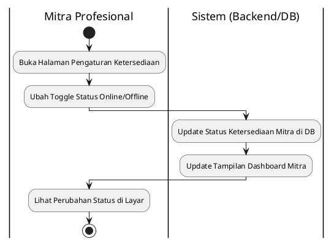
```plantuml
@startuml
|Mitra Profesional|
start
:Buka Halaman Pengaturan Ketersediaan;
:Ubah Toggle Status Online/Offline;

|Sistem (Backend/DB)|
:Update Status Ketersediaan Mitra di DB;
:Update Tampilan Dashboard Mitra;

|Mitra Profesional|
:Lihat Perubahan Status di Layar;
stop
@enduml
```

---

### AD-Admin-01: Activity Diagram - Mengelola Data Akun Klien / Suspend (UC-14)
*Diagram ini merepresentasikan alur due process untuk suspend akun klien: warning 3x, evidence log, notifikasi hukum (surat resmi), dan appeal window 14 hari.*

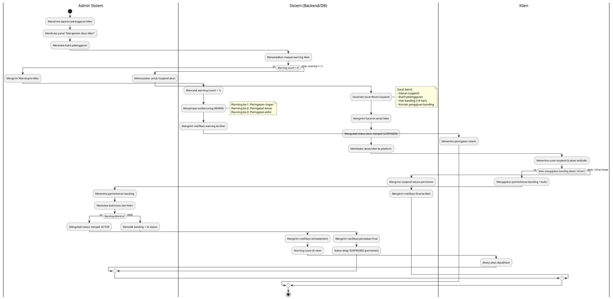
```plantuml
@startuml
|Admin Sistem|
start
:Menerima laporan pelanggaran klien;
:Membuka panel "Manajemen Akun Klien";
:Mereview bukti pelanggaran;

|Sistem (Backend/DB)|
:Menampilkan riwayat warning klien;

if (Warning count < 3?) then (ya)
  |Admin Sistem|
  :Mengirim Warning ke klien;
  |Sistem (Backend/DB)|
  :Mencatat warning (count + 1);
  :Menyimpan evidence log (WORM);
  note right
    Warning ke-1: Peringatan ringan
    Warning ke-2: Peringatan keras
    Warning ke-3: Peringatan akhir
  end note
  :Mengirim notifikasi warning ke klien;
  |Klien|
  :Menerima peringatan sistem;
  
else (tidak, warning >= 3)
  |Admin Sistem|
  :Memutuskan untuk Suspend akun;
  |Sistem (Backend/DB)|
  :Generate Surat Resmi Suspend;
  note right
    Surat berisi:
    - Alasan suspend
    - Bukti pelanggaran
    - Hak banding (14 hari)
    - Kontak pengajuan banding
  end note
  
  :Mengirim Surat ke email klien;
  :Mengubah status akun menjadi SUSPENDED;
  :Memblokir akses klien ke platform;
  |Klien|
  :Menerima surat suspend & akses terblokir;
  if (Klien mengajukan banding dalam 14 hari?) then (ya)
    |Klien|
    :Mengajukan permohonan banding + bukti;
    |Admin Sistem|
    :Menerima permohonan banding;
    :Mereview bukti baru dari klien;
    
    if (Banding diterima?) then (ya)
      :Mengubah status menjadi ACTIVE;
      |Sistem (Backend/DB)|
      :Mengirim notifikasi reinstatement;
      :Warning count di-reset;
      |Klien|
      :Aksesi akun dipulihkan;
    else (tidak)
      |Admin Sistem|
      :Menolak banding + isi alasan;
      |Sistem (Backend/DB)|
      :Mengirim notifikasi penolakan final;
      :Status tetap SUSPENDED (permanen);
    endif
    
  else (tidak, 14 hari lewat)
    |Sistem (Backend/DB)|
    :Mengunci suspend secara permanen;
    :Mengirim notifikasi final ke klien;
  endif
endif

stop
@enduml
```
---

### AD-Admin-02: Activity Diagram - Mengelola Data Akun Mitra / Suspend (UC-15)
*Diagram ini merepresentasikan alur Ethics Committee Flow untuk suspend mitra: laporan masuk, tim etik multidisiplin (dokter/psikolog/advokat), hearing, keputusan, dan report ke Konsil/Peradi/HIMPSI.*

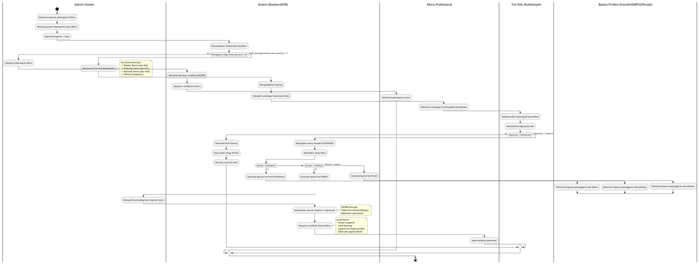
```plantuml
@startuml
|Admin Sistem|
start
:Menerima laporan pelanggaran Mitra;
:Membuka panel "Manajemen Akun Mitra";
:Mereview laporan + bukti;

|Sistem (Backend/DB)|
:Menampilkan riwayat warning Mitra;

if (Pelanggaran ringan (Warning count < 3)?) then (ya)
  |Admin Sistem|
  :Mengirim Warning ke Mitra;
  |Sistem (Backend/DB)|
  :Mencatat warning + evidence (WORM);
  :Mengirim notifikasi ke Mitra;
  |Mitra Profesional|
  :Menerima peringatan sistem;
  
else (tidak, pelanggaran berat atau warning >= 3)
  |Admin Sistem|
  :Membentuk Tim Etik Multidisiplin;
  note right
    Tim Etik terdiri dari:
    - 1 Dokter Senior (jika Kes)
    - 1 Psikolog Senior (jika Psi)
    - 1 Advokat Senior (jika Huk)
    - 1 Admin Compliance
  end note
  
  |Sistem (Backend/DB)|
  :Menjadwalkan Hearing;
  :Mengirim undangan hearing ke Mitra;
  |Mitra Profesional|
  :Menerima undangan & menyiapkan pembelaan;
  
  |Tim Etik Multidisiplin|
  :Melaksanakan Hearing bersama Mitra;
  :Memberikan keputusan etik;
  
  if (Keputusan = Dibebaskan?) then (ya)
    |Sistem (Backend/DB)|
    :Mencatat hasil hearing;
    :Status Mitra tetap ACTIVE;
    :Warning count di-reset;
    
  else (Keputusan = Suspend)
    |Sistem (Backend/DB)|
    :Mengubah status menjadi SUSPENDED;
    :Memblokir akses Mitra;
    if (Domain = Kesehatan?) then (ya)
      :Generate laporan ke Konsil Kedokteran;
      |Badan Profesi (Konsil/HIMPSI/Peradi)|
      :Menerima laporan pelanggaran etik dokter;
    else if (Domain = Psikologi?) then (ya)
      |Sistem (Backend/DB)|
      :Generate laporan ke HIMPSI;
      |Badan Profesi (Konsil/HIMPSI/Peradi)|
      :Menerima laporan pelanggaran etik psikolog;
    else (Domain = Hukum)
      |Sistem (Backend/DB)|
      :Generate laporan ke Peradi;
      |Badan Profesi (Konsil/HIMPSI/Peradi)|
      :Menerima laporan pelanggaran etik advokat;
    endif
    
    |Admin Sistem|
    :Mengonfirmasi pengiriman laporan resmi;
    |Sistem (Backend/DB)|
    :Menyimpan seluruh evidence + keputusan;
    note right
      WORM storage:
      Tidak bisa diubah/dihapus
      Retention: permanen
    end note
    
    :Mengirim notifikasi final ke Mitra;
    note right
      Surat berisi:
      - Alasan suspend
      - Hasil hearing
      - Laporan ke badan profesi
      - Tidak ada appeal (final)
    end note
    |Mitra Profesional|
    :Akses terblokir permanen;
  endif
endif

stop
@enduml
```
---

### 11. Activity Diagram: Mengelola Saldo dan Penarikan Dana Mitra (UC-17)
*Menggambarkan alur pemantauan saldo dan permintaan pencairan dana ke rekening bank oleh Mitra Profesional.*

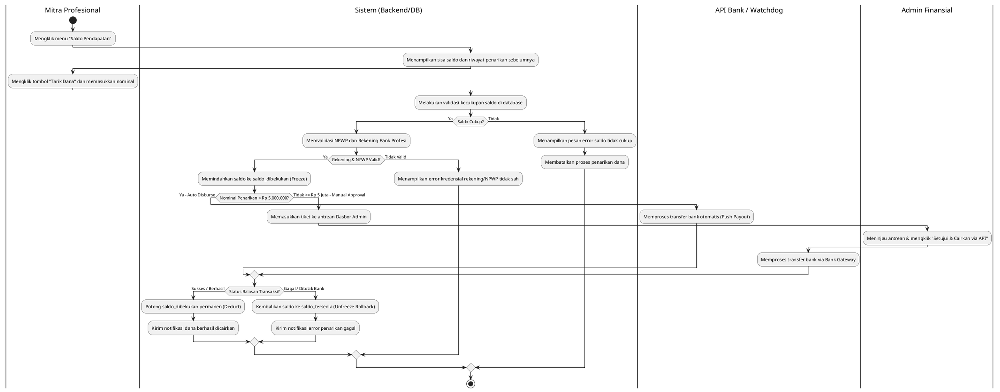
```plantuml
@startuml
|Mitra Profesional|
start
:Mengklik menu "Saldo Pendapatan";
|Sistem (Backend/DB)|
:Menampilkan sisa saldo dan riwayat penarikan sebelumnya;
|Mitra Profesional|
:Mengklik tombol "Tarik Dana" dan memasukkan nominal;
|Sistem (Backend/DB)|
:Melakukan validasi kecukupan saldo di database;
if (Saldo Cukup?) then (Ya)
  :Memvalidasi NPWP dan Rekening Bank Profesi;
  if (Rekening & NPWP Valid?) then (Ya)
    :Memindahkan saldo ke saldo_dibekukan (Freeze);
    if (Nominal Penarikan < Rp 5.000.000?) then (Ya - Auto Disburse)
      |API Bank / Watchdog|
      :Memproses transfer bank otomatis (Push Payout);
    else (Tidak >= Rp 5 Juta - Manual Approval)
      |Sistem (Backend/DB)|
      :Memasukkan tiket ke antrean Dasbor Admin;
      |Admin Finansial|
      :Meninjau antrean & mengklik "Setujui & Cairkan via API";
      |API Bank / Watchdog|
      :Memproses transfer bank via Bank Gateway;
    endif
    
    |Sistem (Backend/DB)|
    if (Status Balasan Transaksi?) then (Sukses / Berhasil)
      :Potong saldo_dibekukan permanen (Deduct);
      :Kirim notifikasi dana berhasil dicairkan;
    else (Gagal / Ditolak Bank)
      :Kembalikan saldo ke saldo_tersedia (Unfreeze Rollback);
      :Kirim notifikasi error penarikan gagal;
    endif
  else (Tidak Valid)
    :Menampilkan error kredensial rekening/NPWP tidak sah;
  endif
else (Tidak)
  :Menampilkan pesan error saldo tidak cukup;
  :Membatalkan proses penarikan dana;
endif
stop
@enduml
```

---

---

## F. Activity Diagram Fitur Spesifik Domain

### AD-Kes-04: Activity Diagram - Menebus Resep dan Membeli Obat (Kes-UC01)
*Diagram ini merepresentasikan alur menebus resep digital termasuk validasi SIA (Sistem Informasi Apotek), cek interaksi obat (drug-drug interaction), dan workflow berbeda untuk obat non-controlled vs controlled (Narkotika/Psikotropika).*

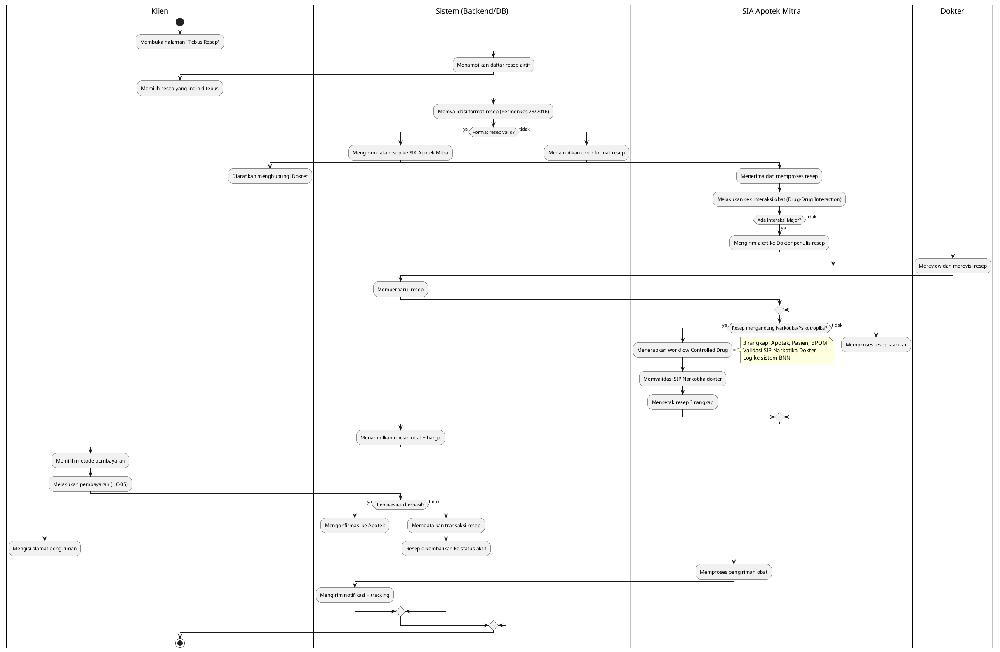
```plantuml
@startuml
|Klien|
start
:Membuka halaman "Tebus Resep";
|Sistem (Backend/DB)|
:Menampilkan daftar resep aktif;
|Klien|
:Memilih resep yang ingin ditebus;
|Sistem (Backend/DB)|
:Memvalidasi format resep (Permenkes 73/2016);

if (Format resep valid?) then (ya)
  :Mengirim data resep ke SIA Apotek Mitra;
  |SIA Apotek Mitra|
  :Menerima dan memproses resep;
  :Melakukan cek interaksi obat (Drug-Drug Interaction);
  
  if (Ada interaksi Major?) then (ya)
    :Mengirim alert ke Dokter penulis resep;
    |Dokter|
    :Mereview dan merevisi resep;
    |Sistem (Backend/DB)|
    :Memperbarui resep;
    |SIA Apotek Mitra|
  else (tidak)
  endif
  
  if (Resep mengandung Narkotika/Psikotropika?) then (ya)
    :Menerapkan workflow Controlled Drug;
    note right
      3 rangkap: Apotek, Pasien, BPOM
      Validasi SIP Narkotika Dokter
      Log ke sistem BNN
    end note
    :Memvalidasi SIP Narkotika dokter;
    :Mencetak resep 3 rangkap;
  else (tidak)
    :Memproses resep standar;
  endif
  
  |Sistem (Backend/DB)|
  :Menampilkan rincian obat + harga;
  |Klien|
  :Memilih metode pembayaran;
  :Melakukan pembayaran (UC-05);
  
  |Sistem (Backend/DB)|
  if (Pembayaran berhasil?) then (ya)
    :Mengonfirmasi ke Apotek;
    |Klien|
    :Mengisi alamat pengiriman;
    |SIA Apotek Mitra|
    :Memproses pengiriman obat;
    |Sistem (Backend/DB)|
    :Mengirim notifikasi + tracking;
  else (tidak)
    :Membatalkan transaksi resep;
    :Resep dikembalikan ke status aktif;
  endif
  
else (tidak)
  |Sistem (Backend/DB)|
  :Menampilkan error format resep;
  |Klien|
  :Diarahkan menghubungi Dokter;
endif

stop
@enduml
```
---

### AD-Psikologi: Mengisi Jurnal Mood Harian (Psi-UC01)
*Diagram ini merepresentasikan alur pengisian jurnal harian oleh klien sebagai bagian dari proses self-care sebelum sesi konseling.*

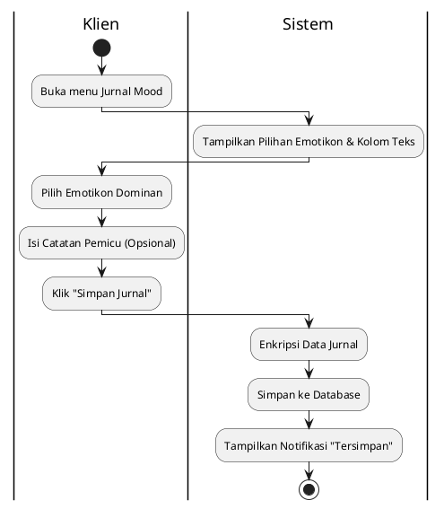
```plantuml
@startuml
|Klien|
start
:Buka menu Jurnal Mood;

|Sistem|
:Tampilkan Pilihan Emotikon & Kolom Teks;

|Klien|
:Pilih Emotikon Dominan;
:Isi Catatan Pemicu (Opsional);
:Klik "Simpan Jurnal";

|Sistem|
:Enkripsi Data Jurnal;
:Simpan ke Database;
:Tampilkan Notifikasi "Tersimpan";
stop
@enduml
```

---

### AD-Hukum: Mengunggah Berkas Perkara (Huk-UC01)
*Diagram ini merepresentasikan alur unggah dokumen rahasia oleh klien yang dienkripsi secara end-to-end sebelum dianalisis oleh advokat.*

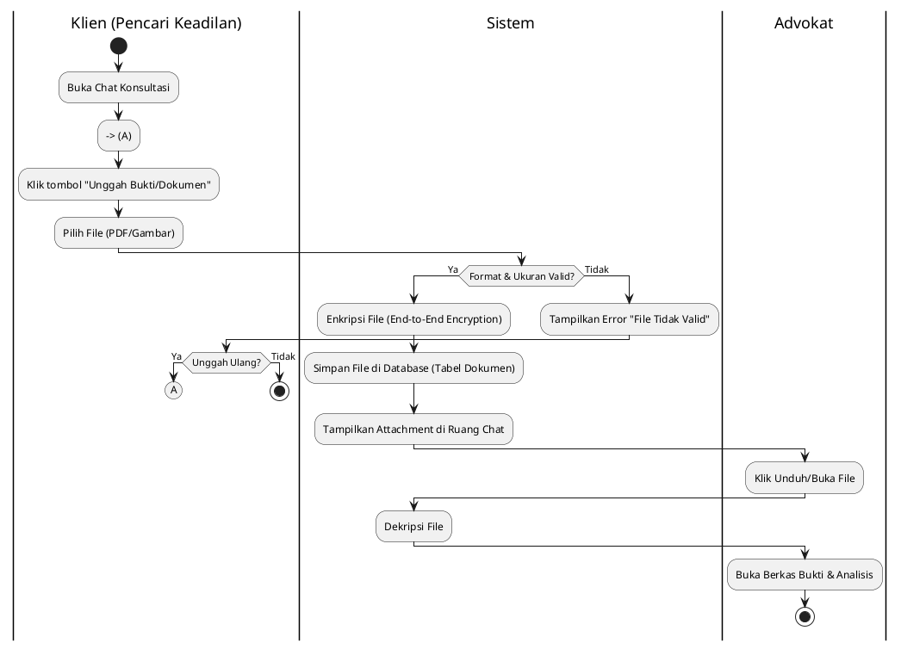
```plantuml
@startuml
|Klien (Pencari Keadilan)|
start
:Buka Chat Konsultasi;
--> (A)
:Klik tombol "Unggah Bukti/Dokumen";
:Pilih File (PDF/Gambar);

|Sistem|
if (Format & Ukuran Valid?) then (Ya)
  :Enkripsi File (End-to-End Encryption);
  :Simpan File di Database (Tabel Dokumen);
  :Tampilkan Attachment di Ruang Chat;
  
  |Advokat|
  :Klik Unduh/Buka File;
  
  |Sistem|
  :Dekripsi File;
  
  |Advokat|
  :Buka Berkas Bukti & Analisis;
  stop
else (Tidak)
  |Sistem|
  :Tampilkan Error "File Tidak Valid";
  
  |Klien (Pencari Keadilan)|
  if (Unggah Ulang?) then (Ya)
    (A)
    detach
  else (Tidak)
    stop
  endif
endif
@enduml
```

---

### AD-Kesehatan: Membuat Janji Temu RS Offline (Kes-UC02)
*Diagram ini merepresentasikan alur pemilihan rumah sakit dan jadwal fisik.*

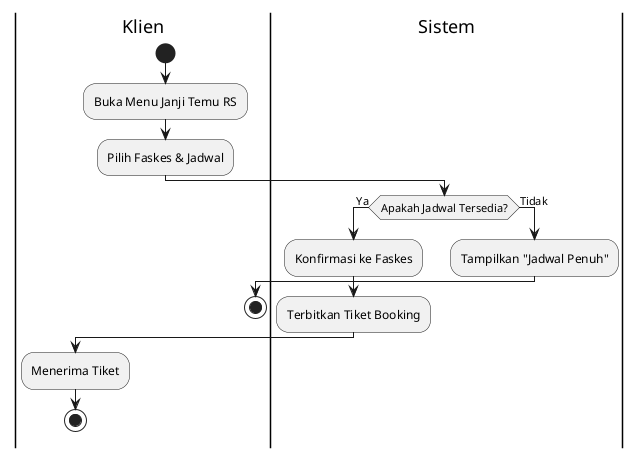
```plantuml
@startuml
|Klien|
start
:Buka Menu Janji Temu RS;
:Pilih Faskes & Jadwal;
|Sistem|
if (Apakah Jadwal Tersedia?) is (Ya) then
  :Konfirmasi ke Faskes;
  :Terbitkan Tiket Booking;
  |Klien|
  :Menerima Tiket;
  stop
else (Tidak)
  |Sistem|
  :Tampilkan "Jadwal Penuh";
  |Klien|
  stop
endif
@enduml
```

---

### AD-Kesehatan: Melihat Rekam Medis (Kes-UC03)
*Diagram ini merepresentasikan alur klien melihat riwayat konsultasinya.*

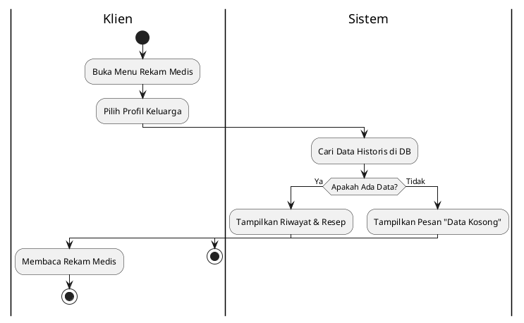
```plantuml
@startuml
|Klien|
start
:Buka Menu Rekam Medis;
:Pilih Profil Keluarga;
|Sistem|
:Cari Data Historis di DB;
if (Apakah Ada Data?) is (Ya) then
  :Tampilkan Riwayat & Resep;
  |Klien|
  :Membaca Rekam Medis;
  stop
else (Tidak)
  |Sistem|
  :Tampilkan Pesan "Data Kosong";
  |Klien|
  stop
endif
@enduml
```

---

### AD-Psikologi: Mengakses Audio Meditasi (Psi-UC02)
*Diagram ini merepresentasikan alur pemutaran audio terapi.*

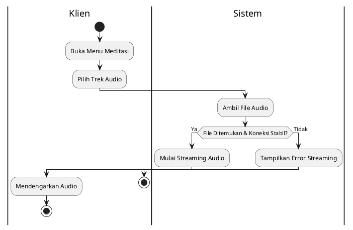
```plantuml
@startuml
|Klien|
start
:Buka Menu Meditasi;
:Pilih Trek Audio;
|Sistem|
:Ambil File Audio;
if (File Ditemukan & Koneksi Stabil?) is (Ya) then
  :Mulai Streaming Audio;
  |Klien|
  :Mendengarkan Audio;
  stop
else (Tidak)
  |Sistem|
  :Tampilkan Error Streaming;
  |Klien|
  stop
endif
@enduml
```

---

### AD-Psi-04: Activity Diagram - Mengisi Tes Asesmen Psikologi DASS-21 (Psi-UC03)
*Diagram ini merepresentasikan alur pengisian asesmen DASS-21 termasuk scoring otomatis, risk protocol untuk skor Severe/Extreme (mandatory crisis hotline, auto-assign psikolog klinis), dan informed consent ulang.*

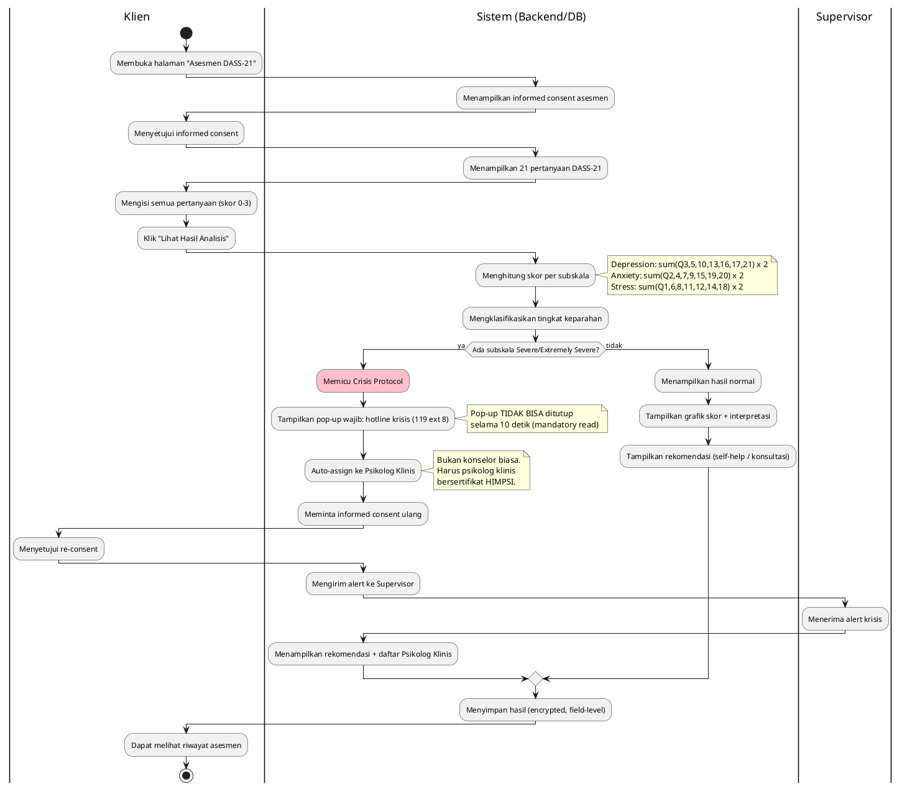
```plantuml
@startuml
|Klien|
start
:Membuka halaman "Asesmen DASS-21";
|Sistem (Backend/DB)|
:Menampilkan informed consent asesmen;
|Klien|
:Menyetujui informed consent;

|Sistem (Backend/DB)|
:Menampilkan 21 pertanyaan DASS-21;
|Klien|
:Mengisi semua pertanyaan (skor 0-3);
:Klik "Lihat Hasil Analisis";

|Sistem (Backend/DB)|
:Menghitung skor per subskala;
note right
  Depression: sum(Q3,5,10,13,16,17,21) x 2
  Anxiety: sum(Q2,4,7,9,15,19,20) x 2
  Stress: sum(Q1,6,8,11,12,14,18) x 2
end note

:Mengklasifikasikan tingkat keparahan;

if (Ada subskala Severe/Extremely Severe?) then (ya)
  #pink:Memicu Crisis Protocol;
  :Tampilkan pop-up wajib: hotline krisis (119 ext 8);
  note right
    Pop-up TIDAK BISA ditutup
    selama 10 detik (mandatory read)
  end note
  
  :Auto-assign ke Psikolog Klinis;
  note right
    Bukan konselor biasa.
    Harus psikolog klinis
    bersertifikat HIMPSI.
  end note
  
  :Meminta informed consent ulang;
  |Klien|
  :Menyetujui re-consent;
  
  |Sistem (Backend/DB)|
  :Mengirim alert ke Supervisor;
  |Supervisor|
  :Menerima alert krisis;
  |Sistem (Backend/DB)|
  :Menampilkan rekomendasi + daftar Psikolog Klinis;
else (tidak)
  |Sistem (Backend/DB)|
  :Menampilkan hasil normal;
  :Tampilkan grafik skor + interpretasi;
  :Tampilkan rekomendasi (self-help / konsultasi);
endif

|Sistem (Backend/DB)|
:Menyimpan hasil (encrypted, field-level);
|Klien|
:Dapat melihat riwayat asesmen;

stop
@enduml
```
---

### AD-Huk-04: Activity Diagram - Membuat Draf Dokumen Hukum (Huk-UC02)
*Diagram ini merepresentasikan alur template engine untuk legal drafting termasuk validasi variabel (NPWP, NIK, Nomor Akta), integrasi e-meterai Peruri, dan version control draf (v1, v2, final).*

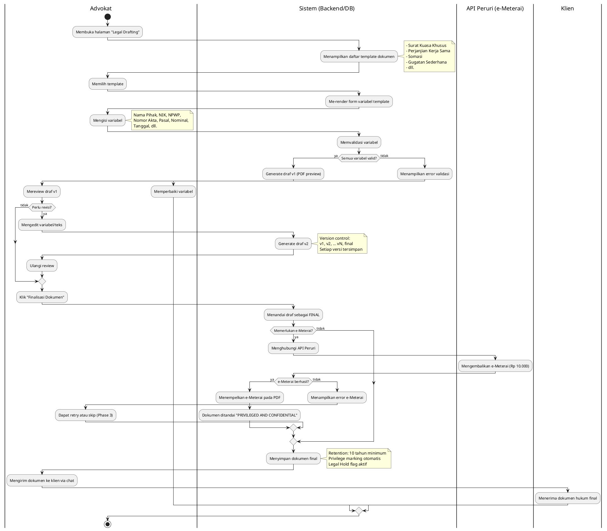
```plantuml
@startuml
|Advokat|
start
:Membuka halaman "Legal Drafting";
|Sistem (Backend/DB)|
:Menampilkan daftar template dokumen;
note right
  - Surat Kuasa Khusus
  - Perjanjian Kerja Sama
  - Somasi
  - Gugatan Sederhana
  - dll.
end note

|Advokat|
:Memilih template;
|Sistem (Backend/DB)|
:Me-render form variabel template;

|Advokat|
:Mengisi variabel;
note right
  Nama Pihak, NIK, NPWP,
  Nomor Akta, Pasal, Nominal,
  Tanggal, dll.
end note

|Sistem (Backend/DB)|
:Memvalidasi variabel;

if (Semua variabel valid?) then (ya)
  :Generate draf v1 (PDF preview);
  |Advokat|
  :Mereview draf v1;
  
  if (Perlu revisi?) then (ya)
    :Mengedit variabel/teks;
    |Sistem (Backend/DB)|
    :Generate draf v2;
    note right
      Version control:
      v1, v2, ... vN, final
      Setiap versi tersimpan
    end note
    |Advokat|
    :Ulangi review;
  else (tidak)
  endif
  
  |Advokat|
  :Klik "Finalisasi Dokumen";
  |Sistem (Backend/DB)|
  :Menandai draf sebagai FINAL;
  
  if (Memerlukan e-Meterai?) then (ya)
    :Menghubungi API Peruri;
    |API Peruri (e-Meterai)|
    :Mengembalikan e-Meterai (Rp 10.000);
    |Sistem (Backend/DB)|
    if (e-Meterai berhasil?) then (ya)
      :Menempelkan e-Meterai pada PDF;
      :Dokumen ditandai "PRIVILEGED AND CONFIDENTIAL";
    else (tidak)
      :Menampilkan error e-Meterai;
      |Advokat|
      :Dapat retry atau skip (Phase 3);
      |Sistem (Backend/DB)|
    endif
  else (tidak)
  endif
  
  |Sistem (Backend/DB)|
  :Menyimpan dokumen final;
  note right
    Retention: 10 tahun minimum
    Privilege marking otomatis
    Legal Hold flag aktif
  end note
  |Advokat|
  :Mengirim dokumen ke klien via chat;
  |Klien|
  :Menerima dokumen hukum final;
  
else (tidak)
  |Sistem (Backend/DB)|
  :Menampilkan error validasi;
  |Advokat|
  :Memperbaiki variabel;
endif

stop
@enduml
```
---

### AD-Huk-05: Activity Diagram - Melakukan Konsultasi Pro Bono (Huk-UC03)
*Diagram ini merepresentasikan alur pengajuan Pro Bono termasuk means test (verifikasi SKTM cross-check Dukcapil), quota management per advokat (max 3 kasus/bulan), dan legal aid report untuk LBH.*

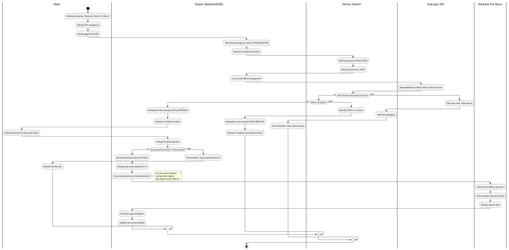
```plantuml
@startuml
|Klien|
start
:Membuka halaman "Bantuan Hukum Pro Bono";
:Mengisi form pengajuan;
:Mengunggah file SKTM;

|Sistem (Backend/DB)|
:Menyimpan pengajuan (status: PENDING_SKTM);
:Mengirim notifikasi ke Admin;
|Admin Sistem|
:Membuka panel verifikasi SKTM;
:Mereview dokumen SKTM;

|Sistem (Backend/DB)|
:Cross-check NIK ke Dukcapil API;
|Dukcapil API|
:Mengembalikan validitas NIK & status ekonomi;

|Admin Sistem|
if (NIK valid dan status ekonomi sesuai?) then (ya)
  if (Admin menyetujui?) then (ya)
    |Sistem (Backend/DB)|
    :Mengubah status menjadi SKTM_APPROVED;
    :Mengirim notifikasi ke Klien;
    |Klien|
    :Memilih advokat Pro Bono dari daftar;
    |Sistem (Backend/DB)|
    :Mengecek quota advokat;
    
    if (Quota advokat tersedia (< 3 kasus/bulan)?) then (ya)
      :Membuat tiket konsultasi Pro Bono;
      :Mengurangi quota advokat (n+1);
      :Dana konsultasi di-escrow oleh platform;
      note right
        Escrow: dana ditahan
        sampai sesi selesai
        dan laporan LBH dikirim
      end note
      |Advokat Pro Bono|
      :Menerima notifikasi sesi baru;
      :Sesi konsultasi dimulai (UC-04);
      :Mengisi laporan LBH;
      |Sistem (Backend/DB)|
      :Generate Legal Aid Report;
      :Melepas escrow ke advokat;
      
    else (tidak)
      :Menampilkan "Quota advokat penuh";
      |Klien|
      :Memilih advokat lain;
    endif
    
  else (tidak)
    |Admin Sistem|
    :Menolak SKTM + isi alasan;
    |Sistem (Backend/DB)|
    :Mengubah status menjadi SKTM_REJECTED;
    :Mengirim notifikasi penolakan ke Klien;
  endif
else (tidak)
  |Dukcapil API|
  :NIK tidak valid / tidak sesuai;
  |Admin Sistem|
  :Menolak pengajuan;
  |Sistem (Backend/DB)|
  :Klien diarahkan untuk upload ulang;
endif

stop
@enduml
```
---

### AD-Kes-05: Activity Diagram - Catatan Sesi dan Resep Elektronik Kesehatan (UC-11 dan UC-12 Domain Kes)
*Diagram ini merepresentasikan alur pengisian SOAP Note oleh dokter, generate PDF resep format Permenkes 73/2016, dan pengiriman ke SIA apotek mitra.*

```plantuml
@startuml
|Dokter|
start
:Membuka form catatan sesi;
|Sistem (Backend/DB)|
:Menampilkan template SOAP Note;

|Dokter|
:Mengisi Subjective (keluhan pasien);
:Mengisi Objective (hasil pemeriksaan);
:Mengisi Assessment (diagnosis + kode ICD-10);
:Mengisi Plan (rencana terapi);

:Klik "Simpan Catatan";
|Sistem (Backend/DB)|
:Menyimpan SOAP Note (encrypted, field-level);

if (Pasien memerlukan resep?) then (ya)
  |Dokter|
  :Klik "Buat Resep Elektronik";
  |Sistem (Backend/DB)|
  :Menampilkan form resep;
  
  |Dokter|
  :Mengisi daftar obat + dosis + aturan pakai;
  |Sistem (Backend/DB)|
  :Melakukan cek interaksi obat otomatis;
  
  if (Ada interaksi Major?) then (ya)
    :Menampilkan warning interaksi;
    |Dokter|
    :Merevisi resep atau override dengan alasan;
    |Sistem (Backend/DB)|
  else (tidak)
  endif
  
  :Generate PDF Resep (format Permenkes 73/2016);
  |Dokter|
  :Menandatangani resep secara digital;
  |Sistem (Backend/DB)|
  :Menyimpan resep + kirim ke SIA Apotek;
  |SIA Apotek|
  :Menerima e-Resep tersertifikasi;
  
  |Sistem (Backend/DB)|
  :Mengirim notifikasi ke Klien;
  note right
    "Resep Anda telah diterbitkan.
     Silakan tebus di Apotek Mitra."
  end note
  |Klien|
  :Menerima notifikasi resep;
else (tidak)
  |Sistem (Backend/DB)|
  :Catatan sesi disimpan tanpa resep;
endif

|Sistem (Backend/DB)|
:Menutup form dan kembali ke dashboard;

stop
@enduml
```
---

### AD-Psi-05: Activity Diagram - Catatan Sesi dan Lembar Tugas Psikologi (UC-11 dan UC-12 Domain Psi)
*Diagram ini merepresentasikan alur pengisian DAP Note oleh psikolog, generate homework sheet (PDF), dan mood tracker correlation view.*

```plantuml
@startuml
|Psikolog|
start
:Membuka form catatan sesi;
|Sistem (Backend/DB)|
:Menampilkan template DAP Note;

|Psikolog|
:Mengisi Data (observasi + laporan klien);
:Mengisi Assessment (evaluasi klinis);

if (Ada indikasi risiko (suicidal/self-harm)?) then (ya)
  |Sistem (Backend/DB)|
  #pink:Memicu Crisis Flag;
  :Mengirim alert real-time ke Supervisor;
  |Supervisor|
  :Menerima alert & memantau sesi;
  |Psikolog|
  :Mengisi Risk Assessment detail;
  |Sistem (Backend/DB)|
  :Mencatat level risiko (Low/Medium/High/Critical);
else (tidak)
endif

|Psikolog|
:Mengisi Plan (rencana intervensi);
:Klik "Simpan Catatan";
|Sistem (Backend/DB)|
:Menyimpan DAP Note (encrypted);

if (Psikolog ingin memberikan tugas rumah?) then (ya)
  |Psikolog|
  :Klik "Buat Lembar Tugas";
  |Sistem (Backend/DB)|
  :Menampilkan template homework;
  
  |Psikolog|
  :Mengisi daftar tugas + instruksi;
  note right
    Contoh tugas:
    - Journaling harian
    - Teknik grounding 5-4-3-2-1
    - Mindfulness 10 menit/hari
  end note
  
  |Sistem (Backend/DB)|
  :Generate homework PDF;
  :Mengirim ke klien via chat;
  |Klien|
  :Menerima notifikasi tugas baru;
else (tidak)
endif

|Psikolog|
:Mereview mood tracker correlation;
note right
  Korelasi antara:
  - Jurnal Mood harian (Psi-UC01)
  - Skor asesmen (Psi-UC03)
  - Progress terapi (DAP Notes)
end note

|Sistem (Backend/DB)|
:Menutup form;

stop
@enduml
```
---

### AD-Huk-06: Activity Diagram - Catatan Sesi dan Legal Opinion Hukum (UC-11 dan UC-12 Domain Huk)
*Diagram ini merepresentasikan alur pengisian Case Memo oleh advokat, legal opinion template (IRAC method), privilege marking, dan retention policy 10 tahun.*

```plantuml
@startuml
|Advokat|
start
:Membuka form catatan sesi;
|Sistem (Backend/DB)|
:Menampilkan template Case Memo;

|Advokat|
:Mengisi ringkasan fakta kasus;
:Mengisi analisis hukum;
:Mengisi rekomendasi tindakan;

:Klik "Simpan Catatan";
|Sistem (Backend/DB)|
:Menyimpan Case Memo (E2EE);
:Otomatis menandai "PRIVILEGED AND CONFIDENTIAL";
note right
  Privilege marking otomatis
  pada semua dokumen hukum.
  Hanya Advokat & Klien yang
  dapat mengakses (Admin tidak).
end note

if (Advokat ingin membuat Legal Opinion?) then (ya)
  |Advokat|
  :Klik "Buat Legal Opinion";
  |Sistem (Backend/DB)|
  :Menampilkan template IRAC;
  
  |Advokat|
  :Mengisi Issue (isu hukum);
  :Mengisi Rule (dasar hukum/pasal);
  :Mengisi Application (penerapan pada kasus);
  :Mengisi Conclusion (kesimpulan);
  
  |Sistem (Backend/DB)|
  :Generate Legal Opinion PDF;
  :Menandai dokumen dengan privilege stamp;
  
  if (Advokat ingin kirim ke klien?) then (ya)
    :Mengirim via chat (E2EE);
    |Klien|
    :Menerima notifikasi dokumen baru;
    note right
      Download gate:
      Klien harus verifikasi
      pembayaran sebelum unduh
    end note
  else (tidak)
    |Sistem (Backend/DB)|
    :Dokumen tersimpan sebagai draft internal;
  endif
  
else (tidak)
endif

|Sistem (Backend/DB)|
:Menerapkan retention policy;
note right
  Retention: 10 tahun minimum
  Legal Hold: aktif otomatis
  Disposal: hanya via
  privilege waiver dari klien
end note

:Menutup form;

stop
@enduml
```