# Kumpulan Kode PlantUML: Sequence Diagrams - Component-Level 5-Lifeline BCE Architecture (Justifiqa & Qualifa)

Dokumen ini berisi kumpulan kode PlantUML untuk seluruh Sequence Diagram pada dua aplikasi mandiri yang **100% terisolasi dan berdiri sendiri (*Siloed Architecture*)**: **Justifiqa** (Domain Hukum) dan **Qualifa** (Domain Psikologi). 

Seluruh diagram menerapkan standar arsitektur terdekopel **Boundary-Control-Entity (BCE) 5-Lifeline Supremacy**:
1. **Actor**: Pengguna / Pemicu eksternal.
2. **Boundary Client (`B_FE`)**: Frontend SPA/Mobile App (menangani interaksi UI & client-side DLP regex).
3. **Boundary Server (`B_BE`)**: API Controller / Gateway (`POST/GET /api/v2/...`, memverifikasi auth JWT, validasi skema JSON DTO, dan mengembalikan HTTP Status Code presisi).
4. **Control (`C_Svc`)**: Domain Application Service / Orchestrator (otak logika bisnis, kalkulasi SLA Fair-Clock, verifikasi SIPP/STR, KMS e-Meterai, dan arbitrase Escrow).
Penomoran diagram telah distandarisasi untuk mencerminkan arsitektur terisolasi dan bersesuaian 1-to-1 dengan Activity Diagram: **`SD-J-xx`** untuk Justifiqa dan **`SD-Q-xx`** untuk Qualifa.

---

## Cara Import ke Draw.io
1. Buka Draw.io (`app.diagrams.net`).
2. Pada toolbar bagian atas, klik tombol **+ (Insert)** atau pilih menu **Arrange -> Insert**.
3. Pilih **Advanced -> PlantUML...**.
4. Salin dan tempel kode di bawah ini, lalu klik **Insert**.

---

## BAGIAN I: SEQUENCE DIAGRAMS - APLIKASI MANDIRI JUSTIFIQA (DOMAIN HUKUM)

### SD-J-01: Registrasi Akun Klien & Advokat (J-UC01, J-UC07)
*Sequence diagram alur pendaftaran akun mandiri Klien (verifikasi NIK Dukcapil) dan Advokat/Notaris (verifikasi SIPP Peradi) di platform Justifiqa dengan eksekusi aktif lengkap pada sisi User (actor) dan sistem.*

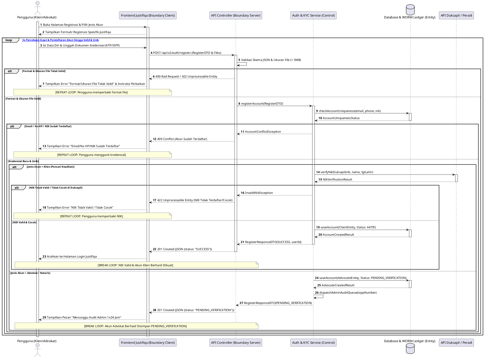
```plantuml
@startuml
autonumber
actor "Pengguna (Klien/Advokat)" as User
participant "Frontend Justifiqa (Boundary Client)" as B_FE
participant "API Controller (Boundary Server)" as B_BE
participant "Auth & KYC Service (Control)" as C_Svc
database "Database & WORM Ledger (Entity)" as E_DB
participant "API Dukcapil / Peradi" as Ext

activate User
User -> B_FE ++ : Buka Halaman Registrasi & Pilih Jenis Akun
B_FE --> User : Tampilkan Formulir Registrasi Spesifik Justifiqa
loop [Maksimal 3x Percobaan Input & Pendaftaran Akun hingga Valid & Unik]
    User -> B_FE : Isi Data Diri & Unggah Dokumen Kredensial (KTP/SIPP)
    B_FE -> B_BE ++ : POST /api/v2/auth/register (RegisterDTO & Files)
    B_BE -> B_BE : Validasi Skema JSON & Ukuran File (< 5MB)

    alt Format & Ukuran File Tidak Valid
        B_BE --> B_FE : 400 Bad Request / 422 Unprocessable Entity
        B_FE --> User : Tampilkan Error "Format/Ukuran File Tidak Valid" & Instruksi Perbaikan
        note over User, B_FE : [REPEAT LOOP: Pengguna memperbaiki format file]
    else Format & Ukuran File Valid
        B_BE -> C_Svc ++ : registerAccount(RegisterDTO)
        C_Svc -> E_DB ++ : checkAccountUniqueness(email, phone, nik)
        E_DB --> C_Svc -- : AccountUniquenessStatus

        alt Email / No HP / NIK Sudah Terdaftar
            C_Svc --> B_BE : AccountConflictException
            B_BE --> B_FE : 409 Conflict (Akun Sudah Terdaftar)
            B_FE --> User : Tampilkan Error "Email/No HP/NIK Sudah Terdaftar"
            note over User, B_FE : [REPEAT LOOP: Pengguna mengganti kredensial]
        else Kredensial Baru & Unik
            alt Jenis Akun = Klien (Pencari Keadilan)
                C_Svc -> Ext ++ : verifyNikDukcapil(nik, nama, tglLahir)
                Ext --> C_Svc -- : NikVerificationResult

                alt NIK Tidak Valid / Tidak Cocok di Dukcapil
                    C_Svc --> B_BE : InvalidNikException
                    B_BE --> B_FE : 422 Unprocessable Entity (NIK Tidak Terdaftar/Cocok)
                    B_FE --> User : Tampilkan Error "NIK Tidak Valid / Tidak Cocok"
                    note over User, B_FE : [REPEAT LOOP: Pengguna memperbaiki NIK]
                else NIK Valid & Cocok
                    C_Svc -> E_DB ++ : saveAccount(ClientEntity, Status: AKTIF)
                    E_DB --> C_Svc -- : AccountCreatedResult
                    C_Svc --> B_BE -- : RegisterResponseDTO(SUCCESS, userId)
                    B_BE --> B_FE -- : 201 Created (JSON {status: "SUCCESS"})
                    B_FE --> User : Arahkan ke Halaman Login Justifiqa
                    note over User, B_BE : [BREAK LOOP: NIK Valid & Akun Klien Berhasil Dibuat]
                end
            else Jenis Akun = Advokat / Notaris
                C_Svc -> E_DB ++ : saveAccount(AdvocateEntity, Status: PENDING_VERIFICATION)
                E_DB --> C_Svc -- : AdvocateCreatedResult
                C_Svc -> C_Svc : dispatchAdminAuditQueue(sippNumber)
                C_Svc --> B_BE -- : RegisterResponseDTO(PENDING_VERIFICATION)
                B_BE --> B_FE -- : 201 Created (JSON {status: "PENDING_VERIFICATION"})
                B_FE --> User : Tampilkan Pesan "Menunggu Audit Admin 1x24 Jam"
                note over User, B_BE : [BREAK LOOP: Akun Advokat Berhasil Disimpan PENDING_VERIFICATION]
            end
        end
    end
end
deactivate User
@enduml
```

---

### SD-J-02: Login Akun Klien & Advokat (J-UC02, J-UC08)
*Sequence diagram alur masuk (login) independen beserta verifikasi Multi-Factor Authentication (MFA / 2FA) dengan spesifikasi eksekusi aktif lengkap pada sisi User (actor) dan sistem.*

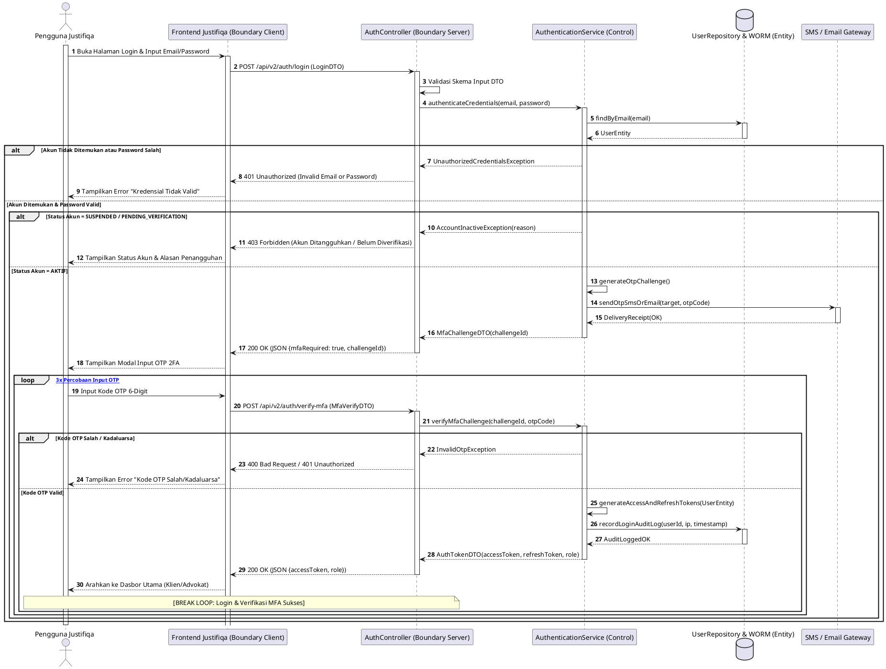
```plantuml
@startuml
autonumber
actor "Pengguna Justifiqa" as User
participant "Frontend Justifiqa (Boundary Client)" as B_FE
participant "AuthController (Boundary Server)" as B_BE
participant "AuthenticationService (Control)" as C_Svc
database "UserRepository & WORM (Entity)" as E_DB
participant "SMS / Email Gateway" as SMS

activate User
User -> B_FE ++ : Buka Halaman Login & Input Email/Password
B_FE -> B_BE ++ : POST /api/v2/auth/login (LoginDTO)
B_BE -> B_BE : Validasi Skema Input DTO
B_BE -> C_Svc ++ : authenticateCredentials(email, password)
C_Svc -> E_DB ++ : findByEmail(email)
E_DB --> C_Svc -- : UserEntity

alt Akun Tidak Ditemukan atau Password Salah
    C_Svc --> B_BE : UnauthorizedCredentialsException
    B_BE --> B_FE : 401 Unauthorized (Invalid Email or Password)
    B_FE --> User : Tampilkan Error "Kredensial Tidak Valid"
else Akun Ditemukan & Password Valid
    alt Status Akun = SUSPENDED / PENDING_VERIFICATION
        C_Svc --> B_BE : AccountInactiveException(reason)
        B_BE --> B_FE : 403 Forbidden (Akun Ditangguhkan / Belum Diverifikasi)
        B_FE --> User : Tampilkan Status Akun & Alasan Penangguhan
    else Status Akun = AKTIF
        C_Svc -> C_Svc : generateOtpChallenge()
        C_Svc -> SMS ++ : sendOtpSmsOrEmail(target, otpCode)
        SMS --> C_Svc -- : DeliveryReceipt(OK)
        C_Svc --> B_BE -- : MfaChallengeDTO(challengeId)
        B_BE --> B_FE -- : 200 OK (JSON {mfaRequired: true, challengeId})
        B_FE --> User : Tampilkan Modal Input OTP 2FA

        loop [Maksimal 3x Percobaan Input OTP]
            User -> B_FE : Input Kode OTP 6-Digit
            B_FE -> B_BE ++ : POST /api/v2/auth/verify-mfa (MfaVerifyDTO)
            B_BE -> C_Svc ++ : verifyMfaChallenge(challengeId, otpCode)

            alt Kode OTP Salah / Kadaluarsa
                C_Svc --> B_BE : InvalidOtpException
                B_BE --> B_FE : 400 Bad Request / 401 Unauthorized
                B_FE --> User : Tampilkan Error "Kode OTP Salah/Kadaluarsa"
            else Kode OTP Valid
                C_Svc -> C_Svc : generateAccessAndRefreshTokens(UserEntity)
                C_Svc -> E_DB ++ : recordLoginAuditLog(userId, ip, timestamp)
                E_DB --> C_Svc -- : AuditLoggedOK
                C_Svc --> B_BE -- : AuthTokenDTO(accessToken, refreshToken, role)
                B_BE --> B_FE -- : 200 OK (JSON {accessToken, role})
                B_FE --> User : Arahkan ke Dasbor Utama (Klien/Advokat)
                note over User, B_BE : [BREAK LOOP: Login & Verifikasi MFA Sukses]
            end
        end
    end
end
deactivate User
@enduml
```

---

### SD-J-03: Konsultasi Hukum & Pembayaran Escrow (J-UC03, J-UC04, J-UC05, J-UC10)
*Sequence diagram reservasi, pembayaran escrow yang ditahan sistem Justifiqa, pelaksanaan sesi chat E2EE, hingga pelepasan dana setelah sesi selesai dengan spesifikasi eksekusi aktif lengkap pada sisi Klien, Advokat (Mitra), dan sistem.*

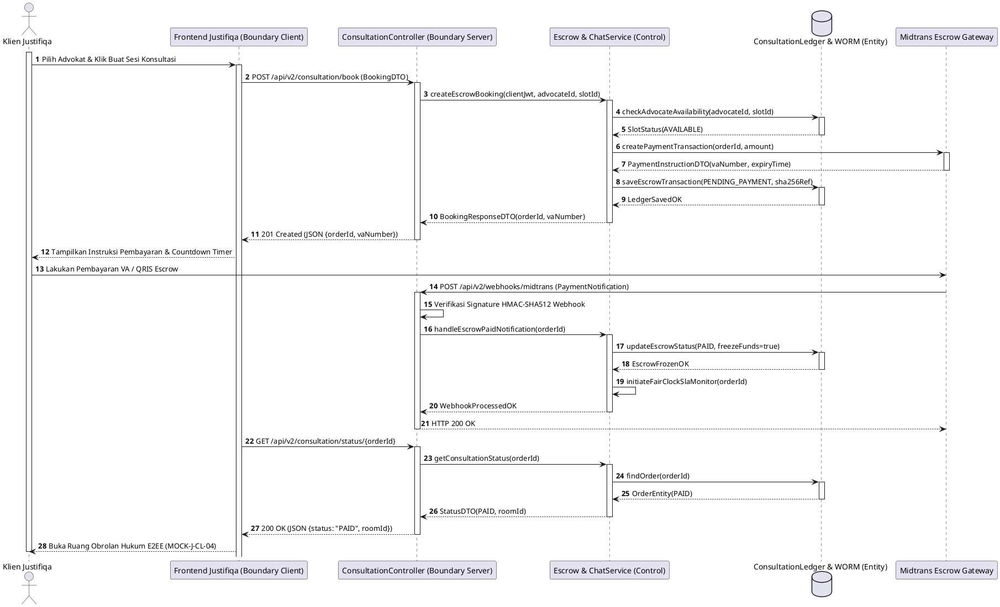
```plantuml
@startuml
autonumber
actor "Klien Justifiqa" as User
participant "Frontend Justifiqa (Boundary Client)" as B_FE
participant "ConsultationController (Boundary Server)" as B_BE
participant "Escrow & ChatService (Control)" as C_Svc
database "ConsultationLedger & WORM (Entity)" as E_DB
participant "Midtrans Escrow Gateway" as Pay

activate User
User -> B_FE ++ : Pilih Advokat & Klik Buat Sesi Konsultasi
B_FE -> B_BE ++ : POST /api/v2/consultation/book (BookingDTO)
B_BE -> C_Svc ++ : createEscrowBooking(clientJwt, advocateId, slotId)
C_Svc -> E_DB ++ : checkAdvocateAvailability(advocateId, slotId)
E_DB --> C_Svc -- : SlotStatus(AVAILABLE)
C_Svc -> Pay ++ : createPaymentTransaction(orderId, amount)
Pay --> C_Svc -- : PaymentInstructionDTO(vaNumber, expiryTime)
C_Svc -> E_DB ++ : saveEscrowTransaction(PENDING_PAYMENT, sha256Ref)
E_DB --> C_Svc -- : LedgerSavedOK
C_Svc --> B_BE -- : BookingResponseDTO(orderId, vaNumber)
B_BE --> B_FE -- : 201 Created (JSON {orderId, vaNumber})
B_FE --> User : Tampilkan Instruksi Pembayaran & Countdown Timer

User -> Pay : Lakukan Pembayaran VA / QRIS Escrow
Pay -> B_BE ++ : POST /api/v2/webhooks/midtrans (PaymentNotification)
B_BE -> B_BE : Verifikasi Signature HMAC-SHA512 Webhook
B_BE -> C_Svc ++ : handleEscrowPaidNotification(orderId)
C_Svc -> E_DB ++ : updateEscrowStatus(PAID, freezeFunds=true)
E_DB --> C_Svc -- : EscrowFrozenOK
C_Svc -> C_Svc : initiateFairClockSlaMonitor(orderId)
C_Svc --> B_BE -- : WebhookProcessedOK
B_BE --> Pay -- : HTTP 200 OK

B_FE -> B_BE ++ : GET /api/v2/consultation/status/{orderId}
B_BE -> C_Svc ++ : getConsultationStatus(orderId)
C_Svc -> E_DB ++ : findOrder(orderId)
E_DB --> C_Svc -- : OrderEntity(PAID)
C_Svc --> B_BE -- : StatusDTO(PAID, roomId)
B_BE --> B_FE -- : 200 OK (JSON {status: "PAID", roomId})
B_FE --> User : Buka Ruang Obrolan Hukum E2EE (MOCK-J-CL-04)
deactivate User
@enduml
```

---

### SD-J-04: Mengatur Status Ketersediaan Praktik Advokat (J-UC09)
*Sequence diagram pengaturan ketersediaan slot kalender praktik dan deteksi konflik jadwal otomatis (tanpa toggle manual) dengan spesifikasi eksekusi aktif lengkap pada sisi Advokat (Mitra) dan sistem.*

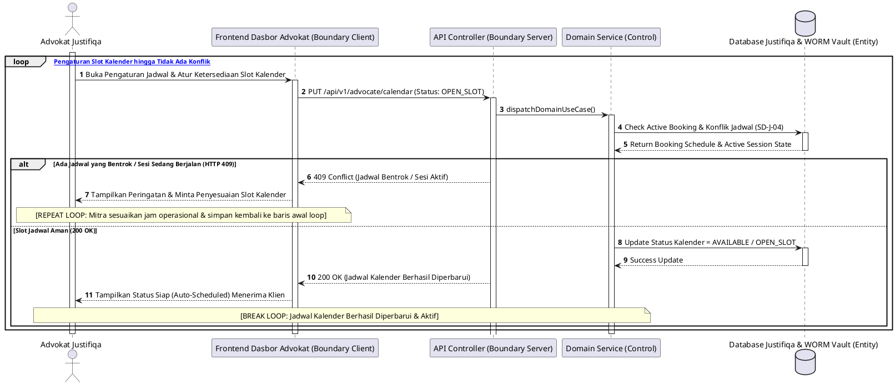
```plantuml
@startuml
autonumber
actor "Advokat Justifiqa" as Mitra
participant "Frontend Dasbor Advokat (Boundary Client)" as B_FE
participant "API Controller (Boundary Server)" as B_BE
participant "Domain Service (Control)" as C_Svc
participant "Backend Independen Justifiqa" as C_Svc
database "Database Justifiqa & WORM Vault (Entity)" as E_DB

activate Mitra
loop [Percobaan Pengaturan Slot Kalender hingga Tidak Ada Konflik]
    Mitra -> B_FE ++ : Buka Pengaturan Jadwal & Atur Ketersediaan Slot Kalender
    B_FE -> B_BE ++ : PUT /api/v1/advocate/calendar (Status: OPEN_SLOT)
    B_BE -> C_Svc ++ : dispatchDomainUseCase()

    C_Svc -> E_DB ++ : Check Active Booking & Konflik Jadwal (SD-J-04)
    E_DB --> C_Svc -- : Return Booking Schedule & Active Session State

    alt Ada Jadwal yang Bentrok / Sesi Sedang Berjalan (HTTP 409)
        B_BE --> B_FE : 409 Conflict (Jadwal Bentrok / Sesi Aktif)
        B_FE --> Mitra : Tampilkan Peringatan & Minta Penyesuaian Slot Kalender
        note over Mitra, B_FE : [REPEAT LOOP: Mitra sesuaikan jam operasional & simpan kembali ke baris awal loop]
    else Slot Jadwal Aman (200 OK)
        C_Svc -> E_DB ++ : Update Status Kalender = AVAILABLE / OPEN_SLOT
        E_DB --> C_Svc -- : Success Update
        B_BE --> B_FE : 200 OK (Jadwal Kalender Berhasil Diperbarui)
        B_FE --> Mitra : Tampilkan Status Siap (Auto-Scheduled) Menerima Klien
        note over Mitra, C_Svc : [BREAK LOOP: Jadwal Kalender Berhasil Diperbarui & Aktif]
    end
end
deactivate C_Svc
deactivate B_FE
deactivate Mitra
@enduml
```

---

### SD-J-05: Mengunggah Berkas Perkara E2EE Zero-Knowledge (J-UC13)
*Sequence diagram pengunggahan bukti perkara yang dienkripsi sebelum meninggalkan perangkat klien agar tidak dapat dibaca oleh server maupun pihak ketiga dengan spesifikasi eksekusi aktif lengkap pada sisi Klien, Advokat, dan sistem.*

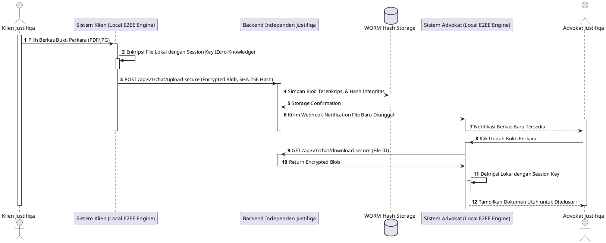
```plantuml
@startuml
autonumber
actor "Klien Justifiqa" as Klien
participant "Sistem Klien (Local E2EE Engine)" as LocK
participant "Backend Independen Justifiqa" as C_Svc
database "WORM Hash Storage" as WORM
participant "Sistem Advokat (Local E2EE Engine)" as LocM
actor "Advokat Justifiqa" as Mitra

activate Klien
Klien -> LocK ++ : Pilih Berkas Bukti Perkara (PDF/JPG)
LocK -> LocK ++ : Enkripsi File Lokal dengan Session Key (Zero-Knowledge)
deactivate LocK
LocK -> C_Svc ++ : POST /api/v1/chat/upload-secure (Encrypted Blob, SHA-256 Hash)
C_Svc -> WORM ++ : Simpan Blob Terenkripsi & Hash Integritas
WORM --> C_Svc -- : Storage Confirmation
C_Svc --> LocM ++ : Kirim Webhook Notification File Baru Diunggah
activate Mitra
LocM --> Mitra : Notifikasi Berkas Baru Tersedia
deactivate LocM
deactivate C_Svc
deactivate LocK

Mitra -> LocM ++ : Klik Unduh Bukti Perkara
LocM -> C_Svc ++ : GET /api/v1/chat/download-secure (File ID)
C_Svc --> LocM -- : Return Encrypted Blob
LocM -> LocM ++ : Dekripsi Lokal dengan Session Key
deactivate LocM
LocM --> Mitra : Tampilkan Dokumen Utuh untuk Ditelusuri
deactivate Klien
deactivate Mitra
@enduml
```

---

### SD-J-06: Membuat & Memfinalisasi Draf Kontrak Hukum Bermeterai (J-UC12, J-UC14)
*Sequence diagram pembuatan opini hukum/kontrak oleh advokat serta finalisasi pembubuhan e-Meterai resmi Peruri yang difasilitasi platform (*Platform-Facilitated Stamping*) dengan spesifikasi eksekusi aktif lengkap pada sisi Advokat, Klien, dan sistem.*

```plantuml
@startuml
title Sequence Diagram: SD-J-06 - Membuat & Memfinalisasi Draf Kontrak Hukum Bermeterai (J-UC12, J-UC14)
autonumber
actor "Advokat Justifiqa" as Mitra
participant "Frontend Workstation (Boundary Client)" as B_FE
participant "API Controller (Boundary Server)" as B_BE
participant "Domain Service (Control)" as C_Svc
participant "Backend Justifiqa" as C_Svc
participant "API Mekari Sign" as Peruri
database "Database & WORM & WORM Vault (Entity)" as E_DB
actor "Klien Justifiqa" as Klien

activate Mitra
Mitra -> B_FE ++ : Buat Draf Legal Opinion / Kontrak & Pilih e-Meterai
B_FE -> B_BE ++ : POST /api/v1/legal-docs/generate (Payload, Stamping Req)
    B_BE -> C_Svc ++ : dispatchDomainUseCase()
C_Svc -> E_DB ++ : Simpan Draf Versi Awal (v1)
E_DB --> C_Svc -- : Draf Saved
deactivate C_Svc
deactivate B_FE

alt Pembubuhan e-Meterai Peruri = TRUE
    Mitra -> B_FE ++ : Klik "Finalisasi Dokumen & Bubuhkan e-Meterai Resmi"
    B_FE -> B_BE ++ : POST /api/v1/drafts/{id}/finalize-stamp
    B_BE -> C_Svc ++ : dispatchDomainUseCase()
    
    loop Cek Saldo Dompet Advokat (Biaya Rp12.000)
        C_Svc -> E_DB ++ : SELECT balance FROM advocate_wallets WHERE advocate_id = {id}
        E_DB --> C_Svc -- : Return Balance
        
        alt Saldo Dompet Tidak Mencukupi (Balance < Rp12.000)
            B_BE --> B_FE : 402 Payment Required (Saldo Dompet Kurang)
            B_FE --> Mitra : Tampilkan Alert "⚠️ Saldo Dompet Kurang untuk e-Meterai"
            Mitra -> B_FE : Lakukan Top-Up Dompet (Lihat SD-J-22)
            note right of Mitra : Advokat menjalankan alur SD-J-22 (Top-Up).
Jika sukses/gagal/batal, kontrol kembali
untuk mengulang pengecekan saldo di atas.
        else Saldo Dompet Mencukupi
            C_Svc -> E_DB ++ : UPDATE advocate_wallets SET balance = balance - 12000
            E_DB --> C_Svc -- : 200 OK (Success / Rows Affected)
            C_Svc -> E_DB ++ : UPDATE drafts SET status = 'IMMUTABLE_FINAL'
            E_DB --> C_Svc -- : 200 OK (Success / Rows Affected)
        end
    end
    
    C_Svc -> Peruri ++ : POST /api/v1/emeterai/stamp (PDF Payload & SHA-256 Hash)
    Peruri -> Peruri ++ : Validasi Request & Bubuhkan Serial Number e-Meterai
    Peruri --> Peruri -- : 200 OK (Serial Number e-Meterai Rilis)
    Peruri --> C_Svc -- : Return Stamped Document & Certificate SHA-256 Hash
    C_Svc -> E_DB ++ : Simpan Dokumen Bersertifikat Resmi ke WORM Storage
    E_DB --> C_Svc -- : 200 OK (Success / Rows Affected)
else Tanpa e-Meterai (Draf Internal / Standar)
    C_Svc -> E_DB ++ : Simpan Dokumen Hukum Standar
    E_DB --> C_Svc -- : 200 OK (Success / Rows Affected)
end

E_DB --> C_Svc : Save Confirmed
B_BE --> B_FE : 200 OK (Dokumen Final Siap)
B_FE --> Mitra : Tampilkan Konfirmasi Sukses & Tautan Unduh
deactivate C_Svc

Mitra -> B_FE ++ : Unduh Arsip Dokumen Bermeterai
B_FE -> B_BE ++ : GET /api/v1/documents/{id}/download
    B_BE -> C_Svc ++ : dispatchDomainUseCase()
C_Svc --> B_BE -- : DomainResultDTO
    B_BE --> B_FE -- : Return File PDF Resmi & SHA-256 Proof
B_FE --> Mitra : Render & Simpan File PDF Bermeterai

activate Klien
C_Svc -> Klien : Push Notification & Email "Dokumen Hukum Bermeterai Siap Diunduh"
Klien -> B_FE ++ : Unduh Dokumen Akhir (Download Gate)
B_FE -> B_BE ++ : GET /api/v1/documents/{id}/download
    B_BE -> C_Svc ++ : dispatchDomainUseCase()
C_Svc --> B_BE -- : DomainResultDTO
    B_BE --> B_FE -- : Return File PDF Resmi & SHA-256 Proof
B_FE --> Klien : Render File PDF Bermeterai

loop [Siklus Review & Revisi Draf Kontrak - Ulangi Selama Klien Mengajukan Revisi & Kuota < 2x & SLA Belum Habis]
    Klien -> B_FE : Kirim Catatan berlabel [REVISI KLAUSUL] di Async Thread
    B_FE -> B_BE ++ : POST /api/v1/documents/{id}/async-thread/revise
    B_BE -> C_Svc ++ : dispatchDomainUseCase()
    C_Svc -> C_Svc ++ : Inline DLP Scan pada Komentar Asinkron
    C_Svc --> C_Svc -- : Return DLP Decision
    C_Svc --> B_BE -- : DomainResultDTO
    B_BE --> B_FE -- : 200 OK
    B_FE --> Klien : Konfirmasi Permintaan Revisi Terkirim
    note over Klien, C_Svc : Advokat memproses revisi dan mengunggah draf v2/v3
end

alt [Penyelesaian Deliverable] Dokumen Disetujui Klien ATAU Batas Kuota 2x Habis ATAU Melewati SLA 3x24 Jam
    Klien -> B_FE : Klik Setujui Dokumen Final (Final Approved) / Auto-Approve SLA Habis / Kuota Habis
    B_FE -> B_BE ++ : POST /api/v1/documents/{id}/approve
    B_BE -> C_Svc ++ : dispatchDomainUseCase()
    C_Svc -> E_DB ++ : UPDATE consultation_sessions SET async_thread_locked = TRUE WHERE id = session_id
    E_DB --> C_Svc -- : 200 OK
    opt [Jika Batas Kuota 2x Habis / SLA Habis]
        C_Svc -> B_FE ++ : Tampilkan Prompt "Batas Kuota Revisi Sesi Ini Habis"
        B_FE --> Klien : Prompt Buat Reservasi Sesi Baru untuk Topik Tambahan
        deactivate B_FE
    end
    C_Svc -> C_Svc ++ : Trigger Deliverable-Triggered Escrow Release (J-UC19)
    C_Svc --> C_Svc -- : Return Computed Result / State
    C_Svc -> E_DB ++ : UPDATE escrow_ledger SET status = 'SETTLED' WHERE session_id = id
    E_DB --> C_Svc -- : 200 OK
    C_Svc --> B_BE -- : DomainResultDTO
    B_BE --> B_FE -- : 200 Approved
    B_FE --> Klien : Konfirmasi Dokumen Disetujui & Escrow Dicairkan
end
deactivate Klien
deactivate Mitra
@enduml
```

---

### SD-J-07: Konsultasi Pro Bono SKTM (J-UC15)
*Sequence diagram pengajuan bantuan hukum cuma-cuma (Pro Bono) melalui verifikasi Surat Keterangan Tidak Mampu (SKTM) Dukcapil dengan spesifikasi eksekusi aktif lengkap pada sisi Klien, Advokat, dan sistem.*

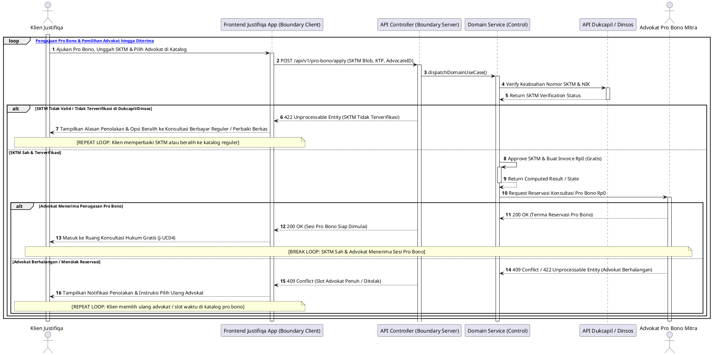
```plantuml
@startuml
autonumber
actor "Klien Justifiqa" as Klien
participant "Frontend Justifiqa App (Boundary Client)" as B_FE
participant "API Controller (Boundary Server)" as B_BE
participant "Domain Service (Control)" as C_Svc
participant "Backend Independen Justifiqa" as C_Svc
participant "API Dukcapil / Dinsos" as Ext
actor "Advokat Pro Bono Mitra" as Mitra

activate Klien
loop [Percobaan Pengajuan Pro Bono & Pemilihan Advokat hingga Diterima]
    Klien -> B_FE ++ : Ajukan Pro Bono, Unggah SKTM & Pilih Advokat di Katalog
    B_FE -> B_BE ++ : POST /api/v1/pro-bono/apply (SKTM Blob, KTP, AdvocateID)
    B_BE -> C_Svc ++ : dispatchDomainUseCase()
    C_Svc -> Ext ++ : Verify Keabsahan Nomor SKTM & NIK
    Ext --> C_Svc -- : Return SKTM Verification Status

    alt SKTM Tidak Valid / Tidak Terverifikasi di Dukcapil/Dinsos
        B_BE --> B_FE : 422 Unprocessable Entity (SKTM Tidak Terverifikasi)
        B_FE --> Klien : Tampilkan Alasan Penolakan & Opsi Beralih ke Konsultasi Berbayar Reguler / Perbaiki Berkas
        note over Klien, B_FE : [REPEAT LOOP: Klien memperbaiki SKTM atau beralih ke katalog reguler]
    else SKTM Sah & Terverifikasi
        C_Svc -> C_Svc ++ : Approve SKTM & Buat Invoice Rp0 (Gratis)
        C_Svc --> C_Svc -- : Return Computed Result / State
        C_Svc -> Mitra ++ : Request Reservasi Konsultasi Pro Bono Rp0
        
        alt Advokat Menerima Penugasan Pro Bono
            Mitra --> C_Svc : 200 OK (Terima Reservasi Pro Bono)
            B_BE --> B_FE : 200 OK (Sesi Pro Bono Siap Dimulai)
            B_FE --> Klien : Masuk ke Ruang Konsultasi Hukum Gratis (J-UC04)
            note over Klien, Mitra : [BREAK LOOP: SKTM Sah & Advokat Menerima Sesi Pro Bono]
        else Advokat Berhalangan / Menolak Reservasi
            Mitra --> C_Svc : 409 Conflict / 422 Unprocessable Entity (Advokat Berhalangan)
            B_BE --> B_FE : 409 Conflict (Slot Advokat Penuh / Ditolak)
            B_FE --> Klien : Tampilkan Notifikasi Penolakan & Instruksi Pilih Ulang Advokat
            note over Klien, B_FE : [REPEAT LOOP: Klien memilih ulang advokat / slot waktu di katalog pro bono]
        end
    end
end
deactivate C_Svc
deactivate B_FE
deactivate Klien
deactivate Mitra
@enduml
```

---

### SD-J-08: Membuat Catatan Sesi IRAC Note Advokat (J-UC11)
*Sequence diagram pembuatan catatan terstruktur metode IRAC (Issue, Rule, Application, Conclusion) oleh advokat dengan spesifikasi eksekusi aktif lengkap pada sisi Advokat dan sistem.*

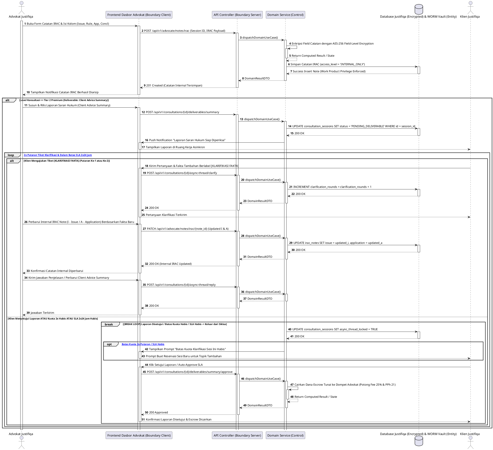
```plantuml
@startuml
autonumber
actor "Advokat Justifiqa" as Mitra
participant "Frontend Dasbor Advokat (Boundary Client)" as B_FE
participant "API Controller (Boundary Server)" as B_BE
participant "Domain Service (Control)" as C_Svc
participant "Backend Independen Justifiqa" as C_Svc
database "Database Justifiqa (Encrypted) & WORM Vault (Entity)" as E_DB
actor "Klien Justifiqa" as Klien

activate Mitra
Mitra -> B_FE ++ : Buka Form Catatan IRAC & Isi Kolom (Issue, Rule, App, Concl)
B_FE -> B_BE ++ : POST /api/v1/advocate/notes/irac (Session ID, IRAC Payload)
    B_BE -> C_Svc ++ : dispatchDomainUseCase()
C_Svc -> C_Svc ++ : Enkripsi Field Catatan dengan AES-256 Field-Level Encryption
C_Svc --> C_Svc -- : Return Computed Result / State
C_Svc -> E_DB ++ : Simpan Catatan IRAC (access_level = 'INTERNAL_ONLY')
E_DB --> C_Svc -- : Success Insert Note (Work Product Privilege Enforced)
C_Svc --> B_BE -- : DomainResultDTO
    B_BE --> B_FE -- : 201 Created (Catatan Internal Tersimpan)
B_FE --> Mitra : Tampilkan Notifikasi Catatan IRAC Berhasil Diarsip
deactivate B_FE

alt Level Konsultasi == Tier 2 Premium (Deliverable: Client Advice Summary)
    Mitra -> B_FE ++ : Susun & Rilis Laporan Saran Hukum (Client Advice Summary)
    B_FE -> B_BE ++ : POST /api/v1/consultations/{id}/deliverables/summary
    B_BE -> C_Svc ++ : dispatchDomainUseCase()
    C_Svc -> E_DB ++ : UPDATE consultation_sessions SET status = 'PENDING_DELIVERABLE' WHERE id = session_id
    E_DB --> C_Svc -- : 200 OK
    C_Svc -> B_FE ++ : Push Notification "Laporan Saran Hukum Siap Diperiksa"
    B_FE --> Klien : Tampilkan Laporan di Ruang Kerja Asinkron
    deactivate B_FE

    loop [Maksimal 2x Putaran Tiket Klarifikasi & Dalam Batas SLA 2x24 Jam]
        alt Klien Mengajukan Tiket [KLARIFIKASI FAKTA] (Putaran Ke-1 atau Ke-2)
            Klien -> B_FE ++ : Kirim Pertanyaan & Fakta Tambahan Berlabel [KLARIFIKASI FAKTA]
            B_FE -> B_BE ++ : POST /api/v1/consultations/{id}/async-thread/clarify
    B_BE -> C_Svc ++ : dispatchDomainUseCase()
            C_Svc -> E_DB ++ : INCREMENT clarification_rounds = clarification_rounds + 1
            E_DB --> C_Svc -- : 200 OK
            C_Svc --> B_BE -- : DomainResultDTO
    B_BE --> B_FE -- : 200 OK
            B_FE --> Klien : Pertanyaan Klarifikasi Terkirim
            deactivate B_FE
            
            Mitra -> B_FE ++ : Perbarui Internal IRAC Note (I - Issue / A - Application) Berdasarkan Fakta Baru
            B_FE -> B_BE ++ : PATCH /api/v1/advocate/notes/irac/{note_id} (Updated I & A)
    B_BE -> C_Svc ++ : dispatchDomainUseCase()
            C_Svc -> E_DB ++ : UPDATE irac_notes SET issue = updated_i, application = updated_a
            E_DB --> C_Svc -- : 200 OK
            C_Svc --> B_BE -- : DomainResultDTO
    B_BE --> B_FE -- : 200 OK (Internal IRAC Updated)
            B_FE --> Mitra : Konfirmasi Catatan Internal Diperbarui
            deactivate B_FE
            
            Mitra -> B_FE ++ : Kirim Jawaban Penjelasan / Perbarui Client Advice Summary
            B_FE -> B_BE ++ : POST /api/v1/consultations/{id}/async-thread/reply
    B_BE -> C_Svc ++ : dispatchDomainUseCase()
            C_Svc --> B_BE -- : DomainResultDTO
    B_BE --> B_FE -- : 200 OK
            B_FE --> Mitra : Jawaban Terkirim
            deactivate B_FE
        else Klien Menyetujui Laporan ATAU Kuota 2x Habis ATAU SLA 2x24 Jam Habis
            break [BREAK LOOP] Laporan Disetujui / Batas Kuota Habis / SLA Habis -> Keluar dari Siklus
                C_Svc -> E_DB ++ : UPDATE consultation_sessions SET async_thread_locked = TRUE
                E_DB --> C_Svc -- : 200 OK
                opt [Jika Batas Kuota 2x Putaran / SLA Habis]
                    C_Svc -> B_FE ++ : Tampilkan Prompt "Batas Kuota Klarifikasi Sesi Ini Habis"
                    B_FE --> Klien : Prompt Buat Reservasi Sesi Baru untuk Topik Tambahan
                    deactivate B_FE
                end
                Klien -> B_FE ++ : Klik Setujui Laporan / Auto-Approve SLA
                B_FE -> B_BE ++ : POST /api/v1/consultations/{id}/deliverables/summary/approve
    B_BE -> C_Svc ++ : dispatchDomainUseCase()
                C_Svc -> C_Svc ++ : Cairkan Dana Escrow Tunai ke Dompet Advokat (Potong Fee 25% & PPh 21)
                C_Svc --> C_Svc -- : Return Computed Result / State
                C_Svc --> B_BE -- : DomainResultDTO
    B_BE --> B_FE -- : 200 Approved
                B_FE --> Klien : Konfirmasi Laporan Disetujui & Escrow Dicairkan
                deactivate B_FE
            end
        end
    end
end

deactivate Mitra
@enduml
```

---

### SD-J-09: Verifikasi Kredensial & Sanitasi Profil/Media 3-Lapisan Advokat Mitra (J-UC16)
*Sequence diagram audit verifikasi keabsahan lisensi profesi Peradi serta pertahanan 3-Lapisan sanitasi profil/media anti-bypass kontak pribadi dengan spesifikasi eksekusi aktif lengkap pada sisi Admin, Advokat (actor), dan sistem.*

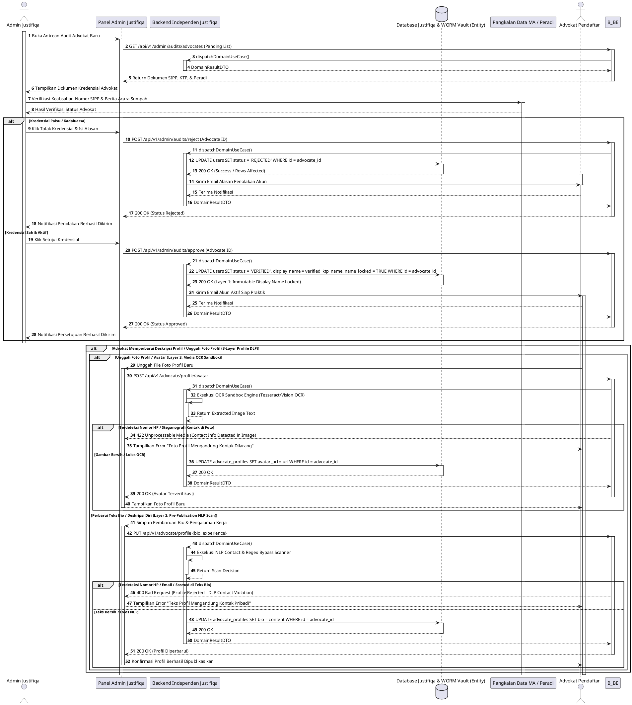
```plantuml
@startuml
autonumber
actor "Admin Justifiqa" as Admin
participant "Panel Admin Justifiqa" as B_FE
participant "Backend Independen Justifiqa" as C_Svc
database "Database Justifiqa & WORM Vault (Entity)" as E_DB
participant "Pangkalan Data MA / Peradi" as Peradi
actor "Advokat Pendaftar" as Mitra

activate Admin
Admin -> B_FE ++ : Buka Antrean Audit Advokat Baru
B_FE -> B_BE ++ : GET /api/v1/admin/audits/advocates (Pending List)
    B_BE -> C_Svc ++ : dispatchDomainUseCase()
C_Svc --> B_BE -- : DomainResultDTO
    B_BE --> B_FE -- : Return Dokumen SIPP, KTP, & Peradi
B_FE --> Admin : Tampilkan Dokumen Kredensial Advokat
Admin -> Peradi ++ : Verifikasi Keabsahan Nomor SIPP & Berita Acara Sumpah
Peradi --> Admin : Hasil Verifikasi Status Advokat

alt Kredensial Palsu / Kadaluarsa
    Admin -> B_FE : Klik Tolak Kredensial & Isi Alasan
    B_FE -> B_BE ++ : POST /api/v1/admin/audits/reject (Advocate ID)
    B_BE -> C_Svc ++ : dispatchDomainUseCase()
    C_Svc -> E_DB ++ : UPDATE users SET status = 'REJECTED' WHERE id = advocate_id
    E_DB --> C_Svc -- : 200 OK (Success / Rows Affected)
activate Mitra
    C_Svc -> Mitra ++ : Kirim Email Alasan Penolakan Akun
    Mitra --> C_Svc : Terima Notifikasi
    C_Svc --> B_BE -- : DomainResultDTO
    B_BE --> B_FE -- : 200 OK (Status Rejected)
    B_FE --> Admin : Notifikasi Penolakan Berhasil Dikirim
else Kredensial Sah & Aktif
    Admin -> B_FE : Klik Setujui Kredensial
    B_FE -> B_BE ++ : POST /api/v1/admin/audits/approve (Advocate ID)
    B_BE -> C_Svc ++ : dispatchDomainUseCase()
    C_Svc -> E_DB ++ : UPDATE users SET status = 'VERIFIED', display_name = verified_ktp_name, name_locked = TRUE WHERE id = advocate_id
    E_DB --> C_Svc -- : 200 OK (Layer 1: Immutable Display Name Locked)
    C_Svc -> Mitra ++ : Kirim Email Akun Aktif Siap Praktik
    Mitra --> C_Svc : Terima Notifikasi
    C_Svc --> B_BE -- : DomainResultDTO
    B_BE --> B_FE -- : 200 OK (Status Approved)
    B_FE --> Admin : Notifikasi Persetujuan Berhasil Dikirim
end
deactivate Admin

alt Advokat Memperbarui Deskripsi Profil / Unggah Foto Profil (3-Layer Profile DLP)
    alt Unggah Foto Profil / Avatar (Layer 3: Media OCR Sandbox)
        Mitra -> B_FE ++ : Unggah File Foto Profil Baru
        B_FE -> B_BE ++ : POST /api/v1/advocate/profile/avatar
    B_BE -> C_Svc ++ : dispatchDomainUseCase()
        C_Svc -> C_Svc ++ : Eksekusi OCR Sandbox Engine (Tesseract/Vision OCR)
        C_Svc --> C_Svc -- : Return Extracted Image Text
        alt Terdeteksi Nomor HP / Steganografi Kontak di Foto
            B_BE --> B_FE : 422 Unprocessable Media (Contact Info Detected in Image)
            B_FE --> Mitra : Tampilkan Error "Foto Profil Mengandung Kontak Dilarang"
        else Gambar Bersih / Lolos OCR
            C_Svc -> E_DB ++ : UPDATE advocate_profiles SET avatar_url = url WHERE id = advocate_id
            E_DB --> C_Svc -- : 200 OK
            C_Svc --> B_BE -- : DomainResultDTO
    B_BE --> B_FE -- : 200 OK (Avatar Terverifikasi)
            B_FE --> Mitra : Tampilkan Foto Profil Baru
            deactivate B_FE
        end
    else Perbarui Teks Bio / Deskripsi Diri (Layer 2: Pre-Publication NLP Scan)
        Mitra -> B_FE ++ : Simpan Pembaruan Bio & Pengalaman Kerja
        B_FE -> B_BE ++ : PUT /api/v1/advocate/profile {bio, experience}
    B_BE -> C_Svc ++ : dispatchDomainUseCase()
        C_Svc -> C_Svc ++ : Eksekusi NLP Contact & Regex Bypass Scanner
        C_Svc --> C_Svc -- : Return Scan Decision
        alt Terdeteksi Nomor HP / Email / Sosmed di Teks Bio
            B_BE --> B_FE : 400 Bad Request (Profile Rejected - DLP Contact Violation)
            B_FE --> Mitra : Tampilkan Error "Teks Profil Mengandung Kontak Pribadi"
        else Teks Bersih / Lolos NLP
            C_Svc -> E_DB ++ : UPDATE advocate_profiles SET bio = content WHERE id = advocate_id
            E_DB --> C_Svc -- : 200 OK
            C_Svc --> B_BE -- : DomainResultDTO
    B_BE --> B_FE -- : 200 OK (Profil Diperbarui)
            B_FE --> Mitra : Konfirmasi Profil Berhasil Dipublikasikan
            deactivate B_FE
        end
    end
end
deactivate Mitra
@enduml
```

---

### SD-J-10: Moderasi Akun, Deteksi Fraud Perilaku, & Due Process Suspend Admin Justifiqa (J-UC17)
*Sequence diagram penanganan laporan pelanggaran kode etik, investigasi Due Process of Law, deteksi fraud perilaku (e.g. drop-off < 5 menit), pengajuan sanggahan, dan putusan akhir akun advokat (Reputational Death).*

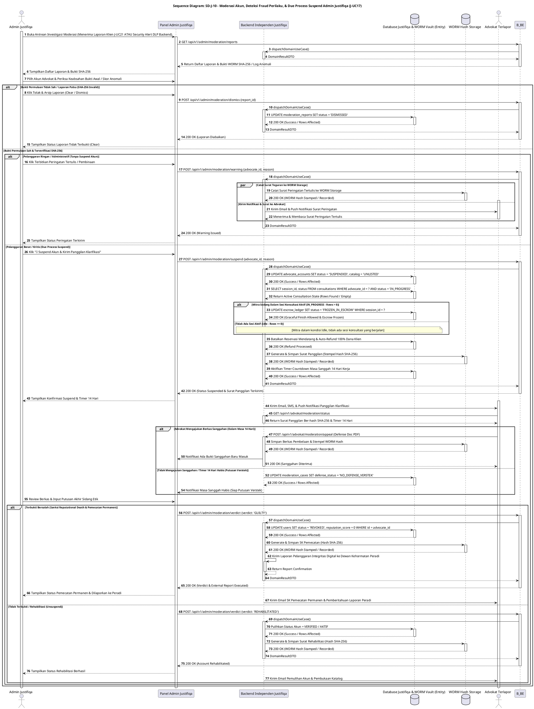
```plantuml
@startuml
title Sequence Diagram: SD-J-10 - Moderasi Akun, Deteksi Fraud Perilaku, & Due Process Suspend Admin Justifiqa (J-UC17)
autonumber
actor "Admin Justifiqa" as Admin
participant "Panel Admin Justifiqa" as B_FE
participant "Backend Independen Justifiqa" as C_Svc
database "Database Justifiqa & WORM Vault (Entity)" as E_DB
database "WORM Hash Storage" as WORM
actor "Advokat Terlapor" as Mitra

activate Admin
Admin -> B_FE ++ : Buka Antrean Investigasi Moderasi (Menerima Laporan Klien J-UC21 ATAU Security Alert DLP Backend)
B_FE -> B_BE ++ : GET /api/v1/admin/moderation/reports
    B_BE -> C_Svc ++ : dispatchDomainUseCase()
C_Svc --> B_BE -- : DomainResultDTO
    B_BE --> B_FE -- : Return Daftar Laporan & Bukti WORM SHA-256 / Log Anomali
B_FE --> Admin : Tampilkan Daftar Laporan & Bukti SHA-256
Admin -> B_FE : Pilih Akun Advokat & Periksa Keabsahan Bukti Awal / Skor Anomali

alt Bukti Permulaan Tidak Sah / Laporan Palsu (SHA-256 Invalid)
    Admin -> B_FE : Klik Tolak & Arsip Laporan (Clear / Dismiss)
    B_FE -> B_BE ++ : POST /api/v1/admin/moderation/dismiss {report_id}
    B_BE -> C_Svc ++ : dispatchDomainUseCase()
    C_Svc -> E_DB ++ : UPDATE moderation_reports SET status = 'DISMISSED'
    E_DB --> C_Svc -- : 200 OK (Success / Rows Affected)
    C_Svc --> B_BE -- : DomainResultDTO
    B_BE --> B_FE -- : 200 OK (Laporan Diabaikan)
    B_FE --> Admin : Tampilkan Status Laporan Tidak Terbukti (Clear)
else Bukti Permulaan Sah & Terverifikasi SHA-256
    alt Pelanggaran Ringan / Administratif (Tanpa Suspend Akun)
        Admin -> B_FE : Klik Terbitkan Peringatan Tertulis / Pembinaan
        B_FE -> B_BE ++ : POST /api/v1/admin/moderation/warning {advocate_id, reason}
    B_BE -> C_Svc ++ : dispatchDomainUseCase()
        par Catat Surat Teguran ke WORM Storage
            C_Svc -> WORM ++ : Catat Surat Peringatan Tertulis ke WORM Storage
            WORM --> C_Svc -- : 200 OK (WORM Hash Stamped / Recorded)
        else Kirim Notifikasi & Surat ke Advokat
            activate Mitra
            C_Svc -> Mitra : Kirim Email & Push Notifikasi Surat Peringatan
            Mitra --> C_Svc : Menerima & Membaca Surat Peringatan Tertulis
            deactivate Mitra
        end
        C_Svc --> B_BE -- : DomainResultDTO
    B_BE --> B_FE -- : 200 OK (Warning Issued)
        B_FE --> Admin : Tampilkan Status Peringatan Terkirim
    else Pelanggaran Berat / Kritis (Due Process Suspend)
        Admin -> B_FE : Klik "🛑 Suspend Akun & Kirim Panggilan Klarifikasi"
        B_FE -> B_BE ++ : POST /api/v1/admin/moderation/suspend {advocate_id, reason}
    B_BE -> C_Svc ++ : dispatchDomainUseCase()
        C_Svc -> E_DB ++ : UPDATE advocate_accounts SET status = 'SUSPENDED', catalog = 'UNLISTED'
        E_DB --> C_Svc -- : 200 OK (Success / Rows Affected)
        C_Svc -> E_DB ++ : SELECT session_id, status FROM consultations WHERE advocate_id = ? AND status = 'IN_PROGRESS'
        E_DB --> C_Svc -- : Return Active Consultation State (Rows Found / Empty)
        alt Mitra Sedang Dalam Sesi Konsultasi Aktif (IN_PROGRESS - Rows > 0)
            C_Svc -> E_DB ++ : UPDATE escrow_ledger SET status = 'FROZEN_IN_ESCROW' WHERE session_id = ?
            E_DB --> C_Svc -- : 200 OK (Graceful Finish Allowed & Escrow Frozen)
        else Tidak Ada Sesi Aktif (Idle - Rows == 0)
            note over C_Svc, E_DB : [Mitra dalam kondisi Idle, tidak ada sesi konsultasi yang berjalan]
        end
        C_Svc -> E_DB ++ : Batalkan Reservasi Mendatang & Auto-Refund 100% Dana Klien
        E_DB --> C_Svc -- : 200 OK (Refund Processed)
        C_Svc -> WORM ++ : Generate & Simpan Surat Panggilan (Stempel Hash SHA-256)
        WORM --> C_Svc -- : 200 OK (WORM Hash Stamped / Recorded)
        C_Svc -> E_DB ++ : Aktifkan Timer Countdown Masa Sanggah 14 Hari Kerja
        E_DB --> C_Svc -- : 200 OK (Success / Rows Affected)
        C_Svc --> B_BE -- : DomainResultDTO
    B_BE --> B_FE -- : 200 OK (Status Suspended & Surat Panggilan Terkirim)
        B_FE --> Admin : Tampilkan Konfirmasi Suspend & Timer 14 Hari
        
        activate Mitra
        C_Svc -> Mitra : Kirim Email, SMS, & Push Notifikasi Panggilan Klarifikasi
        Mitra -> C_Svc ++ : GET /api/v1/advokat/moderation/status
        C_Svc --> Mitra -- : Return Surat Panggilan Ber-hash SHA-256 & Timer 14 Hari
        
        alt Advokat Mengajukan Berkas Sanggahan (Dalam Masa 14 Hari)
            Mitra -> C_Svc ++ : POST /api/v1/advokat/moderation/appeal (Defense Doc PDF)
            C_Svc -> WORM ++ : Simpan Berkas Pembelaan & Stempel WORM Hash
            WORM --> C_Svc -- : 200 OK (WORM Hash Stamped / Recorded)
            C_Svc -> B_FE : Notifikasi Ada Bukti Sanggahan Baru Masuk
            C_Svc --> Mitra -- : 200 OK (Sanggahan Diterima)
        else Tidak Mengajukan Sanggahan / Timer 14 Hari Habis (Putusan Verstek)
            C_Svc -> E_DB ++ : UPDATE moderation_cases SET defense_status = 'NO_DEFENSE_VERSTEK'
            E_DB --> C_Svc -- : 200 OK (Success / Rows Affected)
            C_Svc -> B_FE : Notifikasi Masa Sanggah Habis (Siap Putusan Verstek)
        end
        
        Admin -> B_FE : Review Berkas & Input Putusan Akhir Sidang Etik
        alt Terbukti Bersalah (Sanksi Reputational Death & Pemecatan Permanen)
            B_FE -> B_BE ++ : POST /api/v1/admin/moderation/verdict {verdict: 'GUILTY'}
    B_BE -> C_Svc ++ : dispatchDomainUseCase()
            C_Svc -> E_DB ++ : UPDATE users SET status = 'REVOKED', reputation_score = 0 WHERE id = advocate_id
            E_DB --> C_Svc -- : 200 OK (Success / Rows Affected)
            C_Svc -> WORM ++ : Generate & Simpan SK Pemecatan (Hash SHA-256)
            WORM --> C_Svc -- : 200 OK (WORM Hash Stamped / Recorded)
            C_Svc -> C_Svc ++ : Kirim Laporan Pelanggaran Integritas Digital ke Dewan Kehormatan Peradi
            C_Svc --> C_Svc -- : Return Report Confirmation
            C_Svc --> B_BE -- : DomainResultDTO
    B_BE --> B_FE -- : 200 OK (Verdict & External Report Executed)
            B_FE --> Admin : Tampilkan Status Pemecatan Permanen & Dilaporkan ke Peradi
            C_Svc -> Mitra : Kirim Email SK Pemecatan Permanen & Pemberitahuan Laporan Peradi
        else Tidak Terbukti / Rehabilitasi (Unsuspend)
            B_FE -> B_BE ++ : POST /api/v1/admin/moderation/verdict {verdict: 'REHABILITATED'}
    B_BE -> C_Svc ++ : dispatchDomainUseCase()
            C_Svc -> E_DB ++ : Pulihkan Status Akun = VERIFIED / AKTIF
            E_DB --> C_Svc -- : 200 OK (Success / Rows Affected)
            C_Svc -> WORM ++ : Generate & Simpan Surat Rehabilitasi (Hash SHA-256)
            WORM --> C_Svc -- : 200 OK (WORM Hash Stamped / Recorded)
            C_Svc --> B_BE -- : DomainResultDTO
    B_BE --> B_FE -- : 200 OK (Account Rehabilitated)
            B_FE --> Admin : Tampilkan Status Rehabilitasi Berhasil
            C_Svc -> Mitra : Kirim Email Pemulihan Akun & Pembukaan Katalog
        end
    end
end
deactivate B_FE
deactivate Admin
deactivate Mitra
@enduml
```

---

### SD-J-11: Pencairan Dana Escrow & Perhitungan PPh 21 Advokat (J-UC19)
*Sequence diagram penarikan dana honorarium advokat dari dompet digital ke rekening bank pribadi, pemotongan pajak PPh 21 otomatis, dan auto-rollback jika transfer gagal dengan spesifikasi eksekusi aktif lengkap pada sisi Advokat dan sistem.*

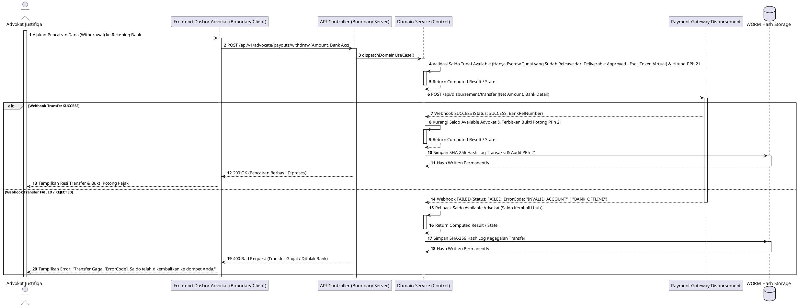
```plantuml
@startuml
autonumber
actor "Advokat Justifiqa" as Mitra
participant "Frontend Dasbor Advokat (Boundary Client)" as B_FE
participant "API Controller (Boundary Server)" as B_BE
participant "Domain Service (Control)" as C_Svc
participant "Backend Independen Justifiqa" as C_Svc
participant "Payment Gateway Disbursement" as PG
database "WORM Hash Storage" as WORM

activate Mitra
Mitra -> B_FE ++ : Ajukan Pencairan Dana (Withdrawal) ke Rekening Bank
B_FE -> B_BE ++ : POST /api/v1/advocate/payouts/withdraw (Amount, Bank Acc)
    B_BE -> C_Svc ++ : dispatchDomainUseCase()

C_Svc -> C_Svc ++ : Validasi Saldo Tunai Available (Hanya Escrow Tunai yang Sudah Release dari Deliverable Approved - Excl. Token Virtual) & Hitung PPh 21
C_Svc --> C_Svc -- : Return Computed Result / State
C_Svc -> PG ++ : POST /api/disbursement/transfer (Net Amount, Bank Detail)

alt Webhook Transfer SUCCESS
    PG --> C_Svc : Webhook SUCCESS (Status: SUCCESS, BankRefNumber)
    C_Svc -> C_Svc ++ : Kurangi Saldo Available Advokat & Terbitkan Bukti Potong PPh 21
    C_Svc --> C_Svc -- : Return Computed Result / State
    C_Svc -> WORM ++ : Simpan SHA-256 Hash Log Transaksi & Audit PPh 21
    WORM --> C_Svc -- : Hash Written Permanently
    B_BE --> B_FE : 200 OK (Pencairan Berhasil Diproses)
    B_FE --> Mitra : Tampilkan Resi Transfer & Bukti Potong Pajak
else Webhook Transfer FAILED / REJECTED
    PG --> C_Svc -- : Webhook FAILED (Status: FAILED, ErrorCode: "INVALID_ACCOUNT" | "BANK_OFFLINE")
    C_Svc -> C_Svc ++ : Rollback Saldo Available Advokat (Saldo Kembali Utuh)
    C_Svc --> C_Svc -- : Return Computed Result / State
    C_Svc -> WORM ++ : Simpan SHA-256 Hash Log Kegagalan Transfer
    WORM --> C_Svc -- : Hash Written Permanently
    B_BE --> B_FE : 400 Bad Request (Transfer Gagal / Ditolak Bank)
    B_FE --> Mitra : Tampilkan Error: "Transfer Gagal [ErrorCode]. Saldo telah dikembalikan ke dompet Anda."
end
deactivate C_Svc
deactivate B_FE
deactivate Mitra
@enduml
```

---

### SD-J-12: Memantau Laporan Keuangan Escrow & Audit WORM (J-UC18)
*Sequence diagram pengawasan buku besar escrow, verifikasi bagi hasil platform (25%/75%), dan eksport bukti pajak PPh 21 ber-hash WORM SHA-256 oleh Admin Justifiqa dengan spesifikasi eksekusi aktif lengkap pada sisi Admin dan sistem.*

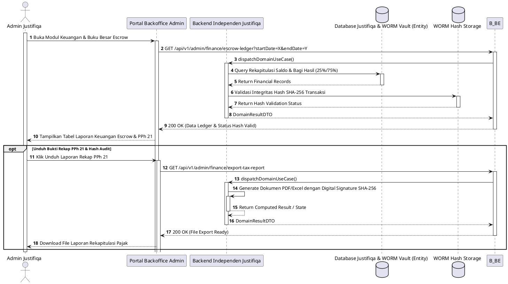
```plantuml
@startuml
autonumber
actor "Admin Justifiqa" as Admin
participant "Portal Backoffice Admin" as B_FE
participant "Backend Independen Justifiqa" as C_Svc
database "Database Justifiqa & WORM Vault (Entity)" as E_DB
database "WORM Hash Storage" as WORM

activate Admin
Admin -> B_FE ++ : Buka Modul Keuangan & Buku Besar Escrow
B_FE -> B_BE ++ : GET /api/v1/admin/finance/escrow-ledger?startDate=X&endDate=Y
    B_BE -> C_Svc ++ : dispatchDomainUseCase()
C_Svc -> E_DB ++ : Query Rekapitulasi Saldo & Bagi Hasil (25%/75%)
E_DB --> C_Svc -- : Return Financial Records
C_Svc -> WORM ++ : Validasi Integritas Hash SHA-256 Transaksi
WORM --> C_Svc -- : Return Hash Validation Status
C_Svc --> B_BE -- : DomainResultDTO
    B_BE --> B_FE -- : 200 OK (Data Ledger & Status Hash Valid)
B_FE --> Admin : Tampilkan Tabel Laporan Keuangan Escrow & PPh 21

opt Unduh Bukti Rekap PPh 21 & Hash Audit
    Admin -> B_FE ++ : Klik Unduh Laporan Rekap PPh 21
    B_FE -> B_BE ++ : GET /api/v1/admin/finance/export-tax-report
    B_BE -> C_Svc ++ : dispatchDomainUseCase()
    C_Svc -> C_Svc ++ : Generate Dokumen PDF/Excel dengan Digital Signature SHA-256
    C_Svc --> C_Svc -- : Return Computed Result / State
    C_Svc --> B_BE -- : DomainResultDTO
    B_BE --> B_FE -- : 200 OK (File Export Ready)
    B_FE --> Admin : Download File Laporan Rekapitulasi Pajak
end
deactivate Admin
@enduml
```

---

### SD-J-13: Memberikan Ulasan & Rating Advokat (J-UC06)
*Sequence diagram pemberian penilaian pasca-sesi konsultasi dengan proteksi privasi anonimisasi nama publik sesuai UU PDP dan kalkulasi agregat rating otomatis dengan spesifikasi eksekusi aktif lengkap pada sisi Klien dan sistem.*

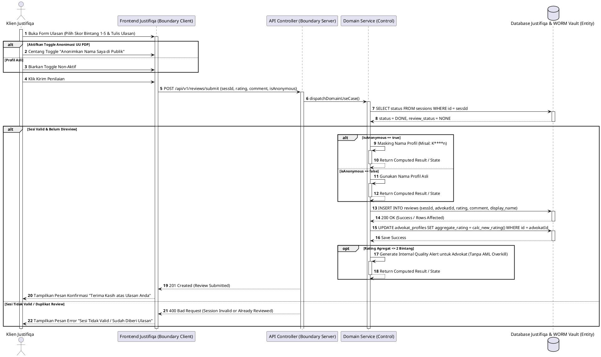
```plantuml
@startuml
autonumber
actor "Klien Justifiqa" as Klien
participant "Frontend Justifiqa (Boundary Client)" as B_FE
participant "API Controller (Boundary Server)" as B_BE
participant "Domain Service (Control)" as C_Svc
participant "Backend Justifiqa" as C_Svc
database "Database Justifiqa & WORM Vault (Entity)" as E_DB

activate Klien
Klien -> B_FE ++ : Buka Form Ulasan (Pilih Skor Bintang 1-5 & Tulis Ulasan)
alt Aktifkan Toggle Anonimasi UU PDP
    Klien -> B_FE : Centang Toggle "Anonimkan Nama Saya di Publik"
else Profil Asli
    Klien -> B_FE : Biarkan Toggle Non-Aktif
end
Klien -> B_FE : Klik Kirim Penilaian
B_FE -> B_BE ++ : POST /api/v1/reviews/submit {sessId, rating, comment, isAnonymous}
    B_BE -> C_Svc ++ : dispatchDomainUseCase()
C_Svc -> E_DB ++ : SELECT status FROM sessions WHERE id = sessId
E_DB --> C_Svc -- : status = DONE, review_status = NONE

alt Sesi Valid & Belum Direview
    alt isAnonymous == true
        C_Svc -> C_Svc ++ : Masking Nama Profil (Misal: K****n)
        C_Svc --> C_Svc -- : Return Computed Result / State
    else isAnonymous == false
        C_Svc -> C_Svc ++ : Gunakan Nama Profil Asli
        C_Svc --> C_Svc -- : Return Computed Result / State
    end
    C_Svc -> E_DB ++ : INSERT INTO reviews (sessId, advokatId, rating, comment, display_name)
    E_DB --> C_Svc -- : 200 OK (Success / Rows Affected)
    C_Svc -> E_DB ++ : UPDATE advokat_profiles SET aggregate_rating = calc_new_rating() WHERE id = advokatId
    E_DB --> C_Svc -- : Save Success
    
    opt Rating Agregat <= 2 Bintang
        C_Svc -> C_Svc ++ : Generate Internal Quality Alert untuk Advokat (Tanpa AML Overkill)
        C_Svc --> C_Svc -- : Return Computed Result / State
    end
    
    B_BE --> B_FE : 201 Created (Review Submitted)
    B_FE --> Klien : Tampilkan Pesan Konfirmasi "Terima Kasih atas Ulasan Anda"
else Sesi Tidak Valid / Duplikat Review
    B_BE --> B_FE : 400 Bad Request (Session Invalid or Already Reviewed)
    B_FE --> Klien : Tampilkan Pesan Error "Sesi Tidak Valid / Sudah Diberi Ulasan"
end
deactivate C_Svc
deactivate B_FE
deactivate Klien
@enduml
```

---

### SD-J-14: [DILEBUR KE DALAM SD-J-06]
*Catatan: Skenario J-UC14 (Pembubuhan e-Meterai Peruri) telah ditiadakan sebagai diagram mandiri dan dilebur seutuhnya ke dalam **SD-J-06 (J-UC12, J-UC14)** sebagai alur kerja terpadu perumusan dan finalisasi dokumen bermeterai yang difasilitasi platform (*Platform-Facilitated Stamping*) dengan pemotongan saldo dompet advokat.*

### SD-J-21: Melaporkan Dugaan Pelanggaran Etik Advokat (J-UC21)
*Sequence diagram pengajuan laporan dugaan pelanggaran kode etik, kerahasiaan, atau wanprestasi advokat oleh klien beserta lampiran barang bukti digital terverifikasi SHA-256.*

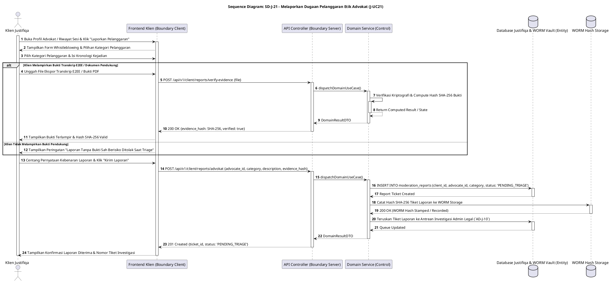
```plantuml
@startuml
title Sequence Diagram: SD-J-21 - Melaporkan Dugaan Pelanggaran Etik Advokat (J-UC21)
autonumber
actor "Klien Justifiqa" as Klien
participant "Frontend Klien (Boundary Client)" as B_FE
participant "API Controller (Boundary Server)" as B_BE
participant "Domain Service (Control)" as C_Svc
participant "Backend Independen Justifiqa" as C_Svc
database "Database Justifiqa & WORM Vault (Entity)" as E_DB
database "WORM Hash Storage" as WORM

activate Klien
Klien -> B_FE ++ : Buka Profil Advokat / Riwayat Sesi & Klik "Laporkan Pelanggaran"
B_FE --> Klien : Tampilkan Form Whistleblowing & Pilihan Kategori Pelanggaran
Klien -> B_FE : Pilih Kategori Pelanggaran & Isi Kronologi Kejadian

alt Klien Melampirkan Bukti Transkrip E2EE / Dokumen Pendukung
    Klien -> B_FE : Unggah File Ekspor Transkrip E2EE / Bukti PDF
    B_FE -> B_BE ++ : POST /api/v1/client/reports/verify-evidence {file}
    B_BE -> C_Svc ++ : dispatchDomainUseCase()
    C_Svc -> C_Svc ++ : Verifikasi Kriptografi & Compute Hash SHA-256 Bukti
    C_Svc --> C_Svc -- : Return Computed Result / State
    C_Svc --> B_BE -- : DomainResultDTO
    B_BE --> B_FE -- : 200 OK {evidence_hash: SHA-256, verified: true}
    B_FE --> Klien : Tampilkan Bukti Terlampir & Hash SHA-256 Valid
else Klien Tidak Melampirkan Bukti Pendukung
    B_FE --> Klien : Tampilkan Peringatan "Laporan Tanpa Bukti Sah Berisiko Ditolak Saat Triage"
end

Klien -> B_FE : Centang Pernyataan Kebenaran Laporan & Klik "Kirim Laporan"
B_FE -> B_BE ++ : POST /api/v1/client/reports/advokat {advocate_id, category, description, evidence_hash}
    B_BE -> C_Svc ++ : dispatchDomainUseCase()
C_Svc -> E_DB ++ : INSERT INTO moderation_reports (client_id, advocate_id, category, status: 'PENDING_TRIAGE')
E_DB --> C_Svc -- : Report Ticket Created
C_Svc -> WORM ++ : Catat Hash SHA-256 Tiket Laporan ke WORM Storage
WORM --> C_Svc -- : 200 OK (WORM Hash Stamped / Recorded)
C_Svc -> E_DB ++ : Teruskan Tiket Laporan ke Antrean Investigasi Admin Legal (`AD-J-10`)
E_DB --> C_Svc -- : Queue Updated
C_Svc --> B_BE -- : DomainResultDTO
    B_BE --> B_FE -- : 201 Created {ticket_id, status: 'PENDING_TRIAGE'}
B_FE --> Klien : Tampilkan Konfirmasi Laporan Diterima & Nomor Tiket Investigasi
deactivate B_FE
deactivate Klien
@enduml
```

---

### SD-J-22: Mengisi Saldo Dompet Advokat (Top-Up / Cash-In - J-UC22)
*Sequence diagram pengisian saldo dompet digital advokat melalui Payment Gateway (Snap / QRIS / VA) untuk membayar layanan berbayar platform tanpa potongan pajak PPh 21 dengan spesifikasi eksekusi aktif lengkap pada sisi Advokat dan sistem.*

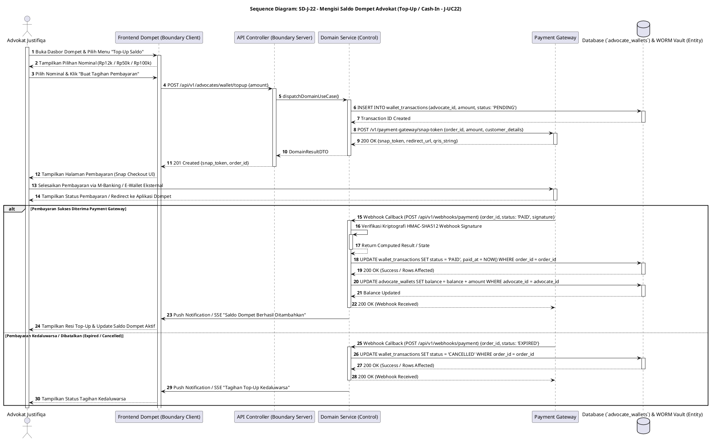
```plantuml
@startuml
title Sequence Diagram: SD-J-22 - Mengisi Saldo Dompet Advokat (Top-Up / Cash-In - J-UC22)
autonumber
actor "Advokat Justifiqa" as Mitra
participant "Frontend Dompet (Boundary Client)" as B_FE
participant "API Controller (Boundary Server)" as B_BE
participant "Domain Service (Control)" as C_Svc
participant "Backend Justifiqa" as C_Svc
participant "Payment Gateway" as PG
database "Database (`advocate_wallets`) & WORM Vault (Entity)" as E_DB

activate Mitra
Mitra -> B_FE ++ : Buka Dasbor Dompet & Pilih Menu "Top-Up Saldo"
B_FE --> Mitra : Tampilkan Pilihan Nominal (Rp12k / Rp50k / Rp100k)
Mitra -> B_FE : Pilih Nominal & Klik "Buat Tagihan Pembayaran"
B_FE -> B_BE ++ : POST /api/v1/advocates/wallet/topup {amount}
    B_BE -> C_Svc ++ : dispatchDomainUseCase()

C_Svc -> E_DB ++ : INSERT INTO wallet_transactions (advocate_id, amount, status: 'PENDING')
E_DB --> C_Svc -- : Transaction ID Created
C_Svc -> PG ++ : POST /v1/payment-gateway/snap-token {order_id, amount, customer_details}
PG --> C_Svc -- : 200 OK {snap_token, redirect_url, qris_string}
C_Svc --> B_BE -- : DomainResultDTO
    B_BE --> B_FE -- : 201 Created {snap_token, order_id}
B_FE --> Mitra : Tampilkan Halaman Pembayaran (Snap Checkout UI)

Mitra -> PG ++ : Selesaikan Pembayaran via M-Banking / E-Wallet Eksternal
PG --> Mitra -- : Tampilkan Status Pembayaran / Redirect ke Aplikasi Dompet

alt Pembayaran Sukses Diterima Payment Gateway
    PG -> C_Svc ++ : Webhook Callback (POST /api/v1/webhooks/payment) {order_id, status: 'PAID', signature}
    C_Svc -> C_Svc ++ : Verifikasi Kriptografi HMAC-SHA512 Webhook Signature
    C_Svc --> C_Svc -- : Return Computed Result / State
    C_Svc -> E_DB ++ : UPDATE wallet_transactions SET status = 'PAID', paid_at = NOW() WHERE order_id = order_id
    E_DB --> C_Svc -- : 200 OK (Success / Rows Affected)
    C_Svc -> E_DB ++ : UPDATE advocate_wallets SET balance = balance + amount WHERE advocate_id = advocate_id
    E_DB --> C_Svc -- : Balance Updated
    C_Svc --> PG -- : 200 OK (Webhook Received)
    
    C_Svc -> B_FE : Push Notification / SSE "Saldo Dompet Berhasil Ditambahkan"
    B_FE --> Mitra : Tampilkan Resi Top-Up & Update Saldo Dompet Aktif
else Pembayaran Kedaluwarsa / Dibatalkan (Expired / Cancelled)
    PG -> C_Svc ++ : Webhook Callback (POST /api/v1/webhooks/payment) {order_id, status: 'EXPIRED'}
    C_Svc -> E_DB ++ : UPDATE wallet_transactions SET status = 'CANCELLED' WHERE order_id = order_id
    E_DB --> C_Svc -- : 200 OK (Success / Rows Affected)
    C_Svc --> PG -- : 200 OK (Webhook Received)
    
    C_Svc -> B_FE : Push Notification / SSE "Tagihan Top-Up Kedaluwarsa"
    B_FE --> Mitra : Tampilkan Status Tagihan Kedaluwarsa
end
deactivate Mitra
@enduml
```

---

### SD-J-20: Autentikasi Portal Backoffice Admin Justifiqa (TOTP 2FA - J-UC20)
*Sequence diagram alur autentikasi tingkat lanjut untuk Admin Justifiqa melalui portal backoffice terisolasi (`admin.justifiqa.com`) dengan IP Whitelisting, verifikasi kredensial internal, dan otentikasi ganda TOTP Authenticator dengan spesifikasi eksekusi aktif lengkap pada sisi Admin dan sistem.*

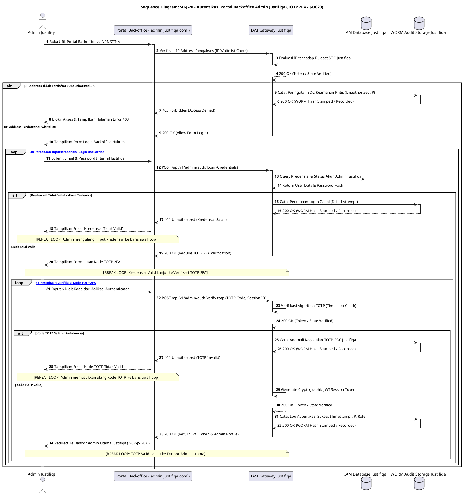
```plantuml
@startuml
title Sequence Diagram: SD-J-20 - Autentikasi Portal Backoffice Admin Justifiqa (TOTP 2FA - J-UC20)
autonumber
actor "Admin Justifiqa" as Admin
participant "Portal Backoffice (`admin.justifiqa.com`)" as B_FE
participant "IAM Gateway Justifiqa" as IAM
database "IAM Database Justifiqa" as E_DB
database "WORM Audit Storage Justifiqa" as WORM

activate Admin
Admin -> B_FE ++ : Buka URL Portal Backoffice via VPN/ZTNA
B_FE -> IAM ++ : Verifikasi IP Address Pengakses (IP Whitelist Check)
IAM -> IAM ++ : Evaluasi IP terhadap Ruleset SOC Justifiqa
IAM --> IAM -- : 200 OK (Token / State Verified)

alt IP Address Tidak Terdaftar (Unauthorized IP)
    IAM -> WORM ++ : Catat Peringatan SOC Keamanan Kritis (Unauthorized IP)
    WORM --> IAM -- : 200 OK (WORM Hash Stamped / Recorded)
    IAM --> B_FE : 403 Forbidden (Access Denied)
    B_FE --> Admin : Blokir Akses & Tampilkan Halaman Error 403
else IP Address Terdaftar di Whitelist
    IAM --> B_FE -- : 200 OK (Allow Form Login)
    B_FE --> Admin : Tampilkan Form Login Backoffice Hukum
    
    loop [Maksimal 3x Percobaan Input Kredensial Login Backoffice]
        Admin -> B_FE : Submit Email & Password Internal Justifiqa
        B_FE -> IAM ++ : POST /api/v1/admin/auth/login (Credentials)
        IAM -> E_DB ++ : Query Kredensial & Status Akun Admin Justifiqa
        E_DB --> IAM -- : Return User Data & Password Hash
        
        alt Kredensial Tidak Valid / Akun Terkunci
            IAM -> WORM ++ : Catat Percobaan Login Gagal (Failed Attempt)
            WORM --> IAM -- : 200 OK (WORM Hash Stamped / Recorded)
            IAM --> B_FE : 401 Unauthorized (Kredensial Salah)
            B_FE --> Admin : Tampilkan Error "Kredensial Tidak Valid"
            note over Admin, B_FE : [REPEAT LOOP: Admin mengulangi input kredensial ke baris awal loop]
        else Kredensial Valid
            IAM --> B_FE -- : 200 OK (Require TOTP 2FA Verification)
            B_FE --> Admin : Tampilkan Permintaan Kode TOTP 2FA
            note over Admin, IAM : [BREAK LOOP: Kredensial Valid Lanjut ke Verifikasi TOTP 2FA]
            
            loop [Maksimal 3x Percobaan Verifikasi Kode TOTP 2FA]
                Admin -> B_FE : Input 6 Digit Kode dari Aplikasi Authenticator
                B_FE -> IAM ++ : POST /api/v1/admin/auth/verify-totp (TOTP Code, Session ID)
                IAM -> IAM ++ : Verifikasi Algoritma TOTP (Time-step Check)
                IAM --> IAM -- : 200 OK (Token / State Verified)
                
                alt Kode TOTP Salah / Kadaluarsa
                    IAM -> WORM ++ : Catat Anomali Kegagalan TOTP SOC Justifiqa
                    WORM --> IAM -- : 200 OK (WORM Hash Stamped / Recorded)
                    IAM --> B_FE : 401 Unauthorized (TOTP Invalid)
                    B_FE --> Admin : Tampilkan Error "Kode TOTP Tidak Valid"
                    note over Admin, B_FE : [REPEAT LOOP: Admin memasukkan ulang kode TOTP ke baris awal loop]
                else Kode TOTP Valid
                    IAM -> IAM ++ : Generate Cryptographic JWT Session Token
                    IAM --> IAM -- : 200 OK (Token / State Verified)
                    IAM -> WORM ++ : Catat Log Autentikasi Sukses (Timestamp, IP, Role)
                    WORM --> IAM -- : 200 OK (WORM Hash Stamped / Recorded)
                    IAM --> B_FE -- : 200 OK (Return JWT Token & Admin Profile)
                    B_FE --> Admin : Redirect ke Dasbor Admin Utama Justifiqa (`SCR-JST-07`)
                    note over Admin, IAM : [BREAK LOOP: TOTP Valid Lanjut ke Dasbor Admin Utama]
                end
            end
        end
    end
end
deactivate B_FE
deactivate Admin
@enduml
```

---

## BAGIAN II: SEQUENCE DIAGRAMS - APLIKASI MANDIRI QUALIFA (DOMAIN PSIKOLOGI)

### SD-Q-01: Registrasi Akun Klien & Psikolog Klinis (Q-UC01, Q-UC07)
*Sequence diagram alur pendaftaran akun mandiri Klien dan Psikolog Klinis (verifikasi STR & SIPP HIMPSI) di platform Qualifa dengan spesifikasi eksekusi aktif (activation bars).*

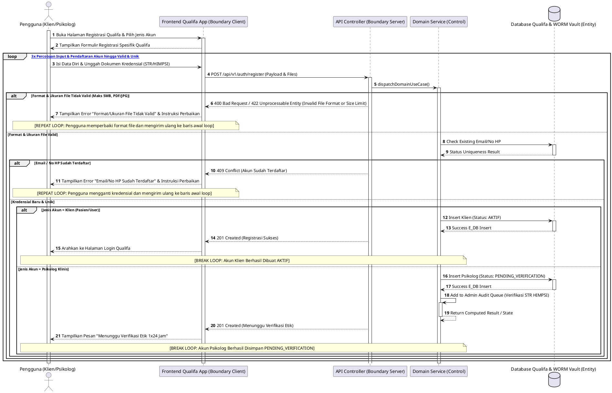
```plantuml
@startuml
autonumber
actor "Pengguna (Klien/Psikolog)" as User
participant "Frontend Qualifa App (Boundary Client)" as B_FE
participant "API Controller (Boundary Server)" as B_BE
participant "Domain Service (Control)" as C_Svc
participant "Backend Independen Qualifa" as C_Svc
database "Database Qualifa & WORM Vault (Entity)" as E_DB

activate User
User -> B_FE ++ : Buka Halaman Registrasi Qualifa & Pilih Jenis Akun
B_FE --> User : Tampilkan Formulir Registrasi Spesifik Qualifa
loop [Maksimal 3x Percobaan Input & Pendaftaran Akun hingga Valid & Unik]
    User -> B_FE : Isi Data Diri & Unggah Dokumen Kredensial (STR/HIMPSI)
    B_FE -> B_BE ++ : POST /api/v1/auth/register (Payload & Files)
    B_BE -> C_Svc ++ : dispatchDomainUseCase()

    alt Format & Ukuran File Tidak Valid (Maks 5MB, PDF/JPG)
        B_BE --> B_FE : 400 Bad Request / 422 Unprocessable Entity (Invalid File Format or Size Limit)
        B_FE --> User : Tampilkan Error "Format/Ukuran File Tidak Valid" & Instruksi Perbaikan
        note over User, B_FE : [REPEAT LOOP: Pengguna memperbaiki format file dan mengirim ulang ke baris awal loop]
    else Format & Ukuran File Valid
        C_Svc -> E_DB ++ : Check Existing Email/No HP
        E_DB --> C_Svc -- : Status Uniqueness Result

        alt Email / No HP Sudah Terdaftar
            B_BE --> B_FE : 409 Conflict (Akun Sudah Terdaftar)
            B_FE --> User : Tampilkan Error "Email/No HP Sudah Terdaftar" & Instruksi Perbaikan
            note over User, B_FE : [REPEAT LOOP: Pengguna mengganti kredensial dan mengirim ulang ke baris awal loop]
        else Kredensial Baru & Unik
            alt Jenis Akun = Klien (Pasien/User)
                C_Svc -> E_DB ++ : Insert Klien (Status: AKTIF)
                E_DB --> C_Svc -- : Success E_DB Insert
                B_BE --> B_FE : 201 Created (Registrasi Sukses)
                B_FE --> User : Arahkan ke Halaman Login Qualifa
                note over User, C_Svc : [BREAK LOOP: Akun Klien Berhasil Dibuat AKTIF]
            else Jenis Akun = Psikolog Klinis
                C_Svc -> E_DB ++ : Insert Psikolog (Status: PENDING_VERIFICATION)
                E_DB --> C_Svc -- : Success E_DB Insert
                C_Svc -> C_Svc ++ : Add to Admin Audit Queue (Verifikasi STR HIMPSI)
                C_Svc --> C_Svc -- : Return Computed Result / State
                B_BE --> B_FE : 201 Created (Menunggu Verifikasi Etik)
                B_FE --> User : Tampilkan Pesan "Menunggu Verifikasi Etik 1x24 Jam"
                note over User, C_Svc : [BREAK LOOP: Akun Psikolog Berhasil Disimpan PENDING_VERIFICATION]
            end
        end
    end
end
deactivate C_Svc
deactivate B_FE
deactivate User
@enduml
```

---

### SD-Q-02: Login Akun Klien & Psikolog Klinis (Q-UC02, Q-UC08)
*Sequence diagram alur masuk (login) independen beserta verifikasi Multi-Factor Authentication (MFA / 2FA) dengan spesifikasi eksekusi aktif (activation bars).*

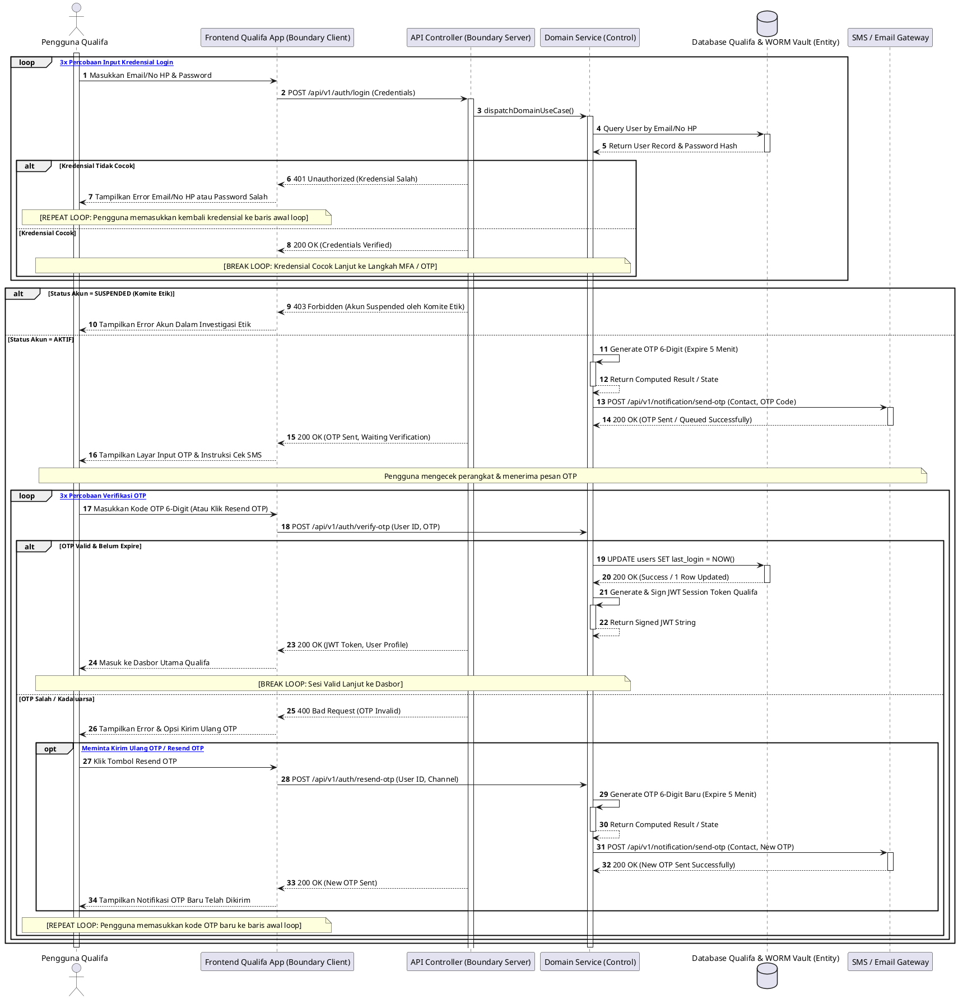
```plantuml
@startuml
autonumber
actor "Pengguna Qualifa" as User
participant "Frontend Qualifa App (Boundary Client)" as B_FE
participant "API Controller (Boundary Server)" as B_BE
participant "Domain Service (Control)" as C_Svc
participant "Backend Independen Qualifa" as C_Svc
database "Database Qualifa & WORM Vault (Entity)" as E_DB
participant "SMS / Email Gateway" as SMS

activate User
loop [Maksimal 3x Percobaan Input Kredensial Login]
    User -> B_FE : Masukkan Email/No HP & Password
    B_FE -> B_BE ++ : POST /api/v1/auth/login (Credentials)
    B_BE -> C_Svc ++ : dispatchDomainUseCase()

    C_Svc -> E_DB ++ : Query User by Email/No HP
    E_DB --> C_Svc -- : Return User Record & Password Hash

    alt Kredensial Tidak Cocok
        B_BE --> B_FE : 401 Unauthorized (Kredensial Salah)
        B_FE --> User : Tampilkan Error Email/No HP atau Password Salah
        note over User, B_FE : [REPEAT LOOP: Pengguna memasukkan kembali kredensial ke baris awal loop]
    else Kredensial Cocok
        B_BE --> B_FE : 200 OK (Credentials Verified)
        note over User, C_Svc : [BREAK LOOP: Kredensial Cocok Lanjut ke Langkah MFA / OTP]
    end
end

alt Status Akun = SUSPENDED (Komite Etik)
    B_BE --> B_FE : 403 Forbidden (Akun Suspended oleh Komite Etik)
    B_FE --> User : Tampilkan Error Akun Dalam Investigasi Etik
else Status Akun = AKTIF
    C_Svc -> C_Svc ++ : Generate OTP 6-Digit (Expire 5 Menit)
    C_Svc --> C_Svc -- : Return Computed Result / State
    C_Svc -> SMS ++ : POST /api/v1/notification/send-otp (Contact, OTP Code)
    SMS --> C_Svc -- : 200 OK (OTP Sent / Queued Successfully)
    B_BE --> B_FE : 200 OK (OTP Sent, Waiting Verification)
    B_FE --> User : Tampilkan Layar Input OTP & Instruksi Cek SMS
    note over User, SMS : Pengguna mengecek perangkat & menerima pesan OTP
    
    loop [Maksimal 3x Percobaan Verifikasi OTP]
        User -> B_FE : Masukkan Kode OTP 6-Digit (Atau Klik Resend OTP)
        B_FE -> C_Svc : POST /api/v1/auth/verify-otp (User ID, OTP)
        
        alt OTP Valid & Belum Expire
            C_Svc -> E_DB ++ : UPDATE users SET last_login = NOW()
            E_DB --> C_Svc -- : 200 OK (Success / 1 Row Updated)
            C_Svc -> C_Svc ++ : Generate & Sign JWT Session Token Qualifa
            C_Svc --> C_Svc -- : Return Signed JWT String
            B_BE --> B_FE : 200 OK (JWT Token, User Profile)
            B_FE --> User : Masuk ke Dasbor Utama Qualifa
            note over User, C_Svc : [BREAK LOOP: Sesi Valid Lanjut ke Dasbor]
        else OTP Salah / Kadaluarsa
            B_BE --> B_FE : 400 Bad Request (OTP Invalid)
            B_FE --> User : Tampilkan Error & Opsi Kirim Ulang OTP
            
            opt [Pengguna Meminta Kirim Ulang OTP / Resend OTP]
                User -> B_FE : Klik Tombol Resend OTP
                B_FE -> C_Svc : POST /api/v1/auth/resend-otp (User ID, Channel)
                C_Svc -> C_Svc ++ : Generate OTP 6-Digit Baru (Expire 5 Menit)
                C_Svc --> C_Svc -- : Return Computed Result / State
                C_Svc -> SMS ++ : POST /api/v1/notification/send-otp (Contact, New OTP)
                SMS --> C_Svc -- : 200 OK (New OTP Sent Successfully)
                B_BE --> B_FE : 200 OK (New OTP Sent)
                B_FE --> User : Tampilkan Notifikasi OTP Baru Telah Dikirim
            end
            note over User, B_FE : [REPEAT LOOP: Pengguna memasukkan kode OTP baru ke baris awal loop]
        end
    end
end
deactivate C_Svc
deactivate B_FE
deactivate User
@enduml
```

---

### SD-Q-03: Sesi Konseling Klinis & Pembayaran (Q-UC03, Q-UC04, Q-UC05, Q-UC10)
*Sequence diagram reservasi psikolog, pembayaran konseling, pelaksanaan sesi terapi (chat/audio/video), dan penyelesaian sesi dengan spesifikasi eksekusi aktif (activation bars).*

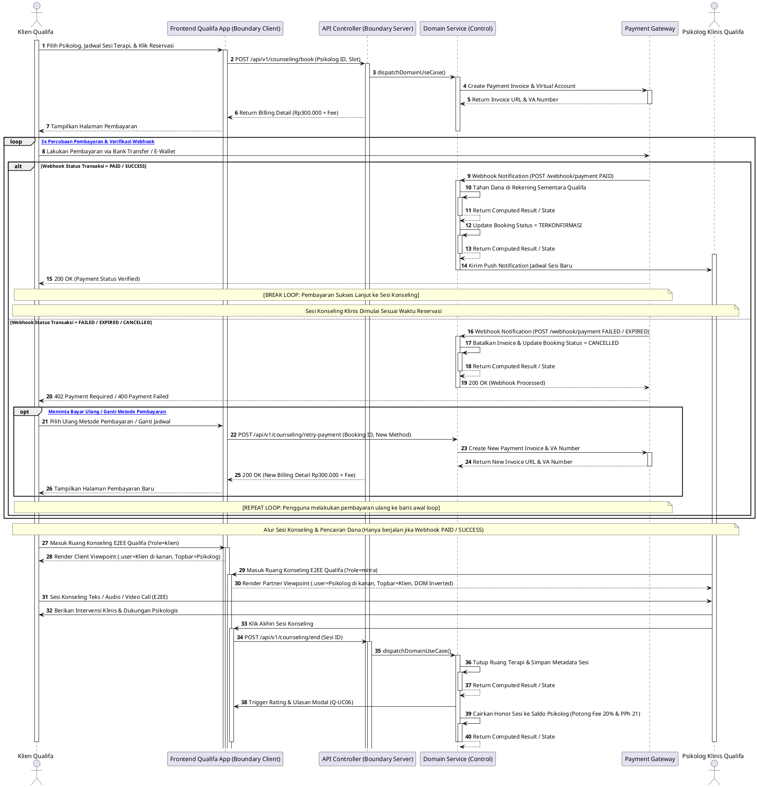
```plantuml
@startuml
autonumber
actor "Klien Qualifa" as Klien
participant "Frontend Qualifa App (Boundary Client)" as B_FE
participant "API Controller (Boundary Server)" as B_BE
participant "Domain Service (Control)" as C_Svc
participant "Backend Independen Qualifa" as C_Svc
participant "Payment Gateway" as PG
actor "Psikolog Klinis Qualifa" as Mitra

activate Klien
Klien -> B_FE ++ : Pilih Psikolog, Jadwal Sesi Terapi, & Klik Reservasi
B_FE -> B_BE ++ : POST /api/v1/counseling/book (Psikolog ID, Slot)
    B_BE -> C_Svc ++ : dispatchDomainUseCase()
C_Svc -> PG ++ : Create Payment Invoice & Virtual Account
PG --> C_Svc -- : Return Invoice URL & VA Number
B_BE --> B_FE : Return Billing Detail (Rp300.000 + Fee)
B_FE --> Klien : Tampilkan Halaman Pembayaran
deactivate C_Svc

loop [Maksimal 3x Percobaan Pembayaran & Verifikasi Webhook]
    Klien -> PG : Lakukan Pembayaran via Bank Transfer / E-Wallet

    alt Webhook Status Transaksi = PAID / SUCCESS
        PG -> C_Svc ++ : Webhook Notification (POST /webhook/payment PAID)
        C_Svc -> C_Svc ++ : Tahan Dana di Rekening Sementara Qualifa
        C_Svc --> C_Svc -- : Return Computed Result / State
        C_Svc -> C_Svc ++ : Update Booking Status = TERKONFIRMASI
        C_Svc --> C_Svc -- : Return Computed Result / State
        activate Mitra
        C_Svc -> Mitra : Kirim Push Notification Jadwal Sesi Baru
        deactivate C_Svc
        PG --> Klien : 200 OK (Payment Status Verified)
        note over Klien, PG : [BREAK LOOP: Pembayaran Sukses Lanjut ke Sesi Konseling]
        
        note over Klien, Mitra : Sesi Konseling Klinis Dimulai Sesuai Waktu Reservasi
    else Webhook Status Transaksi = FAILED / EXPIRED / CANCELLED
        PG -> C_Svc ++ : Webhook Notification (POST /webhook/payment FAILED / EXPIRED)
        C_Svc -> C_Svc ++ : Batalkan Invoice & Update Booking Status = CANCELLED
        C_Svc --> C_Svc -- : Return Computed Result / State
        C_Svc --> PG -- : 200 OK (Webhook Processed)
        PG --> Klien : 402 Payment Required / 400 Payment Failed
        
        opt [Pengguna Meminta Bayar Ulang / Ganti Metode Pembayaran]
            Klien -> B_FE : Pilih Ulang Metode Pembayaran / Ganti Jadwal
            B_FE -> C_Svc : POST /api/v1/counseling/retry-payment (Booking ID, New Method)
            C_Svc -> PG ++ : Create New Payment Invoice & VA Number
            PG --> C_Svc -- : Return New Invoice URL & VA Number
            B_BE --> B_FE : 200 OK (New Billing Detail Rp300.000 + Fee)
            B_FE --> Klien : Tampilkan Halaman Pembayaran Baru
        end
        note over Klien, PG : [REPEAT LOOP: Pengguna melakukan pembayaran ulang ke baris awal loop]
    end
end

note over Klien, Mitra : Alur Sesi Konseling & Pencairan Dana (Hanya berjalan jika Webhook PAID / SUCCESS)
Klien -> B_FE ++ : Masuk Ruang Konseling E2EE Qualifa (?role=klien)
B_FE --> Klien : Render Client Viewpoint (.user=Klien di kanan, Topbar=Psikolog)
Mitra -> B_FE ++ : Masuk Ruang Konseling E2EE Qualifa (?role=mitra)
B_FE --> Mitra : Render Partner Viewpoint (.user=Psikolog di kanan, Topbar=Klien, DOM Inverted)
Klien -> Mitra : Sesi Konseling Teks / Audio / Video Call (E2EE)
Mitra -> Klien : Berikan Intervensi Klinis & Dukungan Psikologis

Mitra -> B_FE ++ : Klik Akhiri Sesi Konseling
B_FE -> B_BE ++ : POST /api/v1/counseling/end (Sesi ID)
    B_BE -> C_Svc ++ : dispatchDomainUseCase()
C_Svc -> C_Svc ++ : Tutup Ruang Terapi & Simpan Metadata Sesi
C_Svc --> C_Svc -- : Return Computed Result / State
C_Svc -> B_FE : Trigger Rating & Ulasan Modal (Q-UC06)
C_Svc -> C_Svc ++ : Cairkan Honor Sesi ke Saldo Psikolog (Potong Fee 20% & PPh 21)
C_Svc --> C_Svc -- : Return Computed Result / State
deactivate C_Svc
deactivate B_FE
deactivate Klien
deactivate Mitra
@enduml
```

---

### SD-Q-04: Mengatur Status Ketersediaan & Buffer 30 Mnt (Q-UC09)
*Sequence diagram pengaturan jadwal praktik psikolog dengan aturan wajib jeda istirahat emosional (buffer rule) 30 menit antar sesi dan tanpa toggle manual, dilengkapi spesifikasi eksekusi aktif (activation bars).*

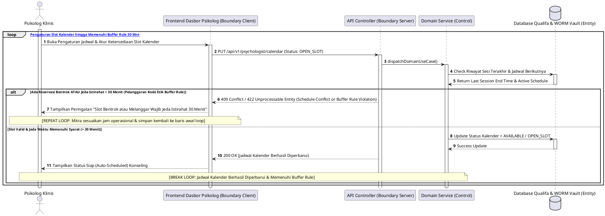
```plantuml
@startuml
autonumber
actor "Psikolog Klinis" as Mitra
participant "Frontend Dasbor Psikolog (Boundary Client)" as B_FE
participant "API Controller (Boundary Server)" as B_BE
participant "Domain Service (Control)" as C_Svc
participant "Backend Independen Qualifa" as C_Svc
database "Database Qualifa & WORM Vault (Entity)" as E_DB

activate Mitra
loop [Percobaan Pengaturan Slot Kalender hingga Memenuhi Buffer Rule 30 Mnt]
    Mitra -> B_FE ++ : Buka Pengaturan Jadwal & Atur Ketersediaan Slot Kalender
    B_FE -> B_BE ++ : PUT /api/v1/psychologist/calendar (Status: OPEN_SLOT)
    B_BE -> C_Svc ++ : dispatchDomainUseCase()

    C_Svc -> E_DB ++ : Check Riwayat Sesi Terakhir & Jadwal Berikutnya
    E_DB --> C_Svc -- : Return Last Session End Time & Active Schedule

    alt Ada Reservasi Bentrok ATAU Jeda Istirahat < 30 Menit (Pelanggaran Kode Etik Buffer Rule)
        B_BE --> B_FE : 409 Conflict / 422 Unprocessable Entity (Schedule Conflict or Buffer Rule Violation)
        B_FE --> Mitra : Tampilkan Peringatan "Slot Bentrok atau Melanggar Wajib Jeda Istirahat 30 Menit"
        note over Mitra, B_FE : [REPEAT LOOP: Mitra sesuaikan jam operasional & simpan kembali ke baris awal loop]
    else Slot Valid & Jeda Waktu Memenuhi Syarat (> 30 Menit)
        C_Svc -> E_DB ++ : Update Status Kalender = AVAILABLE / OPEN_SLOT
        E_DB --> C_Svc -- : Success Update
        B_BE --> B_FE : 200 OK (Jadwal Kalender Berhasil Diperbarui)
        B_FE --> Mitra : Tampilkan Status Siap (Auto-Scheduled) Konseling
        note over Mitra, C_Svc : [BREAK LOOP: Jadwal Kalender Berhasil Diperbarui & Memenuhi Buffer Rule]
    end
end
deactivate C_Svc
deactivate B_FE
deactivate Mitra
@enduml
```

---

### SD-Q-05: Mengisi Jurnal Mood Tracker Harian Proactive Alert (Q-UC13)
*Sequence diagram pengisian jurnal emosi harian yang dilengkapi sistem pendeteksi risiko penurunan kesehatan mental otomatis dengan spesifikasi eksekusi aktif (activation bars).*

```plantuml
@startuml
autonumber
actor "Klien Qualifa" as Klien
participant "Frontend Qualifa App (Boundary Client)" as B_FE
participant "API Controller (Boundary Server)" as B_BE
participant "Domain Service (Control)" as C_Svc
participant "Backend Independen Qualifa" as C_Svc
database "Database Qualifa & WORM Vault (Entity)" as E_DB
participant "Wellness Alert Engine" as Alert

activate Klien
Klien -> B_FE ++ : Pilih Emotikon Emosi, Pemicu, & Tulis Jurnal Harian
B_FE -> B_BE ++ : POST /api/v1/wellness/mood-tracker (Mood Score, Notes)
    B_BE -> C_Svc ++ : dispatchDomainUseCase()
C_Svc -> E_DB ++ : Simpan Catatan Jurnal & Update Riwayat Emosi
E_DB --> C_Svc -- : Return Last 7 Days Mood Trend

C_Svc -> C_Svc ++ : Analisis Tren Emosi 7 Hari Terakhir
C_Svc --> C_Svc -- : Return Computed Result / State
alt Terdeteksi Tren Sedih / Cemas Ekstrem 5 Hari Beruntun
    C_Svc -> Alert ++ : Trigger Proactive Wellness Alert
    Alert -> Alert ++ : Generate Rekomendasi Psikoedukasi & Bantuan Klinis
    Alert --> Alert -- : 200 OK (Service Response / Executed)
    Alert --> B_FE : Push Alert pop-up & Bantuan Konseling Prioritas
    Alert --> C_Svc -- : 200 OK (Service Response / Executed)
    B_FE --> Klien : Munculkan Peringatan Lembut & Saran Konseling
else Tren Emosi Stabil / Normal
    B_BE --> B_FE : 200 OK (Jurnal Berhasil Disimpan)
    B_FE --> Klien : Perbarui Grafik Mood di Dasbor Klien
end
deactivate C_Svc
deactivate B_FE
deactivate Klien
@enduml
```

---

### SD-Q-06: Mengakses Streaming Audio Meditasi & Relaksasi (Q-UC14)
*Sequence diagram pemutaran trek audio terapi relaksasi dengan penyesuaian kualitas bitrate adaptif dan spesifikasi eksekusi aktif (activation bars).*

```plantuml
@startuml
autonumber
actor "Klien Qualifa" as Klien
participant "Frontend Qualifa App (Boundary Client)" as B_FE
participant "API Controller (Boundary Server)" as B_BE
participant "Domain Service (Control)" as C_Svc
participant "Backend Independen Qualifa" as C_Svc
participant "Media CDN Server" as CDN
database "Database Qualifa & WORM Vault (Entity)" as E_DB

activate Klien
Klien -> B_FE ++ : Buka Menu Relaksasi & Pilih Trek Audio Meditasi
B_FE -> B_BE ++ : GET /api/v1/wellness/meditation/stream (Track ID, Bandwidth)
    B_BE -> C_Svc ++ : dispatchDomainUseCase()
C_Svc -> C_Svc ++ : Evaluate Client Bandwidth & Network Speed
C_Svc --> C_Svc -- : Return Computed Result / State

alt Koneksi Cepat / Wi-Fi
    C_Svc -> CDN ++ : Request High Quality Audio URL (320 kbps)
    CDN --> C_Svc -- : Return CDN Secure Stream URL (HQ)
else Koneksi Seluler / Lambat
    C_Svc -> CDN ++ : Request Adaptive Smooth Audio URL (128 kbps)
    CDN --> C_Svc -- : Return CDN Secure Stream URL (Smooth)
end

C_Svc -> E_DB ++ : Log Exercise Activity Start
E_DB --> C_Svc -- : 200 OK (Success / Rows Affected)
C_Svc --> B_BE -- : DomainResultDTO
    B_BE --> B_FE -- : 200 OK (Stream URL)
B_FE -> CDN ++ : Start Audio Streaming
B_FE --> Klien : Putar Audio Meditasi & Tampilkan Timer Relaksasi
CDN --> B_FE -- : 200 OK (Service Response / Executed)
deactivate Klien
@enduml
```

---

### SD-Q-07: Mengisi Asesmen DASS-21 & Protokol Crisis Button 119 (Q-UC15)
*Sequence diagram pengisian tes stres klinis DASS-21 yang memicu protokol kedaruratan bunuh diri/krisis 119 jika skor berada pada tingkat bahaya ekstrem dengan spesifikasi eksekusi aktif (activation bars).*

```plantuml
@startuml
autonumber
actor "Klien Qualifa" as Klien
participant "Frontend Qualifa App (Boundary Client)" as B_FE
participant "API Controller (Boundary Server)" as B_BE
participant "Domain Service (Control)" as C_Svc
participant "Backend Independen Qualifa" as C_Svc
database "Database Qualifa & WORM Vault (Entity)" as E_DB
participant "Emergency Crisis System" as Crisis

activate Klien
Klien -> B_FE ++ : Isi 21 Pertanyaan Asesmen DASS-21 & Submit
B_FE -> B_BE ++ : POST /api/v1/assessment/dass21 (Responses Array)
    B_BE -> C_Svc ++ : dispatchDomainUseCase()
C_Svc -> C_Svc ++ : Hitung Skor Sub-Skala Depresi, Anxiety, & Stress
C_Svc --> C_Svc -- : Return Computed Result / State
C_Svc -> E_DB ++ : Simpan Hasil Skor Asesmen di Profil Klinis Klien
E_DB --> C_Svc -- : 200 OK (Success / Rows Affected)

alt Skor Depresi / Anxiety = EXTREME (Risk of Self-Harm)
    C_Svc -> Crisis ++ : Trigger Emergency 119 Crisis Protocol (User ID)
    Crisis -> Crisis ++ : Notify Registered Emergency Family Contact
    Crisis --> Crisis -- : 200 OK (Service Response / Executed)
    Crisis --> C_Svc -- : Protocol Triggered Successfully
    B_BE --> B_FE : 200 OK (Result: EXTREME, Trigger Red Alert)
    B_FE --> Klien : Tampilkan Layar Darurat Merah & Tombol Hotline Krisis 119
else Skor Normal / Sedang / Ringan
    B_BE --> B_FE : 200 OK (Result: Normal/Moderate, Education Suggestions)
    B_FE --> Klien : Tampilkan Hasil Asesmen & Saran Artikel Kesehatan Mental
end
deactivate C_Svc
deactivate B_FE
deactivate Klien
@enduml
```

---

### SD-Q-08: Membuat Catatan Terapi DAP Note & Worksheet CCBT (Q-UC11, Q-UC12)
*Sequence diagram pembuatan catatan klinis metode DAP (Data, Assessment, Plan) dan penugasan lembar kerja terapi perilaku kognitif (CCBT) dengan spesifikasi eksekusi aktif (activation bars).*

```plantuml
@startuml
autonumber
actor "Psikolog Klinis" as Mitra
participant "Frontend Dasbor Psikolog (Boundary Client)" as B_FE
participant "API Controller (Boundary Server)" as B_BE
participant "Domain Service (Control)" as C_Svc
participant "Backend Independen Qualifa" as C_Svc
database "Database Qualifa (Encrypted) & WORM Vault (Entity)" as E_DB
actor "Klien Qualifa" as Klien

activate Mitra
Mitra -> B_FE ++ : Buat Catatan DAP Note & Pilih Tugas Worksheet CCBT
B_FE -> B_BE ++ : POST /api/v1/psychologist/clinical-notes (Sesi ID, DAP Payload)
    B_BE -> C_Svc ++ : dispatchDomainUseCase()
C_Svc -> C_Svc ++ : Enkripsi Catatan Klinis dengan Field-Level Encryption
C_Svc --> C_Svc -- : Return Computed Result / State
C_Svc -> E_DB ++ : Simpan Catatan DAP Note di Arsip Rahasia Klien
E_DB --> C_Svc -- : Save Confirmed

alt Psikolog Memberikan Tugas CCBT Worksheet
    Mitra -> B_FE : Assign Worksheet (Thought Record / Behavioral Activation)
    B_FE -> C_Svc : POST /api/v1/counseling/ccbt/assign (Sesi ID, Template ID)
    C_Svc -> E_DB ++ : Simpan Tugas di Dasbor Klien
    E_DB --> C_Svc -- : 200 OK (Success / Rows Affected)
activate Klien
    C_Svc -> Klien ++ : Kirim Push Notification Tugas CCBT Baru
    B_BE --> B_FE : 201 Created (Tugas Terkirim ke Klien)
else Tanpa Tugas CCBT
    B_BE --> B_FE : 201 Created (Catatan DAP Note Tersimpan)
end

B_FE --> Mitra : Tampilkan Konfirmasi Sukses Pengarsipan Klinis
deactivate C_Svc
deactivate Klien
deactivate Mitra
@enduml
```

---

### SD-Q-09: Verifikasi STR/HIMPSI & Moderasi Komite Etik Admin Qualifa (Q-UC16, Q-UC17)
*Sequence diagram audit keabsahan surat tanda registrasi psikolog klinis serta penanganan laporan kode etik dengan spesifikasi eksekusi aktif (activation bars).*

```plantuml
@startuml
autonumber
actor "Admin Qualifa" as Admin
participant "Panel Admin Qualifa" as B_FE
participant "Backend Independen Qualifa" as C_Svc
database "Database Qualifa & WORM Vault (Entity)" as E_DB
participant "Pangkalan Data HIMPSI / STR" as HIMPSI
actor "Psikolog Terlapor / Pendaftar" as Mitra

activate Admin
Admin -> B_FE ++ : Buka Antrean Verifikasi Psikolog Baru
B_FE -> B_BE ++ : GET /api/v1/admin/audits/psychologists (Pending List)
    B_BE -> C_Svc ++ : dispatchDomainUseCase()
C_Svc --> B_BE -- : DomainResultDTO
    B_BE --> B_FE -- : Return Dokumen STR, SIPP, & Kartu HIMPSI
B_FE --> Admin : Tampilkan Dokumen STR & HIMPSI
Admin -> HIMPSI ++ : Cek Keabsahan STR & Status Keanggotaan HIMPSI
HIMPSI --> Admin : Hasil Verifikasi Status STR

alt STR Tidak Sah / Kadaluarsa
    Admin -> B_FE ++ : Tolak Verifikasi & Isi Alasan
    B_FE -> B_BE ++ : POST /api/v1/admin/audits/reject (Psychologist ID)
    B_BE -> C_Svc ++ : dispatchDomainUseCase()
    C_Svc -> E_DB ++ : Update Status = REJECTED
    E_DB --> C_Svc -- : 200 OK (Success / Rows Affected)
activate Mitra
    C_Svc -> Mitra ++ : Kirim Email Alasan Penolakan Kredensial
    B_BE --> B_FE : 200 OK (Status Rejected)
    B_FE --> Admin : Notifikasi Penolakan Terkirim
else STR Sah & Aktif
    Admin -> B_FE : Setujui Verifikasi
    B_FE -> C_Svc : POST /api/v1/admin/audits/approve (Psychologist ID)
    C_Svc -> E_DB ++ : Update Status = AKTIF / VERIFIED
    E_DB --> C_Svc -- : 200 OK (Success / Rows Affected)
    C_Svc -> Mitra ++ : Kirim Email Selamat Datang & Panduan Etik
    B_BE --> B_FE : 200 OK (Status Approved)
    B_FE --> Admin : Notifikasi Persetujuan Terkirim
    deactivate C_Svc
end

note over Admin, Mitra : Alur Pemeriksaan Pelanggaran Kode Etik / Malpraktik
Admin -> B_FE ++ : Proses Laporan Pelanggaran Etik & Klik Suspend
B_FE -> B_BE ++ : POST /api/v1/admin/ethics/suspend (Psychologist ID, Reason)
    B_BE -> C_Svc ++ : dispatchDomainUseCase()
C_Svc -> E_DB ++ : Update Status Akun = SUSPENDED (Investigasi Etik)
E_DB --> C_Svc -- : 200 OK (Success / Rows Affected)
C_Svc -> Mitra ++ : Kirim Surat Panggilan Klarifikasi Komite Etik Qualifa
C_Svc --> B_BE -- : DomainResultDTO
    B_BE --> B_FE -- : 200 OK (Account Suspended & Panggilan Terkirim)
B_FE --> Admin : Tampilkan Konfirmasi Suspend
deactivate Admin
deactivate Mitra
@enduml
```

---

### SD-Q-10: Pencairan Honor Psikolog & Perhitungan PPh 21 (Q-UC19)
*Sequence diagram penarikan honor sesi konseling klinis oleh psikolog dari dompet digital ke rekening bank, pemotongan pajak PPh 21 otomatis, dan auto-rollback jika transfer gagal dengan spesifikasi eksekusi aktif (activation bars).*

```plantuml
@startuml
autonumber
actor "Psikolog Klinis" as Mitra
participant "Frontend Dasbor Psikolog (Boundary Client)" as B_FE
participant "API Controller (Boundary Server)" as B_BE
participant "Domain Service (Control)" as C_Svc
participant "Backend Independen Qualifa" as C_Svc
participant "Payment Gateway Disbursement" as PG
database "WORM Hash Storage" as WORM

activate Mitra
Mitra -> B_FE ++ : Ajukan Pencairan Honor Sesi ke Rekening Bank
B_FE -> B_BE ++ : POST /api/v1/psychologist/payouts/withdraw (Amount, Bank Acc)
    B_BE -> C_Svc ++ : dispatchDomainUseCase()

C_Svc -> C_Svc ++ : Validasi Saldo Honor & Hitung Potongan Pajak PPh 21
C_Svc --> C_Svc -- : Return Computed Result / State
C_Svc -> PG ++ : POST /api/disbursement/transfer (Net Amount, Bank Detail)

alt Webhook Transfer SUCCESS
    PG --> C_Svc : Webhook SUCCESS (Status: SUCCESS, BankRefNumber)
    C_Svc -> C_Svc ++ : Kurangi Saldo Available Psikolog & Terbitkan Bukti Potong PPh 21
    C_Svc --> C_Svc -- : Return Computed Result / State
    C_Svc -> WORM ++ : Simpan SHA-256 Hash Log Transaksi & Audit PPh 21
    WORM --> C_Svc -- : Hash Written Permanently
    B_BE --> B_FE : 200 OK (Pencairan Honor Berhasil Diproses)
    B_FE --> Mitra : Tampilkan Resi Transfer & Detail Potongan Pajak
else Webhook Transfer FAILED / REJECTED
    PG --> C_Svc -- : Webhook FAILED (Status: FAILED, ErrorCode: "INVALID_ACCOUNT" | "BANK_OFFLINE")
    C_Svc -> C_Svc ++ : Rollback Saldo Available Psikolog (Saldo Kembali Utuh)
    C_Svc --> C_Svc -- : Return Computed Result / State
    C_Svc -> WORM ++ : Simpan SHA-256 Hash Log Kegagalan Transfer
    WORM --> C_Svc -- : Hash Written Permanently
    B_BE --> B_FE : 400 Bad Request (Transfer Gagal / Ditolak Bank)
    B_FE --> Mitra : Tampilkan Error: "Transfer Gagal [ErrorCode]. Saldo telah dikembalikan ke dompet Anda."
end
deactivate C_Svc
deactivate B_FE
deactivate Mitra
@enduml
```

---

### SD-Q-11: Memantau Laporan Keuangan Qualifa & Audit WORM (Q-UC18)
*Sequence diagram pengawasan buku besar honorarium, verifikasi bagi hasil platform (20%/80%), dan eksport bukti pajak PPh 21 ber-hash WORM SHA-256 oleh Admin Qualifa dengan spesifikasi eksekusi aktif (activation bars).*

```plantuml
@startuml
autonumber
actor "Admin Qualifa" as Admin
participant "Portal Backoffice Admin" as B_FE
participant "Backend Independen Qualifa" as C_Svc
database "Database Qualifa & WORM Vault (Entity)" as E_DB
database "WORM Hash Storage" as WORM

activate Admin
Admin -> B_FE ++ : Buka Modul Keuangan & Buku Besar Honorarium
B_FE -> B_BE ++ : GET /api/v1/admin/finance/honorarium-ledger?startDate=X&endDate=Y
    B_BE -> C_Svc ++ : dispatchDomainUseCase()
C_Svc -> E_DB ++ : Query Rekapitulasi Saldo & Bagi Hasil (20%/80%)
E_DB --> C_Svc -- : Return Financial Records
C_Svc -> WORM ++ : Validasi Integritas Hash SHA-256 Transaksi
WORM --> C_Svc -- : Return Hash Validation Status
C_Svc --> B_BE -- : DomainResultDTO
    B_BE --> B_FE -- : 200 OK (Data Ledger & Status Hash Valid)
B_FE --> Admin : Tampilkan Tabel Laporan Keuangan Honorarium & PPh 21

opt Unduh Bukti Rekap PPh 21 & Hash Audit
    Admin -> B_FE ++ : Klik Unduh Laporan Rekap PPh 21
    B_FE -> B_BE ++ : GET /api/v1/admin/finance/export-tax-report
    B_BE -> C_Svc ++ : dispatchDomainUseCase()
    C_Svc -> C_Svc ++ : Generate Dokumen PDF/Excel dengan Digital Signature SHA-256
    C_Svc --> C_Svc -- : Return Computed Result / State
    C_Svc --> B_BE -- : DomainResultDTO
    B_BE --> B_FE -- : 200 OK (File Export Ready)
    B_FE --> Admin : Download File Laporan Rekapitulasi Pajak
end
deactivate Admin
@enduml
```

---

### SD-Q-20: Autentikasi Portal Backoffice Admin Qualifa (TOTP 2FA - Q-UC20)
*Sequence diagram alur autentikasi tingkat lanjut untuk Admin Qualifa melalui portal backoffice terisolasi (`admin.qualifa.com`) dengan IP Whitelisting, verifikasi kredensial internal, dan otentikasi ganda TOTP Authenticator dengan spesifikasi eksekusi aktif (activation bars).*

```plantuml
@startuml
title Sequence Diagram: SD-Q-20 - Autentikasi Portal Backoffice Admin Qualifa (TOTP 2FA - Q-UC20)
autonumber
actor "Admin Qualifa" as Admin
participant "Portal Backoffice (`admin.qualifa.com`)" as B_FE
participant "IAM Gateway Qualifa" as IAM
database "IAM Database Qualifa" as E_DB
database "WORM Audit Storage Qualifa" as WORM

activate Admin
Admin -> B_FE ++ : Buka URL Portal Backoffice via VPN/ZTNA
B_FE -> IAM ++ : Verifikasi IP Address Pengakses (IP Whitelist Check)
IAM -> IAM ++ : Evaluasi IP terhadap Ruleset SOC Qualifa
IAM --> IAM -- : 200 OK (Token / State Verified)

alt IP Address Tidak Terdaftar (Unauthorized IP)
    IAM -> WORM ++ : Catat Peringatan SOC Keamanan Kritis (Unauthorized IP)
    WORM --> IAM -- : 200 OK (WORM Hash Stamped / Recorded)
    IAM --> B_FE : 403 Forbidden (Access Denied)
    B_FE --> Admin : Blokir Akses & Tampilkan Halaman Error 403
else IP Address Terdaftar di Whitelist
    IAM --> B_FE : 200 OK (Allow Form Login)
    B_FE --> Admin : Tampilkan Form Login Backoffice Psikologi
    Admin -> B_FE : Submit Email & Password Internal Qualifa
    B_FE -> IAM : POST /api/v1/admin/auth/login (Credentials)
    IAM -> E_DB ++ : Query Kredensial & Status Akun Admin Qualifa
    E_DB --> IAM -- : Return User Data & Password Hash
    
    alt Kredensial Tidak Valid / Akun Terkunci
        IAM -> WORM ++ : Catat Percobaan Login Gagal (Failed Attempt)
        WORM --> IAM -- : 200 OK (WORM Hash Stamped / Recorded)
        IAM --> B_FE : 401 Unauthorized (Kredensial Salah)
        B_FE --> Admin : Tampilkan Error "Kredensial Tidak Valid"
    else Kredensial Valid
        IAM --> B_FE : 200 OK (Require TOTP 2FA Verification)
        B_FE --> Admin : Tampilkan Permintaan Kode TOTP 2FA
        Admin -> B_FE : Input 6 Digit Kode dari Aplikasi Authenticator
        B_FE -> IAM : POST /api/v1/admin/auth/verify-totp (TOTP Code, Session ID)
        IAM -> IAM ++ : Verifikasi Algoritma TOTP (Time-step Check)
        IAM --> IAM -- : 200 OK (Token / State Verified)
        
        alt Kode TOTP Salah / Kadaluarsa
            IAM -> WORM ++ : Catat Anomali Kegagalan TOTP SOC Qualifa
            WORM --> IAM -- : 200 OK (WORM Hash Stamped / Recorded)
            IAM --> B_FE : 401 Unauthorized (TOTP Invalid)
            B_FE --> Admin : Tampilkan Error "Kode TOTP Tidak Valid"
        else Kode TOTP Valid
            IAM -> IAM ++ : Generate Cryptographic JWT Session Token
            IAM --> IAM -- : 200 OK (Token / State Verified)
            IAM -> WORM ++ : Catat Log Autentikasi Sukses (Timestamp, IP, Role)
            WORM --> IAM -- : 200 OK (WORM Hash Stamped / Recorded)
            IAM --> B_FE : 200 OK (Return JWT Token & Admin Profile)
            B_FE --> Admin : Redirect ke Dasbor Admin Utama Qualifa (`SCR-QLF-07`)
        end
    end
end
IAM --> B_FE -- : 200 OK (Token / State Verified)
deactivate B_FE
deactivate Admin
@enduml
```

---

