# Kumpulan Kode PlantUML: Sequence Diagrams - Component-Level 5-Lifeline BCE Architecture (Justifiqa & Qualifa)

Dokumen ini berisi kumpulan kode PlantUML untuk seluruh Sequence Diagram pada dua aplikasi mandiri yang **100% terisolasi dan berdiri sendiri (*Siloed Architecture*)**: **Justifiqa** (Domain Hukum) dan **Qualifa** (Domain Psikologi).

Seluruh diagram menerapkan standar arsitektur terdekopel **Boundary-Control-Entity (BCE) 5-Lifeline Supremacy** dan dipetakan **1-to-1 100% dengan Activity Diagram**:
1. **Actor**: Pengguna / Pemicu eksternal.
2. **Boundary Client (`B_FE`)**: Frontend SPA/Mobile App (menangani interaksi UI & client-side DLP regex).
3. **Boundary Server (`B_BE`)**: API Controller / Gateway (`POST/GET /api/v2/...`, memverifikasi auth JWT, validasi skema JSON DTO, dan mengembalikan HTTP Status Code presisi).
4. **Control (`C_Svc`)**: Domain Application Service / Orchestrator (otak logika bisnis, kalkulasi SLA Fair-Clock, verifikasi SIPP/STR, KMS e-Meterai, dan arbitrase Escrow).
5. **Entity (`E_DB`)**: Persistent Storage & Immutable Ledger (PostgreSQL DB + WORM SHA-256 Vault).

Penomoran diagram telah distandarisasi untuk mencerminkan arsitektur terisolasi dan bersesuaian 1-to-1 dengan Activity Diagram: **`SD-J-xx`** untuk Justifiqa dan **`SD-Q-xx`** untuk Qualifa.

---

## Cara Import ke Draw.io
1. Buka Draw.io (`app.diagrams.net`).
2. Pada toolbar bagian atas, klik tombol **+ (Insert)** atau pilih menu **Arrange -> Insert**.
3. Pilih **Advanced -> PlantUML...**.
4. Salin dan tempel kode di bawah ini, lalu klik **Insert**.

---

## BAGIAN I: SEQUENCE DIAGRAMS - APLIKASI MANDIRI JUSTIFIQA (DOMAIN HUKUM)
### SD-J-01: Registrasi Akun Klien & Advokat (J-UC01, J-UC07)
*Sequence diagram alur pendaftaran akun mandiri Klien (verifikasi NIK Dukcapil) dan Advokat/Notaris (verifikasi SIPP Peradi) di platform Justifiqa berbasis 5-Lifeline BCE (Sinkron 1-to-1 dengan AD-J-01).*

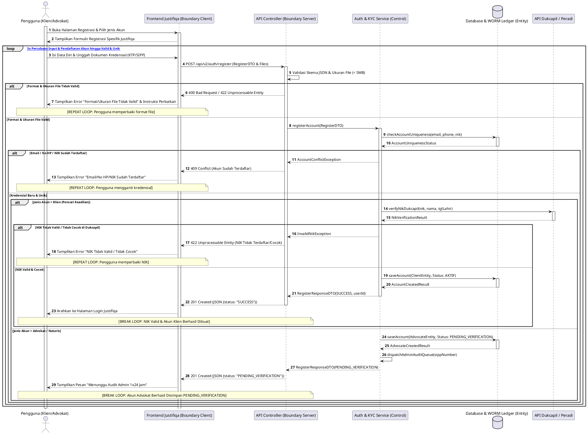

### SD-J-02: Login Akun Klien & Advokat (J-UC02, J-UC08)
*Sequence diagram alur masuk (login) independen beserta verifikasi Multi-Factor Authentication (MFA / 2FA) berbasis 5-Lifeline BCE (Sinkron 1-to-1 dengan AD-J-02).*

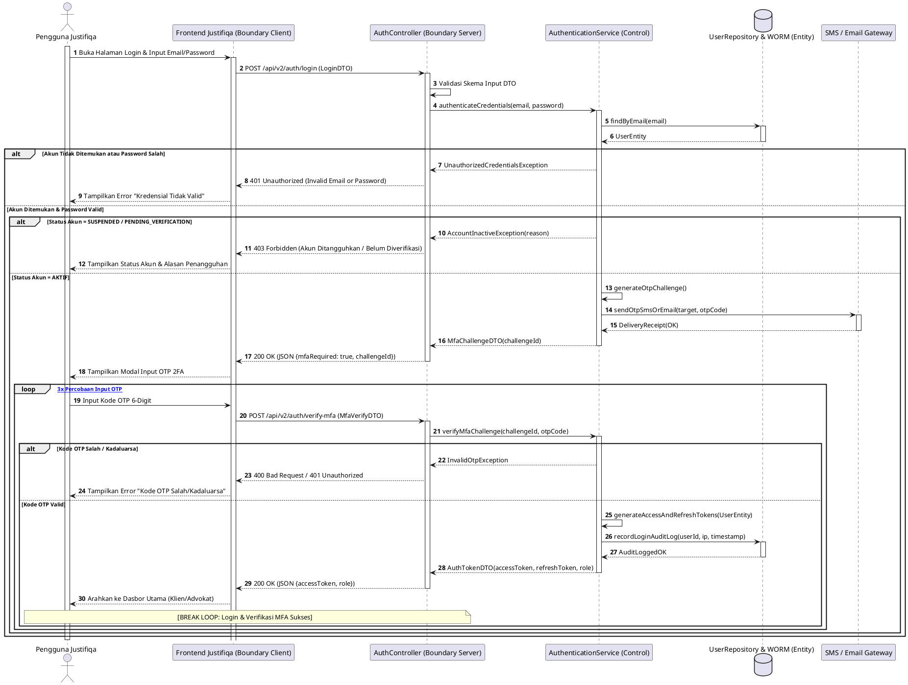

### SD-J-03: Konsultasi Hukum & Pembayaran Escrow (J-UC03, J-UC04, J-UC05, J-UC10)
*Sequence diagram alur pemesanan konsultasi hukum, percabangan Legal Triage Gratis 15 Menit vs Konsultasi Premium/Pro (Virtual Token / Split Payment / Escrow Tunai), dan pemantauan SLA Fair-Clock berbasis 5-Lifeline BCE (Sinkron 1-to-1 dengan AD-J-03).*

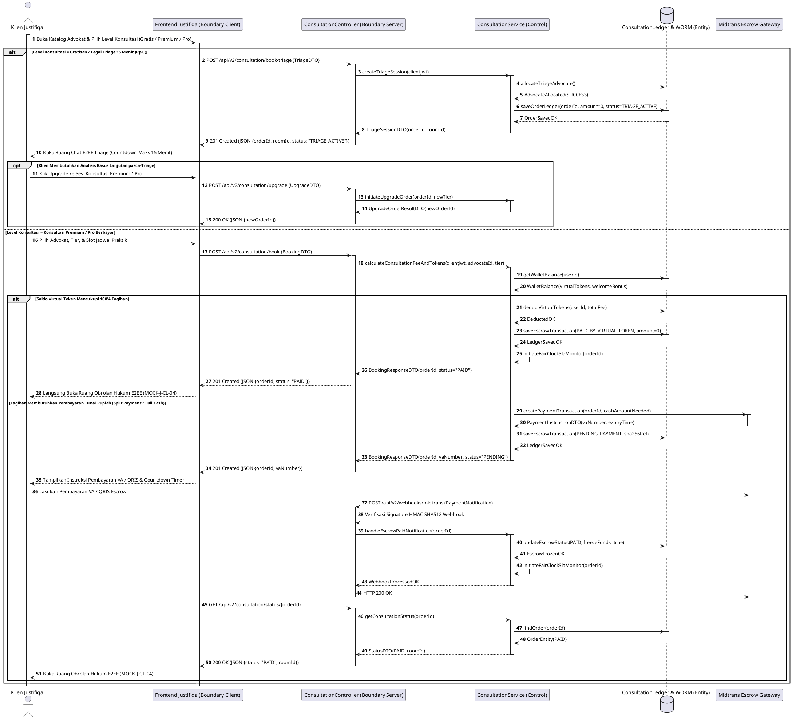

### SD-J-04: Mengatur Status Ketersediaan Praktik Advokat (J-UC09)
*Sequence diagram alur pengaturan slot sesi konsultasi, pengecekan bentrok jadwal, dan validasi kuota harian Advokat berbasis 5-Lifeline BCE (Sinkron 1-to-1 dengan AD-J-04).*

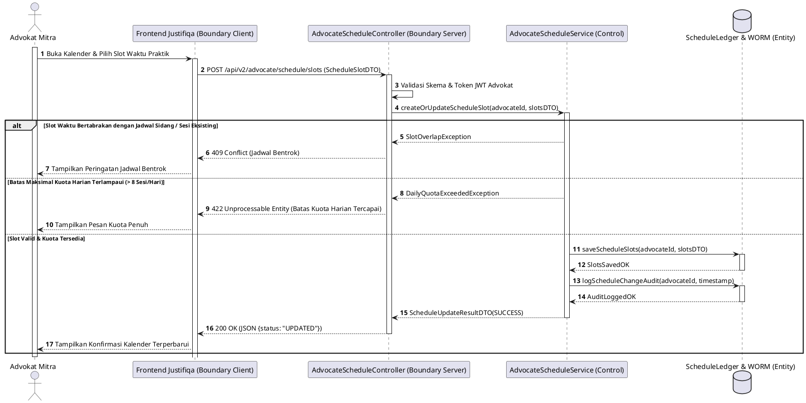

### SD-J-05: Mengunggah Berkas Perkara E2EE Zero-Knowledge (J-UC13)
*Sequence diagram alur pengunggahan dokumen berkas perkara klien terenkripsi AES-GCM lokal di browser berbasis 5-Lifeline BCE (Sinkron 1-to-1 dengan AD-J-05).*

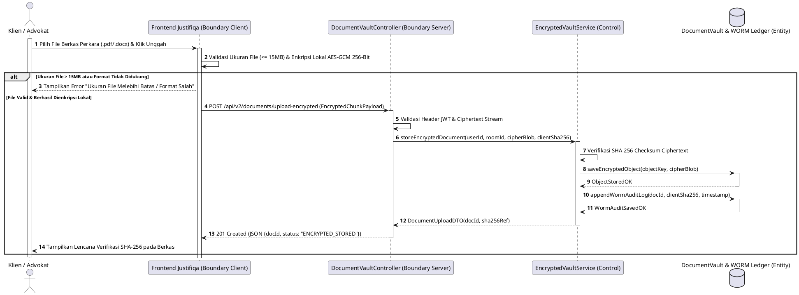

### SD-J-06: Membuat & Memfinalisasi Draf Kontrak Hukum Bermeterai KMS (J-UC12, J-UC14)
*Sequence diagram alur penyusunan draf hukum, pembubuhan e-Meterai KMS Peruri, dan verifikasi persetujuan klien berbasis 5-Lifeline BCE (Sinkron 1-to-1 dengan AD-J-06).*

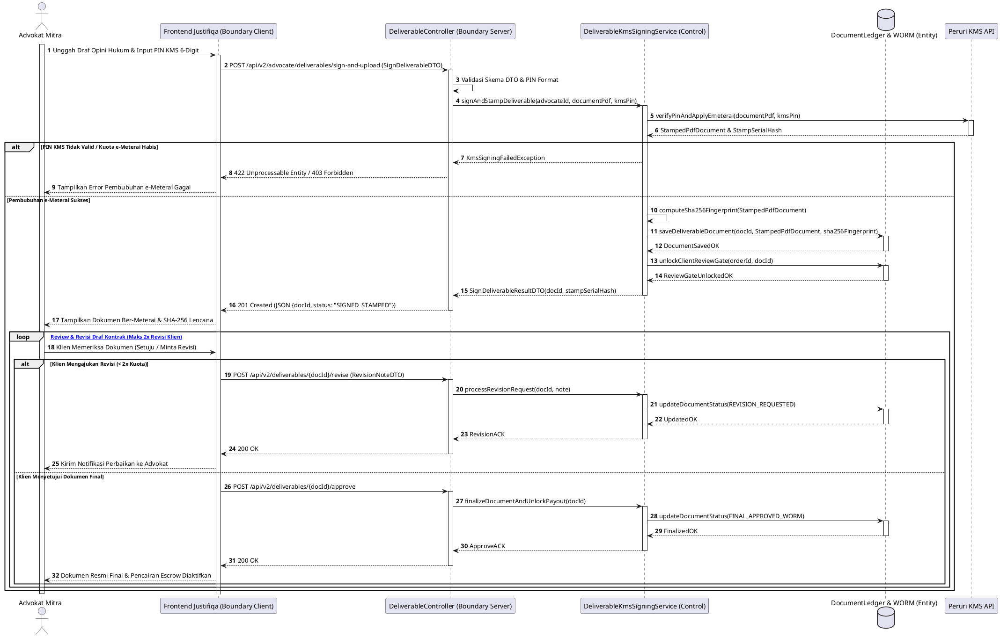

### SD-J-07: Konsultasi Pro Bono SKTM (J-UC15)
*Sequence diagram alur verifikasi NIK DTKS Kemensos dan pembukaan sesi konsultasi Pro Bono Rp 0 bersubsidi penuh berbasis 5-Lifeline BCE (Sinkron 1-to-1 dengan AD-J-07).*

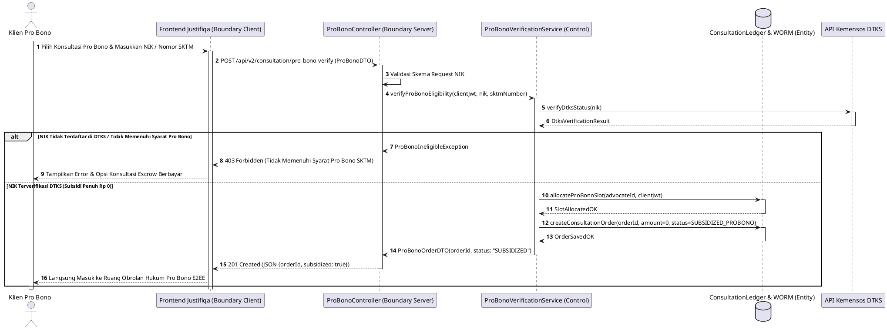

### SD-J-08: Membuat Catatan Sesi IRAC Note Advokat (J-UC11)
*Sequence diagram alur pencatatan opini hukum terstruktur IRAC (Issue, Rule, Analysis, Conclusion) oleh Advokat berbasis 5-Lifeline BCE (Sinkron 1-to-1 dengan AD-J-08).*

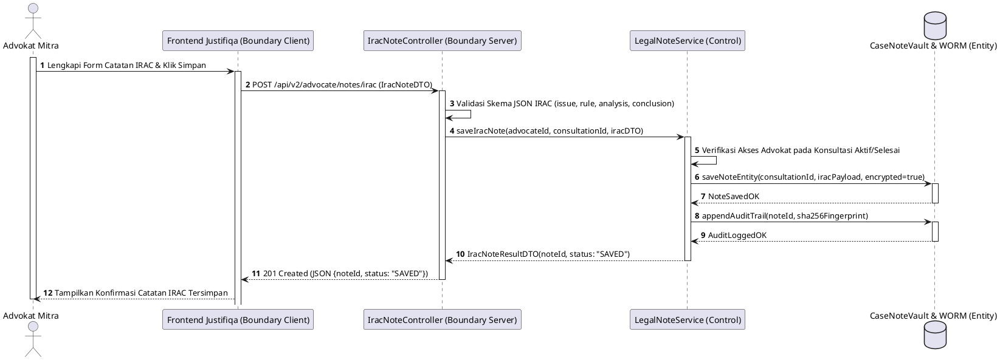

### SD-J-09: Verifikasi Kredensial & Sanitasi Profil/Media 3-Lapisan Advokat Mitra (J-UC16)
*Sequence diagram alur audit berkas lisensi Advokat oleh Admin & pemeriksaan otomatis SIPP MA berbasis 5-Lifeline BCE (Sinkron 1-to-1 dengan AD-J-09).*

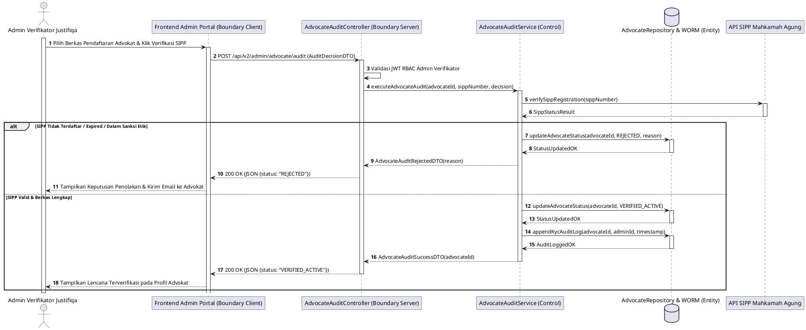

### SD-J-10: Moderasi Akun, Deteksi Fraud Perilaku, & Due Process Suspend Admin Justifiqa (J-UC17)
*Sequence diagram alur investigasi pelanggaran DLP/Etik dan penangguhan akun bersanksi berbasis 5-Lifeline BCE (Sinkron 1-to-1 dengan AD-J-10).*

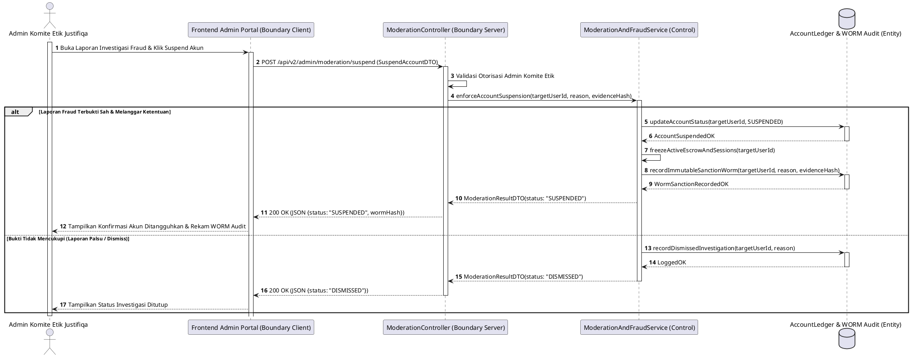

### SD-J-11: Pencairan Dana Escrow & Perhitungan PPh 21 Advokat (J-UC19)
*Sequence diagram alur penyelesaian sesi konsultasi, pemotongan PPh 21 otomatis, dan pencairan honor ke rekening Advokat berbasis 5-Lifeline BCE (Sinkron 1-to-1 dengan AD-J-11).*

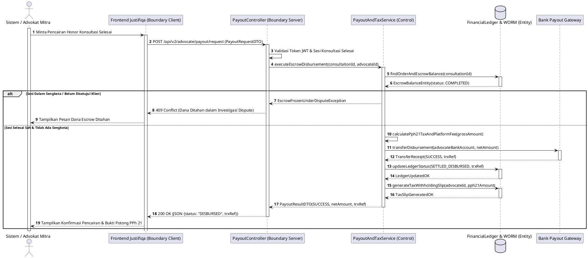

### SD-J-12: Memantau Laporan Keuangan Escrow & Audit WORM (J-UC18)
*Sequence diagram alur ekspor laporan audit finansial transparan berbasis kriptografi WORM SHA-256 berbasis 5-Lifeline BCE (Sinkron 1-to-1 dengan AD-J-12).*

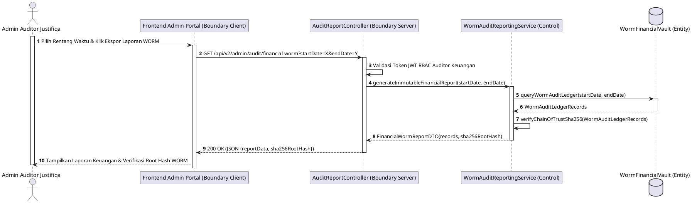

### SD-J-13: Memberikan Ulasan & Rating Advokat (J-UC06)
*Sequence diagram alur pemberian ulasan pasca-sesi konsultasi hukum berbasis 5-Lifeline BCE (Sinkron 1-to-1 dengan AD-J-13).*

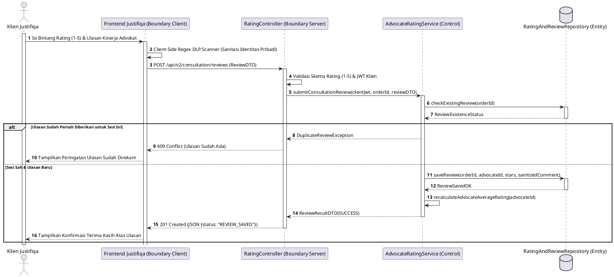

### SD-J-14: [DILEBUR KE DALAM SD-J-06]
*Catatan Arsitektur:* Alur finalisasi dokumen bermeterai telah dilebur secara utuh ke dalam **SD-J-06** (Sinkron 1-to-1 dengan AD-J-14).

### SD-J-21: Melaporkan Dugaan Pelanggaran Etik Advokat (J-UC21)
*Sequence diagram alur pelaporan whistleblowing / sengketa etika konsultasi hukum berbasis 5-Lifeline BCE (Sinkron 1-to-1 dengan AD-J-21).*

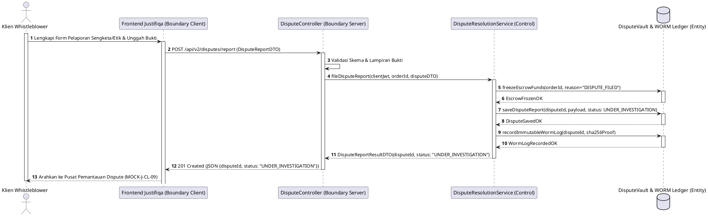

### SD-J-22: Mengisi Saldo Dompet Advokat (Top-Up / Cash-In - J-UC22)
*Sequence diagram alur penambahan saldo dompet Advokat untuk pembelian meterai/fitur premium berbasis 5-Lifeline BCE (Sinkron 1-to-1 dengan AD-J-22).*

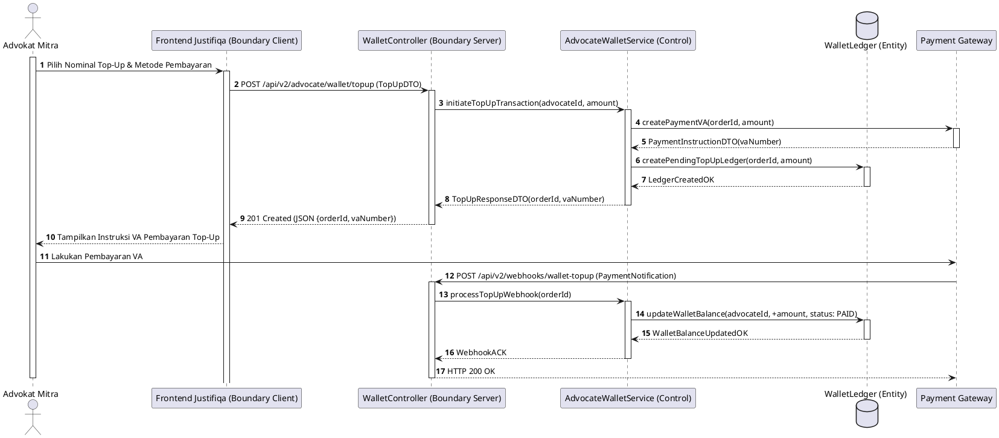

### SD-J-20: Autentikasi Portal Backoffice Admin Justifiqa (TOTP 2FA - J-UC20)
*Sequence diagram alur login aman Multi-Factor Authentication berbasis TOTP Authenticator untuk Admin Justifiqa berbasis 5-Lifeline BCE (Sinkron 1-to-1 dengan AD-J-20).*

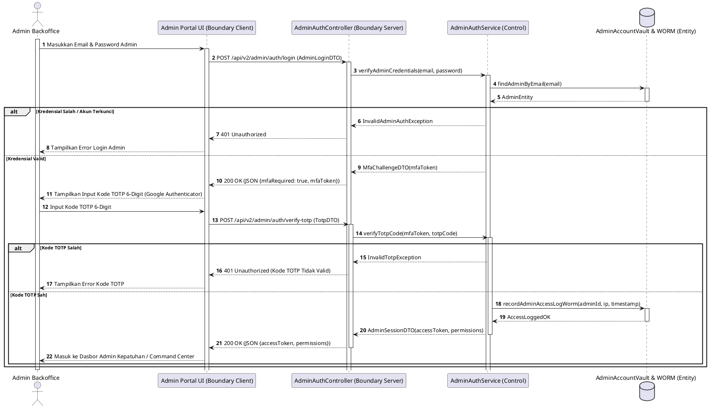


---

## BAGIAN II: SEQUENCE DIAGRAMS - APLIKASI MANDIRI QUALIFA (DOMAIN PSIKOLOGI)

### SD-Q-01: Registrasi Akun Klien & Psikolog Klinis (Q-UC01, Q-UC07)
*Sequence diagram alur pendaftaran akun Klien Klinis dan Psikolog Klinis (verifikasi STR HIMPSI / SATUSEHAT) berbasis 5-Lifeline BCE (Sinkron 1-to-1 dengan AD-Q-01).*

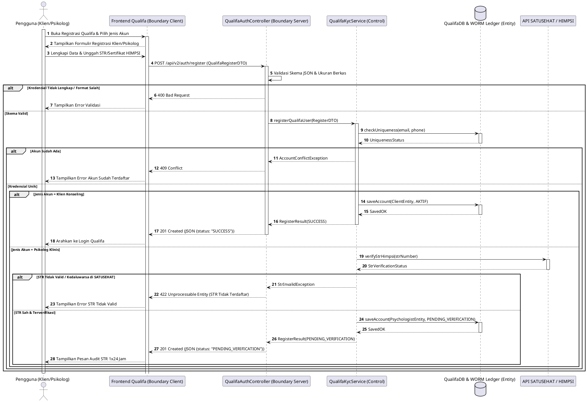

### SD-Q-02: Login Akun Klien & Psikolog Klinis (Q-UC02, Q-UC08)
*Sequence diagram alur login independen Qualifa dengan verifikasi MFA berbasis 5-Lifeline BCE (Sinkron 1-to-1 dengan AD-Q-02).*

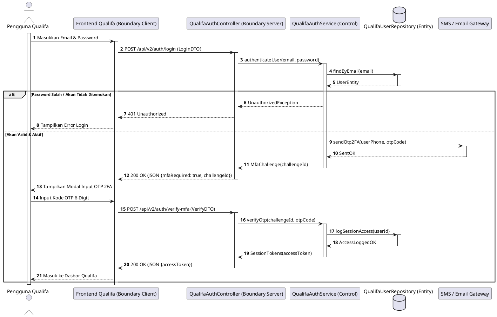

### SD-Q-03: Sesi Konseling Klinis & Pembayaran (Q-UC03, Q-UC04, Q-UC05, Q-UC10)
*Sequence diagram alur pemesanan konseling klinis, percabangan Sesi Crisis 119 Gratis vs Konseling Berbayar (Escrow/Voucher), dan pembukaan ruang obrolan E2EE berbasis 5-Lifeline BCE (Sinkron 1-to-1 dengan AD-Q-03).*

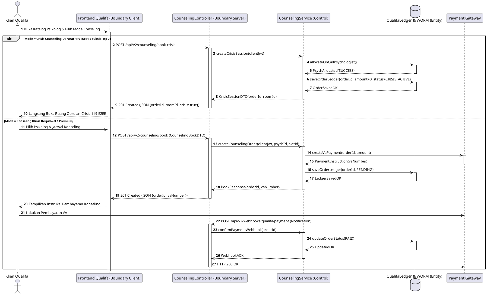

### SD-Q-04: Mengatur Status Ketersediaan & Buffer 30 Mnt (Q-UC09)
*Sequence diagram alur penjadwalan sesi psikolog dengan penegakan buffer waktu pemulihan mental minimal 30 menit antar-sesi berbasis 5-Lifeline BCE (Sinkron 1-to-1 dengan AD-Q-04).*

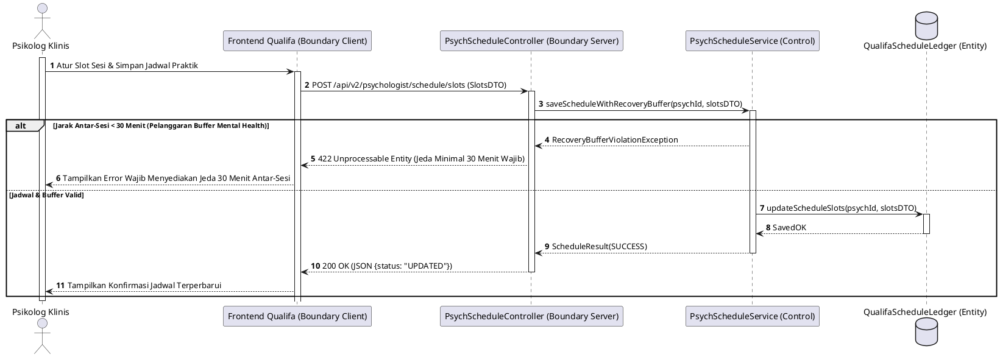

### SD-Q-05: Mengisi Jurnal Mood Tracker Harian Proactive Alert (Q-UC13)
*Sequence diagram alur pencatatan suasana hati (Mood Tracker) dengan peringatan dini otomatis berbasis 5-Lifeline BCE (Sinkron 1-to-1 dengan AD-Q-05).*

```plantuml
@startuml
autonumber
actor "Klien Qualifa" as User
participant "Frontend Qualifa (Boundary Client)" as B_FE
participant "MoodTrackerController (Boundary Server)" as B_BE
participant "MoodAssessmentService (Control)" as C_Svc
database "MoodLedger & AlertQueue (Entity)" as E_DB

activate User
User -> B_FE ++ : Pilih Skor Mood (1-5) & Tulis Jurnal Harian
B_FE -> B_BE ++ : POST /api/v2/mood/tracker (MoodEntryDTO)
B_BE -> C_Svc ++ : recordDailyMood(clientJwt, moodScore, journalText)
C_Svc -> E_DB ++ : saveMoodEntry(userId, score, text, timestamp)
E_DB --> C_Svc -- : EntrySavedOK

alt Mood Score <= 2 Berturut-turut 3 Hari (Crisis Trigger)
    C_Svc -> E_DB ++ : dispatchCrisisAlertQueue(userId)
    E_DB --> C_Svc -- : AlertQueuedOK
    C_Svc --> B_BE : MoodResult(SAVED_WITH_CRISIS_RECOMMENDATION)
    B_BE --> B_FE : 201 Created (JSON {status: "SAVED", triggerCrisisButton: true})
    B_FE --> User : Tampilkan Rekomendasi Bantuan Darurat 119 / Konseling Segera
else Mood Normal (Score > 2)
    C_Svc --> B_BE -- : MoodResult(SAVED_NORMAL)
    B_BE --> B_FE -- : 201 Created (JSON {status: "SAVED"})
    B_FE --> User : Tampilkan Grafik Mood Tracker Harian
end
deactivate User
@enduml
```

### SD-Q-06: Mengakses Streaming Audio Meditasi & Relaksasi (Q-UC14)
*Sequence diagram alur pemutaran konten relaksasi audio berbasis 5-Lifeline BCE (Sinkron 1-to-1 dengan AD-Q-06).*

```plantuml
@startuml
autonumber
actor "Klien Qualifa" as User
participant "Frontend Qualifa (Boundary Client)" as B_FE
participant "AudioStreamController (Boundary Server)" as B_BE
participant "RelaxationMediaService (Control)" as C_Svc
database "MediaLibraryVault (Entity)" as E_DB

activate User
User -> B_FE ++ : Pilih Trek Meditasi Audio & Klik Putar
B_FE -> B_BE ++ : GET /api/v2/wellness/audio/{trackId}/stream
B_BE -> C_Svc ++ : authorizeAudioStream(userJwt, trackId)
C_Svc -> E_DB ++ : getTrackSignedUrl(trackId)
E_DB --> C_Svc -- : SignedAudioStreamUrl
C_Svc --> B_BE -- : AudioStreamDTO(url, duration)
B_BE --> B_FE -- : 200 OK (JSON {streamUrl})
B_FE --> User : Mulai Pemutaran Streaming Audio Meditasi
deactivate User
@enduml
```

### SD-Q-07: Mengisi Asesmen DASS-21 & Protokol Crisis Button 119 (Q-UC15)
*Sequence diagram alur pengisian skrining kesehatan mental DASS-21 dan eskalasi tombol darurat berbasis 5-Lifeline BCE (Sinkron 1-to-1 dengan AD-Q-07).*

```plantuml
@startuml
autonumber
actor "Klien Qualifa" as User
participant "Frontend Qualifa (Boundary Client)" as B_FE
participant "AssessmentController (Boundary Server)" as B_BE
participant "Dass21EvaluationService (Control)" as C_Svc
database "ClinicalAssessmentVault (Entity)" as E_DB

activate User
User -> B_FE ++ : Lengkapi 21 Pertanyaan DASS-21 & Kirim
B_FE -> B_BE ++ : POST /api/v2/assessments/dass21 (DassAnswersDTO)
B_BE -> C_Svc ++ : evaluateDassScore(clientJwt, answers)
C_Svc -> C_Svc : Hitung Skor Depresi, Kecemasan, & Stres
C_Svc -> E_DB ++ : saveAssessmentResult(userId, scoreMap, severity)
E_DB --> C_Svc -- : AssessmentSavedOK

alt Tingkat Keparahan = SEVERE / EXTREMELY SEVERE
    C_Svc --> B_BE : DassResultDTO(scoreMap, severity="SEVERE", enableCrisis119=true)
    B_BE --> B_FE : 201 Created (JSON {severity: "SEVERE", trigger119: true})
    B_FE --> User : Tampilkan Tombol Darurat Crisis 119 & Hotline Kesehatan Mental
else Tingkat Keparahan = MILD / MODERATE / NORMAL
    C_Svc --> B_BE -- : DassResultDTO(scoreMap, severity="MODERATE")
    B_BE --> B_FE -- : 201 Created (JSON {severity: "MODERATE"})
    B_FE --> User : Tampilkan Laporan Hasil Asesmen DASS-21
end
deactivate User
@enduml
```

### SD-Q-08: Membuat Catatan Terapi DAP Note & Worksheet CCBT (Q-UC11, Q-UC12)
*Sequence diagram alur pencatatan medis klinis DAP (Data, Assessment, Plan) secara terenkripsi berbasis 5-Lifeline BCE (Sinkron 1-to-1 dengan AD-Q-08).*

```plantuml
@startuml
autonumber
actor "Psikolog Klinis" as User
participant "Frontend Qualifa (Boundary Client)" as B_FE
participant "ClinicalNoteController (Boundary Server)" as B_BE
participant "DapNoteService (Control)" as C_Svc
database "MedicalRecordVault & WORM (Entity)" as E_DB

activate User
User -> B_FE ++ : Lengkapi Catatan Medis DAP & Klik Simpan
B_FE -> B_BE ++ : POST /api/v2/psychologist/notes/dap (DapNoteDTO)
B_BE -> C_Svc ++ : saveEncryptedDapNote(psychId, sessionId, dapDTO)
C_Svc -> E_DB ++ : storeClinicalNote(sessionId, dapPayload, encrypted=true)
E_DB --> C_Svc -- : NoteStoredOK
C_Svc -> E_DB ++ : appendClinicalAuditWorm(noteId, sha256Ref)
E_DB --> C_Svc -- : WormLoggedOK
C_Svc --> B_BE -- : DapNoteResult(status: "SAVED_ENCRYPTED")
B_BE --> B_FE -- : 201 Created (JSON {status: "SAVED_ENCRYPTED"})
B_FE --> User : Tampilkan Konfirmasi Catatan Klinis Tersimpan
deactivate User
@enduml
```

### SD-Q-09: Verifikasi STR/HIMPSI & Moderasi Komite Etik Admin Qualifa (Q-UC16, Q-UC17)
*Sequence diagram alur verifikasi kredensial psikolog klinis oleh Admin berbasis 5-Lifeline BCE (Sinkron 1-to-1 dengan AD-Q-09).*

```plantuml
@startuml
autonumber
actor "Admin Etik Qualifa" as User
participant "Admin Portal Qualifa (Boundary Client)" as B_FE
participant "PsychAuditController (Boundary Server)" as B_BE
participant "QualifaAuditService (Control)" as C_Svc
database "PsychologistRepository (Entity)" as E_DB
participant "API SATUSEHAT / HIMPSI" as Ext

activate User
User -> B_FE ++ : Periksa Berkas Psikolog & Klik Verifikasi STR
B_FE -> B_BE ++ : POST /api/v2/admin/psychologist/verify (AuditDecisionDTO)
B_BE -> C_Svc ++ : verifyPsychologistCredential(psychId, strNumber)
C_Svc -> Ext ++ : checkStrValidity(strNumber)
Ext --> C_Svc -- : StrStatus(VALID)

alt STR Tidak Valid / Kedaluwarsa
    C_Svc -> E_DB ++ : updatePsychStatus(psychId, REJECTED)
    E_DB --> C_Svc -- : UpdatedOK
    C_Svc --> B_BE : AuditResult(REJECTED)
    B_BE --> B_FE : 200 OK (JSON {status: "REJECTED"})
    B_FE --> User : Tampilkan Keputusan Ditolak
else STR Valid & Berkas Lengkap
    C_Svc -> E_DB ++ : updatePsychStatus(psychId, VERIFIED_ACTIVE)
    E_DB --> C_Svc -- : UpdatedOK
    C_Svc --> B_BE -- : AuditResult(VERIFIED_ACTIVE)
    B_BE --> B_FE -- : 200 OK (JSON {status: "VERIFIED_ACTIVE"})
    B_FE --> User : Tampilkan Lencana Terverifikasi pada Profil Psikolog
end
deactivate User
@enduml
```

### SD-Q-10: Pencairan Honor Psikolog & Perhitungan PPh 21 (Q-UC19)
*Sequence diagram alur pencairan honor konseling pasca-sesi ke rekening psikolog berbasis 5-Lifeline BCE (Sinkron 1-to-1 dengan AD-Q-10).*

```plantuml
@startuml
autonumber
actor "Psikolog Klinis" as User
participant "Frontend Qualifa (Boundary Client)" as B_FE
participant "QualifaPayoutController (Boundary Server)" as B_BE
participant "QualifaPayoutService (Control)" as C_Svc
database "FinancialLedger (Entity)" as E_DB
participant "Bank Gateway" as Bank

activate User
User -> B_FE ++ : Ajukan Pencairan Honor Konseling
B_FE -> B_BE ++ : POST /api/v2/psychologist/payout/request (PayoutRequestDTO)
B_BE -> C_Svc ++ : processPsychologistDisbursement(psychId, counselingId)
C_Svc -> Bank ++ : transferFunds(bankAccount, netAmount)
Bank --> C_Svc -- : TransferReceipt(OK)
C_Svc -> E_DB ++ : updateLedgerDisbursed(counselingId, trxRef)
E_DB --> C_Svc -- : UpdatedOK
C_Svc --> B_BE -- : PayoutSuccessDTO(trxRef)
B_BE --> B_FE -- : 200 OK (JSON {status: "DISBURSED", trxRef})
B_FE --> User : Tampilkan Konfirmasi Transfer & Slip Potong PPh 21
deactivate User
@enduml
```

### SD-Q-11: Memantau Laporan Keuangan Qualifa & Audit WORM (Q-UC18)
*Sequence diagram alur pemeriksaan laporan keuangan & integritas hash WORM pada Qualifa berbasis 5-Lifeline BCE (Sinkron 1-to-1 dengan AD-Q-11).*

```plantuml
@startuml
autonumber
actor "Auditor Keuangan Qualifa" as User
participant "Admin Portal Qualifa (Boundary Client)" as B_FE
participant "QualifaAuditController (Boundary Server)" as B_BE
participant "QualifaWormReportService (Control)" as C_Svc
database "QualifaWormVault (Entity)" as E_DB

activate User
User -> B_FE ++ : Ekspor Laporan Finansial Qualifa WORM
B_FE -> B_BE ++ : GET /api/v2/admin/qualifa/audit/financial-worm
B_BE -> C_Svc ++ : generateWormReport()
C_Svc -> E_DB ++ : queryLedgerEntries()
E_DB --> C_Svc -- : WormRecords
C_Svc --> B_BE -- : ReportDTO(records, rootHashSha256)
B_BE --> B_FE -- : 200 OK (JSON {reportData, rootHashSha256})
B_FE --> User : Tampilkan Laporan Audit & Validasi SHA-256
deactivate User
@enduml
```

### SD-Q-20: Autentikasi Portal Backoffice Admin Qualifa (TOTP 2FA - Q-UC20)
*Sequence diagram alur login portal backoffice Admin Qualifa dengan otentikasi ganda TOTP berbasis 5-Lifeline BCE (Sinkron 1-to-1 dengan AD-Q-20).*

```plantuml
@startuml
autonumber
actor "Admin Qualifa" as User
participant "Admin Portal UI (Boundary Client)" as B_FE
participant "AdminQualifaAuthController (Boundary Server)" as B_BE
participant "AdminQualifaAuthService (Control)" as C_Svc
database "AdminVault (Entity)" as E_DB

activate User
User -> B_FE ++ : Masukkan Email & Password Admin Qualifa
B_FE -> B_BE ++ : POST /api/v2/admin/qualifa/auth/login (AdminLoginDTO)
B_BE -> C_Svc ++ : verifyAdmin(email, password)
C_Svc --> B_BE : MfaChallengeDTO(mfaToken)
B_BE --> B_FE : 200 OK (JSON {mfaRequired: true, mfaToken})
B_FE --> User : Tampilkan Input Kode TOTP 6-Digit

User -> B_FE : Input Kode TOTP 6-Digit
B_FE -> B_BE ++ : POST /api/v2/admin/qualifa/auth/verify-totp (TotpDTO)
B_BE -> C_Svc ++ : verifyTotpCode(mfaToken, totpCode)
C_Svc -> E_DB ++ : logAdminLoginWorm(adminId, timestamp)
E_DB --> C_Svc -- : LoggedOK
C_Svc --> B_BE -- : AdminSessionDTO(accessToken)
B_BE --> B_FE -- : 200 OK (JSON {accessToken})
B_FE --> User : Masuk ke Dasbor Backoffice Qualifa
deactivate User
@enduml
```
