# Kumpulan Kode PlantUML: Sequence Diagrams - 100% Siloed Architecture (Justifiqa & Qualifa)

Dokumen ini berisi kumpulan kode PlantUML untuk seluruh Sequence Diagram pada dua aplikasi mandiri yang **100% terisolasi dan berdiri sendiri (*Siloed Architecture*)**: **Justifiqa** (Domain Hukum) dan **Qualifa** (Domain Psikologi). Penomoran diagram telah distandarisasi untuk mencerminkan arsitektur terisolasi dan bersesuaian 1-to-1 dengan Activity Diagram: **`SD-J-xx`** untuk Justifiqa dan **`SD-Q-xx`** untuk Qualifa.

---

## Cara Import ke Draw.io
1. Buka Draw.io (`app.diagrams.net`).
2. Pada toolbar bagian atas, klik tombol **+ (Insert)** atau pilih menu **Arrange -> Insert**.
3. Pilih **Advanced -> PlantUML...**.
4. Salin dan tempel kode di bawah ini, lalu klik **Insert**.

---

## BAGIAN I: SEQUENCE DIAGRAMS - APLIKASI MANDIRI JUSTIFIQA (DOMAIN HUKUM)

### SD-J-01: Registrasi Akun Klien & Advokat (J-UC01, J-UC07)
*Sequence diagram alur pendaftaran akun mandiri Klien (verifikasi NIK Dukcapil) dan Advokat/Notaris (verifikasi SIPP Peradi) di platform Justifiqa dengan eksekusi aktif lengkap pada sisi User (actor) dan sistem.*

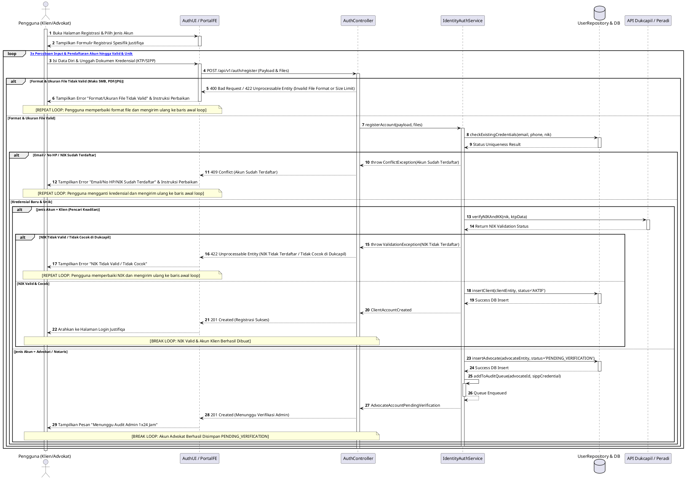
```plantuml
@startuml
autonumber
actor "Pengguna (Klien/Advokat)" as User
participant "AuthUI / PortalFE" as FE
participant "AuthController" as CTRL
participant "IdentityAuthService" as SVC
database "UserRepository & DB" as REPO
participant "API Dukcapil / Peradi" as Ext

activate User
User -> FE ++ : Buka Halaman Registrasi & Pilih Jenis Akun
FE --> User : Tampilkan Formulir Registrasi Spesifik Justifiqa
deactivate FE

loop [Maksimal 3x Percobaan Input & Pendaftaran Akun hingga Valid & Unik]
    User -> FE ++ : Isi Data Diri & Unggah Dokumen Kredensial (KTP/SIPP)
    FE -> CTRL ++ : POST /api/v1/auth/register (Payload & Files)

    alt Format & Ukuran File Tidak Valid (Maks 5MB, PDF/JPG)
        CTRL --> FE : 400 Bad Request / 422 Unprocessable Entity (Invalid File Format or Size Limit)
        FE --> User : Tampilkan Error "Format/Ukuran File Tidak Valid" & Instruksi Perbaikan
        deactivate FE
        note over User, FE : [REPEAT LOOP: Pengguna memperbaiki format file dan mengirim ulang ke baris awal loop]
    else Format & Ukuran File Valid
        CTRL -> SVC ++ : registerAccount(payload, files)
        SVC -> REPO ++ : checkExistingCredentials(email, phone, nik)
        REPO --> SVC -- : Status Uniqueness Result

        alt Email / No HP / NIK Sudah Terdaftar
            SVC --> CTRL : throw ConflictException(Akun Sudah Terdaftar)
            CTRL --> FE : 409 Conflict (Akun Sudah Terdaftar)
            FE --> User : Tampilkan Error "Email/No HP/NIK Sudah Terdaftar" & Instruksi Perbaikan
            deactivate FE
            note over User, FE : [REPEAT LOOP: Pengguna mengganti kredensial dan mengirim ulang ke baris awal loop]
        else Kredensial Baru & Unik
            alt Jenis Akun = Klien (Pencari Keadilan)
                SVC -> Ext ++ : verifyNIKAndKK(nik, ktpData)
                Ext --> SVC -- : Return NIK Validation Status
                
                alt NIK Tidak Valid / Tidak Cocok di Dukcapil
                    SVC --> CTRL : throw ValidationException(NIK Tidak Terdaftar)
                    CTRL --> FE : 422 Unprocessable Entity (NIK Tidak Terdaftar / Tidak Cocok di Dukcapil)
                    FE --> User : Tampilkan Error "NIK Tidak Valid / Tidak Cocok"
                    deactivate FE
                    note over User, FE : [REPEAT LOOP: Pengguna memperbaiki NIK dan mengirim ulang ke baris awal loop]
                else NIK Valid & Cocok
                    SVC -> REPO ++ : insertClient(clientEntity, status='AKTIF')
                    REPO --> SVC -- : Success DB Insert
                    SVC --> CTRL : ClientAccountCreated
                    CTRL --> FE : 201 Created (Registrasi Sukses)
                    FE --> User : Arahkan ke Halaman Login Justifiqa
                    deactivate FE
                    note over User, CTRL : [BREAK LOOP: NIK Valid & Akun Klien Berhasil Dibuat]
                end
            else Jenis Akun = Advokat / Notaris
                SVC -> REPO ++ : insertAdvocate(advocateEntity, status='PENDING_VERIFICATION')
                REPO --> SVC -- : Success DB Insert
                SVC -> SVC ++ : addToAuditQueue(advocateId, sippCredential)
                SVC --> SVC -- : Queue Enqueued
                SVC --> CTRL : AdvocateAccountPendingVerification
                CTRL --> FE : 201 Created (Menunggu Verifikasi Admin)
                FE --> User : Tampilkan Pesan "Menunggu Audit Admin 1x24 Jam"
                deactivate FE
                note over User, CTRL : [BREAK LOOP: Akun Advokat Berhasil Disimpan PENDING_VERIFICATION]
            end
        end
        deactivate SVC
    end
    deactivate CTRL
end
deactivate User
@enduml
```

---

### SD-J-02: Login Akun Klien & Advokat (J-UC02, J-UC08)
*Sequence diagram alur masuk (login) independen beserta verifikasi Multi-Factor Authentication (MFA / 2FA) dengan spesifikasi eksekusi aktif lengkap pada sisi User (actor) dan sistem.*

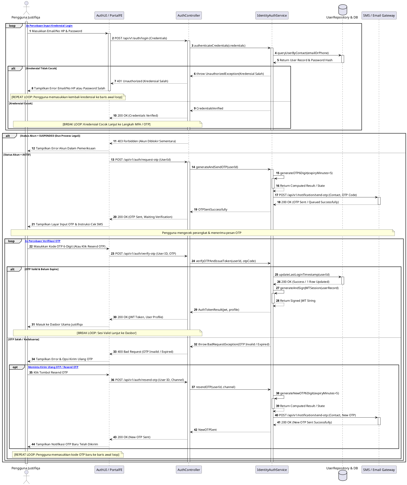
```plantuml
@startuml
autonumber
actor "Pengguna Justifiqa" as User
participant "AuthUI / PortalFE" as FE
participant "AuthController" as CTRL
participant "IdentityAuthService" as SVC
database "UserRepository & DB" as REPO
participant "SMS / Email Gateway" as SMS

activate User
loop [Maksimal 3x Percobaan Input Kredensial Login]
    User -> FE ++ : Masukkan Email/No HP & Password
    FE -> CTRL ++ : POST /api/v1/auth/login (Credentials)
    CTRL -> SVC ++ : authenticateCredentials(credentials)

    SVC -> REPO ++ : queryUserByContact(emailOrPhone)
    REPO --> SVC -- : Return User Record & Password Hash

    alt Kredensial Tidak Cocok
        SVC --> CTRL : throw UnauthorizedException(Kredensial Salah)
        CTRL --> FE : 401 Unauthorized (Kredensial Salah)
        FE --> User : Tampilkan Error Email/No HP atau Password Salah
        deactivate FE
        note over User, FE : [REPEAT LOOP: Pengguna memasukkan kembali kredensial ke baris awal loop]
    else Kredensial Cocok
        SVC --> CTRL : CredentialsVerified
        CTRL --> FE : 200 OK (Credentials Verified)
        deactivate FE
        note over User, CTRL : [BREAK LOOP: Kredensial Cocok Lanjut ke Langkah MFA / OTP]
    end
    deactivate SVC
    deactivate CTRL
end

alt Status Akun = SUSPENDED (Due Process Legal)
    CTRL --> FE : 403 Forbidden (Akun Diblokir Sementara)
    FE --> User : Tampilkan Error Akun Dalam Pemeriksaan
else Status Akun = AKTIF
    FE -> CTRL ++ : POST /api/v1/auth/request-otp (UserId)
    CTRL -> SVC ++ : generateAndSendOTP(userId)
    SVC -> SVC ++ : generateOTP6Digit(expiryMinutes=5)
    SVC --> SVC -- : Return Computed Result / State
    SVC -> SMS ++ : POST /api/v1/notification/send-otp (Contact, OTP Code)
    SMS --> SVC -- : 200 OK (OTP Sent / Queued Successfully)
    SVC --> CTRL : OTPSentSuccessfully
    CTRL --> FE : 200 OK (OTP Sent, Waiting Verification)
    FE --> User : Tampilkan Layar Input OTP & Instruksi Cek SMS
    note over User, SMS : Pengguna mengecek perangkat & menerima pesan OTP
    
    loop [Maksimal 3x Percobaan Verifikasi OTP]
        User -> FE : Masukkan Kode OTP 6-Digit (Atau Klik Resend OTP)
        FE -> CTRL : POST /api/v1/auth/verify-otp (User ID, OTP)
        CTRL -> SVC : verifyOTPAndIssueToken(userId, otpCode)
        
        alt OTP Valid & Belum Expire
            SVC -> REPO ++ : updateLastLoginTimestamp(userId)
            REPO --> SVC -- : 200 OK (Success / 1 Row Updated)
            SVC -> SVC ++ : generateAndSignJWTSession(userRecord)
            SVC --> SVC -- : Return Signed JWT String
            SVC --> CTRL : AuthTokenResult(jwt, profile)
            CTRL --> FE : 200 OK (JWT Token, User Profile)
            FE --> User : Masuk ke Dasbor Utama Justifiqa
            note over User, CTRL : [BREAK LOOP: Sesi Valid Lanjut ke Dasbor]
        else OTP Salah / Kadaluarsa
            SVC --> CTRL : throw BadRequestException(OTP Invalid / Expired)
            CTRL --> FE : 400 Bad Request (OTP Invalid / Expired)
            FE --> User : Tampilkan Error & Opsi Kirim Ulang OTP
            
            opt [Pengguna Meminta Kirim Ulang OTP / Resend OTP]
                User -> FE : Klik Tombol Resend OTP
                FE -> CTRL : POST /api/v1/auth/resend-otp (User ID, Channel)
                CTRL -> SVC : resendOTP(userId, channel)
                SVC -> SVC ++ : generateNewOTP6Digit(expiryMinutes=5)
                SVC --> SVC -- : Return Computed Result / State
                SVC -> SMS ++ : POST /api/v1/notification/send-otp (Contact, New OTP)
                SMS --> SVC -- : 200 OK (New OTP Sent Successfully)
                SVC --> CTRL : NewOTPSent
                CTRL --> FE : 200 OK (New OTP Sent)
                FE --> User : Tampilkan Notifikasi OTP Baru Telah Dikirim
            end
            note over User, FE : [REPEAT LOOP: Pengguna memasukkan kode OTP baru ke baris awal loop]
        end
    end
    deactivate SVC
    deactivate CTRL
end
deactivate User
@enduml
```

---

### SD-J-03: Konsultasi Hukum & Pembayaran Escrow (J-UC03, J-UC04, J-UC05, J-UC10)
*Sequence diagram reservasi, pembayaran escrow yang ditahan sistem Justifiqa, pelaksanaan sesi chat E2EE, hingga pelepasan dana setelah sesi selesai dengan spesifikasi eksekusi aktif lengkap pada sisi Klien, Advokat (Mitra), dan sistem.*

```plantuml
@startuml
title Sequence Diagram: SD-J-03 - Konsultasi Hukum & Pembayaran Escrow (J-UC03, J-UC04, J-UC05, J-UC10)
autonumber
actor "Klien Justifiqa" as Klien
participant "ConsultationUI" as FE
participant "ConsultationController" as CTRL
participant "ConsultationService" as SVC
database "ConsultationRepository & DB" as REPO
participant "Payment Gateway (Midtrans/Xendit)" as PG
actor "Advokat Mitra" as Mitra

activate Klien
activate Mitra

Klien -> FE ++ : Pilih Level Konsultasi (Gratis / Premium / Pro), Advokat, & Slot
FE -> CTRL ++ : POST /api/v1/consultations/book (tier, advocate_id, slot, use_promo=true)

alt Level Konsultasi = Gratis (Legal Triage - 15 Menit Text Chat)
    CTRL -> SVC ++ : createTriageSession(clientId, advocateId, slot)
    SVC -> REPO : insertConsultationSession(fee=Rp0, duration=15m, status='ACTIVE')
    activate REPO
    REPO --> SVC : 200 OK (triage_session_id)
    deactivate REPO
    SVC --> CTRL : TriageSessionCreated
    CTRL --> FE : 200 OK (Sesi Triage Gratis Terkonfirmasi)
    FE --> Klien : Buka Ruang Chat E2EE Langsung (Maks 15 Menit)
    deactivate FE
    SVC -> Mitra : Push Notification Sesi Triage Baru (Advokat Muda/Paralegal)
    note over Klien, Mitra : Sesi Triage Gratis Berlangsung Maks 15 Menit
    SVC -> REPO : UPDATE consultation_sessions SET status = 'CLOSED' WHERE id = triage_session_id
    activate REPO
    REPO --> SVC : 200 OK
    deactivate REPO
    SVC -> SVC ++ : creditReputationTokens(advocateId)
    SVC --> SVC -- : Return Computed Result / State
    SVC -> FE ++ : Trigger Rating & Ulasan Modal (J-UC06 / J-UC13)
    FE --> Klien : Tampilkan Modal Ulasan & Rating Sesi Triage
    deactivate FE
    deactivate SVC
    deactivate CTRL
else Level Konsultasi = Premium / Pro (Berbayar via Virtual Token / PG)
    CTRL -> SVC ++ : checkVirtualTokenBalance(clientId)
    SVC -> REPO : getVirtualTokenBalance(clientId)
    activate REPO
    REPO --> SVC : Return Virtual Token Balance
    deactivate REPO

    alt Saldo Virtual Token Mencukupi 100% Tagihan (Full Virtual Token)
        SVC -> REPO : deductVirtualTokenAndReserveSession(clientId, tierFee)
        activate REPO
        REPO --> SVC : 200 OK
        deactivate REPO
        SVC -> REPO : updateBookingStatus(bookingId, 'TERKONFIRMASI')
        activate REPO
        REPO --> SVC : 200 OK
        deactivate REPO
        SVC --> CTRL : ReservationConfirmedVirtualToken
        CTRL --> FE : 200 OK (Reservasi Terkonfirmasi via Virtual Token)
        FE --> Klien : Tampilkan Konfirmasi Reservasi Sukses
        deactivate FE
        SVC -> Mitra : Kirim Push Notification Jadwal Sesi Baru
        deactivate SVC
        deactivate CTRL
    else Bayar Penuh / Sebagian via Payment Gateway (Split Payment)
        opt Klien Menggunakan Sebagian Promo Credit (Split Payment)
            SVC -> REPO : deductPromoCreditBalance(clientId)
            activate REPO
            REPO --> SVC : Return Computed Result / State
            deactivate REPO
        end
        SVC -> PG ++ : Create Payment Invoice untuk Nominal Sisa / Penuh
        PG --> SVC -- : Return Invoice URL & VA Number
        SVC --> CTRL : BillingDetailReady
        CTRL --> FE : Return Billing Detail (Nominal Sisa / Penuh)
        FE --> Klien : Tampilkan Halaman Pembayaran PG
        deactivate FE
        deactivate SVC
        deactivate CTRL

        loop [Maksimal 3x Percobaan Pembayaran & Verifikasi Webhook]
            Klien -> PG ++ : Lakukan Pembayaran via Bank Transfer / E-Wallet

            alt Webhook Status Transaksi = PAID / SUCCESS
                PG -> CTRL ++ : Webhook Notification (POST /webhook/payment PAID)
                CTRL -> SVC ++ : processPaymentWebhookPaid(invoiceId, payload)
                SVC -> REPO : lockEscrowFundsAndConfirmBooking(bookingId, amount)
                activate REPO
                REPO --> SVC : 200 OK
                deactivate REPO
                SVC --> CTRL : WebhookProcessedSuccess
                CTRL --> PG : 200 OK (Webhook Processed)
                deactivate PG
                SVC -> FE ++ : Push Notification Pembayaran Sukses
                FE --> Klien : Tampilkan Konfirmasi Reservasi Terkonfirmasi
                deactivate FE
                SVC -> Mitra : Kirim Push Notification Jadwal Sesi Baru
                deactivate SVC
                deactivate CTRL
                note over Klien, PG : [BREAK LOOP: Pembayaran Sukses Lanjut ke Sesi Konsultasi]
            else Webhook Status Transaksi = FAILED / EXPIRED / CANCELLED
                PG -> CTRL ++ : Webhook Notification (POST /webhook/payment FAILED / EXPIRED)
                CTRL -> SVC ++ : processPaymentWebhookFailed(invoiceId)
                SVC -> REPO : rollbackPromoCreditAndCancelInvoice(bookingId)
                activate REPO
                REPO --> SVC : 200 OK
                deactivate REPO
                SVC --> CTRL : WebhookProcessedFailed
                CTRL --> PG : 200 OK (Webhook Processed)
                deactivate PG
                SVC -> FE ++ : Push Notification Pembayaran Gagal / Kadaluwarsa
                FE --> Klien : Tampilkan Error Pembayaran Gagal
                deactivate FE
            
                opt [Pengguna Meminta Bayar Ulang / Ganti Metode Pembayaran]
                    Klien -> FE ++ : Pilih Ulang Metode Pembayaran / Ganti Jadwal
                    FE -> CTRL ++ : POST /api/v1/consultations/retry-payment (Booking ID, New Method)
                    CTRL -> SVC ++ : retryBookingPayment(bookingId, newMethod)
                    SVC -> PG ++ : Create New Payment Invoice & VA Number
                    PG --> SVC -- : Return New Invoice URL & VA Number
                    SVC --> CTRL : NewBillingDetailReady
                    CTRL --> FE : 200 OK (New Billing Detail Rp250.000 + Fee)
                    FE --> Klien : Tampilkan Halaman Pembayaran Baru
                    deactivate FE
                    deactivate SVC
                    deactivate CTRL
                end
                deactivate SVC
                deactivate CTRL
                note over Klien, PG : [REPEAT LOOP: Pengguna melakukan pembayaran ulang ke baris awal loop]
            end
        end
    end
end

alt Mode Konsultasi = Offline Tatap Muka (QR-Code Handshake & Standard Clock)
    Klien -> FE ++ : Datang ke Safe Meeting Point & Pindai QR Code Check-in Advokat
    FE -> CTRL ++ : POST /api/v1/consultations/offline/check-in {booking_id, qr_token}
    CTRL -> SVC ++ : verifyQRCodeAndStartOfflineSession(bookingId, qrToken)
    SVC -> SVC ++ : startOfflineCountdown(duration=60m, gracePeriod=120m)
    SVC --> SVC -- : Timer Active
    SVC --> CTRL : SafeMeetingStarted
    CTRL --> FE : 200 OK (Sesi Offline Tatap Muka Dimulai)
    FE --> Klien : Tampilkan Status Sesi Berjalan & Countdown 60 Menit
    deactivate FE
    deactivate SVC
    deactivate CTRL
    note over Klien, Mitra : Sesi Konsultasi Tatap Muka Berlangsung di Lokasi Terverifikasi
    alt Normal Check-out (QR Code Dipindai Klien < 120 Menit)
        Klien -> FE ++ : Pindai QR Code Check-out saat Sesi Selesai
        FE -> CTRL ++ : POST /api/v1/consultations/offline/check-out {booking_id}
        CTRL -> SVC ++ : completeOfflineSession(bookingId)
        SVC --> CTRL : SessionCheckOutSuccess
        CTRL --> FE : 200 OK (Check-out Berhasil)
        FE --> Klien : Tampilkan Ringkasan Sesi Offline
        deactivate FE
        deactivate SVC
        deactivate CTRL
    else Fallback Check-out (Lupa Check-out / Grace Period 120 Menit Habis)
        SVC -> SVC ++ : executeSystemicAutoCheckout(bookingId, 'AUTO_CHECKOUT_SUCCESS')
        SVC --> SVC -- : Mencegah Escrow Menggantung & Lanjut ke PENDING_DELIVERABLE
    end
else Mode Konsultasi = Online E2EE Chat Room (Fair-Clock & Smart SLA)
    Klien -> FE ++ : Masuk Ruang Chat E2EE Justifiqa (?role=klien)
    FE --> Klien : Render Client Viewpoint (.user=Klien di kanan, Topbar=Advokat)
    deactivate FE

    Mitra -> FE ++ : Masuk Ruang Chat E2EE Justifiqa (?role=mitra)
    FE --> Mitra : Render Partner Viewpoint (.user=Advokat di kanan, Topbar=Klien)
    deactivate FE

    Klien -> FE ++ : Kirim Pesan Pembuka Perkara
    FE -> CTRL ++ : POST /api/v1/chat/messages {session_id, content}
    CTRL -> SVC ++ : processIncomingMessage(sessionId, messagePayload)
    SVC -> SVC ++ : awaitFirstSubstantialReply(sessionId)
    SVC --> SVC -- : Return Computed Result / State
    SVC --> CTRL : MessageAccepted
    CTRL --> FE : 200 OK (Message Sent & Clock Active)
    FE --> Klien : Tampilkan Chat Status Active
    deactivate FE
    deactivate SVC
    deactivate CTRL

    Mitra -> FE ++ : Kirim Balasan Pertama
    FE -> CTRL ++ : POST /api/v1/chat/messages {session_id, content}
    CTRL -> SVC ++ : processPartnerReplyAndStartFairClock(sessionId, messagePayload)
    SVC -> SVC ++ : startFairClockCountdown(duration=45m_to_90m)
    SVC --> SVC -- : Return Computed Result / State
    SVC --> CTRL : FairClockStarted
    CTRL --> FE : 200 OK (Timer Berdetak)
    FE --> Mitra : Tampilkan Timer Sesi Aktif
    deactivate FE
    deactivate SVC
    deactivate CTRL

    loop [Interaksi Dua Arah, DLP Circumvention Filter & Monitoring SLA Balasan]
        Klien -> FE ++ : Kirim Pesan Teks / Audio / Video
        FE -> CTRL ++ : POST /api/v1/chat/messages {session_id, content}
        CTRL -> SVC ++ : scanDLPAndRouteMessage(sessionId, content)
        SVC -> SVC ++ : dlpEngineScan(content)
        SVC --> SVC -- : Return DLP Scan Decision

        alt DLP Terdeteksi Ajakan Ketemuan Offline Ilegal / Bypass Platform (Level 1)
            SVC -> SVC ++ : dropMessageRealTime()
            SVC --> SVC -- : Return Computed Result / State
            SVC --> CTRL : SecurityAlertLevel1
            CTRL --> FE : 403 Forbidden / Red Security Alert
            FE --> Klien : Tampilkan Peringatan Keras Pengiriman Kontak Pribadi Ditolak
            deactivate FE
            deactivate SVC
            deactivate CTRL

            opt Percobaan Berulang >= 2x / Evasion Attempt (Level 2 - Zero Tolerance)
                SVC -> SVC ++ : freezeChatRoomAndHoldEscrow(sessionId)
                SVC --> SVC -- : Return Computed Result / State
                SVC -> SVC ++ : escalateIncidentToAdminQueue(sessionId, 'J-UC10')
                SVC --> SVC -- : Return Computed Result / State
            end
        else Pesan Aman / Valid (Lolos DLP)
            SVC --> CTRL : MessageDelivered
            CTRL --> FE : 200 OK (Message Delivered)
            FE --> Mitra : Tampilkan Pesan Chat
            deactivate FE
            deactivate SVC
            deactivate CTRL
        end
        
        alt Advokat Tidak Merespons > 5 Menit (Auto-Pause SLA)
            SVC -> SVC ++ : pauseCountdownTimerAndPushSLAAlert(sessionId)
            SVC --> SVC -- : Return Computed Result / State
            
            alt Advokat Tidak Aktif / AFK > 15 Menit
                SVC -> REPO : updateSessionStatus(sessionId, 'CANCELLED_AFK')
                activate REPO
                REPO --> SVC : 200 OK
                deactivate REPO
                SVC -> FE ++ : pushAlertSessionCancelledAFK()
                FE --> Klien : Tampilkan Modal Refund 100%
                deactivate FE
                Klien -> FE ++ : Ajukan Laporan Pelanggaran / Klaim Refund (J-UC21)
                FE -> CTRL ++ : POST /api/v1/moderation/reports
                CTRL -> SVC ++ : submitRefundClaimReport(sessionId)
                SVC -> REPO : insertViolationReport(sessionId)
                activate REPO
                REPO --> SVC : 201 Created
                deactivate REPO
                SVC --> CTRL : ReportCreated
                CTRL --> FE : 201 Created
                FE --> Klien : Konfirmasi Laporan Diterima
                deactivate FE
                deactivate SVC
                deactivate CTRL
            else Advokat Kembali Membalas Pesan
                SVC -> SVC ++ : resumeCountdownTimer(sessionId)
                SVC --> SVC -- : Return Computed Result / State
            end
        end
    end

    alt Waktu Live Chat 60 Menit Habis ATAU Sesi Diakhiri
        SVC -> SVC ++ : endLiveChatAndLockRoomReadOnly(sessionId)
        SVC --> SVC -- : Return Computed Result / State
        SVC -> SVC ++ : disableVoiceVideoCalls(sessionId)
        SVC --> SVC -- : Return Computed Result / State
        
        SVC -> REPO : UPDATE consultation_sessions SET status = 'PENDING_DELIVERABLE' WHERE id = session_id
        activate REPO
        REPO --> SVC : 200 OK
        deactivate REPO
        SVC -> FE ++ : openAsyncDeliverableThread(sessionId)
        FE --> Mitra : Tampilkan Antarmuka Tiket Komentar [KLARIFIKASI FAKTA] / [REVISI KLAUSUL]
        deactivate FE
        FE --> Klien : Tampilkan Ruang Kerja Asinkron untuk Review & Klarifikasi
        SVC -> SVC ++ : archiveIRACNote(sessionId)
        SVC --> SVC -- : Return Computed Result / State
    end
end

alt Level Konsultasi = Tier 2 Premium (Deliverable: Client Advice Summary)
    Mitra -> FE ++ : Susun & Unggah Laporan Saran Hukum (Summary v1)
    FE -> CTRL ++ : POST /api/v1/consultations/{id}/deliverables/summary
    CTRL -> SVC ++ : submitDeliverableSummary(sessionId, summaryPayload)
    SVC -> REPO : saveDeliverableSummary(sessionId, summaryPayload)
    activate REPO
    REPO --> SVC : 201 Created
    deactivate REPO
    SVC --> CTRL : SummaryCreated
    CTRL --> FE : 201 Created
    FE --> Mitra : Konfirmasi Laporan Saran Dirilis
    deactivate FE
    deactivate SVC
    deactivate CTRL

    loop [Siklus Klarifikasi Saran Hukum - Ulangi Selama Klien Mengajukan Tiket & Kuota < 2x & SLA Belum Habis]
        Klien -> FE ++ : Kirim Pertanyaan berlabel [KLARIFIKASI SARAN] di Async Thread
        FE -> CTRL ++ : POST /api/v1/consultations/{id}/async-thread/clarify
        CTRL -> SVC ++ : submitClarificationTicket(sessionId, questionPayload)
        SVC -> SVC ++ : inlineDLPScan(questionPayload)
        SVC --> SVC -- : Return DLP Decision
        SVC -> REPO : saveClarificationTicket(sessionId, questionPayload)
        activate REPO
        REPO --> SVC : 200 OK
        deactivate REPO
        SVC --> CTRL : ClarificationSent
        CTRL --> FE : 200 OK
        FE --> Klien : Pertanyaan Klarifikasi Terkirim
        deactivate FE
        deactivate SVC
        deactivate CTRL
        
        Mitra -> FE ++ : Berikan Jawaban / Perbarui Laporan Saran Hukum
        FE -> CTRL ++ : POST /api/v1/consultations/{id}/deliverables/summary
        CTRL -> SVC ++ : updateDeliverableSummary(sessionId, updatedPayload)
        SVC -> REPO : updateDeliverableSummary(sessionId, updatedPayload)
        activate REPO
        REPO --> SVC : 200 OK
        deactivate REPO
        SVC --> CTRL : SummaryUpdated
        CTRL --> FE : 200 OK
        FE --> Mitra : Konfirmasi Pembaruan Dirilis
        deactivate FE
        deactivate SVC
        deactivate CTRL
    end

    alt [Penyelesaian Deliverable] Laporan Disetujui Klien ATAU Batas Kuota 2x Habis ATAU SLA 2x24 Jam Habis
        Klien -> FE ++ : Klik Setujui Laporan / Auto-Approve SLA Habis / Kuota Habis
        FE -> CTRL ++ : POST /api/v1/consultations/{id}/deliverables/summary/approve
        CTRL -> SVC ++ : approveDeliverableSummary(sessionId)
        SVC -> REPO : UPDATE consultation_sessions SET async_thread_locked = TRUE WHERE id = session_id
        activate REPO
        REPO --> SVC : 200 OK
        deactivate REPO
        opt [Jika Batas Kuota 2x Habis / SLA Habis]
            SVC -> FE ++ : showPromptQuotaOrSLAExceeded()
            FE --> Klien : Prompt Buat Reservasi Sesi Baru untuk Topik Tambahan
            deactivate FE
        end
        SVC --> CTRL : SummaryApproved
        CTRL --> FE : 200 Approved
        FE --> Klien : Konfirmasi Laporan Disetujui
        deactivate FE
        deactivate SVC
        deactivate CTRL
    end

    SVC -> SVC ++ : disburseEscrowToAdvocateWallet(sessionId, feeRate=0.25, pph21)
    SVC --> SVC -- : Return Computed Result / State
    SVC -> FE ++ : triggerRatingModal(sessionId)
    FE --> Klien : Tampilkan Modal Ulasan & Rating
    deactivate FE
else Level Konsultasi = Tier 3 Pro (Deliverable: Dokumen Hukum Final)
    Mitra -> FE ++ : Susun & Unggah Dokumen Hukum Final (Drafting v1)
    FE -> CTRL ++ : POST /api/v1/consultations/{id}/deliverables/final
    CTRL -> SVC ++ : submitFinalLegalDocument(sessionId, docPayload)
    SVC -> REPO : saveFinalDocumentVersion(sessionId, docPayload)
    activate REPO
    REPO --> SVC : 201 Created
    deactivate REPO
    SVC --> CTRL : FinalDocumentCreated
    CTRL --> FE : 201 Created
    FE --> Mitra : Konfirmasi Dokumen Final Diunggah
    deactivate FE
    deactivate SVC
    deactivate CTRL

    loop [Siklus Review & Revisi Dokumen Final - Ulangi Selama Klien Mengajukan Revisi & Kuota < 2x & SLA Belum Habis]
        Klien -> FE ++ : Kirim Catatan berlabel [REVISI KLAUSUL] di Async Thread
        FE -> CTRL ++ : POST /api/v1/consultations/{id}/async-thread/revise
        CTRL -> SVC ++ : submitRevisionTicket(sessionId, revisionPayload)
        SVC -> SVC ++ : inlineDLPScan(revisionPayload)
        SVC --> SVC -- : Return DLP Decision
        SVC -> REPO : saveRevisionTicket(sessionId, revisionPayload)
        activate REPO
        REPO --> SVC : 200 OK
        deactivate REPO
        SVC --> CTRL : RevisionSent
        CTRL --> FE : 200 OK
        FE --> Klien : Konfirmasi Permintaan Revisi Terkirim
        deactivate FE
        deactivate SVC
        deactivate CTRL
        
        Mitra -> FE ++ : Perbarui & Unggah Draf Revisi Dokumen (v2 / v3)
        FE -> CTRL ++ : POST /api/v1/consultations/{id}/deliverables/final
        CTRL -> SVC ++ : updateFinalLegalDocument(sessionId, updatedDoc)
        SVC -> REPO : saveFinalDocumentVersion(sessionId, updatedDoc)
        activate REPO
        REPO --> SVC : 201 Created
        deactivate REPO
        SVC --> CTRL : FinalDocumentUpdated
        CTRL --> FE : 201 Created
        FE --> Mitra : Konfirmasi Revisi Diunggah
        deactivate FE
        deactivate SVC
        deactivate CTRL
    end

    alt [Penyelesaian Deliverable] Dokumen Disetujui Klien ATAU Batas Kuota 2x Habis ATAU SLA 3x24 Jam Habis
        Klien -> FE ++ : Klik Setujui Dokumen Final / Auto-Approve SLA Habis / Kuota Habis
        FE -> CTRL ++ : POST /api/v1/consultations/{id}/deliverables/final/approve
        CTRL -> SVC ++ : approveFinalLegalDocument(sessionId)
        SVC -> REPO : UPDATE consultation_sessions SET async_thread_locked = TRUE WHERE id = session_id
        activate REPO
        REPO --> SVC : 200 OK
        deactivate REPO
        opt [Jika Batas Kuota 2x Habis / SLA Habis]
            SVC -> FE ++ : showPromptRevisionQuotaExceeded()
            FE --> Klien : Prompt Buat Reservasi Sesi Baru untuk Topik Tambahan
            deactivate FE
        end
        SVC --> CTRL : FinalDocumentApproved
        CTRL --> FE : 200 Approved
        FE --> Klien : Konfirmasi Dokumen Disetujui
        deactivate FE
        deactivate SVC
        deactivate CTRL
    end

    SVC -> SVC ++ : disburseEscrowToAdvocateWallet(sessionId, feeRate=0.25, pph21)
    SVC --> SVC -- : Return Computed Result / State
    SVC -> FE ++ : triggerRatingModal(sessionId)
    FE --> Klien : Tampilkan Modal Ulasan & Rating
    deactivate FE
end

deactivate Mitra
deactivate Klien
@enduml
```

---

### SD-J-04: Mengatur Status Ketersediaan Praktik Advokat (J-UC09)
*Sequence diagram pengaturan ketersediaan slot kalender praktik dan deteksi konflik jadwal otomatis (tanpa toggle manual) dengan spesifikasi eksekusi aktif lengkap pada sisi Advokat (Mitra) dan sistem.*

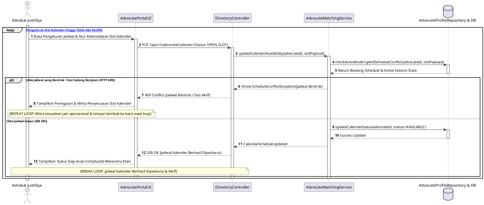
```plantuml
@startuml
autonumber
actor "Advokat Justifiqa" as Mitra
participant "AdvocatePortalUI" as FE
participant "DirectoryController" as CTRL
participant "AdvocateMatchingService" as SVC
database "AdvocateProfileRepository & DB" as REPO

activate Mitra
loop [Percobaan Pengaturan Slot Kalender hingga Tidak Ada Konflik]
    Mitra -> FE ++ : Buka Pengaturan Jadwal & Atur Ketersediaan Slot Kalender
    FE -> CTRL ++ : PUT /api/v1/advocate/calendar (Status: OPEN_SLOT)
    CTRL -> SVC ++ : updateCalendarAvailability(advocateId, slotPayload)

    SVC -> REPO : checkActiveBookingAndScheduleConflict(advocateId, slotPayload)
    activate REPO
    REPO --> SVC : Return Booking Schedule & Active Session State
    deactivate REPO

    alt Ada Jadwal yang Bentrok / Sesi Sedang Berjalan (HTTP 409)
        SVC --> CTRL : throw ScheduleConflictException(Jadwal Bentrok)
        CTRL --> FE : 409 Conflict (Jadwal Bentrok / Sesi Aktif)
        FE --> Mitra : Tampilkan Peringatan & Minta Penyesuaian Slot Kalender
        note over Mitra, FE : [REPEAT LOOP: Mitra sesuaikan jam operasional & simpan kembali ke baris awal loop]
    else Slot Jadwal Aman (200 OK)
        SVC -> REPO : updateCalendarStatus(advocateId, status='AVAILABLE')
        activate REPO
        REPO --> SVC : Success Update
        deactivate REPO
        SVC --> CTRL : CalendarScheduleUpdated
        CTRL --> FE : 200 OK (Jadwal Kalender Berhasil Diperbarui)
        FE --> Mitra : Tampilkan Status Siap (Auto-Scheduled) Menerima Klien
        note over Mitra, CTRL : [BREAK LOOP: Jadwal Kalender Berhasil Diperbarui & Aktif]
    end
    deactivate SVC
    deactivate CTRL
    deactivate FE
end
deactivate Mitra
@enduml
```

---

### SD-J-05: Mengunggah Berkas Perkara E2EE Zero-Knowledge (J-UC13)
*Sequence diagram pengunggahan bukti perkara yang dienkripsi sebelum meninggalkan perangkat klien agar tidak dapat dibaca oleh server maupun pihak ketiga dengan spesifikasi eksekusi aktif lengkap pada sisi Klien, Advokat, dan sistem.*

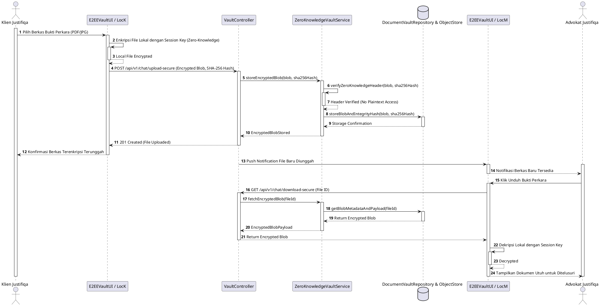
```plantuml
@startuml
autonumber
actor "Klien Justifiqa" as Klien
participant "E2EEVaultUI / LocK" as LocK
participant "VaultController" as CTRL
participant "ZeroKnowledgeVaultService" as SVC
database "DocumentVaultRepository & ObjectStore" as REPO
participant "E2EEVaultUI / LocM" as LocM
actor "Advokat Justifiqa" as Mitra

activate Klien
Klien -> LocK ++ : Pilih Berkas Bukti Perkara (PDF/JPG)
LocK -> LocK ++ : Enkripsi File Lokal dengan Session Key (Zero-Knowledge)
LocK --> LocK -- : Local File Encrypted
LocK -> CTRL ++ : POST /api/v1/chat/upload-secure (Encrypted Blob, SHA-256 Hash)
CTRL -> SVC ++ : storeEncryptedBlob(blob, sha256Hash)
SVC -> SVC ++ : verifyZeroKnowledgeHeader(blob, sha256Hash)
SVC --> SVC -- : Header Verified (No Plaintext Access)

SVC -> REPO : storeBlobAndIntegrityHash(blob, sha256Hash)
activate REPO
REPO --> SVC : Storage Confirmation
deactivate REPO
SVC --> CTRL : EncryptedBlobStored
deactivate SVC
CTRL --> LocK : 201 Created (File Uploaded)
deactivate CTRL
LocK --> Klien : Konfirmasi Berkas Terenkripsi Terunggah
deactivate LocK

CTRL -> LocM ++ : Push Notification File Baru Diunggah
activate Mitra
LocM --> Mitra : Notifikasi Berkas Baru Tersedia
deactivate LocM

Mitra -> LocM ++ : Klik Unduh Bukti Perkara
LocM -> CTRL ++ : GET /api/v1/chat/download-secure (File ID)
CTRL -> SVC ++ : fetchEncryptedBlob(fileId)
SVC -> REPO : getBlobMetadataAndPayload(fileId)
activate REPO
REPO --> SVC : Return Encrypted Blob
deactivate REPO
SVC --> CTRL : EncryptedBlobPayload
deactivate SVC
CTRL --> LocM : Return Encrypted Blob
deactivate CTRL

LocM -> LocM ++ : Dekripsi Lokal dengan Session Key
LocM --> LocM -- : Decrypted
LocM --> Mitra : Tampilkan Dokumen Utuh untuk Ditelusuri
deactivate LocM
deactivate Klien
deactivate Mitra
@enduml
```

---

### SD-J-06: Membuat & Memfinalisasi Draf Kontrak Hukum Bermeterai (J-UC12, J-UC14)
*Sequence diagram pembuatan opini hukum/kontrak oleh advokat serta finalisasi pembubuhan e-Meterai resmi Peruri yang difasilitasi platform (*Platform-Facilitated Stamping*) dengan spesifikasi eksekusi aktif lengkap pada sisi Advokat, Klien, dan sistem.*

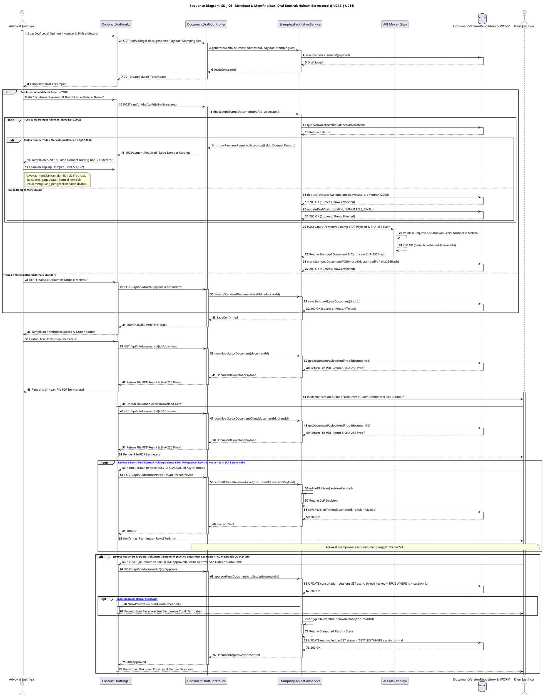
```plantuml
@startuml
title Sequence Diagram: SD-J-06 - Membuat & Memfinalisasi Draf Kontrak Hukum Bermeterai (J-UC12, J-UC14)
autonumber
actor "Advokat Justifiqa" as Mitra
participant "ContractDraftingUI" as FE
participant "DocumentDraftController" as CTRL
participant "StampingFacilitationService" as SVC
participant "API Mekari Sign" as Peruri
database "DocumentVersionRepository & WORM" as REPO
actor "Klien Justifiqa" as Klien

activate Mitra
Mitra -> FE ++ : Buat Draf Legal Opinion / Kontrak & Pilih e-Meterai
FE -> CTRL ++ : POST /api/v1/legal-docs/generate (Payload, Stamping Req)
CTRL -> SVC ++ : generateDraftDocument(advocateId, payload, stampingReq)
SVC -> REPO : saveDraftVersionInitial(payload)
activate REPO
REPO --> SVC : Draf Saved
deactivate REPO
SVC --> CTRL : DraftGenerated
deactivate SVC
CTRL --> FE : 201 Created (Draft Tersimpan)
deactivate CTRL
FE --> Mitra : Tampilkan Draf Tersimpan
deactivate FE

alt Pembubuhan e-Meterai Peruri = TRUE
    Mitra -> FE ++ : Klik "Finalisasi Dokumen & Bubuhkan e-Meterai Resmi"
    FE -> CTRL ++ : POST /api/v1/drafts/{id}/finalize-stamp
    CTRL -> SVC ++ : finalizeAndStampDocument(draftId, advocateId)
    
    loop Cek Saldo Dompet Advokat (Biaya Rp12.000)
        SVC -> REPO : queryAdvocateWalletBalance(advocateId)
        activate REPO
        REPO --> SVC : Return Balance
        deactivate REPO
        
        alt Saldo Dompet Tidak Mencukupi (Balance < Rp12.000)
            SVC --> CTRL : throw PaymentRequiredException(Saldo Dompet Kurang)
            CTRL --> FE : 402 Payment Required (Saldo Dompet Kurang)
            FE --> Mitra : Tampilkan Alert "⚠️ Saldo Dompet Kurang untuk e-Meterai"
            Mitra -> FE : Lakukan Top-Up Dompet (Lihat SD-J-22)
            note right of Mitra : Advokat menjalankan alur SD-J-22 (Top-Up).\nJika sukses/gagal/batal, kontrol kembali\nuntuk mengulang pengecekan saldo di atas.
        else Saldo Dompet Mencukupi
            SVC -> REPO : deductAdvocateWalletBalance(advocateId, amount=12000)
            activate REPO
            REPO --> SVC : 200 OK (Success / Rows Affected)
            deactivate REPO
            SVC -> REPO : updateDraftStatus(draftId, 'IMMUTABLE_FINAL')
            activate REPO
            REPO --> SVC : 200 OK (Success / Rows Affected)
            deactivate REPO
        end
    end
    
    SVC -> Peruri ++ : POST /api/v1/emeterai/stamp (PDF Payload & SHA-256 Hash)
    Peruri -> Peruri ++ : Validasi Request & Bubuhkan Serial Number e-Meterai
    Peruri --> Peruri -- : 200 OK (Serial Number e-Meterai Rilis)
    Peruri --> SVC -- : Return Stamped Document & Certificate SHA-256 Hash
    SVC -> REPO : storeStampedDocumentWORM(draftId, stampedPdf, sha256Hash)
    activate REPO
    REPO --> SVC : 200 OK (Success / Rows Affected)
    deactivate REPO
else Tanpa e-Meterai (Draf Internal / Standar)
    Mitra -> FE ++ : Klik "Finalisasi Dokumen Tanpa e-Meterai"
    FE -> CTRL ++ : POST /api/v1/drafts/{id}/finalize-standard
    CTRL -> SVC ++ : finalizeStandardDocument(draftId, advocateId)
    SVC -> REPO : saveStandardLegalDocument(draftId)
    activate REPO
    REPO --> SVC : 200 OK (Success / Rows Affected)
    deactivate REPO
end

SVC --> CTRL : SaveConfirmed
deactivate SVC
CTRL --> FE : 200 OK (Dokumen Final Siap)
deactivate CTRL
FE --> Mitra : Tampilkan Konfirmasi Sukses & Tautan Unduh
deactivate FE

Mitra -> FE ++ : Unduh Arsip Dokumen Bermeterai
FE -> CTRL ++ : GET /api/v1/documents/{id}/download
CTRL -> SVC ++ : downloadLegalDocument(documentId)
SVC -> REPO : getDocumentPayloadAndProof(documentId)
activate REPO
REPO --> SVC : Return File PDF Resmi & SHA-256 Proof
deactivate REPO
SVC --> CTRL : DocumentDownloadPayload
deactivate SVC
CTRL --> FE : Return File PDF Resmi & SHA-256 Proof
deactivate CTRL
FE --> Mitra : Render & Simpan File PDF Bermeterai
deactivate FE

activate Klien
SVC -> Klien : Push Notification & Email "Dokumen Hukum Bermeterai Siap Diunduh"
Klien -> FE ++ : Unduh Dokumen Akhir (Download Gate)
FE -> CTRL ++ : GET /api/v1/documents/{id}/download
CTRL -> SVC ++ : downloadLegalDocumentClient(documentId, clientId)
SVC -> REPO : getDocumentPayloadAndProof(documentId)
activate REPO
REPO --> SVC : Return File PDF Resmi & SHA-256 Proof
deactivate REPO
SVC --> CTRL : DocumentDownloadPayload
deactivate SVC
CTRL --> FE : Return File PDF Resmi & SHA-256 Proof
deactivate CTRL
FE --> Klien : Render File PDF Bermeterai
deactivate FE

loop [Siklus Review & Revisi Draf Kontrak - Ulangi Selama Klien Mengajukan Revisi & Kuota < 2x & SLA Belum Habis]
    Klien -> FE ++ : Kirim Catatan berlabel [REVISI KLAUSUL] di Async Thread
    FE -> CTRL ++ : POST /api/v1/documents/{id}/async-thread/revise
    CTRL -> SVC ++ : submitClauseRevisionTicket(documentId, revisionPayload)
    SVC -> SVC ++ : inlineDLPScan(revisionPayload)
    SVC --> SVC -- : Return DLP Decision
    SVC -> REPO : saveRevisionTicket(documentId, revisionPayload)
    activate REPO
    REPO --> SVC : 200 OK
    deactivate REPO
    SVC --> CTRL : RevisionSent
    deactivate SVC
    CTRL --> FE : 200 OK
    deactivate CTRL
    FE --> Klien : Konfirmasi Permintaan Revisi Terkirim
    deactivate FE
    note over Klien, CTRL : Advokat memproses revisi dan mengunggah draf v2/v3
end

alt [Penyelesaian Deliverable] Dokumen Disetujui Klien ATAU Batas Kuota 2x Habis ATAU Melewati SLA 3x24 Jam
    Klien -> FE ++ : Klik Setujui Dokumen Final (Final Approved) / Auto-Approve SLA Habis / Kuota Habis
    FE -> CTRL ++ : POST /api/v1/documents/{id}/approve
    CTRL -> SVC ++ : approveFinalDocumentAndSettle(documentId)
    SVC -> REPO : UPDATE consultation_sessions SET async_thread_locked = TRUE WHERE id = session_id
    activate REPO
    REPO --> SVC : 200 OK
    deactivate REPO
    opt [Jika Batas Kuota 2x Habis / SLA Habis]
        SVC -> FE ++ : showPromptRevisionQuotaExceeded()
        FE --> Klien : Prompt Buat Reservasi Sesi Baru untuk Topik Tambahan
        deactivate FE
    end
    SVC -> SVC ++ : triggerDeliverableEscrowRelease(documentId)
    SVC --> SVC -- : Return Computed Result / State
    SVC -> REPO : UPDATE escrow_ledger SET status = 'SETTLED' WHERE session_id = id
    activate REPO
    REPO --> SVC : 200 OK
    deactivate REPO
    SVC --> CTRL : DocumentApprovedAndSettled
    deactivate SVC
    CTRL --> FE : 200 Approved
    deactivate CTRL
    FE --> Klien : Konfirmasi Dokumen Disetujui & Escrow Dicairkan
    deactivate FE
end
deactivate Klien
deactivate Mitra
@enduml
```

---

### SD-J-07: Konsultasi Pro Bono SKTM (J-UC15)
*Sequence diagram pengajuan bantuan hukum cuma-cuma (Pro Bono) melalui verifikasi Surat Keterangan Tidak Mampu (SKTM) Dukcapil dengan spesifikasi eksekusi aktif lengkap pada sisi Klien, Advokat, dan sistem.*

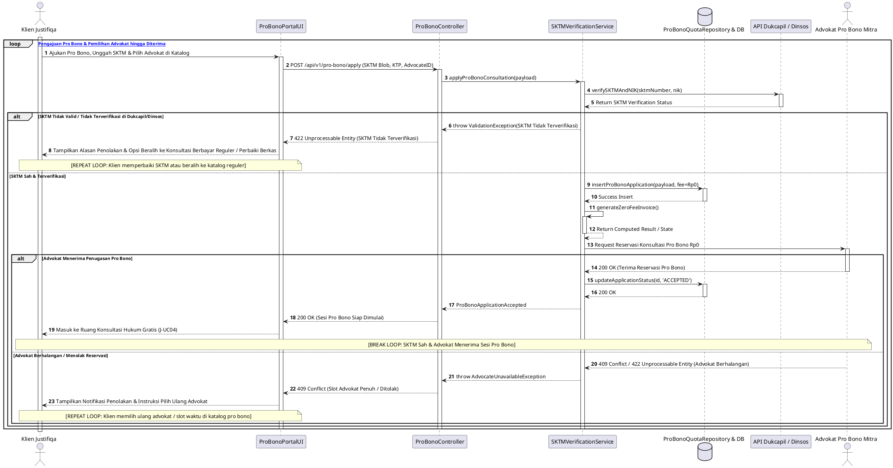
```plantuml
@startuml
autonumber
actor "Klien Justifiqa" as Klien
participant "ProBonoPortalUI" as FE
participant "ProBonoController" as CTRL
participant "SKTMVerificationService" as SVC
database "ProBonoQuotaRepository & DB" as REPO
participant "API Dukcapil / Dinsos" as Ext
actor "Advokat Pro Bono Mitra" as Mitra

activate Klien
loop [Percobaan Pengajuan Pro Bono & Pemilihan Advokat hingga Diterima]
    Klien -> FE ++ : Ajukan Pro Bono, Unggah SKTM & Pilih Advokat di Katalog
    FE -> CTRL ++ : POST /api/v1/pro-bono/apply (SKTM Blob, KTP, AdvocateID)
    CTRL -> SVC ++ : applyProBonoConsultation(payload)
    SVC -> Ext ++ : verifySKTMAndNIK(sktmNumber, nik)
    Ext --> SVC -- : Return SKTM Verification Status

    alt SKTM Tidak Valid / Tidak Terverifikasi di Dukcapil/Dinsos
        SVC --> CTRL : throw ValidationException(SKTM Tidak Terverifikasi)
        CTRL --> FE : 422 Unprocessable Entity (SKTM Tidak Terverifikasi)
        FE --> Klien : Tampilkan Alasan Penolakan & Opsi Beralih ke Konsultasi Berbayar Reguler / Perbaiki Berkas
        note over Klien, FE : [REPEAT LOOP: Klien memperbaiki SKTM atau beralih ke katalog reguler]
    else SKTM Sah & Terverifikasi
        SVC -> REPO : insertProBonoApplication(payload, fee=Rp0)
        activate REPO
        REPO --> SVC : Success Insert
        deactivate REPO
        SVC -> SVC ++ : generateZeroFeeInvoice()
        SVC --> SVC -- : Return Computed Result / State
        SVC -> Mitra ++ : Request Reservasi Konsultasi Pro Bono Rp0
        
        alt Advokat Menerima Penugasan Pro Bono
            Mitra --> SVC -- : 200 OK (Terima Reservasi Pro Bono)
            SVC -> REPO : updateApplicationStatus(id, 'ACCEPTED')
            activate REPO
            REPO --> SVC : 200 OK
            deactivate REPO
            SVC --> CTRL : ProBonoApplicationAccepted
            CTRL --> FE : 200 OK (Sesi Pro Bono Siap Dimulai)
            FE --> Klien : Masuk ke Ruang Konsultasi Hukum Gratis (J-UC04)
            note over Klien, Mitra : [BREAK LOOP: SKTM Sah & Advokat Menerima Sesi Pro Bono]
        else Advokat Berhalangan / Menolak Reservasi
            Mitra --> SVC -- : 409 Conflict / 422 Unprocessable Entity (Advokat Berhalangan)
            SVC --> CTRL : throw AdvocateUnavailableException
            CTRL --> FE : 409 Conflict (Slot Advokat Penuh / Ditolak)
            FE --> Klien : Tampilkan Notifikasi Penolakan & Instruksi Pilih Ulang Advokat
            note over Klien, FE : [REPEAT LOOP: Klien memilih ulang advokat / slot waktu di katalog pro bono]
        end
    end
    deactivate SVC
    deactivate CTRL
    deactivate FE
end
deactivate Klien
@enduml
```

---

### SD-J-08: Membuat Catatan Sesi IRAC Note Advokat (J-UC11)
*Sequence diagram pembuatan catatan terstruktur metode IRAC (Issue, Rule, Application, Conclusion) oleh advokat dengan spesifikasi eksekusi aktif lengkap pada sisi Advokat dan sistem.*

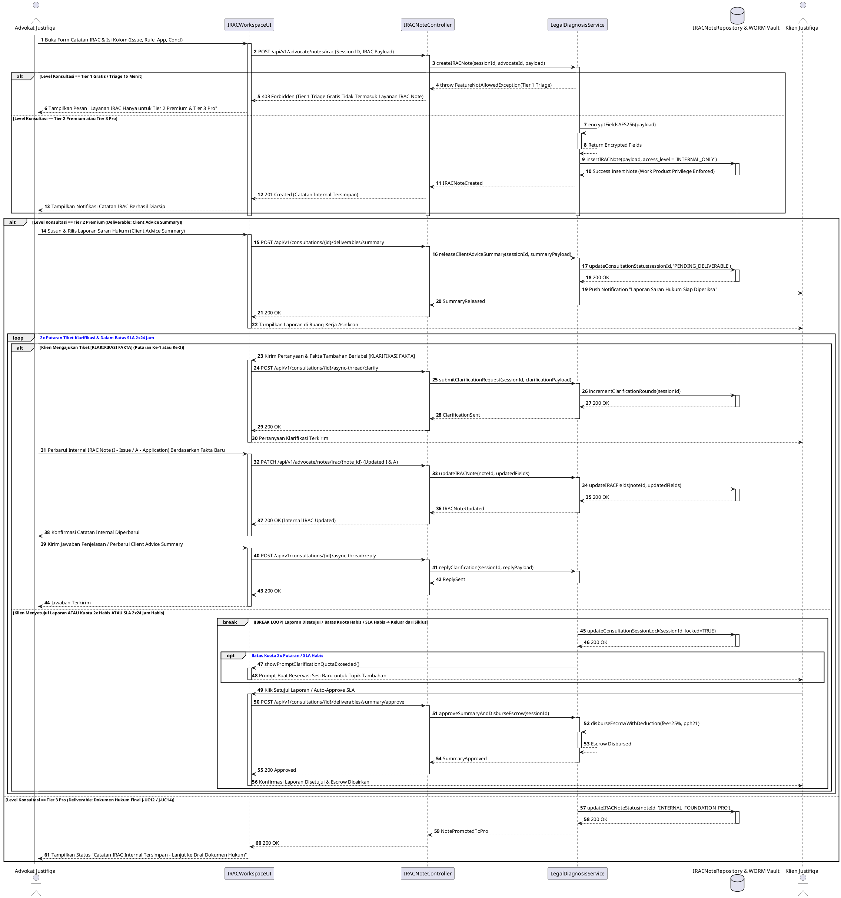
```plantuml
@startuml
autonumber
actor "Advokat Justifiqa" as Mitra
participant "IRACWorkspaceUI" as FE
participant "IRACNoteController" as CTRL
participant "LegalDiagnosisService" as SVC
database "IRACNoteRepository & WORM Vault" as REPO
actor "Klien Justifiqa" as Klien

activate Mitra
Mitra -> FE ++ : Buka Form Catatan IRAC & Isi Kolom (Issue, Rule, App, Concl)
FE -> CTRL ++ : POST /api/v1/advocate/notes/irac (Session ID, IRAC Payload)
CTRL -> SVC ++ : createIRACNote(sessionId, advocateId, payload)

alt Level Konsultasi == Tier 1 Gratis / Triage 15 Menit
    SVC --> CTRL : throw FeatureNotAllowedException(Tier 1 Triage)
    CTRL --> FE : 403 Forbidden (Tier 1 Triage Gratis Tidak Termasuk Layanan IRAC Note)
    FE --> Mitra : Tampilkan Pesan "Layanan IRAC Hanya untuk Tier 2 Premium & Tier 3 Pro"
else Level Konsultasi == Tier 2 Premium atau Tier 3 Pro
    SVC -> SVC ++ : encryptFieldsAES256(payload)
    SVC --> SVC -- : Return Encrypted Fields
    SVC -> REPO : insertIRACNote(payload, access_level = 'INTERNAL_ONLY')
    activate REPO
    REPO --> SVC : Success Insert Note (Work Product Privilege Enforced)
    deactivate REPO
    SVC --> CTRL : IRACNoteCreated
    CTRL --> FE : 201 Created (Catatan Internal Tersimpan)
    FE --> Mitra : Tampilkan Notifikasi Catatan IRAC Berhasil Diarsip
end
deactivate SVC
deactivate CTRL
deactivate FE

alt Level Konsultasi == Tier 2 Premium (Deliverable: Client Advice Summary)
    Mitra -> FE ++ : Susun & Rilis Laporan Saran Hukum (Client Advice Summary)
    FE -> CTRL ++ : POST /api/v1/consultations/{id}/deliverables/summary
    CTRL -> SVC ++ : releaseClientAdviceSummary(sessionId, summaryPayload)
    SVC -> REPO : updateConsultationStatus(sessionId, 'PENDING_DELIVERABLE')
    activate REPO
    REPO --> SVC : 200 OK
    deactivate REPO
    SVC -> Klien : Push Notification "Laporan Saran Hukum Siap Diperiksa"
    SVC --> CTRL : SummaryReleased
    deactivate SVC
    CTRL --> FE : 200 OK
    deactivate CTRL
    FE --> Klien : Tampilkan Laporan di Ruang Kerja Asinkron
    deactivate FE

    loop [Maksimal 2x Putaran Tiket Klarifikasi & Dalam Batas SLA 2x24 Jam]
        alt Klien Mengajukan Tiket [KLARIFIKASI FAKTA] (Putaran Ke-1 atau Ke-2)
            Klien -> FE ++ : Kirim Pertanyaan & Fakta Tambahan Berlabel [KLARIFIKASI FAKTA]
            FE -> CTRL ++ : POST /api/v1/consultations/{id}/async-thread/clarify
            CTRL -> SVC ++ : submitClarificationRequest(sessionId, clarificationPayload)
            SVC -> REPO : incrementClarificationRounds(sessionId)
            activate REPO
            REPO --> SVC : 200 OK
            deactivate REPO
            SVC --> CTRL : ClarificationSent
            deactivate SVC
            CTRL --> FE : 200 OK
            deactivate CTRL
            FE --> Klien : Pertanyaan Klarifikasi Terkirim
            deactivate FE
            
            Mitra -> FE ++ : Perbarui Internal IRAC Note (I - Issue / A - Application) Berdasarkan Fakta Baru
            FE -> CTRL ++ : PATCH /api/v1/advocate/notes/irac/{note_id} (Updated I & A)
            CTRL -> SVC ++ : updateIRACNote(noteId, updatedFields)
            SVC -> REPO : updateIRACFields(noteId, updatedFields)
            activate REPO
            REPO --> SVC : 200 OK
            deactivate REPO
            SVC --> CTRL : IRACNoteUpdated
            deactivate SVC
            CTRL --> FE : 200 OK (Internal IRAC Updated)
            deactivate CTRL
            FE --> Mitra : Konfirmasi Catatan Internal Diperbarui
            deactivate FE
            
            Mitra -> FE ++ : Kirim Jawaban Penjelasan / Perbarui Client Advice Summary
            FE -> CTRL ++ : POST /api/v1/consultations/{id}/async-thread/reply
            CTRL -> SVC ++ : replyClarification(sessionId, replyPayload)
            SVC --> CTRL : ReplySent
            deactivate SVC
            CTRL --> FE : 200 OK
            deactivate CTRL
            FE --> Mitra : Jawaban Terkirim
            deactivate FE
        else Klien Menyetujui Laporan ATAU Kuota 2x Habis ATAU SLA 2x24 Jam Habis
            break [BREAK LOOP] Laporan Disetujui / Batas Kuota Habis / SLA Habis -> Keluar dari Siklus
                SVC -> REPO : updateConsultationSessionLock(sessionId, locked=TRUE)
                activate REPO
                REPO --> SVC : 200 OK
                deactivate REPO
                opt [Jika Batas Kuota 2x Putaran / SLA Habis]
                    SVC -> FE ++ : showPromptClarificationQuotaExceeded()
                    FE --> Klien : Prompt Buat Reservasi Sesi Baru untuk Topik Tambahan
                    deactivate FE
                end
                Klien -> FE ++ : Klik Setujui Laporan / Auto-Approve SLA
                FE -> CTRL ++ : POST /api/v1/consultations/{id}/deliverables/summary/approve
                CTRL -> SVC ++ : approveSummaryAndDisburseEscrow(sessionId)
                SVC -> SVC ++ : disburseEscrowWithDeduction(fee=25%, pph21)
                SVC --> SVC -- : Escrow Disbursed
                SVC --> CTRL : SummaryApproved
                deactivate SVC
                CTRL --> FE : 200 Approved
                deactivate CTRL
                FE --> Klien : Konfirmasi Laporan Disetujui & Escrow Dicairkan
                deactivate FE
            end
        end
    end
else Level Konsultasi == Tier 3 Pro (Deliverable: Dokumen Hukum Final J-UC12 / J-UC14)
    SVC -> REPO : updateIRACNoteStatus(noteId, 'INTERNAL_FOUNDATION_PRO')
    activate REPO
    REPO --> SVC : 200 OK
    deactivate REPO
    SVC --> CTRL : NotePromotedToPro
    CTRL --> FE : 200 OK
    FE --> Mitra : Tampilkan Status "Catatan IRAC Internal Tersimpan - Lanjut ke Draf Dokumen Hukum"
end
deactivate Mitra
@enduml
```

---

### SD-J-09: Verifikasi Kredensial & Sanitasi Profil/Media 3-Lapisan Advokat Mitra (J-UC16)
*Sequence diagram audit verifikasi keabsahan lisensi profesi Peradi serta pertahanan 3-Lapisan sanitasi profil/media anti-bypass kontak pribadi dengan spesifikasi eksekusi aktif lengkap pada sisi Admin, Advokat (actor), dan sistem.*

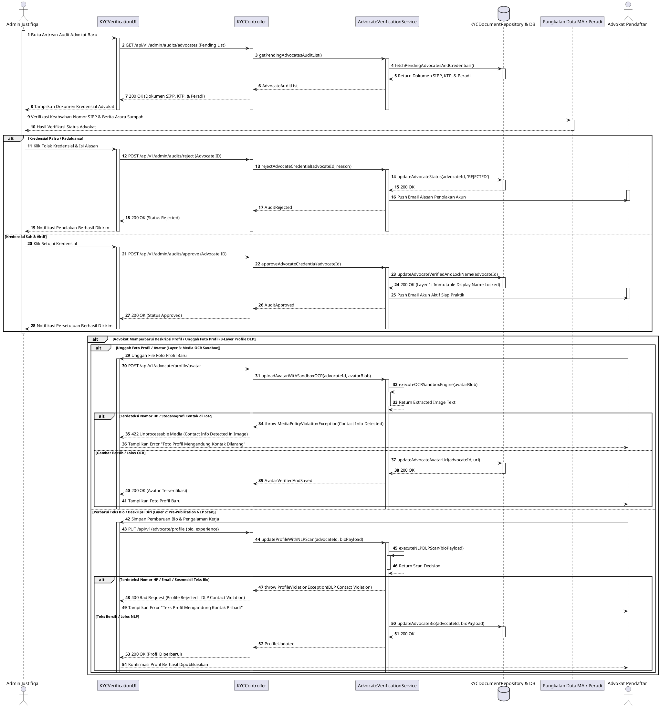
```plantuml
@startuml
autonumber
actor "Admin Justifiqa" as Admin
participant "KYCVerificationUI" as FE
participant "KYCController" as CTRL
participant "AdvocateVerificationService" as SVC
database "KYCDocumentRepository & DB" as REPO
participant "Pangkalan Data MA / Peradi" as Peradi
actor "Advokat Pendaftar" as Mitra

activate Admin
Admin -> FE ++ : Buka Antrean Audit Advokat Baru
FE -> CTRL ++ : GET /api/v1/admin/audits/advocates (Pending List)
CTRL -> SVC ++ : getPendingAdvocatesAuditList()
SVC -> REPO : fetchPendingAdvocatesAndCredentials()
activate REPO
REPO --> SVC : Return Dokumen SIPP, KTP, & Peradi
deactivate REPO
SVC --> CTRL : AdvocateAuditList
CTRL --> FE : 200 OK (Dokumen SIPP, KTP, & Peradi)
FE --> Admin : Tampilkan Dokumen Kredensial Advokat
deactivate SVC
deactivate CTRL
deactivate FE

Admin -> Peradi ++ : Verifikasi Keabsahan Nomor SIPP & Berita Acara Sumpah
Peradi --> Admin -- : Hasil Verifikasi Status Advokat

alt Kredensial Palsu / Kadaluarsa
    Admin -> FE ++ : Klik Tolak Kredensial & Isi Alasan
    FE -> CTRL ++ : POST /api/v1/admin/audits/reject (Advocate ID)
    CTRL -> SVC ++ : rejectAdvocateCredential(advocateId, reason)
    SVC -> REPO : updateAdvocateStatus(advocateId, 'REJECTED')
    activate REPO
    REPO --> SVC : 200 OK
    deactivate REPO
    activate Mitra
    SVC -> Mitra : Push Email Alasan Penolakan Akun
    deactivate Mitra
    SVC --> CTRL : AuditRejected
    CTRL --> FE : 200 OK (Status Rejected)
    FE --> Admin : Notifikasi Penolakan Berhasil Dikirim
    deactivate SVC
    deactivate CTRL
    deactivate FE
else Kredensial Sah & Aktif
    Admin -> FE ++ : Klik Setujui Kredensial
    FE -> CTRL ++ : POST /api/v1/admin/audits/approve (Advocate ID)
    CTRL -> SVC ++ : approveAdvocateCredential(advocateId)
    SVC -> REPO : updateAdvocateVerifiedAndLockName(advocateId)
    activate REPO
    REPO --> SVC : 200 OK (Layer 1: Immutable Display Name Locked)
    deactivate REPO
    activate Mitra
    SVC -> Mitra : Push Email Akun Aktif Siap Praktik
    deactivate Mitra
    SVC --> CTRL : AuditApproved
    CTRL --> FE : 200 OK (Status Approved)
    FE --> Admin : Notifikasi Persetujuan Berhasil Dikirim
    deactivate SVC
    deactivate CTRL
    deactivate FE
end
deactivate Admin

alt Advokat Memperbarui Deskripsi Profil / Unggah Foto Profil (3-Layer Profile DLP)
    alt Unggah Foto Profil / Avatar (Layer 3: Media OCR Sandbox)
        activate Mitra
        Mitra -> FE ++ : Unggah File Foto Profil Baru
        FE -> CTRL ++ : POST /api/v1/advocate/profile/avatar
        CTRL -> SVC ++ : uploadAvatarWithSandboxOCR(advocateId, avatarBlob)
        SVC -> SVC ++ : executeOCRSandboxEngine(avatarBlob)
        SVC --> SVC -- : Return Extracted Image Text
        alt Terdeteksi Nomor HP / Steganografi Kontak di Foto
            SVC --> CTRL : throw MediaPolicyViolationException(Contact Info Detected)
            CTRL --> FE : 422 Unprocessable Media (Contact Info Detected in Image)
            FE --> Mitra : Tampilkan Error "Foto Profil Mengandung Kontak Dilarang"
        else Gambar Bersih / Lolos OCR
            SVC -> REPO : updateAdvocateAvatarUrl(advocateId, url)
            activate REPO
            REPO --> SVC : 200 OK
            deactivate REPO
            SVC --> CTRL : AvatarVerifiedAndSaved
            CTRL --> FE : 200 OK (Avatar Terverifikasi)
            FE --> Mitra : Tampilkan Foto Profil Baru
        end
        deactivate SVC
        deactivate CTRL
        deactivate FE
        deactivate Mitra
    else Perbarui Teks Bio / Deskripsi Diri (Layer 2: Pre-Publication NLP Scan)
        activate Mitra
        Mitra -> FE ++ : Simpan Pembaruan Bio & Pengalaman Kerja
        FE -> CTRL ++ : PUT /api/v1/advocate/profile {bio, experience}
        CTRL -> SVC ++ : updateProfileWithNLPScan(advocateId, bioPayload)
        SVC -> SVC ++ : executeNLPDLPScan(bioPayload)
        SVC --> SVC -- : Return Scan Decision
        alt Terdeteksi Nomor HP / Email / Sosmed di Teks Bio
            SVC --> CTRL : throw ProfileViolationException(DLP Contact Violation)
            CTRL --> FE : 400 Bad Request (Profile Rejected - DLP Contact Violation)
            FE --> Mitra : Tampilkan Error "Teks Profil Mengandung Kontak Pribadi"
        else Teks Bersih / Lolos NLP
            SVC -> REPO : updateAdvocateBio(advocateId, bioPayload)
            activate REPO
            REPO --> SVC : 200 OK
            deactivate REPO
            SVC --> CTRL : ProfileUpdated
            CTRL --> FE : 200 OK (Profil Diperbarui)
            FE --> Mitra : Konfirmasi Profil Berhasil Dipublikasikan
        end
        deactivate SVC
        deactivate CTRL
        deactivate FE
        deactivate Mitra
    end
end
@enduml
```

---

### SD-J-10: Moderasi Akun, Deteksi Fraud Perilaku, & Due Process Suspend Admin Justifiqa (J-UC17)
*Sequence diagram penanganan laporan pelanggaran kode etik, investigasi Due Process of Law, deteksi fraud perilaku (e.g. drop-off < 5 menit), pengajuan sanggahan, dan putusan akhir akun advokat (Reputational Death).*

```plantuml
@startuml
title Sequence Diagram: SD-J-10 - Moderasi Akun, Deteksi Fraud Perilaku, & Due Process Suspend Admin Justifiqa (J-UC17)
autonumber
actor "Admin Justifiqa" as Admin
participant "AdminModerationUI" as FE
participant "ModerationController" as CTRL
participant "FraudDetectionService" as SVC
database "AccountAuditRepository & DB" as REPO
database "WORM Hash Storage" as WORM
actor "Advokat Terlapor" as Mitraactivate Admin
Admin -> FE ++ : Buka Antrean Investigasi Moderasi (Menerima Laporan Klien J-UC21 ATAU Security Alert DLP Backend)
FE -> CTRL ++ : GET /api/v1/admin/moderation/reports
CTRL -> SVC ++ : listModerationReports()
SVC -> REPO : fetchReportsAndWORMProofs()
activate REPO
REPO --> SVC : Return Daftar Laporan & Bukti WORM SHA-256 / Log Anomali
deactivate REPO
SVC --> CTRL : ModerationReportsList
CTRL --> FE : 200 OK (Daftar Laporan & Bukti WORM SHA-256)
FE --> Admin : Tampilkan Daftar Laporan & Bukti SHA-256
deactivate SVC
deactivate CTRL
deactivate FE

Admin -> FE ++ : Pilih Akun Advokat & Periksa Keabsahan Bukti Awal / Skor Anomali

alt Bukti Permulaan Tidak Sah / Laporan Palsu (SHA-256 Invalid)
    Admin -> FE : Klik Tolak & Arsip Laporan (Clear / Dismiss)
    FE -> CTRL ++ : POST /api/v1/admin/moderation/dismiss {report_id}
    CTRL -> SVC ++ : dismissReport(reportId)
    SVC -> REPO : updateReportStatus(reportId, 'DISMISSED')
    activate REPO
    REPO --> SVC : 200 OK
    deactivate REPO
    SVC --> CTRL : ReportDismissed
    CTRL --> FE : 200 OK (Laporan Diabaikan)
    FE --> Admin : Tampilkan Status Laporan Tidak Terbukti (Clear)
    deactivate SVC
    deactivate CTRL
else Bukti Permulaan Sah & Terverifikasi SHA-256
    alt Pelanggaran Ringan / Administratif (Tanpa Suspend Akun)
        Admin -> FE : Klik Terbitkan Peringatan Tertulis / Pembinaan
        FE -> CTRL ++ : POST /api/v1/admin/moderation/warning {advocate_id, reason}
        CTRL -> SVC ++ : issueWrittenWarning(advocateId, reason)
        par Catat Surat Teguran ke WORM Storage
            SVC -> WORM : storeWarningLetterWORM(advocateId, reason)
            activate WORM
            WORM --> SVC : 200 OK (WORM Hash Stamped / Recorded)
            deactivate WORM
        else Kirim Notifikasi & Surat ke Advokat
            activate Mitra
            SVC -> Mitra : Kirim Email & Push Notifikasi Surat Peringatan
            Mitra --> SVC : Menerima & Membaca Surat Peringatan Tertulis
            deactivate Mitra
        end
        SVC --> CTRL : WarningIssued
        CTRL --> FE : 200 OK (Warning Issued)
        FE --> Admin : Tampilkan Status Peringatan Terkirim
        deactivate SVC
        deactivate CTRL
    else Pelanggaran Berat / Kritis (Due Process Suspend)
        Admin -> FE : Klik "🛑 Suspend Akun & Kirim Panggilan Klarifikasi"
        FE -> CTRL ++ : POST /api/v1/admin/moderation/suspend {advocate_id, reason}
        CTRL -> SVC ++ : executeDueProcessSuspend(advocateId, reason)
        SVC -> REPO : updateAccountStatus(advocateId, 'SUSPENDED', catalog='UNLISTED')
        activate REPO
        REPO --> SVC : 200 OK
        deactivate REPO
        SVC -> REPO : queryActiveConsultations(advocateId, status='IN_PROGRESS')
        activate REPO
        REPO --> SVC : Return Active Consultation State
        deactivate REPO

        alt Mitra Sedang Dalam Sesi Konsultasi Aktif (IN_PROGRESS - Rows > 0)
            SVC -> REPO : freezeEscrowLedger(sessionId, status='FROZEN_IN_ESCROW')
            activate REPO
            REPO --> SVC : 200 OK (Graceful Finish Allowed & Escrow Frozen)
            deactivate REPO
        else Tidak Ada Sesi Aktif (Idle - Rows == 0)
            note over SVC, REPO : [Mitra dalam kondisi Idle, tidak ada sesi konsultasi yang berjalan]
        end

        SVC -> REPO : cancelUpcomingReservationsAndRefund100Percent()
        activate REPO
        REPO --> SVC : 200 OK (Refund Processed)
        deactivate REPO
        SVC -> WORM : generateAndStoreSummonsLetterWORM(advocateId)
        activate WORM
        WORM --> SVC : 200 OK (WORM Hash Stamped / Recorded)
        deactivate WORM
        SVC -> REPO : startAppealTimer14Days(advocateId)
        activate REPO
        REPO --> SVC : 200 OK
        deactivate REPO
        SVC --> CTRL : DueProcessSummonsSent
        CTRL --> FE : 200 OK (Status Suspended & Surat Panggilan Terkirim)
        FE --> Admin : Tampilkan Konfirmasi Suspend & Timer 14 Hari
        deactivate SVC
        deactivate CTRL
        
        activate Mitra
        CTRL -> Mitra : Push Email, SMS, & Push Notifikasi Panggilan Klarifikasi
        Mitra -> CTRL ++ : GET /api/v1/advocate/moderation/status
        CTRL -> SVC ++ : getModerationCaseStatus(advocateId)
        SVC -> WORM : fetchSummonsAndProof(advocateId)
        activate WORM
        WORM --> SVC : Return Surat Panggilan & Proof
        deactivate WORM
        SVC --> CTRL : ModerationStatusPayload
        CTRL --> Mitra : Return Surat Panggilan Ber-hash SHA-256 & Timer 14 Hari
        deactivate SVC
        deactivate CTRL
        
        alt Advokat Mengajukan Berkas Sanggahan (Dalam Masa 14 Hari)
            Mitra -> CTRL ++ : POST /api/v1/advocate/moderation/appeal (Defense Doc PDF)
            CTRL -> SVC ++ : submitAppealDefense(advocateId, defenseDoc)
            SVC -> WORM : storeDefenseDocWORM(defenseDoc)
            activate WORM
            WORM --> SVC : 200 OK (WORM Hash Stamped / Recorded)
            deactivate WORM
            SVC --> CTRL : AppealSubmitted
            CTRL -> FE : Push Notifikasi Ada Bukti Sanggahan Baru Masuk
            CTRL --> Mitra : 200 OK (Sanggahan Diterima)
            deactivate SVC
            deactivate CTRL
            deactivate Mitra
        else Tidak Mengajukan Sanggahan / Timer 14 Hari Habis (Putusan Verstek)
            CTRL -> SVC ++ : handleVerstekDefaultVerdict(advocateId)
            SVC -> REPO : updateDefenseStatus(advocateId, 'NO_DEFENSE_VERSTEK')
            activate REPO
            REPO --> SVC : 200 OK
            deactivate REPO
            SVC --> CTRL : VerstekReady
            CTRL -> FE : Push Notifikasi Masa Sanggah Habis (Siap Putusan Verstek)
            deactivate SVC
            deactivate CTRL
            deactivate Mitra
        end
        
        Admin -> FE : Review Berkas & Input Putusan Akhir Sidang Etik
        alt Terbukti Bersalah (Sanksi Reputational Death & Pemecatan Permanen)
            FE -> CTRL ++ : POST /api/v1/admin/moderation/verdict {verdict: 'GUILTY'}
            CTRL -> SVC ++ : enforceGuiltyVerdictReputationalDeath(advocateId)
            SVC -> REPO : revokeAdvocatePermanently(advocateId, reputationScore=0)
            activate REPO
            REPO --> SVC : 200 OK
            deactivate REPO
            SVC -> WORM : generateAndStoreRevocationDecreeWORM(advocateId)
            activate WORM
            WORM --> SVC : 200 OK
            deactivate WORM
            SVC -> SVC ++ : reportDigitalIntegrityViolationToPeradi(advocateId)
            SVC --> SVC -- : Report Confirmation
            SVC --> CTRL : VerdictExecuted
            CTRL --> FE : 200 OK (Verdict & External Report Executed)
            FE --> Admin : Tampilkan Status Pemecatan Permanen & Dilaporkan ke Peradi
            activate Mitra
            CTRL -> Mitra : Kirim Email SK Pemecatan Permanen & Pemberitahuan Laporan Peradi
            deactivate Mitra
            deactivate SVC
            deactivate CTRL
        else Tidak Terbukti / Rehabilitasi (Unsuspend)
            FE -> CTRL ++ : POST /api/v1/admin/moderation/verdict {verdict: 'REHABILITATED'}
            CTRL -> SVC ++ : rehabilitateAdvocateAccount(advocateId)
            SVC -> REPO : restoreAdvocateStatusActive(advocateId)
            activate REPO
            REPO --> SVC : 200 OK
            deactivate REPO
            SVC -> WORM : generateAndStoreRehabilitationLetterWORM(advocateId)
            activate WORM
            WORM --> SVC : 200 OK
            deactivate WORM
            SVC --> CTRL : AccountRehabilitated
            CTRL --> FE : 200 OK (Account Rehabilitated)
            FE --> Admin : Tampilkan Status Rehabilitasi Berhasil
            activate Mitra
            CTRL -> Mitra : Kirim Email Pemulihan Akun & Pembukaan Katalog
            deactivate Mitra
            deactivate SVC
            deactivate CTRL
        end
    end
end
deactivate FE
deactivate Admin
@enduml
```

---

### SD-J-11: Pencairan Dana Escrow & Perhitungan PPh 21 Advokat (J-UC19)
*Sequence diagram penarikan dana honorarium advokat dari dompet digital ke rekening bank pribadi, pemotongan pajak PPh 21 otomatis, dan auto-rollback jika transfer gagal dengan spesifikasi eksekusi aktif lengkap pada sisi Advokat dan sistem.*

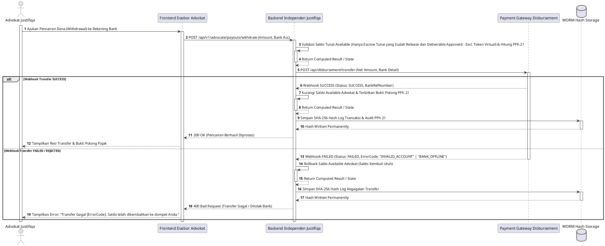
```plantuml
@startuml
autonumber
actor "Advokat Justifiqa" as Mitra
participant "Frontend Dasbor Advokat" as FE
participant "Backend Independen Justifiqa" as BE
participant "Payment Gateway Disbursement" as PG
database "WORM Hash Storage" as WORM

activate Mitra
Mitra -> FE ++ : Ajukan Pencairan Dana (Withdrawal) ke Rekening Bank
FE -> BE ++ : POST /api/v1/advocate/payouts/withdraw (Amount, Bank Acc)

BE -> BE ++ : Validasi Saldo Tunai Available (Hanya Escrow Tunai yang Sudah Release dari Deliverable Approved - Excl. Token Virtual) & Hitung PPh 21
BE --> BE -- : Return Computed Result / State
BE -> PG ++ : POST /api/disbursement/transfer (Net Amount, Bank Detail)

alt Webhook Transfer SUCCESS
    PG --> BE : Webhook SUCCESS (Status: SUCCESS, BankRefNumber)
    BE -> BE ++ : Kurangi Saldo Available Advokat & Terbitkan Bukti Potong PPh 21
    BE --> BE -- : Return Computed Result / State
    BE -> WORM ++ : Simpan SHA-256 Hash Log Transaksi & Audit PPh 21
    WORM --> BE -- : Hash Written Permanently
    BE --> FE : 200 OK (Pencairan Berhasil Diproses)
    FE --> Mitra : Tampilkan Resi Transfer & Bukti Potong Pajak
else Webhook Transfer FAILED / REJECTED
    PG --> BE -- : Webhook FAILED (Status: FAILED, ErrorCode: "INVALID_ACCOUNT" | "BANK_OFFLINE")
    BE -> BE ++ : Rollback Saldo Available Advokat (Saldo Kembali Utuh)
    BE --> BE -- : Return Computed Result / State
    BE -> WORM ++ : Simpan SHA-256 Hash Log Kegagalan Transfer
    WORM --> BE -- : Hash Written Permanently
    BE --> FE : 400 Bad Request (Transfer Gagal / Ditolak Bank)
    FE --> Mitra : Tampilkan Error: "Transfer Gagal [ErrorCode]. Saldo telah dikembalikan ke dompet Anda."
end
deactivate BE
deactivate FE
deactivate Mitra
@enduml
```

---

### SD-J-12: Memantau Laporan Keuangan Escrow & Audit WORM (J-UC18)
*Sequence diagram pengawasan buku besar escrow, verifikasi bagi hasil platform (25%/75%), dan eksport bukti pajak PPh 21 ber-hash WORM SHA-256 oleh Admin Justifiqa dengan spesifikasi eksekusi aktif lengkap pada sisi Admin dan sistem.*

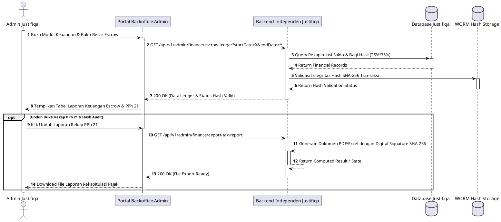
```plantuml
@startuml
autonumber
actor "Admin Justifiqa" as Admin
participant "Portal Backoffice Admin" as FE
participant "Backend Independen Justifiqa" as BE
database "Database Justifiqa" as DB
database "WORM Hash Storage" as WORM

activate Admin
Admin -> FE ++ : Buka Modul Keuangan & Buku Besar Escrow
FE -> BE ++ : GET /api/v1/admin/finance/escrow-ledger?startDate=X&endDate=Y
BE -> DB ++ : Query Rekapitulasi Saldo & Bagi Hasil (25%/75%)
DB --> BE -- : Return Financial Records
BE -> WORM ++ : Validasi Integritas Hash SHA-256 Transaksi
WORM --> BE -- : Return Hash Validation Status
BE --> FE -- : 200 OK (Data Ledger & Status Hash Valid)
FE --> Admin : Tampilkan Tabel Laporan Keuangan Escrow & PPh 21

opt Unduh Bukti Rekap PPh 21 & Hash Audit
    Admin -> FE ++ : Klik Unduh Laporan Rekap PPh 21
    FE -> BE ++ : GET /api/v1/admin/finance/export-tax-report
    BE -> BE ++ : Generate Dokumen PDF/Excel dengan Digital Signature SHA-256
    BE --> BE -- : Return Computed Result / State
    BE --> FE -- : 200 OK (File Export Ready)
    FE --> Admin : Download File Laporan Rekapitulasi Pajak
end
deactivate Admin
@enduml
```

---

### SD-J-13: Memberikan Ulasan & Rating Advokat (J-UC06)
*Sequence diagram pemberian penilaian pasca-sesi konsultasi dengan proteksi privasi anonimisasi nama publik sesuai UU PDP dan kalkulasi agregat rating otomatis dengan spesifikasi eksekusi aktif lengkap pada sisi Klien dan sistem.*

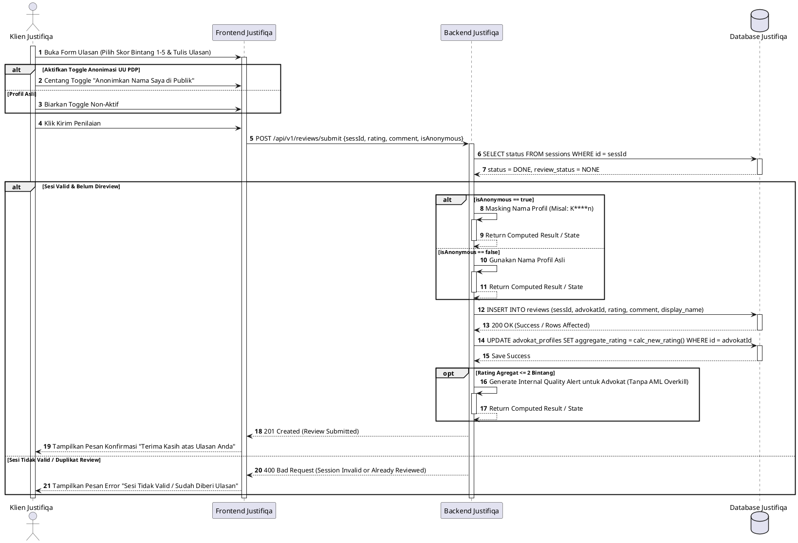
```plantuml
@startuml
autonumber
actor "Klien Justifiqa" as Klien
participant "Frontend Justifiqa" as FE
participant "Backend Justifiqa" as BE
database "Database Justifiqa" as DB

activate Klien
Klien -> FE ++ : Buka Form Ulasan (Pilih Skor Bintang 1-5 & Tulis Ulasan)
alt Aktifkan Toggle Anonimasi UU PDP
    Klien -> FE : Centang Toggle "Anonimkan Nama Saya di Publik"
else Profil Asli
    Klien -> FE : Biarkan Toggle Non-Aktif
end
Klien -> FE : Klik Kirim Penilaian
FE -> BE ++ : POST /api/v1/reviews/submit {sessId, rating, comment, isAnonymous}
BE -> DB ++ : SELECT status FROM sessions WHERE id = sessId
DB --> BE -- : status = DONE, review_status = NONE

alt Sesi Valid & Belum Direview
    alt isAnonymous == true
        BE -> BE ++ : Masking Nama Profil (Misal: K****n)
        BE --> BE -- : Return Computed Result / State
    else isAnonymous == false
        BE -> BE ++ : Gunakan Nama Profil Asli
        BE --> BE -- : Return Computed Result / State
    end
    BE -> DB ++ : INSERT INTO reviews (sessId, advokatId, rating, comment, display_name)
    DB --> BE -- : 200 OK (Success / Rows Affected)
    BE -> DB ++ : UPDATE advokat_profiles SET aggregate_rating = calc_new_rating() WHERE id = advokatId
    DB --> BE -- : Save Success
    
    opt Rating Agregat <= 2 Bintang
        BE -> BE ++ : Generate Internal Quality Alert untuk Advokat (Tanpa AML Overkill)
        BE --> BE -- : Return Computed Result / State
    end
    
    BE --> FE : 201 Created (Review Submitted)
    FE --> Klien : Tampilkan Pesan Konfirmasi "Terima Kasih atas Ulasan Anda"
else Sesi Tidak Valid / Duplikat Review
    BE --> FE : 400 Bad Request (Session Invalid or Already Reviewed)
    FE --> Klien : Tampilkan Pesan Error "Sesi Tidak Valid / Sudah Diberi Ulasan"
end
deactivate BE
deactivate FE
deactivate Klien
@enduml
```

---

### SD-J-14: [DILEBUR KE DALAM SD-J-06]
*Catatan: Skenario J-UC14 (Pembubuhan e-Meterai Peruri) telah ditiadakan sebagai diagram mandiri dan dilebur seutuhnya ke dalam **SD-J-06 (J-UC12, J-UC14)** sebagai alur kerja terpadu perumusan dan finalisasi dokumen bermeterai yang difasilitasi platform (*Platform-Facilitated Stamping*) dengan pemotongan saldo dompet advokat.*

### SD-J-21: Melaporkan Dugaan Pelanggaran Etik Advokat (J-UC21)
*Sequence diagram pengajuan laporan dugaan pelanggaran kode etik, kerahasiaan, atau wanprestasi advokat oleh klien beserta lampiran barang bukti digital terverifikasi SHA-256.*

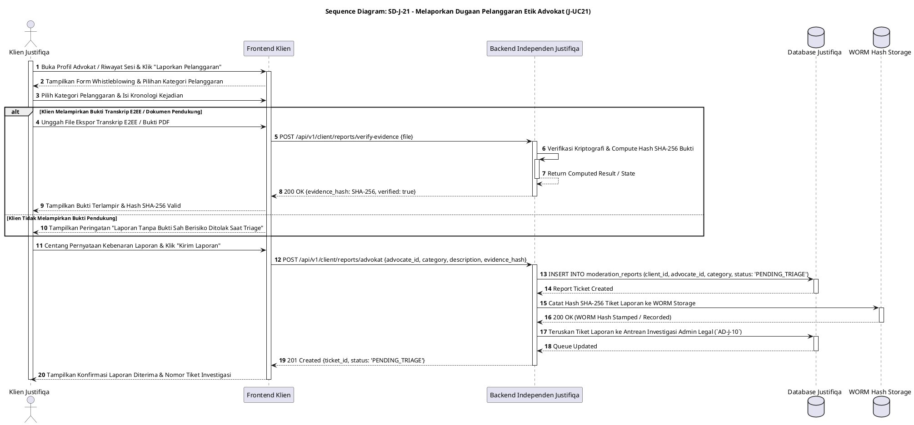
```plantuml
@startuml
title Sequence Diagram: SD-J-21 - Melaporkan Dugaan Pelanggaran Etik Advokat (J-UC21)
autonumber
actor "Klien Justifiqa" as Klien
participant "Frontend Klien" as FE
participant "Backend Independen Justifiqa" as BE
database "Database Justifiqa" as DB
database "WORM Hash Storage" as WORM

activate Klien
Klien -> FE ++ : Buka Profil Advokat / Riwayat Sesi & Klik "Laporkan Pelanggaran"
FE --> Klien : Tampilkan Form Whistleblowing & Pilihan Kategori Pelanggaran
Klien -> FE : Pilih Kategori Pelanggaran & Isi Kronologi Kejadian

alt Klien Melampirkan Bukti Transkrip E2EE / Dokumen Pendukung
    Klien -> FE : Unggah File Ekspor Transkrip E2EE / Bukti PDF
    FE -> BE ++ : POST /api/v1/client/reports/verify-evidence {file}
    BE -> BE ++ : Verifikasi Kriptografi & Compute Hash SHA-256 Bukti
    BE --> BE -- : Return Computed Result / State
    BE --> FE -- : 200 OK {evidence_hash: SHA-256, verified: true}
    FE --> Klien : Tampilkan Bukti Terlampir & Hash SHA-256 Valid
else Klien Tidak Melampirkan Bukti Pendukung
    FE --> Klien : Tampilkan Peringatan "Laporan Tanpa Bukti Sah Berisiko Ditolak Saat Triage"
end

Klien -> FE : Centang Pernyataan Kebenaran Laporan & Klik "Kirim Laporan"
FE -> BE ++ : POST /api/v1/client/reports/advokat {advocate_id, category, description, evidence_hash}
BE -> DB ++ : INSERT INTO moderation_reports (client_id, advocate_id, category, status: 'PENDING_TRIAGE')
DB --> BE -- : Report Ticket Created
BE -> WORM ++ : Catat Hash SHA-256 Tiket Laporan ke WORM Storage
WORM --> BE -- : 200 OK (WORM Hash Stamped / Recorded)
BE -> DB ++ : Teruskan Tiket Laporan ke Antrean Investigasi Admin Legal (`AD-J-10`)
DB --> BE -- : Queue Updated
BE --> FE -- : 201 Created {ticket_id, status: 'PENDING_TRIAGE'}
FE --> Klien : Tampilkan Konfirmasi Laporan Diterima & Nomor Tiket Investigasi
deactivate FE
deactivate Klien
@enduml
```

---

### SD-J-22: Mengisi Saldo Dompet Advokat (Top-Up / Cash-In - J-UC22)
*Sequence diagram pengisian saldo dompet digital advokat melalui Payment Gateway (Snap / QRIS / VA) untuk membayar layanan berbayar platform tanpa potongan pajak PPh 21 dengan spesifikasi eksekusi aktif lengkap pada sisi Advokat dan sistem.*

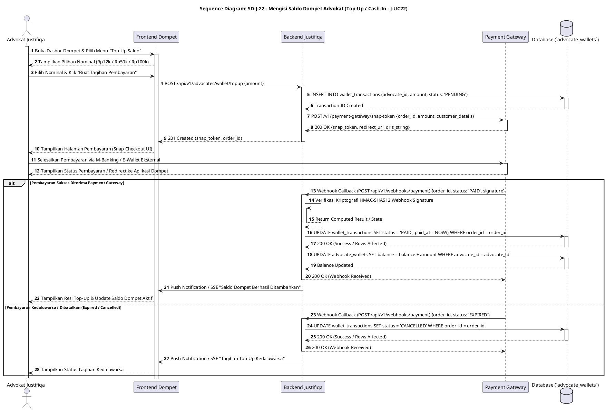
```plantuml
@startuml
title Sequence Diagram: SD-J-22 - Mengisi Saldo Dompet Advokat (Top-Up / Cash-In - J-UC22)
autonumber
actor "Advokat Justifiqa" as Mitra
participant "Frontend Dompet" as FE
participant "Backend Justifiqa" as BE
participant "Payment Gateway" as PG
database "Database (`advocate_wallets`)" as DB

activate Mitra
Mitra -> FE ++ : Buka Dasbor Dompet & Pilih Menu "Top-Up Saldo"
FE --> Mitra : Tampilkan Pilihan Nominal (Rp12k / Rp50k / Rp100k)
Mitra -> FE : Pilih Nominal & Klik "Buat Tagihan Pembayaran"
FE -> BE ++ : POST /api/v1/advocates/wallet/topup {amount}

BE -> DB ++ : INSERT INTO wallet_transactions (advocate_id, amount, status: 'PENDING')
DB --> BE -- : Transaction ID Created
BE -> PG ++ : POST /v1/payment-gateway/snap-token {order_id, amount, customer_details}
PG --> BE -- : 200 OK {snap_token, redirect_url, qris_string}
BE --> FE -- : 201 Created {snap_token, order_id}
FE --> Mitra : Tampilkan Halaman Pembayaran (Snap Checkout UI)

Mitra -> PG ++ : Selesaikan Pembayaran via M-Banking / E-Wallet Eksternal
PG --> Mitra -- : Tampilkan Status Pembayaran / Redirect ke Aplikasi Dompet

alt Pembayaran Sukses Diterima Payment Gateway
    PG -> BE ++ : Webhook Callback (POST /api/v1/webhooks/payment) {order_id, status: 'PAID', signature}
    BE -> BE ++ : Verifikasi Kriptografi HMAC-SHA512 Webhook Signature
    BE --> BE -- : Return Computed Result / State
    BE -> DB ++ : UPDATE wallet_transactions SET status = 'PAID', paid_at = NOW() WHERE order_id = order_id
    DB --> BE -- : 200 OK (Success / Rows Affected)
    BE -> DB ++ : UPDATE advocate_wallets SET balance = balance + amount WHERE advocate_id = advocate_id
    DB --> BE -- : Balance Updated
    BE --> PG -- : 200 OK (Webhook Received)
    
    BE -> FE : Push Notification / SSE "Saldo Dompet Berhasil Ditambahkan"
    FE --> Mitra : Tampilkan Resi Top-Up & Update Saldo Dompet Aktif
else Pembayaran Kedaluwarsa / Dibatalkan (Expired / Cancelled)
    PG -> BE ++ : Webhook Callback (POST /api/v1/webhooks/payment) {order_id, status: 'EXPIRED'}
    BE -> DB ++ : UPDATE wallet_transactions SET status = 'CANCELLED' WHERE order_id = order_id
    DB --> BE -- : 200 OK (Success / Rows Affected)
    BE --> PG -- : 200 OK (Webhook Received)
    
    BE -> FE : Push Notification / SSE "Tagihan Top-Up Kedaluwarsa"
    FE --> Mitra : Tampilkan Status Tagihan Kedaluwarsa
end
deactivate Mitra
@enduml
```

---

### SD-J-20: Autentikasi Portal Backoffice Admin Justifiqa (TOTP 2FA - J-UC20)
*Sequence diagram alur autentikasi tingkat lanjut untuk Admin Justifiqa melalui portal backoffice terisolasi (`admin.justifiqa.com`) dengan IP Whitelisting, verifikasi kredensial internal, dan otentikasi ganda TOTP Authenticator dengan spesifikasi eksekusi aktif lengkap pada sisi Admin dan sistem.*

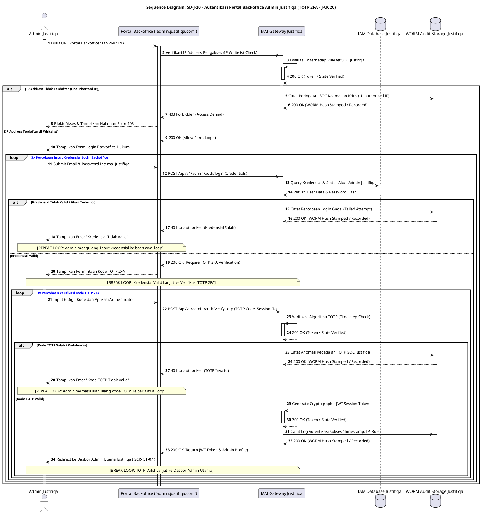
```plantuml
@startuml
title Sequence Diagram: SD-J-20 - Autentikasi Portal Backoffice Admin Justifiqa (TOTP 2FA - J-UC20)
autonumber
actor "Admin Justifiqa" as Admin
participant "Portal Backoffice (`admin.justifiqa.com`)" as FE
participant "IAM Gateway Justifiqa" as IAM
database "IAM Database Justifiqa" as DB
database "WORM Audit Storage Justifiqa" as WORM

activate Admin
Admin -> FE ++ : Buka URL Portal Backoffice via VPN/ZTNA
FE -> IAM ++ : Verifikasi IP Address Pengakses (IP Whitelist Check)
IAM -> IAM ++ : Evaluasi IP terhadap Ruleset SOC Justifiqa
IAM --> IAM -- : 200 OK (Token / State Verified)

alt IP Address Tidak Terdaftar (Unauthorized IP)
    IAM -> WORM ++ : Catat Peringatan SOC Keamanan Kritis (Unauthorized IP)
    WORM --> IAM -- : 200 OK (WORM Hash Stamped / Recorded)
    IAM --> FE : 403 Forbidden (Access Denied)
    FE --> Admin : Blokir Akses & Tampilkan Halaman Error 403
else IP Address Terdaftar di Whitelist
    IAM --> FE -- : 200 OK (Allow Form Login)
    FE --> Admin : Tampilkan Form Login Backoffice Hukum
    
    loop [Maksimal 3x Percobaan Input Kredensial Login Backoffice]
        Admin -> FE : Submit Email & Password Internal Justifiqa
        FE -> IAM ++ : POST /api/v1/admin/auth/login (Credentials)
        IAM -> DB ++ : Query Kredensial & Status Akun Admin Justifiqa
        DB --> IAM -- : Return User Data & Password Hash
        
        alt Kredensial Tidak Valid / Akun Terkunci
            IAM -> WORM ++ : Catat Percobaan Login Gagal (Failed Attempt)
            WORM --> IAM -- : 200 OK (WORM Hash Stamped / Recorded)
            IAM --> FE : 401 Unauthorized (Kredensial Salah)
            FE --> Admin : Tampilkan Error "Kredensial Tidak Valid"
            note over Admin, FE : [REPEAT LOOP: Admin mengulangi input kredensial ke baris awal loop]
        else Kredensial Valid
            IAM --> FE -- : 200 OK (Require TOTP 2FA Verification)
            FE --> Admin : Tampilkan Permintaan Kode TOTP 2FA
            note over Admin, IAM : [BREAK LOOP: Kredensial Valid Lanjut ke Verifikasi TOTP 2FA]
            
            loop [Maksimal 3x Percobaan Verifikasi Kode TOTP 2FA]
                Admin -> FE : Input 6 Digit Kode dari Aplikasi Authenticator
                FE -> IAM ++ : POST /api/v1/admin/auth/verify-totp (TOTP Code, Session ID)
                IAM -> IAM ++ : Verifikasi Algoritma TOTP (Time-step Check)
                IAM --> IAM -- : 200 OK (Token / State Verified)
                
                alt Kode TOTP Salah / Kadaluarsa
                    IAM -> WORM ++ : Catat Anomali Kegagalan TOTP SOC Justifiqa
                    WORM --> IAM -- : 200 OK (WORM Hash Stamped / Recorded)
                    IAM --> FE : 401 Unauthorized (TOTP Invalid)
                    FE --> Admin : Tampilkan Error "Kode TOTP Tidak Valid"
                    note over Admin, FE : [REPEAT LOOP: Admin memasukkan ulang kode TOTP ke baris awal loop]
                else Kode TOTP Valid
                    IAM -> IAM ++ : Generate Cryptographic JWT Session Token
                    IAM --> IAM -- : 200 OK (Token / State Verified)
                    IAM -> WORM ++ : Catat Log Autentikasi Sukses (Timestamp, IP, Role)
                    WORM --> IAM -- : 200 OK (WORM Hash Stamped / Recorded)
                    IAM --> FE -- : 200 OK (Return JWT Token & Admin Profile)
                    FE --> Admin : Redirect ke Dasbor Admin Utama Justifiqa (`SCR-JST-07`)
                    note over Admin, IAM : [BREAK LOOP: TOTP Valid Lanjut ke Dasbor Admin Utama]
                end
            end
        end
    end
end
deactivate FE
deactivate Admin
@enduml
```

---

## BAGIAN II: SEQUENCE DIAGRAMS - APLIKASI MANDIRI QUALIFA (DOMAIN PSIKOLOGI)

### SD-Q-01: Registrasi Akun Klien & Psikolog Klinis (Q-UC01, Q-UC07)
*Sequence diagram alur pendaftaran akun mandiri Klien dan Psikolog Klinis (verifikasi STR & SIPP HIMPSI) di platform Qualifa dengan spesifikasi eksekusi aktif (activation bars).*

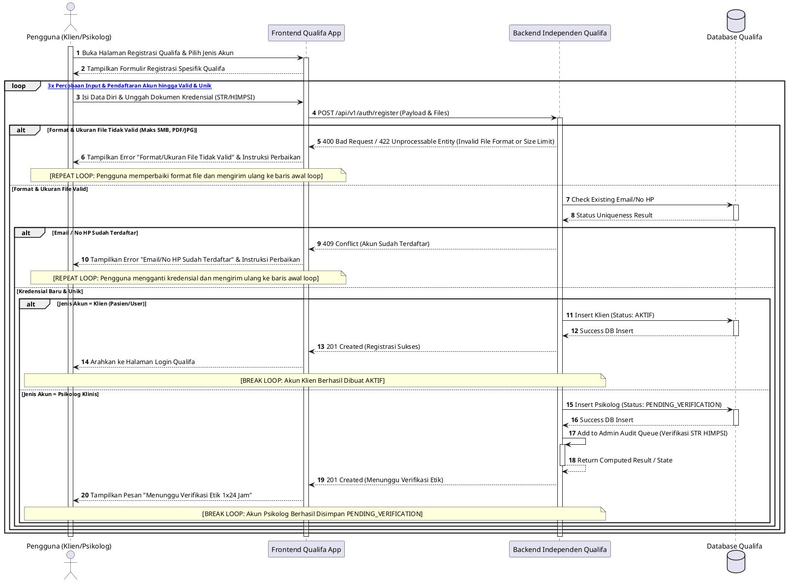
```plantuml
@startuml
autonumber
actor "Pengguna (Klien/Psikolog)" as User
participant "Frontend Qualifa App" as FE
participant "Backend Independen Qualifa" as BE
database "Database Qualifa" as DB

activate User
User -> FE ++ : Buka Halaman Registrasi Qualifa & Pilih Jenis Akun
FE --> User : Tampilkan Formulir Registrasi Spesifik Qualifa
loop [Maksimal 3x Percobaan Input & Pendaftaran Akun hingga Valid & Unik]
    User -> FE : Isi Data Diri & Unggah Dokumen Kredensial (STR/HIMPSI)
    FE -> BE ++ : POST /api/v1/auth/register (Payload & Files)

    alt Format & Ukuran File Tidak Valid (Maks 5MB, PDF/JPG)
        BE --> FE : 400 Bad Request / 422 Unprocessable Entity (Invalid File Format or Size Limit)
        FE --> User : Tampilkan Error "Format/Ukuran File Tidak Valid" & Instruksi Perbaikan
        note over User, FE : [REPEAT LOOP: Pengguna memperbaiki format file dan mengirim ulang ke baris awal loop]
    else Format & Ukuran File Valid
        BE -> DB ++ : Check Existing Email/No HP
        DB --> BE -- : Status Uniqueness Result

        alt Email / No HP Sudah Terdaftar
            BE --> FE : 409 Conflict (Akun Sudah Terdaftar)
            FE --> User : Tampilkan Error "Email/No HP Sudah Terdaftar" & Instruksi Perbaikan
            note over User, FE : [REPEAT LOOP: Pengguna mengganti kredensial dan mengirim ulang ke baris awal loop]
        else Kredensial Baru & Unik
            alt Jenis Akun = Klien (Pasien/User)
                BE -> DB ++ : Insert Klien (Status: AKTIF)
                DB --> BE -- : Success DB Insert
                BE --> FE : 201 Created (Registrasi Sukses)
                FE --> User : Arahkan ke Halaman Login Qualifa
                note over User, BE : [BREAK LOOP: Akun Klien Berhasil Dibuat AKTIF]
            else Jenis Akun = Psikolog Klinis
                BE -> DB ++ : Insert Psikolog (Status: PENDING_VERIFICATION)
                DB --> BE -- : Success DB Insert
                BE -> BE ++ : Add to Admin Audit Queue (Verifikasi STR HIMPSI)
                BE --> BE -- : Return Computed Result / State
                BE --> FE : 201 Created (Menunggu Verifikasi Etik)
                FE --> User : Tampilkan Pesan "Menunggu Verifikasi Etik 1x24 Jam"
                note over User, BE : [BREAK LOOP: Akun Psikolog Berhasil Disimpan PENDING_VERIFICATION]
            end
        end
    end
end
deactivate BE
deactivate FE
deactivate User
@enduml
```

---

### SD-Q-02: Login Akun Klien & Psikolog Klinis (Q-UC02, Q-UC08)
*Sequence diagram alur masuk (login) independen beserta verifikasi Multi-Factor Authentication (MFA / 2FA) dengan spesifikasi eksekusi aktif (activation bars).*

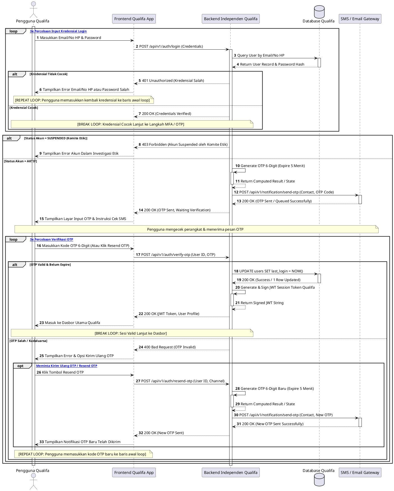
```plantuml
@startuml
autonumber
actor "Pengguna Qualifa" as User
participant "Frontend Qualifa App" as FE
participant "Backend Independen Qualifa" as BE
database "Database Qualifa" as DB
participant "SMS / Email Gateway" as SMS

activate User
loop [Maksimal 3x Percobaan Input Kredensial Login]
    User -> FE : Masukkan Email/No HP & Password
    FE -> BE ++ : POST /api/v1/auth/login (Credentials)

    BE -> DB ++ : Query User by Email/No HP
    DB --> BE -- : Return User Record & Password Hash

    alt Kredensial Tidak Cocok
        BE --> FE : 401 Unauthorized (Kredensial Salah)
        FE --> User : Tampilkan Error Email/No HP atau Password Salah
        note over User, FE : [REPEAT LOOP: Pengguna memasukkan kembali kredensial ke baris awal loop]
    else Kredensial Cocok
        BE --> FE : 200 OK (Credentials Verified)
        note over User, BE : [BREAK LOOP: Kredensial Cocok Lanjut ke Langkah MFA / OTP]
    end
end

alt Status Akun = SUSPENDED (Komite Etik)
    BE --> FE : 403 Forbidden (Akun Suspended oleh Komite Etik)
    FE --> User : Tampilkan Error Akun Dalam Investigasi Etik
else Status Akun = AKTIF
    BE -> BE ++ : Generate OTP 6-Digit (Expire 5 Menit)
    BE --> BE -- : Return Computed Result / State
    BE -> SMS ++ : POST /api/v1/notification/send-otp (Contact, OTP Code)
    SMS --> BE -- : 200 OK (OTP Sent / Queued Successfully)
    BE --> FE : 200 OK (OTP Sent, Waiting Verification)
    FE --> User : Tampilkan Layar Input OTP & Instruksi Cek SMS
    note over User, SMS : Pengguna mengecek perangkat & menerima pesan OTP
    
    loop [Maksimal 3x Percobaan Verifikasi OTP]
        User -> FE : Masukkan Kode OTP 6-Digit (Atau Klik Resend OTP)
        FE -> BE : POST /api/v1/auth/verify-otp (User ID, OTP)
        
        alt OTP Valid & Belum Expire
            BE -> DB ++ : UPDATE users SET last_login = NOW()
            DB --> BE -- : 200 OK (Success / 1 Row Updated)
            BE -> BE ++ : Generate & Sign JWT Session Token Qualifa
            BE --> BE -- : Return Signed JWT String
            BE --> FE : 200 OK (JWT Token, User Profile)
            FE --> User : Masuk ke Dasbor Utama Qualifa
            note over User, BE : [BREAK LOOP: Sesi Valid Lanjut ke Dasbor]
        else OTP Salah / Kadaluarsa
            BE --> FE : 400 Bad Request (OTP Invalid)
            FE --> User : Tampilkan Error & Opsi Kirim Ulang OTP
            
            opt [Pengguna Meminta Kirim Ulang OTP / Resend OTP]
                User -> FE : Klik Tombol Resend OTP
                FE -> BE : POST /api/v1/auth/resend-otp (User ID, Channel)
                BE -> BE ++ : Generate OTP 6-Digit Baru (Expire 5 Menit)
                BE --> BE -- : Return Computed Result / State
                BE -> SMS ++ : POST /api/v1/notification/send-otp (Contact, New OTP)
                SMS --> BE -- : 200 OK (New OTP Sent Successfully)
                BE --> FE : 200 OK (New OTP Sent)
                FE --> User : Tampilkan Notifikasi OTP Baru Telah Dikirim
            end
            note over User, FE : [REPEAT LOOP: Pengguna memasukkan kode OTP baru ke baris awal loop]
        end
    end
end
deactivate BE
deactivate FE
deactivate User
@enduml
```

---

### SD-Q-03: Sesi Konseling Klinis & Pembayaran (Q-UC03, Q-UC04, Q-UC05, Q-UC10)
*Sequence diagram reservasi psikolog, pembayaran konseling, pelaksanaan sesi terapi (chat/audio/video), dan penyelesaian sesi dengan spesifikasi eksekusi aktif (activation bars).*

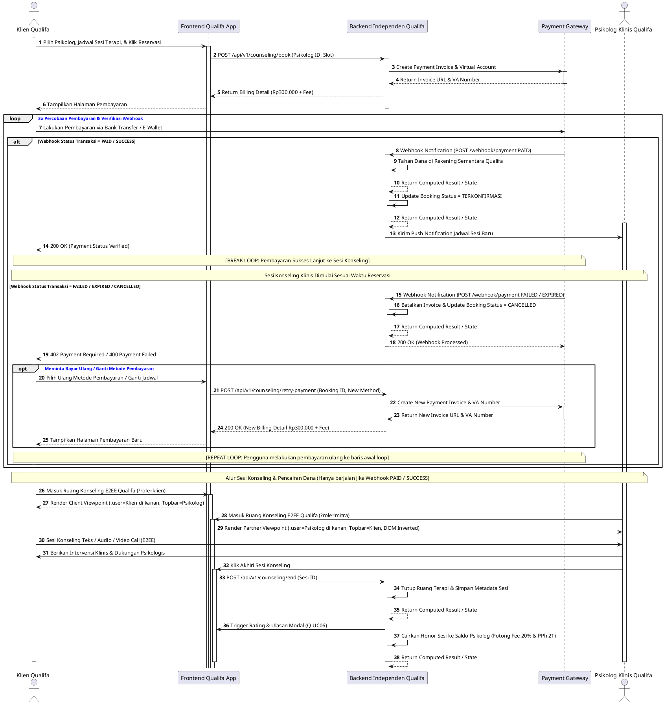
```plantuml
@startuml
autonumber
actor "Klien Qualifa" as Klien
participant "Frontend Qualifa App" as FE
participant "Backend Independen Qualifa" as BE
participant "Payment Gateway" as PG
actor "Psikolog Klinis Qualifa" as Mitra

activate Klien
Klien -> FE ++ : Pilih Psikolog, Jadwal Sesi Terapi, & Klik Reservasi
FE -> BE ++ : POST /api/v1/counseling/book (Psikolog ID, Slot)
BE -> PG ++ : Create Payment Invoice & Virtual Account
PG --> BE -- : Return Invoice URL & VA Number
BE --> FE : Return Billing Detail (Rp300.000 + Fee)
FE --> Klien : Tampilkan Halaman Pembayaran
deactivate BE

loop [Maksimal 3x Percobaan Pembayaran & Verifikasi Webhook]
    Klien -> PG : Lakukan Pembayaran via Bank Transfer / E-Wallet

    alt Webhook Status Transaksi = PAID / SUCCESS
        PG -> BE ++ : Webhook Notification (POST /webhook/payment PAID)
        BE -> BE ++ : Tahan Dana di Rekening Sementara Qualifa
        BE --> BE -- : Return Computed Result / State
        BE -> BE ++ : Update Booking Status = TERKONFIRMASI
        BE --> BE -- : Return Computed Result / State
        activate Mitra
        BE -> Mitra : Kirim Push Notification Jadwal Sesi Baru
        deactivate BE
        PG --> Klien : 200 OK (Payment Status Verified)
        note over Klien, PG : [BREAK LOOP: Pembayaran Sukses Lanjut ke Sesi Konseling]
        
        note over Klien, Mitra : Sesi Konseling Klinis Dimulai Sesuai Waktu Reservasi
    else Webhook Status Transaksi = FAILED / EXPIRED / CANCELLED
        PG -> BE ++ : Webhook Notification (POST /webhook/payment FAILED / EXPIRED)
        BE -> BE ++ : Batalkan Invoice & Update Booking Status = CANCELLED
        BE --> BE -- : Return Computed Result / State
        BE --> PG -- : 200 OK (Webhook Processed)
        PG --> Klien : 402 Payment Required / 400 Payment Failed
        
        opt [Pengguna Meminta Bayar Ulang / Ganti Metode Pembayaran]
            Klien -> FE : Pilih Ulang Metode Pembayaran / Ganti Jadwal
            FE -> BE : POST /api/v1/counseling/retry-payment (Booking ID, New Method)
            BE -> PG ++ : Create New Payment Invoice & VA Number
            PG --> BE -- : Return New Invoice URL & VA Number
            BE --> FE : 200 OK (New Billing Detail Rp300.000 + Fee)
            FE --> Klien : Tampilkan Halaman Pembayaran Baru
        end
        note over Klien, PG : [REPEAT LOOP: Pengguna melakukan pembayaran ulang ke baris awal loop]
    end
end

note over Klien, Mitra : Alur Sesi Konseling & Pencairan Dana (Hanya berjalan jika Webhook PAID / SUCCESS)
Klien -> FE ++ : Masuk Ruang Konseling E2EE Qualifa (?role=klien)
FE --> Klien : Render Client Viewpoint (.user=Klien di kanan, Topbar=Psikolog)
Mitra -> FE ++ : Masuk Ruang Konseling E2EE Qualifa (?role=mitra)
FE --> Mitra : Render Partner Viewpoint (.user=Psikolog di kanan, Topbar=Klien, DOM Inverted)
Klien -> Mitra : Sesi Konseling Teks / Audio / Video Call (E2EE)
Mitra -> Klien : Berikan Intervensi Klinis & Dukungan Psikologis

Mitra -> FE ++ : Klik Akhiri Sesi Konseling
FE -> BE ++ : POST /api/v1/counseling/end (Sesi ID)
BE -> BE ++ : Tutup Ruang Terapi & Simpan Metadata Sesi
BE --> BE -- : Return Computed Result / State
BE -> FE : Trigger Rating & Ulasan Modal (Q-UC06)
BE -> BE ++ : Cairkan Honor Sesi ke Saldo Psikolog (Potong Fee 20% & PPh 21)
BE --> BE -- : Return Computed Result / State
deactivate BE
deactivate FE
deactivate Klien
deactivate Mitra
@enduml
```

---

### SD-Q-04: Mengatur Status Ketersediaan & Buffer 30 Mnt (Q-UC09)
*Sequence diagram pengaturan jadwal praktik psikolog dengan aturan wajib jeda istirahat emosional (buffer rule) 30 menit antar sesi dan tanpa toggle manual, dilengkapi spesifikasi eksekusi aktif (activation bars).*

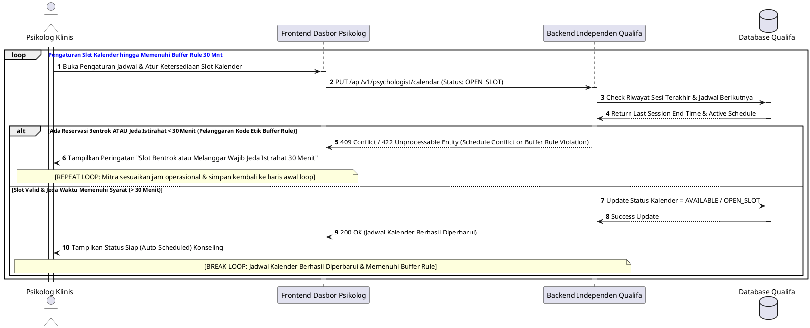
```plantuml
@startuml
autonumber
actor "Psikolog Klinis" as Mitra
participant "Frontend Dasbor Psikolog" as FE
participant "Backend Independen Qualifa" as BE
database "Database Qualifa" as DB

activate Mitra
loop [Percobaan Pengaturan Slot Kalender hingga Memenuhi Buffer Rule 30 Mnt]
    Mitra -> FE ++ : Buka Pengaturan Jadwal & Atur Ketersediaan Slot Kalender
    FE -> BE ++ : PUT /api/v1/psychologist/calendar (Status: OPEN_SLOT)

    BE -> DB ++ : Check Riwayat Sesi Terakhir & Jadwal Berikutnya
    DB --> BE -- : Return Last Session End Time & Active Schedule

    alt Ada Reservasi Bentrok ATAU Jeda Istirahat < 30 Menit (Pelanggaran Kode Etik Buffer Rule)
        BE --> FE : 409 Conflict / 422 Unprocessable Entity (Schedule Conflict or Buffer Rule Violation)
        FE --> Mitra : Tampilkan Peringatan "Slot Bentrok atau Melanggar Wajib Jeda Istirahat 30 Menit"
        note over Mitra, FE : [REPEAT LOOP: Mitra sesuaikan jam operasional & simpan kembali ke baris awal loop]
    else Slot Valid & Jeda Waktu Memenuhi Syarat (> 30 Menit)
        BE -> DB ++ : Update Status Kalender = AVAILABLE / OPEN_SLOT
        DB --> BE -- : Success Update
        BE --> FE : 200 OK (Jadwal Kalender Berhasil Diperbarui)
        FE --> Mitra : Tampilkan Status Siap (Auto-Scheduled) Konseling
        note over Mitra, BE : [BREAK LOOP: Jadwal Kalender Berhasil Diperbarui & Memenuhi Buffer Rule]
    end
end
deactivate BE
deactivate FE
deactivate Mitra
@enduml
```

---

### SD-Q-05: Mengisi Jurnal Mood Tracker Harian Proactive Alert (Q-UC13)
*Sequence diagram pengisian jurnal emosi harian yang dilengkapi sistem pendeteksi risiko penurunan kesehatan mental otomatis dengan spesifikasi eksekusi aktif (activation bars).*

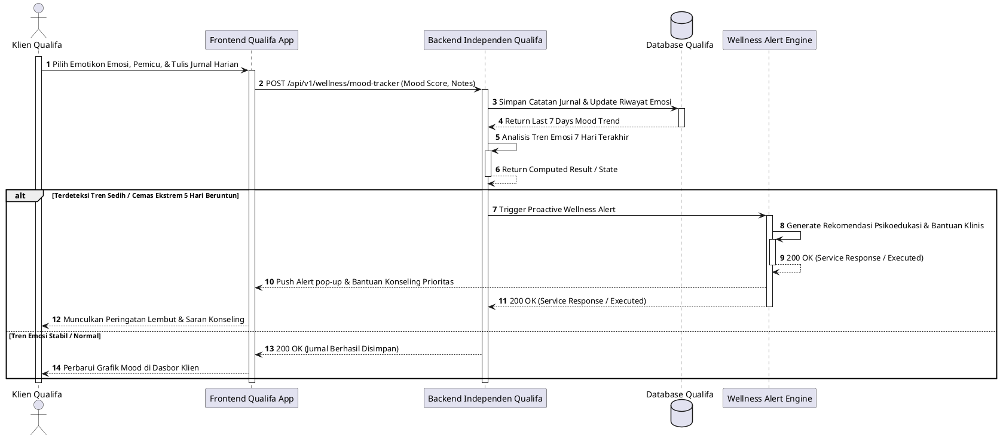
```plantuml
@startuml
autonumber
actor "Klien Qualifa" as Klien
participant "Frontend Qualifa App" as FE
participant "Backend Independen Qualifa" as BE
database "Database Qualifa" as DB
participant "Wellness Alert Engine" as Alert

activate Klien
Klien -> FE ++ : Pilih Emotikon Emosi, Pemicu, & Tulis Jurnal Harian
FE -> BE ++ : POST /api/v1/wellness/mood-tracker (Mood Score, Notes)
BE -> DB ++ : Simpan Catatan Jurnal & Update Riwayat Emosi
DB --> BE -- : Return Last 7 Days Mood Trend

BE -> BE ++ : Analisis Tren Emosi 7 Hari Terakhir
BE --> BE -- : Return Computed Result / State
alt Terdeteksi Tren Sedih / Cemas Ekstrem 5 Hari Beruntun
    BE -> Alert ++ : Trigger Proactive Wellness Alert
    Alert -> Alert ++ : Generate Rekomendasi Psikoedukasi & Bantuan Klinis
    Alert --> Alert -- : 200 OK (Service Response / Executed)
    Alert --> FE : Push Alert pop-up & Bantuan Konseling Prioritas
    Alert --> BE -- : 200 OK (Service Response / Executed)
    FE --> Klien : Munculkan Peringatan Lembut & Saran Konseling
else Tren Emosi Stabil / Normal
    BE --> FE : 200 OK (Jurnal Berhasil Disimpan)
    FE --> Klien : Perbarui Grafik Mood di Dasbor Klien
end
deactivate BE
deactivate FE
deactivate Klien
@enduml
```

---

### SD-Q-06: Mengakses Streaming Audio Meditasi & Relaksasi (Q-UC14)
*Sequence diagram pemutaran trek audio terapi relaksasi dengan penyesuaian kualitas bitrate adaptif dan spesifikasi eksekusi aktif (activation bars).*

```plantuml
@startuml
autonumber
actor "Klien Qualifa" as Klien
participant "Frontend Qualifa App" as FE
participant "Backend Independen Qualifa" as BE
participant "Media CDN Server" as CDN
database "Database Qualifa" as DB

activate Klien
Klien -> FE ++ : Buka Menu Relaksasi & Pilih Trek Audio Meditasi
FE -> BE ++ : GET /api/v1/wellness/meditation/stream (Track ID, Bandwidth)
BE -> BE ++ : Evaluate Client Bandwidth & Network Speed
BE --> BE -- : Return Computed Result / State

alt Koneksi Cepat / Wi-Fi
    BE -> CDN ++ : Request High Quality Audio URL (320 kbps)
    CDN --> BE -- : Return CDN Secure Stream URL (HQ)
else Koneksi Seluler / Lambat
    BE -> CDN ++ : Request Adaptive Smooth Audio URL (128 kbps)
    CDN --> BE -- : Return CDN Secure Stream URL (Smooth)
end

BE -> DB ++ : Log Exercise Activity Start
DB --> BE -- : 200 OK (Success / Rows Affected)
BE --> FE -- : 200 OK (Stream URL)
FE -> CDN ++ : Start Audio Streaming
FE --> Klien : Putar Audio Meditasi & Tampilkan Timer Relaksasi
CDN --> FE -- : 200 OK (Service Response / Executed)
deactivate Klien
@enduml
```

---

### SD-Q-07: Mengisi Asesmen DASS-21 & Protokol Crisis Button 119 (Q-UC15)
*Sequence diagram pengisian tes stres klinis DASS-21 yang memicu protokol kedaruratan bunuh diri/krisis 119 jika skor berada pada tingkat bahaya ekstrem dengan spesifikasi eksekusi aktif (activation bars).*

```plantuml
@startuml
autonumber
actor "Klien Qualifa" as Klien
participant "Frontend Qualifa App" as FE
participant "Backend Independen Qualifa" as BE
database "Database Qualifa" as DB
participant "Emergency Crisis System" as Crisis

activate Klien
Klien -> FE ++ : Isi 21 Pertanyaan Asesmen DASS-21 & Submit
FE -> BE ++ : POST /api/v1/assessment/dass21 (Responses Array)
BE -> BE ++ : Hitung Skor Sub-Skala Depresi, Anxiety, & Stress
BE --> BE -- : Return Computed Result / State
BE -> DB ++ : Simpan Hasil Skor Asesmen di Profil Klinis Klien
DB --> BE -- : 200 OK (Success / Rows Affected)

alt Skor Depresi / Anxiety = EXTREME (Risk of Self-Harm)
    BE -> Crisis ++ : Trigger Emergency 119 Crisis Protocol (User ID)
    Crisis -> Crisis ++ : Notify Registered Emergency Family Contact
    Crisis --> Crisis -- : 200 OK (Service Response / Executed)
    Crisis --> BE -- : Protocol Triggered Successfully
    BE --> FE : 200 OK (Result: EXTREME, Trigger Red Alert)
    FE --> Klien : Tampilkan Layar Darurat Merah & Tombol Hotline Krisis 119
else Skor Normal / Sedang / Ringan
    BE --> FE : 200 OK (Result: Normal/Moderate, Education Suggestions)
    FE --> Klien : Tampilkan Hasil Asesmen & Saran Artikel Kesehatan Mental
end
deactivate BE
deactivate FE
deactivate Klien
@enduml
```

---

### SD-Q-08: Membuat Catatan Terapi DAP Note & Worksheet CCBT (Q-UC11, Q-UC12)
*Sequence diagram pembuatan catatan klinis metode DAP (Data, Assessment, Plan) dan penugasan lembar kerja terapi perilaku kognitif (CCBT) dengan spesifikasi eksekusi aktif (activation bars).*

```plantuml
@startuml
autonumber
actor "Psikolog Klinis" as Mitra
participant "Frontend Dasbor Psikolog" as FE
participant "Backend Independen Qualifa" as BE
database "Database Qualifa (Encrypted)" as DB
actor "Klien Qualifa" as Klien

activate Mitra
Mitra -> FE ++ : Buat Catatan DAP Note & Pilih Tugas Worksheet CCBT
FE -> BE ++ : POST /api/v1/psychologist/clinical-notes (Sesi ID, DAP Payload)
BE -> BE ++ : Enkripsi Catatan Klinis dengan Field-Level Encryption
BE --> BE -- : Return Computed Result / State
BE -> DB ++ : Simpan Catatan DAP Note di Arsip Rahasia Klien
DB --> BE -- : Save Confirmed

alt Psikolog Memberikan Tugas CCBT Worksheet
    Mitra -> FE : Assign Worksheet (Thought Record / Behavioral Activation)
    FE -> BE : POST /api/v1/counseling/ccbt/assign (Sesi ID, Template ID)
    BE -> DB ++ : Simpan Tugas di Dasbor Klien
    DB --> BE -- : 200 OK (Success / Rows Affected)
activate Klien
    BE -> Klien ++ : Kirim Push Notification Tugas CCBT Baru
    BE --> FE : 201 Created (Tugas Terkirim ke Klien)
else Tanpa Tugas CCBT
    BE --> FE : 201 Created (Catatan DAP Note Tersimpan)
end

FE --> Mitra : Tampilkan Konfirmasi Sukses Pengarsipan Klinis
deactivate BE
deactivate Klien
deactivate Mitra
@enduml
```

---

### SD-Q-09: Verifikasi STR/HIMPSI & Moderasi Komite Etik Admin Qualifa (Q-UC16, Q-UC17)
*Sequence diagram audit keabsahan surat tanda registrasi psikolog klinis serta penanganan laporan kode etik dengan spesifikasi eksekusi aktif (activation bars).*

```plantuml
@startuml
autonumber
actor "Admin Qualifa" as Admin
participant "Panel Admin Qualifa" as FE
participant "Backend Independen Qualifa" as BE
database "Database Qualifa" as DB
participant "Pangkalan Data HIMPSI / STR" as HIMPSI
actor "Psikolog Terlapor / Pendaftar" as Mitra

activate Admin
Admin -> FE ++ : Buka Antrean Verifikasi Psikolog Baru
FE -> BE ++ : GET /api/v1/admin/audits/psychologists (Pending List)
BE --> FE -- : Return Dokumen STR, SIPP, & Kartu HIMPSI
FE --> Admin : Tampilkan Dokumen STR & HIMPSI
Admin -> HIMPSI ++ : Cek Keabsahan STR & Status Keanggotaan HIMPSI
HIMPSI --> Admin : Hasil Verifikasi Status STR

alt STR Tidak Sah / Kadaluarsa
    Admin -> FE ++ : Tolak Verifikasi & Isi Alasan
    FE -> BE ++ : POST /api/v1/admin/audits/reject (Psychologist ID)
    BE -> DB ++ : Update Status = REJECTED
    DB --> BE -- : 200 OK (Success / Rows Affected)
activate Mitra
    BE -> Mitra ++ : Kirim Email Alasan Penolakan Kredensial
    BE --> FE : 200 OK (Status Rejected)
    FE --> Admin : Notifikasi Penolakan Terkirim
else STR Sah & Aktif
    Admin -> FE : Setujui Verifikasi
    FE -> BE : POST /api/v1/admin/audits/approve (Psychologist ID)
    BE -> DB ++ : Update Status = AKTIF / VERIFIED
    DB --> BE -- : 200 OK (Success / Rows Affected)
    BE -> Mitra ++ : Kirim Email Selamat Datang & Panduan Etik
    BE --> FE : 200 OK (Status Approved)
    FE --> Admin : Notifikasi Persetujuan Terkirim
    deactivate BE
end

note over Admin, Mitra : Alur Pemeriksaan Pelanggaran Kode Etik / Malpraktik
Admin -> FE ++ : Proses Laporan Pelanggaran Etik & Klik Suspend
FE -> BE ++ : POST /api/v1/admin/ethics/suspend (Psychologist ID, Reason)
BE -> DB ++ : Update Status Akun = SUSPENDED (Investigasi Etik)
DB --> BE -- : 200 OK (Success / Rows Affected)
BE -> Mitra ++ : Kirim Surat Panggilan Klarifikasi Komite Etik Qualifa
BE --> FE -- : 200 OK (Account Suspended & Panggilan Terkirim)
FE --> Admin : Tampilkan Konfirmasi Suspend
deactivate Admin
deactivate Mitra
@enduml
```

---

### SD-Q-10: Pencairan Honor Psikolog & Perhitungan PPh 21 (Q-UC19)
*Sequence diagram penarikan honor sesi konseling klinis oleh psikolog dari dompet digital ke rekening bank, pemotongan pajak PPh 21 otomatis, dan auto-rollback jika transfer gagal dengan spesifikasi eksekusi aktif (activation bars).*

```plantuml
@startuml
autonumber
actor "Psikolog Klinis" as Mitra
participant "Frontend Dasbor Psikolog" as FE
participant "Backend Independen Qualifa" as BE
participant "Payment Gateway Disbursement" as PG
database "WORM Hash Storage" as WORM

activate Mitra
Mitra -> FE ++ : Ajukan Pencairan Honor Sesi ke Rekening Bank
FE -> BE ++ : POST /api/v1/psychologist/payouts/withdraw (Amount, Bank Acc)

BE -> BE ++ : Validasi Saldo Honor & Hitung Potongan Pajak PPh 21
BE --> BE -- : Return Computed Result / State
BE -> PG ++ : POST /api/disbursement/transfer (Net Amount, Bank Detail)

alt Webhook Transfer SUCCESS
    PG --> BE : Webhook SUCCESS (Status: SUCCESS, BankRefNumber)
    BE -> BE ++ : Kurangi Saldo Available Psikolog & Terbitkan Bukti Potong PPh 21
    BE --> BE -- : Return Computed Result / State
    BE -> WORM ++ : Simpan SHA-256 Hash Log Transaksi & Audit PPh 21
    WORM --> BE -- : Hash Written Permanently
    BE --> FE : 200 OK (Pencairan Honor Berhasil Diproses)
    FE --> Mitra : Tampilkan Resi Transfer & Detail Potongan Pajak
else Webhook Transfer FAILED / REJECTED
    PG --> BE -- : Webhook FAILED (Status: FAILED, ErrorCode: "INVALID_ACCOUNT" | "BANK_OFFLINE")
    BE -> BE ++ : Rollback Saldo Available Psikolog (Saldo Kembali Utuh)
    BE --> BE -- : Return Computed Result / State
    BE -> WORM ++ : Simpan SHA-256 Hash Log Kegagalan Transfer
    WORM --> BE -- : Hash Written Permanently
    BE --> FE : 400 Bad Request (Transfer Gagal / Ditolak Bank)
    FE --> Mitra : Tampilkan Error: "Transfer Gagal [ErrorCode]. Saldo telah dikembalikan ke dompet Anda."
end
deactivate BE
deactivate FE
deactivate Mitra
@enduml
```

---

### SD-Q-11: Memantau Laporan Keuangan Qualifa & Audit WORM (Q-UC18)
*Sequence diagram pengawasan buku besar honorarium, verifikasi bagi hasil platform (20%/80%), dan eksport bukti pajak PPh 21 ber-hash WORM SHA-256 oleh Admin Qualifa dengan spesifikasi eksekusi aktif (activation bars).*

```plantuml
@startuml
autonumber
actor "Admin Qualifa" as Admin
participant "Portal Backoffice Admin" as FE
participant "Backend Independen Qualifa" as BE
database "Database Qualifa" as DB
database "WORM Hash Storage" as WORM

activate Admin
Admin -> FE ++ : Buka Modul Keuangan & Buku Besar Honorarium
FE -> BE ++ : GET /api/v1/admin/finance/honorarium-ledger?startDate=X&endDate=Y
BE -> DB ++ : Query Rekapitulasi Saldo & Bagi Hasil (20%/80%)
DB --> BE -- : Return Financial Records
BE -> WORM ++ : Validasi Integritas Hash SHA-256 Transaksi
WORM --> BE -- : Return Hash Validation Status
BE --> FE -- : 200 OK (Data Ledger & Status Hash Valid)
FE --> Admin : Tampilkan Tabel Laporan Keuangan Honorarium & PPh 21

opt Unduh Bukti Rekap PPh 21 & Hash Audit
    Admin -> FE ++ : Klik Unduh Laporan Rekap PPh 21
    FE -> BE ++ : GET /api/v1/admin/finance/export-tax-report
    BE -> BE ++ : Generate Dokumen PDF/Excel dengan Digital Signature SHA-256
    BE --> BE -- : Return Computed Result / State
    BE --> FE -- : 200 OK (File Export Ready)
    FE --> Admin : Download File Laporan Rekapitulasi Pajak
end
deactivate Admin
@enduml
```

---

### SD-Q-20: Autentikasi Portal Backoffice Admin Qualifa (TOTP 2FA - Q-UC20)
*Sequence diagram alur autentikasi tingkat lanjut untuk Admin Qualifa melalui portal backoffice terisolasi (`admin.qualifa.com`) dengan IP Whitelisting, verifikasi kredensial internal, dan otentikasi ganda TOTP Authenticator dengan spesifikasi eksekusi aktif (activation bars).*

```plantuml
@startuml
title Sequence Diagram: SD-Q-20 - Autentikasi Portal Backoffice Admin Qualifa (TOTP 2FA - Q-UC20)
autonumber
actor "Admin Qualifa" as Admin
participant "Portal Backoffice (`admin.qualifa.com`)" as FE
participant "IAM Gateway Qualifa" as IAM
database "IAM Database Qualifa" as DB
database "WORM Audit Storage Qualifa" as WORM

activate Admin
Admin -> FE ++ : Buka URL Portal Backoffice via VPN/ZTNA
FE -> IAM ++ : Verifikasi IP Address Pengakses (IP Whitelist Check)
IAM -> IAM ++ : Evaluasi IP terhadap Ruleset SOC Qualifa
IAM --> IAM -- : 200 OK (Token / State Verified)

alt IP Address Tidak Terdaftar (Unauthorized IP)
    IAM -> WORM ++ : Catat Peringatan SOC Keamanan Kritis (Unauthorized IP)
    WORM --> IAM -- : 200 OK (WORM Hash Stamped / Recorded)
    IAM --> FE : 403 Forbidden (Access Denied)
    FE --> Admin : Blokir Akses & Tampilkan Halaman Error 403
else IP Address Terdaftar di Whitelist
    IAM --> FE : 200 OK (Allow Form Login)
    FE --> Admin : Tampilkan Form Login Backoffice Psikologi
    Admin -> FE : Submit Email & Password Internal Qualifa
    FE -> IAM : POST /api/v1/admin/auth/login (Credentials)
    IAM -> DB ++ : Query Kredensial & Status Akun Admin Qualifa
    DB --> IAM -- : Return User Data & Password Hash
    
    alt Kredensial Tidak Valid / Akun Terkunci
        IAM -> WORM ++ : Catat Percobaan Login Gagal (Failed Attempt)
        WORM --> IAM -- : 200 OK (WORM Hash Stamped / Recorded)
        IAM --> FE : 401 Unauthorized (Kredensial Salah)
        FE --> Admin : Tampilkan Error "Kredensial Tidak Valid"
    else Kredensial Valid
        IAM --> FE : 200 OK (Require TOTP 2FA Verification)
        FE --> Admin : Tampilkan Permintaan Kode TOTP 2FA
        Admin -> FE : Input 6 Digit Kode dari Aplikasi Authenticator
        FE -> IAM : POST /api/v1/admin/auth/verify-totp (TOTP Code, Session ID)
        IAM -> IAM ++ : Verifikasi Algoritma TOTP (Time-step Check)
        IAM --> IAM -- : 200 OK (Token / State Verified)
        
        alt Kode TOTP Salah / Kadaluarsa
            IAM -> WORM ++ : Catat Anomali Kegagalan TOTP SOC Qualifa
            WORM --> IAM -- : 200 OK (WORM Hash Stamped / Recorded)
            IAM --> FE : 401 Unauthorized (TOTP Invalid)
            FE --> Admin : Tampilkan Error "Kode TOTP Tidak Valid"
        else Kode TOTP Valid
            IAM -> IAM ++ : Generate Cryptographic JWT Session Token
            IAM --> IAM -- : 200 OK (Token / State Verified)
            IAM -> WORM ++ : Catat Log Autentikasi Sukses (Timestamp, IP, Role)
            WORM --> IAM -- : 200 OK (WORM Hash Stamped / Recorded)
            IAM --> FE : 200 OK (Return JWT Token & Admin Profile)
            FE --> Admin : Redirect ke Dasbor Admin Utama Qualifa (`SCR-QLF-07`)
        end
    end
end
IAM --> FE -- : 200 OK (Token / State Verified)
deactivate FE
deactivate Admin
@enduml
```

---

