# Kumpulan Kode PlantUML: Sequence Diagrams - 100% Siloed Architecture (Justifiqa & Qualifa)

Dokumen ini berisi kumpulan kode PlantUML untuk seluruh Sequence Diagram pada dua aplikasi mandiri yang **100% terisolasi dan berdiri sendiri (*Siloed Architecture*)**: **Justifiqa** (Domain Hukum) dan **Qualifa** (Domain Psikologi). Penomoran diagram telah distandarisasi untuk mencerminkan arsitektur terisolasi dan bersesuaian 1-to-1 dengan Activity Diagram: **`SD-J-xx`** untuk Justifiqa dan **`SD-Q-xx`** untuk Qualifa.

---

## Cara Import ke Draw.io
1. Buka Draw.io (`app.diagrams.net`).
2. Pada toolbar bagian atas, klik tombol **+ (Insert)** atau pilih menu **Arrange -> Insert**.
3. Pilih **Advanced -> PlantUML...**.
4. Salin dan tempel kode di bawah ini, lalu klik **Insert**.

---

## BAGIAN I: SEQUENCE DIAGRAMS - APLIKASI MANDIRI JUSTIFIQA (DOMAIN HUKUM)

### SD-J-01: Registrasi Akun Klien & Advokat (J-UC01, J-UC07)
*Sequence diagram alur pendaftaran akun mandiri Klien (verifikasi NIK Dukcapil) dan Advokat/Notaris (verifikasi SIPP Peradi) di platform Justifiqa.*

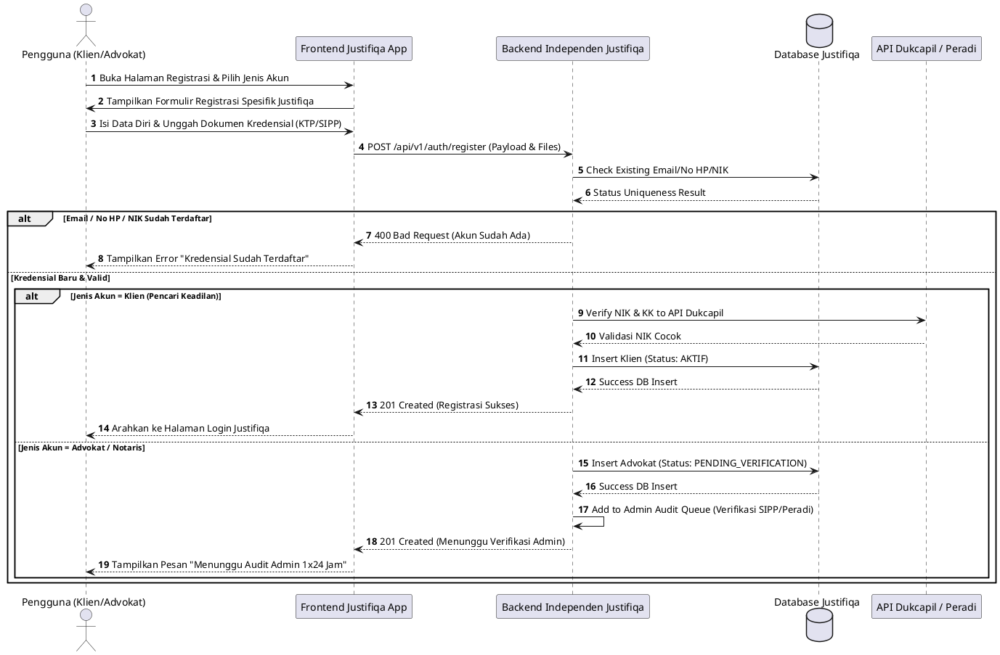

---

### SD-J-02: Login Akun Klien & Advokat (J-UC02, J-UC08)
*Sequence diagram alur masuk (login) independen beserta verifikasi Multi-Factor Authentication (MFA / 2FA).*

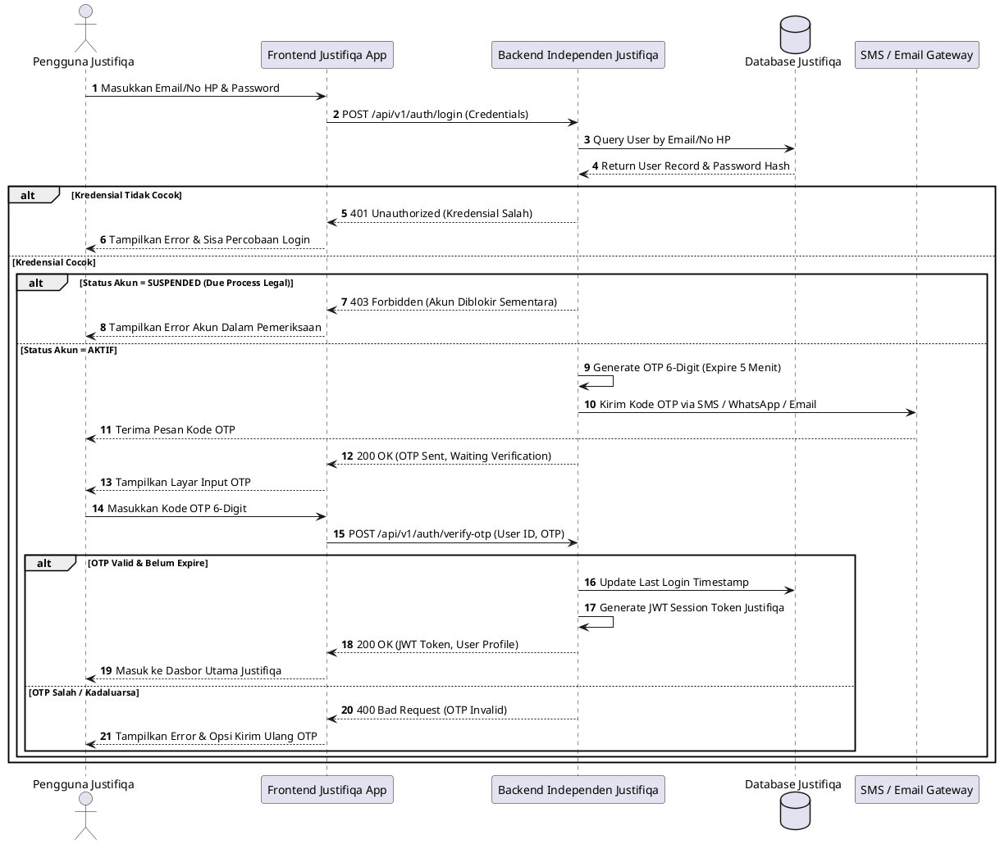

---

### SD-J-03: Konsultasi Hukum & Pembayaran Escrow (J-UC03, J-UC04, J-UC05, J-UC10)
*Sequence diagram reservasi, pembayaran escrow yang ditahan sistem Justifiqa, pelaksanaan sesi chat E2EE, hingga pelepasan dana setelah sesi selesai.*

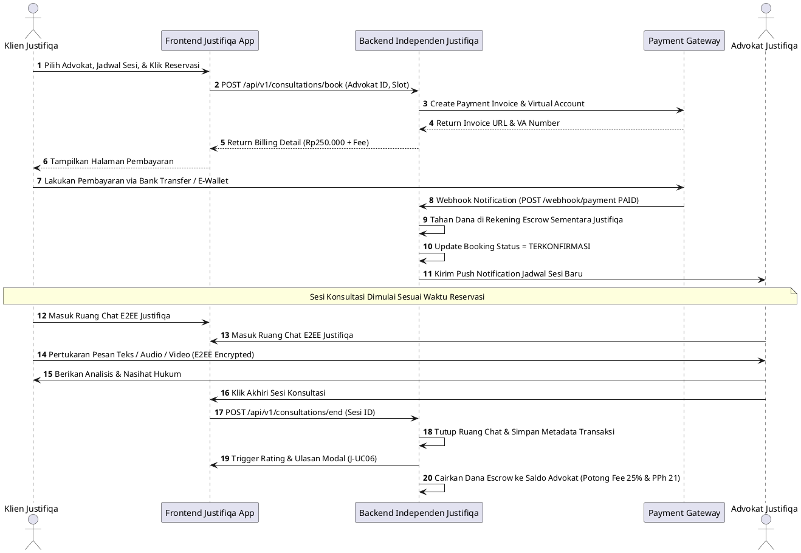

---

### SD-J-04: Mengatur Status Ketersediaan Praktik Advokat (J-UC09)
*Sequence diagram pengaturan jadwal praktik dan toggle ketersediaan real-time advokat.*

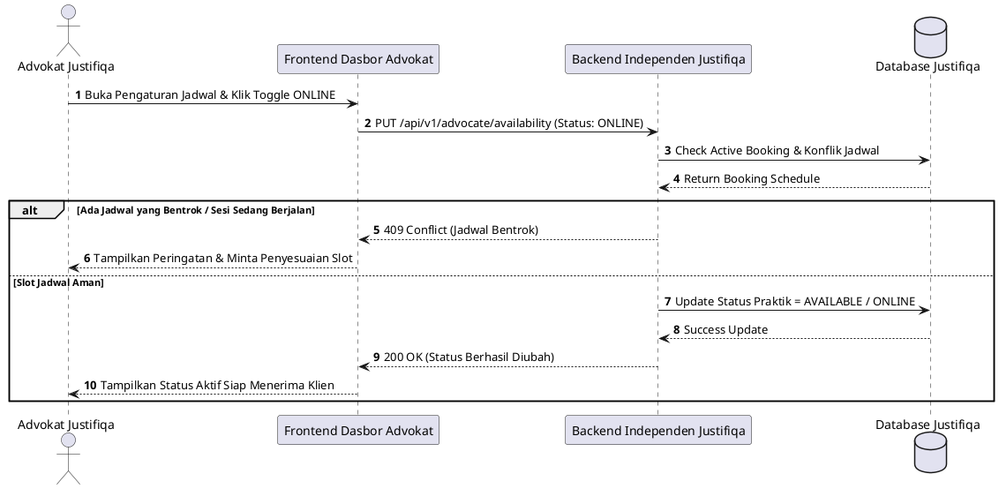

---

### SD-J-05: Mengunggah Berkas Perkara E2EE Zero-Knowledge (J-UC13)
*Sequence diagram pengunggahan bukti perkara yang dienkripsi sebelum meninggalkan perangkat klien agar tidak dapat dibaca oleh server maupun pihak ketiga.*

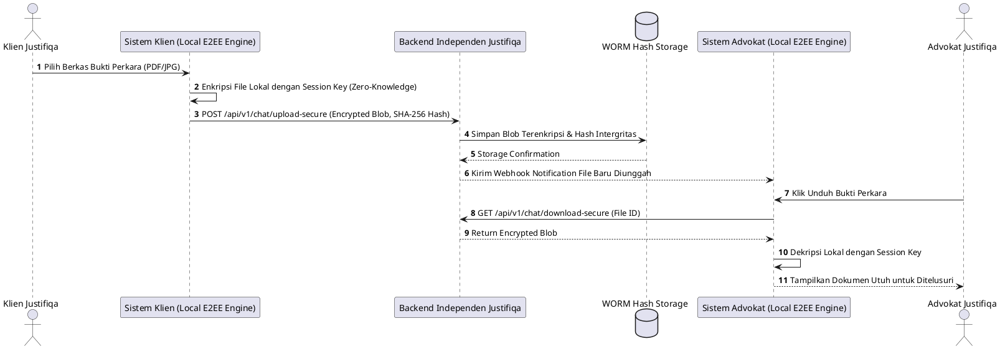

---

### SD-J-06: Membuat Draf Dokumen Hukum & e-Meterai Peruri (J-UC12, J-UC14)
*Sequence diagram pembuatan opini hukum/kontrak oleh advokat serta pembubuhan e-Meterai resmi Peruri.*

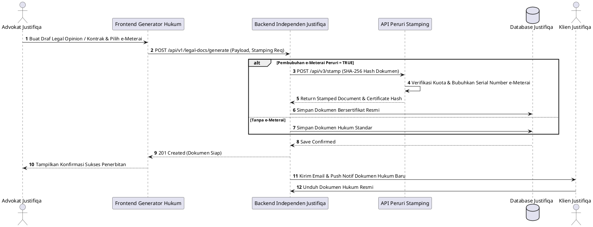

---

### SD-J-07: Konsultasi Pro Bono SKTM (J-UC15)
*Sequence diagram pengajuan bantuan hukum cuma-cuma (Pro Bono) melalui verifikasi Surat Keterangan Tidak Mampu (SKTM) Dukcapil.*

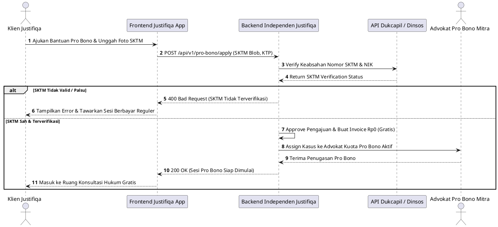

---

### SD-J-08: Membuat Catatan Sesi IRAC Note Advokat (J-UC11)
*Sequence diagram pembuatan catatan terstruktur metode IRAC (Issue, Rule, Application, Conclusion) oleh advokat.*

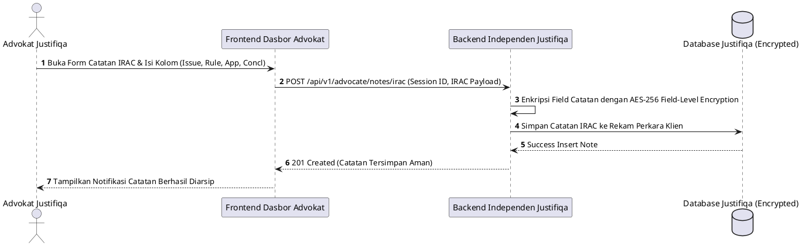

---

### SD-J-09: Verifikasi Kredensial & Moderasi Akun Admin Justifiqa (J-UC16, J-UC17)
*Sequence diagram audit verifikasi advokat oleh Admin Legal serta proses penahanan akun (Due Process Suspend).*

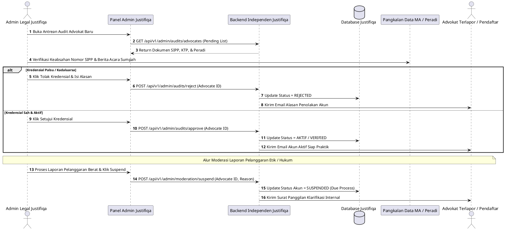

---

### SD-J-10: Audit Log WORM Hash & Pencairan Dana Escrow PPh 21 (J-UC18, J-UC19)
*Sequence diagram pencatatan log transaksi mutlak WORM (Write-Once-Read-Many) serta perhitungan otomatis PPh 21 saat penarikan dana advokat.*

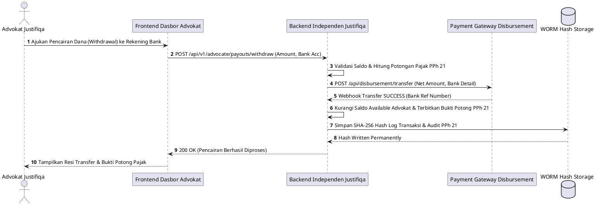

---

## BAGIAN II: SEQUENCE DIAGRAMS - APLIKASI MANDIRI QUALIFA (DOMAIN PSIKOLOGI)

### SD-Q-01: Registrasi Akun Klien & Psikolog Klinis (Q-UC01, Q-UC07)
*Sequence diagram alur pendaftaran akun mandiri Klien dan Psikolog Klinis (verifikasi STR & SIPP HIMPSI) di platform Qualifa.*

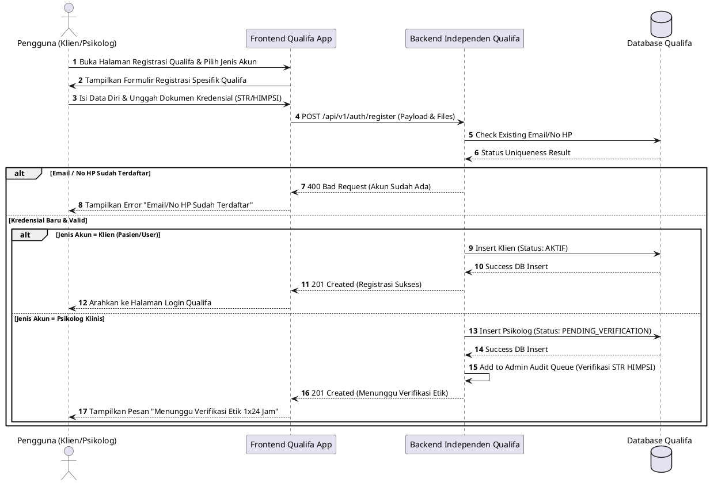

---

### SD-Q-02: Login Akun Klien & Psikolog Klinis (Q-UC02, Q-UC08)
*Sequence diagram alur masuk (login) independen beserta verifikasi Multi-Factor Authentication (MFA / 2FA).*

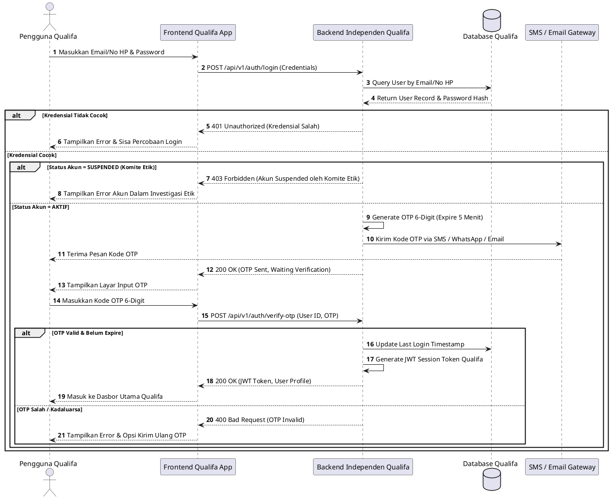

---

### SD-Q-03: Sesi Konseling Klinis & Pembayaran (Q-UC03, Q-UC04, Q-UC05, Q-UC10)
*Sequence diagram reservasi psikolog, pembayaran konseling, pelaksanaan sesi terapi (chat/audio/video), dan penyelesaian sesi.*

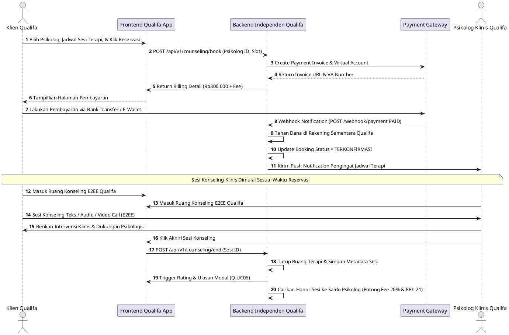

---

### SD-Q-04: Mengatur Status Ketersediaan & Buffer 30 Mnt (Q-UC09)
*Sequence diagram pengaturan jadwal praktik psikolog dengan aturan wajib jeda istirahat emosional (buffer rule) 30 menit antar sesi.*

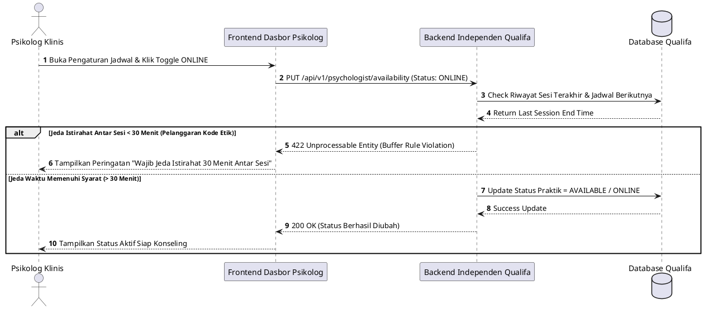

---

### SD-Q-05: Mengisi Jurnal Mood Tracker Harian Proactive Alert (Q-UC13)
*Sequence diagram pengisian jurnal emosi harian yang dilengkapi sistem pendeteksi risiko penurunan kesehatan mental otomatis.*

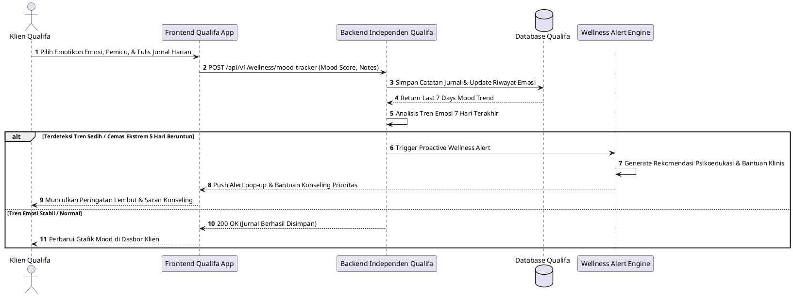

---

### SD-Q-06: Mengakses Streaming Audio Meditasi & Relaksasi (Q-UC14)
*Sequence diagram pemutaran trek audio terapi relaksasi dengan penyesuaian kualitas bitrate adaptif.*

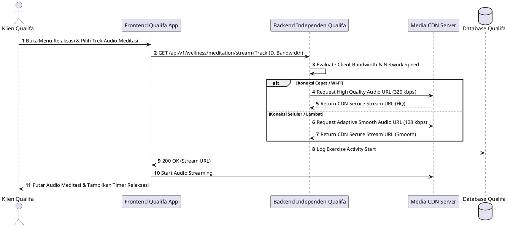

---

### SD-Q-07: Mengisi Asesmen DASS-21 & Protokol Crisis Button 119 (Q-UC15)
*Sequence diagram pengisian tes stres klinis DASS-21 yang memicu protokol kedaruratan bunuh diri/krisis 119 jika skor berada pada tingkat bahaya ekstrem.*

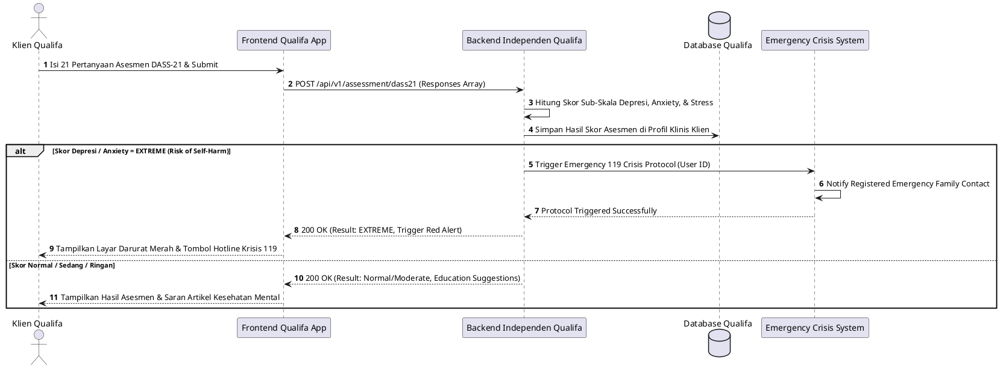

---

### SD-Q-08: Membuat Catatan Terapi DAP Note & Worksheet CCBT (Q-UC11, Q-UC12)
*Sequence diagram pembuatan catatan klinis metode DAP (Data, Assessment, Plan) dan penugasan lembar kerja terapi perilaku kognitif (CCBT).*

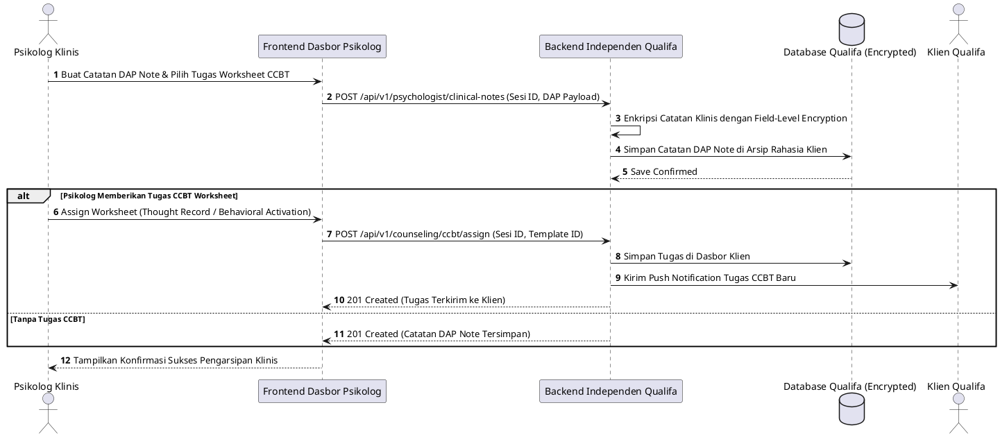

---

### SD-Q-09: Verifikasi STR/HIMPSI & Moderasi Komite Etik Admin Qualifa (Q-UC16, Q-UC17)
*Sequence diagram audit keabsahan surat tanda registrasi psikolog klinis serta penanganan laporan kode etik.*

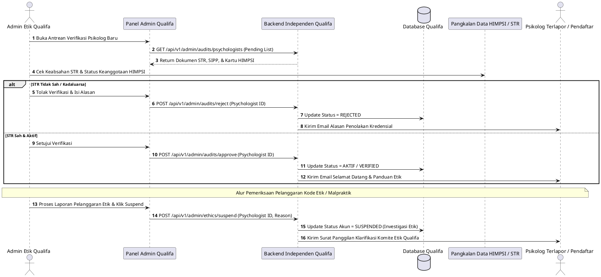

---

### SD-Q-10: Audit Log WORM Hash & Manajemen Honor Psikolog (Q-UC18, Q-UC19)
*Sequence diagram pencatatan log transaksi mutlak WORM (Write-Once-Read-Many) serta pencairan honor sesi psikolog klinis.*

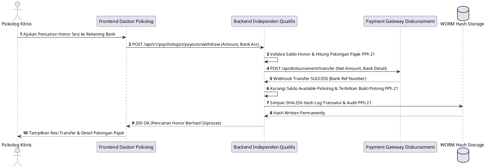
