# Kumpulan Kode PlantUML: Sequence Diagrams - LifeQ SuperApp

Dokumen ini berisi kumpulan kode PlantUML untuk seluruh Sequence Diagram pada sistem **LifeQ SuperApp** (17 Core Use Case + 9 Domain Use Case).

---

## Cara Import ke Draw.io
1. Buka Draw.io (pp.diagrams.net).
2. Pada toolbar bagian atas, klik tombol **+ (Insert)** atau pilih menu **Arrange -> Insert**.
3. Pilih **Advanced -> PlantUML...** (atau **Mermaid...**).
4. Salin dan tempel kode di bawah ini, lalu klik **Insert**.

---

## Sequence Diagrams (Diagram Urutan)

Berikut adalah kumpulan kode PlantUML untuk Sequence Diagram terpadu pada platform.

### SD-01: Sequence Diagram - Melakukan Login (UC-02 & UC-08)
*Diagram ini merepresentasikan alur pesan sinkron/asinkron untuk proses verifikasi login Klien dan Mitra Profesional.*

#### Opsi A: Versi Mermaid (Sangat Direkomendasikan untuk Draw.io)
*Cara Import ke Draw.io: Arrange -> Insert -> Advanced -> Mermaid... -> Paste kode di bawah ini -> Insert.*

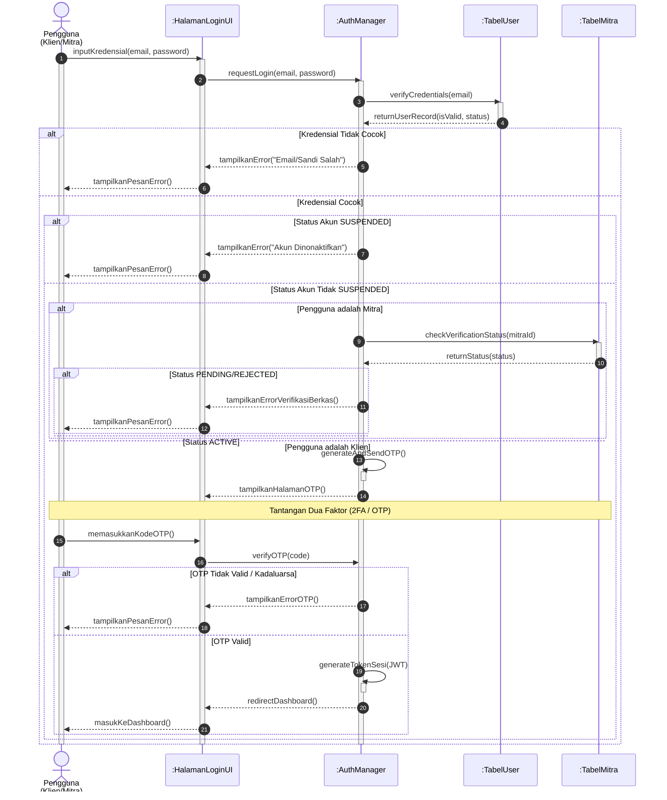
```mermaid
sequenceDiagram
    autonumber
    actor Pengguna as Pengguna<br/>(Klien/Mitra)
    participant UI as :HalamanLoginUI
    participant Auth as :AuthManager
    participant DBUser as :TabelUser
    participant DBMitra as :TabelMitra

    Pengguna->>UI: inputKredensial(email, password)
    activate Pengguna
    activate UI
    UI->>Auth: requestLogin(email, password)
    activate Auth

    Auth->>DBUser: verifyCredentials(email)
    activate DBUser
    DBUser-->>Auth: returnUserRecord(isValid, status)
    deactivate DBUser

    alt Kredensial Tidak Cocok
        Auth-->>UI: tampilkanError("Email/Sandi Salah")
        UI-->>Pengguna: tampilkanPesanError()
    else Kredensial Cocok
        alt Status Akun SUSPENDED
            Auth-->>UI: tampilkanError("Akun Dinonaktifkan")
            UI-->>Pengguna: tampilkanPesanError()
        else Status Akun Tidak SUSPENDED
            alt Pengguna adalah Mitra
                Auth->>DBMitra: checkVerificationStatus(mitraId)
                activate DBMitra
                DBMitra-->>Auth: returnStatus(status)
                deactivate DBMitra
                
                alt Status PENDING/REJECTED
                    Auth-->>UI: tampilkanErrorVerifikasiBerkas()
                    UI-->>Pengguna: tampilkanPesanError()
                else Status ACTIVE
                    %% Alur berlanjut ke pengiriman OTP di bawah
                end
            else Pengguna adalah Klien
                %% Alur berlanjut ke pengiriman OTP di bawah
            end
            
            Auth->>Auth: generateAndSendOTP()
            activate Auth
            deactivate Auth
            Auth-->>UI: tampilkanHalamanOTP()
            
            note over Pengguna,DBMitra: Tantangan Dua Faktor (2FA / OTP)
            
            Pengguna->>UI: memasukkanKodeOTP()
            UI->>Auth: verifyOTP(code)
            
            alt OTP Tidak Valid / Kadaluarsa
                Auth-->>UI: tampilkanErrorOTP()
                UI-->>Pengguna: tampilkanPesanError()
            else OTP Valid
                Auth->>Auth: generateTokenSesi(JWT)
                activate Auth
                deactivate Auth
                Auth-->>UI: redirectDashboard()
                UI-->>Pengguna: masukKeDashboard()
            end
        end
    end

    deactivate Auth
    deactivate UI
    deactivate Pengguna
```

#### Opsi B: Versi PlantUML
*Cara Import ke Draw.io: Arrange -> Insert -> Advanced -> PlantUML... -> Paste kode di bawah ini -> Insert.*

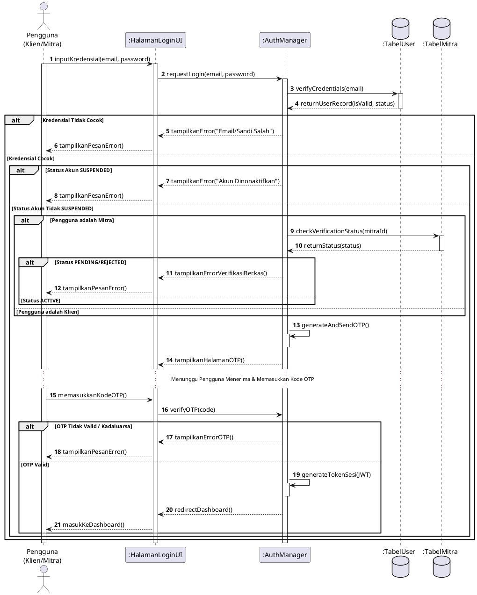
```plantuml
@startuml
autonumber

actor "Pengguna\n(Klien/Mitra)" as Pengguna
participant ":HalamanLoginUI" as UI
participant ":AuthManager" as Auth
database ":TabelUser" as DBUser
database ":TabelMitra" as DBMitra

Pengguna -> UI : inputKredensial(email, password)
activate Pengguna
activate UI
UI -> Auth : requestLogin(email, password)
activate Auth

Auth -> DBUser : verifyCredentials(email)
activate DBUser
DBUser --> Auth : returnUserRecord(isValid, status)
deactivate DBUser

alt Kredensial Tidak Cocok
  Auth --> UI : tampilkanError("Email/Sandi Salah")
  UI --> Pengguna : tampilkanPesanError()
else Kredensial Cocok
  alt Status Akun SUSPENDED
    Auth --> UI : tampilkanError("Akun Dinonaktifkan")
    UI --> Pengguna : tampilkanPesanError()
  else Status Akun Tidak SUSPENDED
    alt Pengguna adalah Mitra
      Auth -> DBMitra : checkVerificationStatus(mitraId)
      activate DBMitra
      DBMitra --> Auth : returnStatus(status)
      deactivate DBMitra
      
      alt Status PENDING/REJECTED
        Auth --> UI : tampilkanErrorVerifikasiBerkas()
        UI --> Pengguna : tampilkanPesanError()
      else Status ACTIVE
        ' Alur berlanjut ke pengiriman OTP di bawah
      end
    else Pengguna adalah Klien
      ' Alur berlanjut ke pengiriman OTP di bawah
    end
    
    Auth -> Auth : generateAndSendOTP()
    activate Auth
    deactivate Auth
    Auth --> UI : tampilkanHalamanOTP()
    
    ... Menunggu Pengguna Menerima & Memasukkan Kode OTP ...
    
    Pengguna -> UI : memasukkanKodeOTP()
    UI -> Auth : verifyOTP(code)
    
    alt OTP Tidak Valid / Kadaluarsa
      Auth --> UI : tampilkanErrorOTP()
      UI --> Pengguna : tampilkanPesanError()
    else OTP Valid
      Auth -> Auth : generateTokenSesi(JWT)
      activate Auth
      deactivate Auth
      Auth --> UI : redirectDashboard()
      UI --> Pengguna : masukKeDashboard()
    end
  end
end

deactivate Auth
deactivate UI
deactivate Pengguna
@enduml
```

---

### SD-02: Sequence Diagram - Transaksi Pembayaran & Inisiasi Konsultasi (UC-04 & UC-05)
*Diagram ini merepresentasikan alur pesan untuk pemrosesan token pembayaran dari Payment Gateway (Fase 1) dan penanganan Callback Notification secara asinkron di latar belakang (Fase 2).*

#### Opsi A: Versi Mermaid (Sangat Direkomendasikan untuk Draw.io)
*Cara Import ke Draw.io: Arrange -> Insert -> Advanced -> Mermaid... -> Paste kode di bawah ini -> Insert.*

```mermaid
sequenceDiagram
    autonumber
    actor Pengguna as Pengguna (Klien)
    participant UI as :HalamanPembayaranUI
    participant Payment as :PaymentManager
    participant DB as :TabelTransaksi
    participant PG as :PaymentGatewayServer

    note over Pengguna,PG: FASE 1: Permintaan Token Pembayaran (Synchronous)

    Pengguna->>UI: pilihMetodeDanKlikBayar()
    activate Pengguna
    activate UI
    UI->>Payment: initiatePayment(bookingId, total)
    activate Payment

    Payment->>PG: requestSnapToken(transactionDetails)
    activate PG
    PG-->>Payment: returnSnapToken
    deactivate PG

    Payment-->>UI: tampilkanPaymentModal(snapToken)
    deactivate Payment
    deactivate UI

    Pengguna->PG: melakukanTransferDana()
    deactivate Pengguna

    note over Pengguna,PG: FASE 2: Proses Callback Notifikasi (Asynchronous & Latar Belakang)

    PG->Payment: postCallbackNotification(orderId, status_code)
    activate PG
    activate Payment

    alt Status == SUCCESS
        Payment->>DB: updateStatusToPaid(orderId)
        activate DB
        DB-->>Payment: return
        deactivate DB
        
        Payment->>DB: terbitkanTiketKonsultasi()
        activate DB
        DB-->>Payment: return
        deactivate DB
        
        Payment-->>PG: return HTTP 200 OK
        deactivate PG
        
        Payment->UI: notifyPaymentSuccess()
        activate UI
        deactivate Payment
        
        UI->Pengguna: tampilkanNotifikasiSukses()
        activate Pengguna
        deactivate Pengguna
        deactivate UI
    else Status == EXPIRED / DENIED
        Payment->>DB: updateStatusToCancel(orderId)
        activate DB
        DB-->>Payment: return
        deactivate DB
        
        Payment-->>PG: return HTTP 200 OK
        deactivate PG
        
        Payment->UI: notifyPaymentFailed()
        activate UI
        deactivate Payment
        
        UI->Pengguna: tampilkanNotifikasiGagal()
        activate Pengguna
        deactivate Pengguna
        deactivate UI
    end
```

#### Opsi B: Versi PlantUML
*Cara Import ke Draw.io: Arrange -> Insert -> Advanced -> PlantUML... -> Paste kode di bawah ini -> Insert.*

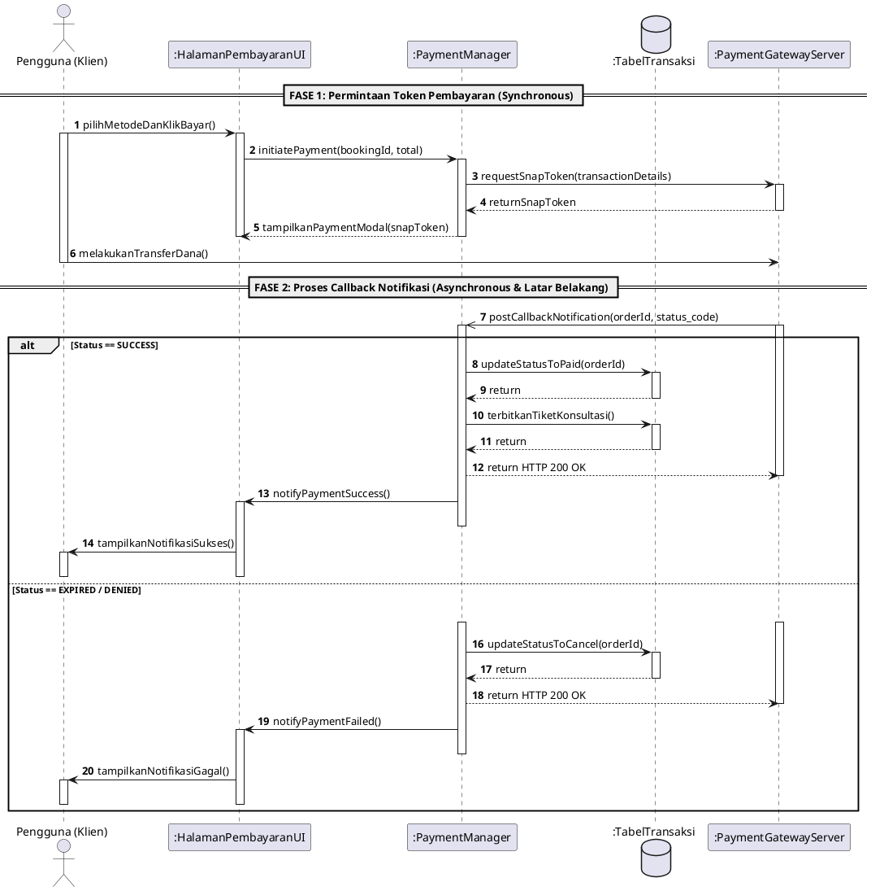
```plantuml
@startuml
autonumber

actor "Pengguna (Klien)" as Pengguna
participant ":HalamanPembayaranUI" as UI
participant ":PaymentManager" as Payment
database ":TabelTransaksi" as DB
participant ":PaymentGatewayServer" as PG

== FASE 1: Permintaan Token Pembayaran (Synchronous) ==

Pengguna -> UI : pilihMetodeDanKlikBayar()
activate Pengguna
activate UI
UI -> Payment : initiatePayment(bookingId, total)
activate Payment

Payment -> PG : requestSnapToken(transactionDetails)
activate PG
PG --> Payment : returnSnapToken
deactivate PG

Payment --> UI : tampilkanPaymentModal(snapToken)
deactivate Payment
deactivate UI

Pengguna -> PG : melakukanTransferDana()
deactivate Pengguna

== FASE 2: Proses Callback Notifikasi (Asynchronous & Latar Belakang) ==

PG ->> Payment : postCallbackNotification(orderId, status_code)
activate PG
activate Payment

alt Status == SUCCESS
  Payment -> DB : updateStatusToPaid(orderId)
  activate DB
  DB --> Payment : return
  deactivate DB
  
  Payment -> DB : terbitkanTiketKonsultasi()
  activate DB
  DB --> Payment : return
  deactivate DB
  
  Payment --> PG : return HTTP 200 OK
  deactivate PG
  
  Payment -> UI : notifyPaymentSuccess()
  activate UI
  deactivate Payment
  
  UI -> Pengguna : tampilkanNotifikasiSukses()
  activate Pengguna
  deactivate Pengguna
  deactivate UI
else Status == EXPIRED / DENIED
  PG -[hidden]-> PG
  activate PG
  activate Payment
  
  Payment -> DB : updateStatusToCancel(orderId)
  activate DB
  DB --> Payment : return
  deactivate DB
  
  Payment --> PG : return HTTP 200 OK
  deactivate PG
  
  Payment -> UI : notifyPaymentFailed()
  activate UI
  deactivate Payment
  
  UI -> Pengguna : tampilkanNotifikasiGagal()
  activate Pengguna
  deactivate Pengguna
  deactivate UI
end
@enduml
```

---

### SD-03: Sequence Diagram - Sesi Konsultasi & Penutupan Chat (UC-04 & UC-10)
*Diagram ini merepresentasikan alur obrolan real-time (looping) antara Klien dan Mitra Profesional serta alur penutupan/penguncian sesi chat setelah selesai.*

#### Opsi A: Versi Mermaid (Sangat Direkomendasikan untuk Draw.io)
*Cara Import ke Draw.io: Arrange -> Insert -> Advanced -> Mermaid... -> Paste kode di bawah ini -> Insert.*

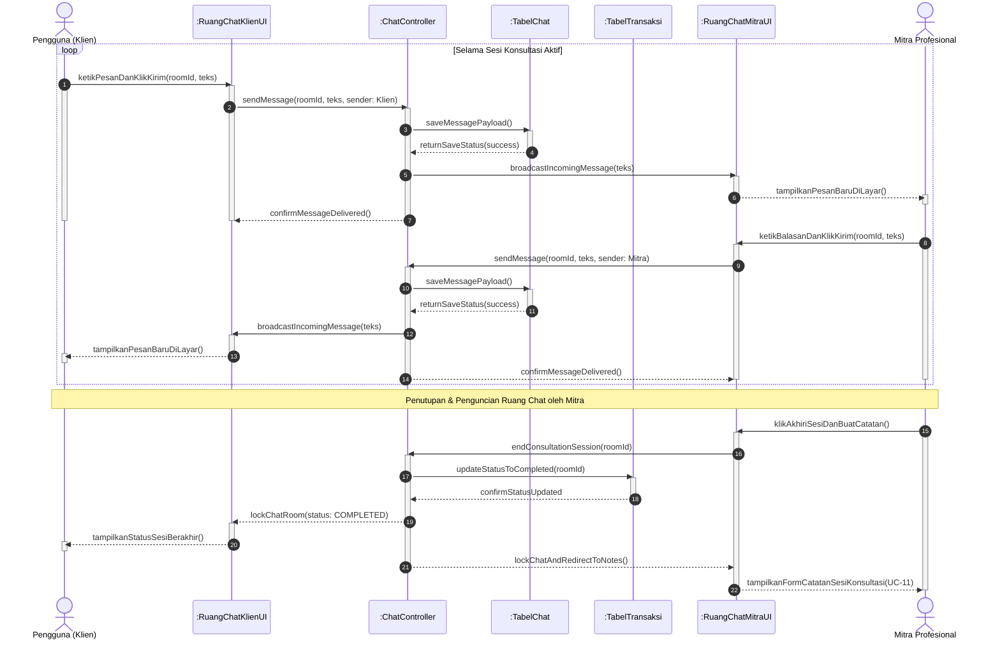
```mermaid
sequenceDiagram
    autonumber
    actor Klien as Pengguna (Klien)
    participant UIKlien as :RuangChatKlienUI
    participant ChatController as :ChatController
    participant TChat as :TabelChat
    participant TTransaksi as :TabelTransaksi
    participant UIMitra as :RuangChatMitraUI
    actor Mitra as Mitra Profesional

    loop Selama Sesi Konsultasi Aktif
        Klien->>UIKlien: ketikPesanDanKlikKirim(roomId, teks)
        activate Klien
        activate UIKlien
        
        UIKlien->>ChatController: sendMessage(roomId, teks, sender: Klien)
        activate ChatController
        
        ChatController->>TChat: saveMessagePayload()
        activate TChat
        TChat-->>ChatController: returnSaveStatus(success)
        deactivate TChat
        
        ChatController->>UIMitra: broadcastIncomingMessage(teks)
        activate UIMitra
        UIMitra-->>Mitra: tampilkanPesanBaruDiLayar()
        activate Mitra
        deactivate Mitra
        deactivate UIMitra
        
        ChatController-->>UIKlien: confirmMessageDelivered()
        deactivate ChatController
        deactivate UIKlien
        deactivate Klien
        
        Mitra->>UIMitra: ketikBalasanDanKlikKirim(roomId, teks)
        activate Mitra
        activate UIMitra
        
        UIMitra->>ChatController: sendMessage(roomId, teks, sender: Mitra)
        activate ChatController
        
        ChatController->>TChat: saveMessagePayload()
        activate TChat
        TChat-->>ChatController: returnSaveStatus(success)
        deactivate TChat
        
        ChatController->>UIKlien: broadcastIncomingMessage(teks)
        activate UIKlien
        UIKlien-->>Klien: tampilkanPesanBaruDiLayar()
        activate Klien
        deactivate Klien
        deactivate UIKlien
        
        ChatController-->>UIMitra: confirmMessageDelivered()
        deactivate ChatController
        deactivate UIMitra
        deactivate Mitra
    end

    note over Klien,Mitra: Penutupan & Penguncian Ruang Chat oleh Mitra

    Mitra->>UIMitra: klikAkhiriSesiDanBuatCatatan()
    activate Mitra
    activate UIMitra
    
    UIMitra->>ChatController: endConsultationSession(roomId)
    activate ChatController
    
    ChatController->>TTransaksi: updateStatusToCompleted(roomId)
    activate TTransaksi
    TTransaksi-->>ChatController: confirmStatusUpdated
    deactivate TTransaksi
    
    ChatController-->>UIKlien: lockChatRoom(status: COMPLETED)
    activate UIKlien
    UIKlien-->>Klien: tampilkanStatusSesiBerakhir()
    activate Klien
    deactivate Klien
    deactivate UIKlien
    
    ChatController-->>UIMitra: lockChatAndRedirectToNotes()
    deactivate ChatController
    
    UIMitra-->>Mitra: tampilkanFormCatatanSesiKonsultasi(UC-11)
    deactivate UIMitra
    deactivate Mitra
```

#### Opsi B: Versi PlantUML
*Cara Import ke Draw.io: Arrange -> Insert -> Advanced -> PlantUML... -> Paste kode di bawah ini -> Insert.*

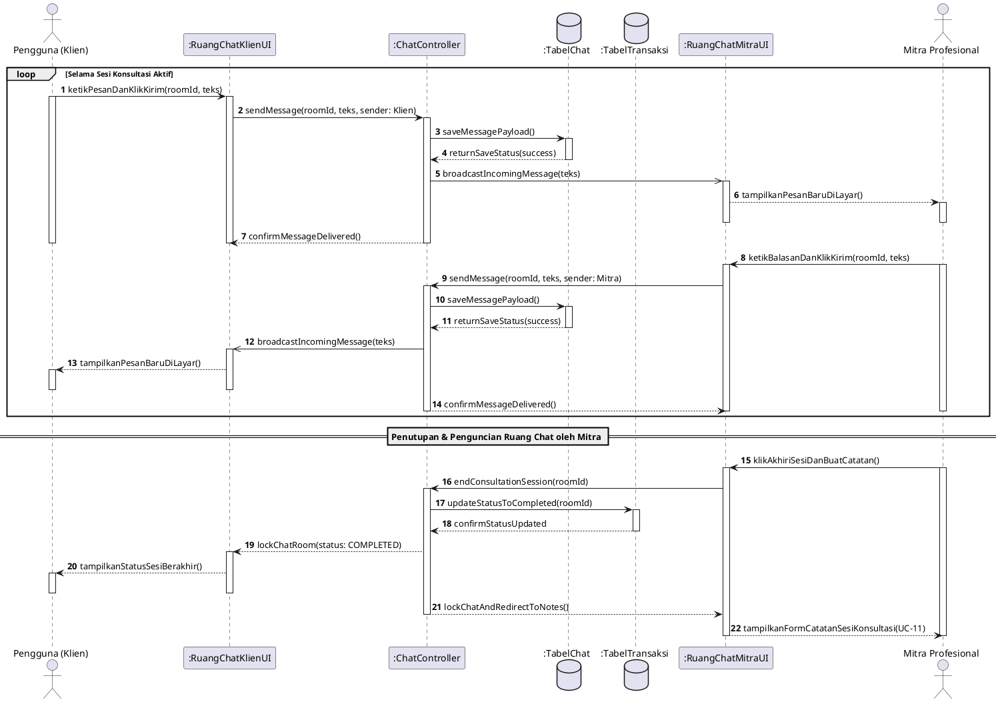
```plantuml
@startuml
autonumber

actor "Pengguna (Klien)" as Klien
participant ":RuangChatKlienUI" as UIKlien
participant ":ChatController" as ChatController
database ":TabelChat" as TChat
database ":TabelTransaksi" as TTransaksi
participant ":RuangChatMitraUI" as UIMitra
actor "Mitra Profesional" as Mitra

loop Selama Sesi Konsultasi Aktif
  Klien -> UIKlien : ketikPesanDanKlikKirim(roomId, teks)
  activate Klien
  activate UIKlien
  
  UIKlien -> ChatController : sendMessage(roomId, teks, sender: Klien)
  activate ChatController
  
  ChatController -> TChat : saveMessagePayload()
  activate TChat
  TChat --> ChatController : returnSaveStatus(success)
  deactivate TChat
  
  ChatController ->> UIMitra : broadcastIncomingMessage(teks)
  activate UIMitra
  UIMitra --> Mitra : tampilkanPesanBaruDiLayar()
  activate Mitra
  deactivate Mitra
  deactivate UIMitra
  
  ChatController --> UIKlien : confirmMessageDelivered()
  deactivate ChatController
  deactivate UIKlien
  deactivate Klien
  
  Mitra -> UIMitra : ketikBalasanDanKlikKirim(roomId, teks)
  activate Mitra
  activate UIMitra
  
  UIMitra -> ChatController : sendMessage(roomId, teks, sender: Mitra)
  activate ChatController
  
  ChatController -> TChat : saveMessagePayload()
  activate TChat
  TChat --> ChatController : returnSaveStatus(success)
  deactivate TChat
  
  ChatController ->> UIKlien : broadcastIncomingMessage(teks)
  activate UIKlien
  UIKlien --> Klien : tampilkanPesanBaruDiLayar()
  activate Klien
  deactivate Klien
  deactivate UIKlien
  
  ChatController --> UIMitra : confirmMessageDelivered()
  deactivate ChatController
  deactivate UIMitra
  deactivate Mitra
end

== Penutupan & Penguncian Ruang Chat oleh Mitra ==

Mitra -> UIMitra : klikAkhiriSesiDanBuatCatatan()
activate Mitra
activate UIMitra

UIMitra -> ChatController : endConsultationSession(roomId)
activate ChatController

ChatController -> TTransaksi : updateStatusToCompleted(roomId)
activate TTransaksi
TTransaksi --> ChatController : confirmStatusUpdated
deactivate TTransaksi

ChatController --> UIKlien : lockChatRoom(status: COMPLETED)
activate UIKlien
UIKlien --> Klien : tampilkanStatusSesiBerakhir()
activate Klien
deactivate Klien
deactivate UIKlien

ChatController --> UIMitra : lockChatAndRedirectToNotes()
deactivate ChatController

UIMitra --> Mitra : tampilkanFormCatatanSesiKonsultasi(UC-11)
deactivate UIMitra
deactivate Mitra
@enduml
```

---

### SD-04: Sequence Diagram - Mengelola Data Akun & Force Logout (UC-14 & UC-15)
*Diagram ini merepresentasikan alur penangguhan (suspend) akun klien/mitra oleh Admin dan proses force logout instan dengan menghapus token sesi JWT.*

#### Opsi A: Versi Mermaid (Sangat Direkomendasikan untuk Draw.io)
*Cara Import ke Draw.io: Arrange -> Insert -> Advanced -> Mermaid... -> Paste kode di bawah ini -> Insert.*

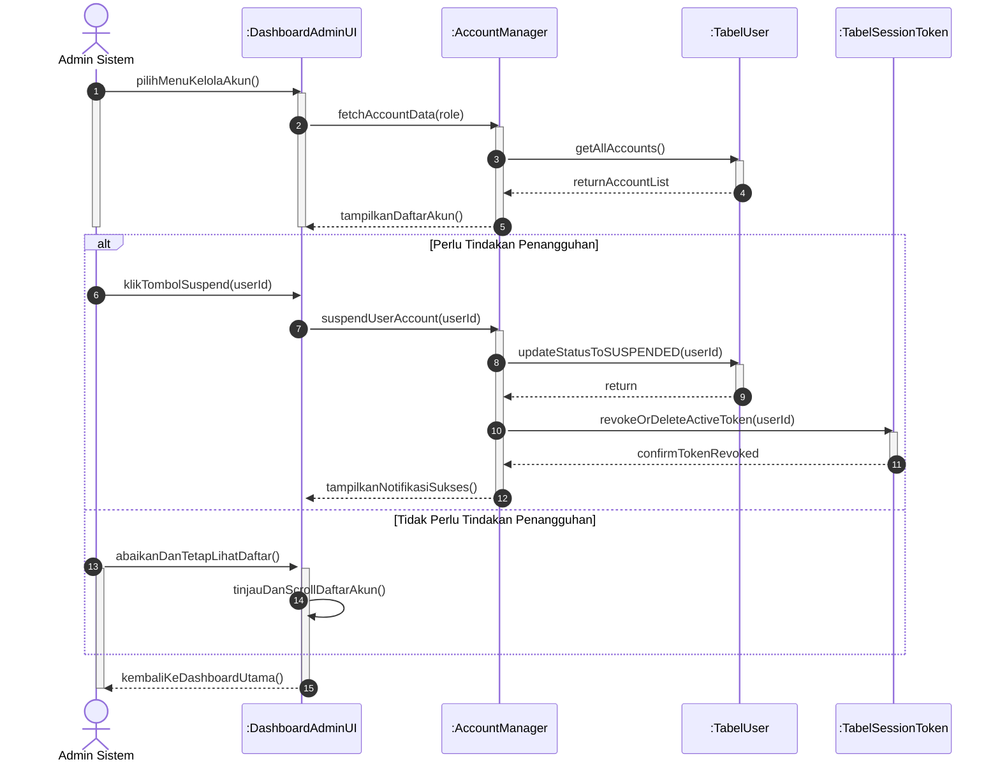
```mermaid
sequenceDiagram
    autonumber
    actor Admin as Admin Sistem
    participant UI as :DashboardAdminUI
    participant AccountManager as :AccountManager
    participant TUser as :TabelUser
    participant TToken as :TabelSessionToken

    Admin->>UI: pilihMenuKelolaAkun()
    activate Admin
    activate UI

    UI->>AccountManager: fetchAccountData(role)
    activate AccountManager

    AccountManager->>TUser: getAllAccounts()
    activate TUser
    TUser-->>AccountManager: returnAccountList
    deactivate TUser

    AccountManager-->>UI: tampilkanDaftarAkun()
    deactivate AccountManager
    deactivate UI
    deactivate Admin

    alt Perlu Tindakan Penangguhan
        Admin->>UI: klikTombolSuspend(userId)
        activate Admin
        activate UI
        
        UI->>AccountManager: suspendUserAccount(userId)
        activate AccountManager
        
        AccountManager->>TUser: updateStatusToSUSPENDED(userId)
        activate TUser
        TUser-->>AccountManager: return
        deactivate TUser
        
        AccountManager->>TToken: revokeOrDeleteActiveToken(userId)
        activate TToken
        TToken-->>AccountManager: confirmTokenRevoked
        deactivate TToken
        
        AccountManager-->>UI: tampilkanNotifikasiSukses()
        deactivate AccountManager
    else Tidak Perlu Tindakan Penangguhan
        Admin->>UI: abaikanDanTetapLihatDaftar()
        activate Admin
        activate UI
        UI->>UI: tinjauDanScrollDaftarAkun()
    end

    UI-->>Admin: kembaliKeDashboardUtama()
    deactivate UI
    deactivate Admin
```

#### Opsi B: Versi PlantUML
*Cara Import ke Draw.io: Arrange -> Insert -> Advanced -> PlantUML... -> Paste kode di bawah ini -> Insert.*

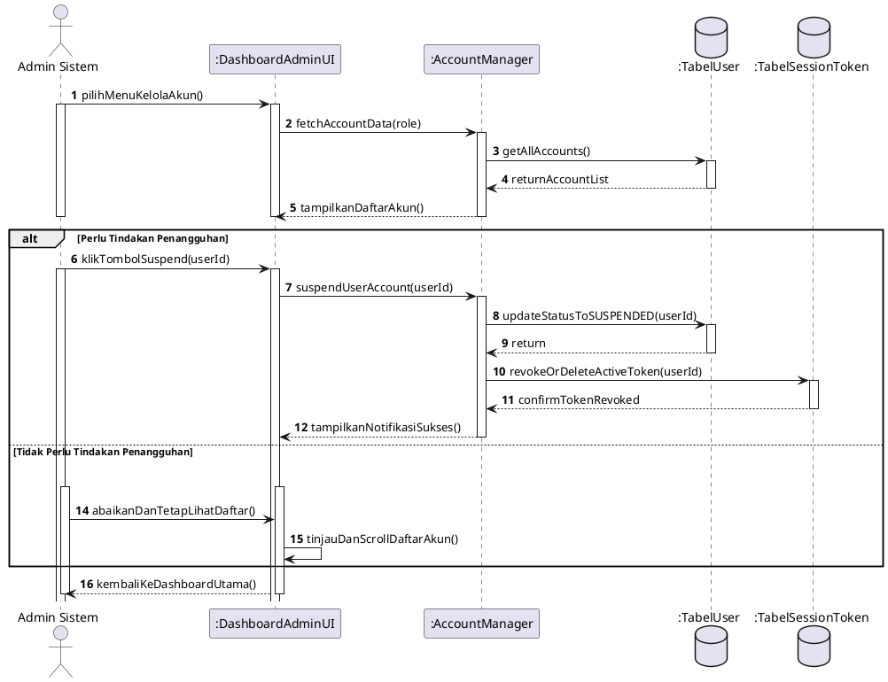
```plantuml
@startuml
autonumber

actor "Admin Sistem" as Admin
participant ":DashboardAdminUI" as UI
participant ":AccountManager" as AccountManager
database ":TabelUser" as TUser
database ":TabelSessionToken" as TToken

Admin -> UI : pilihMenuKelolaAkun()
activate Admin
activate UI

UI -> AccountManager : fetchAccountData(role)
activate AccountManager

AccountManager -> TUser : getAllAccounts()
activate TUser
TUser --> AccountManager : returnAccountList
deactivate TUser

AccountManager --> UI : tampilkanDaftarAkun()
deactivate AccountManager
deactivate UI
deactivate Admin

alt Perlu Tindakan Penangguhan
  Admin -> UI : klikTombolSuspend(userId)
  activate Admin
  activate UI
  
  UI -> AccountManager : suspendUserAccount(userId)
  activate AccountManager
  
  AccountManager -> TUser : updateStatusToSUSPENDED(userId)
  activate TUser
  TUser --> AccountManager : return
  deactivate TUser
  
  AccountManager -> TToken : revokeOrDeleteActiveToken(userId)
  activate TToken
  TToken --> AccountManager : confirmTokenRevoked
  deactivate TToken
  
  AccountManager --> UI : tampilkanNotifikasiSukses()
  deactivate AccountManager
else Tidak Perlu Tindakan Penangguhan
  Admin -[hidden]-> Admin
  activate Admin
  activate UI
  
  Admin -> UI : abaikanDanTetapLihatDaftar()
  UI -> UI : tinjauDanScrollDaftarAkun()
end

UI --> Admin : kembaliKeDashboardUtama()
deactivate UI
deactivate Admin
@enduml
```

---

### SD-14: Sequence Diagram - Catatan Sesi dan Output Dokumen (UC-11 dan UC-12)
*Diagram ini merepresentasikan alur pengisian catatan sesi dengan template domain-specific: SOAP Note + ICD-10 (Kes), DAP Note + Risk Assessment (Psi), Case Memo + Legal Opinion IRAC (Huk), serta penerbitan output dokumen.*

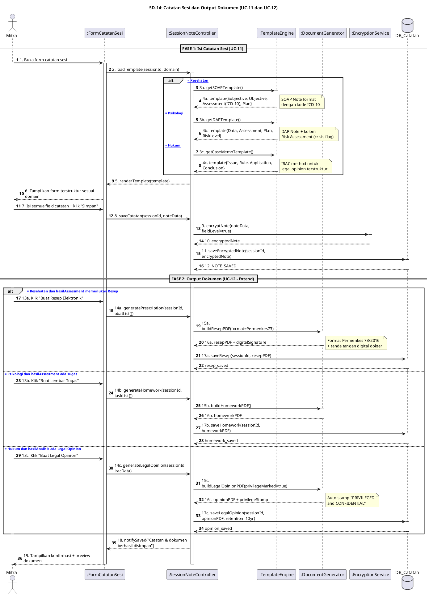
```plantuml
@startuml
autonumber
skinparam sequenceArrowThickness 2
skinparam maxMessageSize 250

title SD-14: Catatan Sesi dan Output Dokumen (UC-11 dan UC-12)

actor "Mitra" as M
participant ":FormCatatanSesi" as UI
participant ":SessionNoteController" as SNC
participant ":TemplateEngine" as TE
participant ":DocumentGenerator" as DG
participant ":EncryptionService" as ES
database ":DB_Catatan" as DB

== FASE 1: Isi Catatan Sesi (UC-11) ==

M -> UI : 1. Buka form catatan sesi
activate M
activate UI
UI -> SNC : 2. loadTemplate(sessionId, domain)
activate SNC

alt [Domain = Kesehatan]
    SNC -> TE : 3a. getSOAPTemplate()
    activate TE
    TE --> SNC : 4a. template{Subjective, Objective, Assessment(ICD-10), Plan}
    deactivate TE
    note right : SOAP Note format\ndengan kode ICD-10
else [Domain = Psikologi]
    SNC -> TE : 3b. getDAPTemplate()
    activate TE
    TE --> SNC : 4b. template{Data, Assessment, Plan, RiskLevel}
    deactivate TE
    note right : DAP Note + kolom\nRisk Assessment (crisis flag)
else [Domain = Hukum]
    SNC -> TE : 3c. getCaseMemoTemplate()
    activate TE
    TE --> SNC : 4c. template{Issue, Rule, Application, Conclusion}
    deactivate TE
    note right : IRAC method untuk\nlegal opinion terstruktur
end

SNC --> UI : 5. renderTemplate(template)
UI --> M : 6. Tampilkan form terstruktur sesuai domain

M -> UI : 7. Isi semua field catatan + klik "Simpan"
UI -> SNC : 8. saveCatatan(sessionId, noteData)
SNC -> ES : 9. encryptNote(noteData, fieldLevel=true)
activate ES
ES --> SNC : 10. encryptedNote
deactivate ES
SNC -> DB : 11. saveEncryptedNote(sessionId, encryptedNote)
activate DB
DB --> SNC : 12. NOTE_SAVED
deactivate DB

== FASE 2: Output Dokumen (UC-12 - Extend) ==

alt [Domain = Kesehatan dan hasilAssessment memerlukan Resep]
    M -> UI : 13a. Klik "Buat Resep Elektronik"
    UI -> SNC : 14a. generatePrescription(sessionId, obatList[])
    SNC -> DG : 15a. buildResepPDF(format=Permenkes73)
    activate DG
    DG --> SNC : 16a. resepPDF + digitalSignature
    deactivate DG
    note right : Format Permenkes 73/2016\n+ tanda tangan digital dokter
    SNC -> DB : 17a. saveResep(sessionId, resepPDF)
    activate DB
    DB --> SNC : resep_saved
    deactivate DB
else [Domain = Psikologi dan hasilAssessment ada Tugas]
    M -> UI : 13b. Klik "Buat Lembar Tugas"
    UI -> SNC : 14b. generateHomework(sessionId, taskList[])
    SNC -> DG : 15b. buildHomeworkPDF()
    activate DG
    DG --> SNC : 16b. homeworkPDF
    deactivate DG
    SNC -> DB : 17b. saveHomework(sessionId, homeworkPDF)
    activate DB
    DB --> SNC : homework_saved
    deactivate DB
else [Domain = Hukum dan hasilAnalisis ada Legal Opinion]
    M -> UI : 13c. Klik "Buat Legal Opinion"
    UI -> SNC : 14c. generateLegalOpinion(sessionId, iracData)
    SNC -> DG : 15c. buildLegalOpinionPDF(privilegeMarked=true)
    activate DG
    DG --> SNC : 16c. opinionPDF + privilegeStamp
    deactivate DG
    note right : Auto-stamp "PRIVILEGED\nand CONFIDENTIAL"
    SNC -> DB : 17c. saveLegalOpinion(sessionId, opinionPDF, retention=10yr)
    activate DB
    DB --> SNC : opinion_saved
    deactivate DB
end

SNC --> UI : 18. notifySaved("Catatan & dokumen berhasil disimpan")
UI --> M : 19. Tampilkan konfirmasi + preview dokumen

deactivate SNC
deactivate UI
deactivate M
@enduml
```
---

### SD-08: Sequence Diagram - Registrasi Klien (UC-01)
*Diagram ini merepresentasikan alur registrasi klien dengan validasi duplikasi NIK/BPJS (Kes), verifikasi email domain .ac.id untuk psikolog magang (Psi), serta consent granular per domain.*

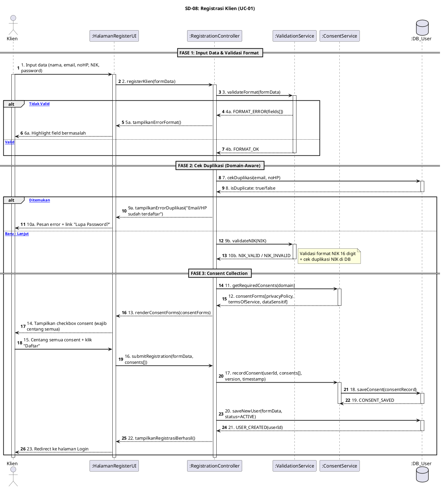
```plantuml
@startuml
autonumber
skinparam sequenceArrowThickness 2
skinparam maxMessageSize 250

title SD-08: Registrasi Klien (UC-01)

actor "Klien" as K
participant ":HalamanRegisterUI" as UI
participant ":RegistrationController" as RC
participant ":ValidationService" as VS
participant ":ConsentService" as CS
database ":DB_User" as DB

== FASE 1: Input Data & Validasi Format ==

K -> UI : 1. Input data (nama, email, noHP, NIK, password)
activate K
activate UI
UI -> RC : 2. registerKlien(formData)
activate RC
RC -> VS : 3. validateFormat(formData)
activate VS

alt [Format Tidak Valid]
    VS --> RC : 4a. FORMAT_ERROR(fields[])
    RC --> UI : 5a. tampilkanErrorFormat()
    UI --> K : 6a. Highlight field bermasalah
else [Format Valid]
    VS --> RC : 4b. FORMAT_OK
    deactivate VS
end

== FASE 2: Cek Duplikasi (Domain-Aware) ==

RC -> DB : 7. cekDuplikasi(email, noHP)
activate DB
DB --> RC : 8. isDuplicate: true/false
deactivate DB

alt [Duplikasi Ditemukan]
    RC --> UI : 9a. tampilkanErrorDuplikasi("Email/HP sudah terdaftar")
    UI --> K : 10a. Pesan error + link "Lupa Password?"
else [Data Baru - Lanjut]

    RC -> VS : 9b. validateNIK(NIK)
    activate VS
    VS --> RC : 10b. NIK_VALID / NIK_INVALID
    deactivate VS
    note right : Validasi format NIK 16 digit\n+ cek duplikasi NIK di DB

    == FASE 3: Consent Collection ==

    RC -> CS : 11. getRequiredConsents(domain)
    activate CS
    CS --> RC : 12. consentForms[privacyPolicy, termsOfService, dataSensitif]
    deactivate CS
    RC --> UI : 13. renderConsentForms(consentForms)
    UI --> K : 14. Tampilkan checkbox consent (wajib centang semua)

    K -> UI : 15. Centang semua consent + klik "Daftar"
    UI -> RC : 16. submitRegistration(formData, consents[])

    RC -> CS : 17. recordConsent(userId, consents[], version, timestamp)
    activate CS
    CS -> DB : 18. saveConsent(consentRecord)
    activate DB
    DB --> CS : 19. CONSENT_SAVED
    deactivate DB
    deactivate CS

    RC -> DB : 20. saveNewUser(formData, status=ACTIVE)
    activate DB
    DB --> RC : 21. USER_CREATED(userId)
    deactivate DB

    RC --> UI : 22. tampilkanRegistrasiBerhasil()
    UI --> K : 23. Redirect ke halaman Login
end

deactivate RC
deactivate UI
deactivate K
@enduml
```
---

### SD-11: Sequence Diagram - Registrasi Mitra Profesional (UC-07)
*Diagram ini merepresentasikan alur registrasi mitra dengan upload berkas domain-specific: STR + SIP + BPJS Provider (Kes), SIPP + HIMPSI Membership (Psi), KTA Peradi + SK Pengacara (Huk). Status awal PENDING_VERIFICATION.*

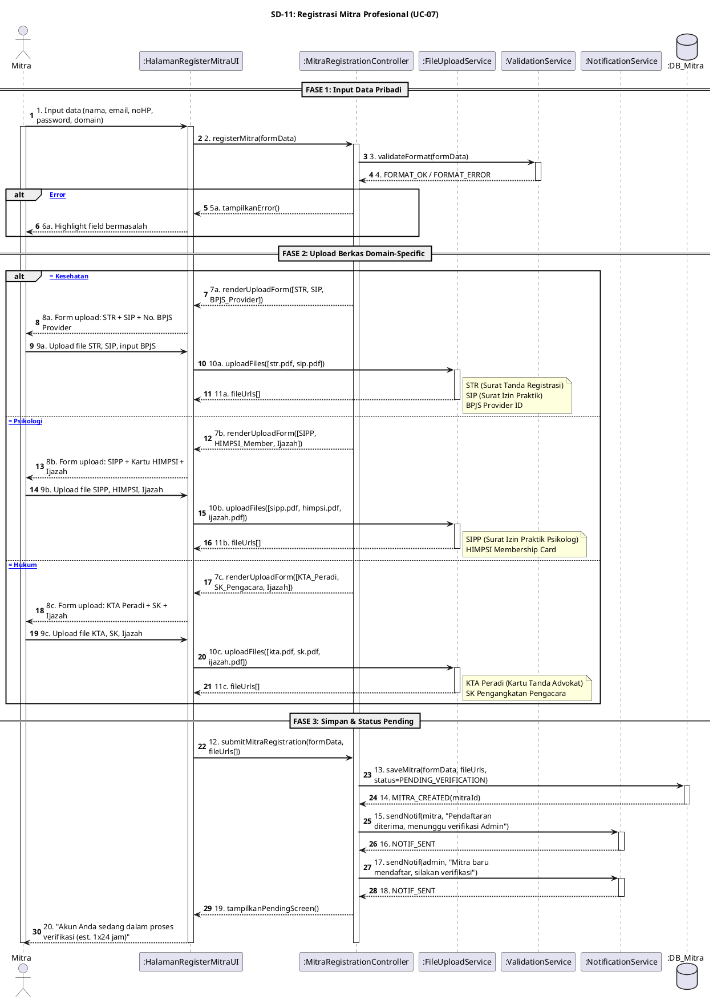
```plantuml
@startuml
autonumber
skinparam sequenceArrowThickness 2
skinparam maxMessageSize 250

title SD-11: Registrasi Mitra Profesional (UC-07)

actor "Mitra" as M
participant ":HalamanRegisterMitraUI" as UI
participant ":MitraRegistrationController" as MRC
participant ":FileUploadService" as FU
participant ":ValidationService" as VS
participant ":NotificationService" as NS
database ":DB_Mitra" as DB

== FASE 1: Input Data Pribadi ==

M -> UI : 1. Input data (nama, email, noHP, password, domain)
activate M
activate UI
UI -> MRC : 2. registerMitra(formData)
activate MRC
MRC -> VS : 3. validateFormat(formData)
activate VS
VS --> MRC : 4. FORMAT_OK / FORMAT_ERROR
deactivate VS

alt [Format Error]
    MRC --> UI : 5a. tampilkanError()
    UI --> M : 6a. Highlight field bermasalah
end

== FASE 2: Upload Berkas Domain-Specific ==

alt [Domain = Kesehatan]
    MRC --> UI : 7a. renderUploadForm([STR, SIP, BPJS_Provider])
    UI --> M : 8a. Form upload: STR + SIP + No. BPJS Provider
    M -> UI : 9a. Upload file STR, SIP, input BPJS
    UI -> FU : 10a. uploadFiles([str.pdf, sip.pdf])
    activate FU
    FU --> UI : 11a. fileUrls[]
    deactivate FU
    note right : STR (Surat Tanda Registrasi)\nSIP (Surat Izin Praktik)\nBPJS Provider ID
else [Domain = Psikologi]
    MRC --> UI : 7b. renderUploadForm([SIPP, HIMPSI_Member, Ijazah])
    UI --> M : 8b. Form upload: SIPP + Kartu HIMPSI + Ijazah
    M -> UI : 9b. Upload file SIPP, HIMPSI, Ijazah
    UI -> FU : 10b. uploadFiles([sipp.pdf, himpsi.pdf, ijazah.pdf])
    activate FU
    FU --> UI : 11b. fileUrls[]
    deactivate FU
    note right : SIPP (Surat Izin Praktik Psikolog)\nHIMPSI Membership Card
else [Domain = Hukum]
    MRC --> UI : 7c. renderUploadForm([KTA_Peradi, SK_Pengacara, Ijazah])
    UI --> M : 8c. Form upload: KTA Peradi + SK + Ijazah
    M -> UI : 9c. Upload file KTA, SK, Ijazah
    UI -> FU : 10c. uploadFiles([kta.pdf, sk.pdf, ijazah.pdf])
    activate FU
    FU --> UI : 11c. fileUrls[]
    deactivate FU
    note right : KTA Peradi (Kartu Tanda Advokat)\nSK Pengangkatan Pengacara
end

== FASE 3: Simpan & Status Pending ==

UI -> MRC : 12. submitMitraRegistration(formData, fileUrls[])
MRC -> DB : 13. saveMitra(formData, fileUrls, status=PENDING_VERIFICATION)
activate DB
DB --> MRC : 14. MITRA_CREATED(mitraId)
deactivate DB

MRC -> NS : 15. sendNotif(mitra, "Pendaftaran diterima, menunggu verifikasi Admin")
activate NS
NS --> MRC : 16. NOTIF_SENT
deactivate NS
MRC -> NS : 17. sendNotif(admin, "Mitra baru mendaftar, silakan verifikasi")
activate NS
NS --> MRC : 18. NOTIF_SENT
deactivate NS

MRC --> UI : 19. tampilkanPendingScreen()
UI --> M : 20. "Akun Anda sedang dalam proses verifikasi (est. 1x24 jam)"

deactivate MRC
deactivate UI
deactivate M
@enduml
```
---

### SD-12: Sequence Diagram - Login Mitra dengan MFA (UC-08)
*Diagram ini merepresentasikan alur login khusus Mitra Profesional yang mewajibkan Multi-Factor Authentication (TOTP/SMS) sebagai compliance data sensitif pasien/klien.*

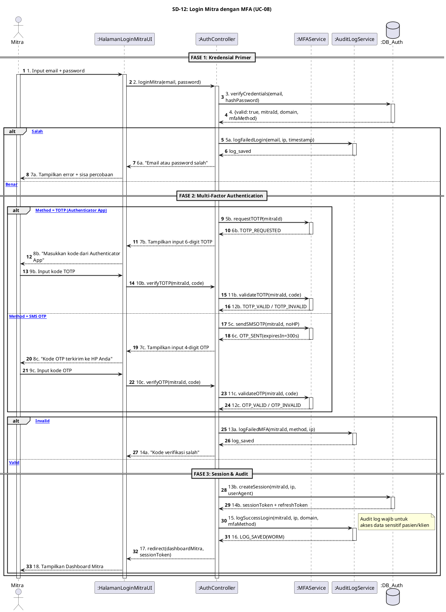
```plantuml
@startuml
autonumber
skinparam sequenceArrowThickness 2
skinparam maxMessageSize 250

title SD-12: Login Mitra dengan MFA (UC-08)

actor "Mitra" as M
participant ":HalamanLoginMitraUI" as UI
participant ":AuthController" as AC
participant ":MFAService" as MFA
participant ":AuditLogService" as AL
database ":DB_Auth" as DB

== FASE 1: Kredensial Primer ==

M -> UI : 1. Input email + password
activate M
activate UI
UI -> AC : 2. loginMitra(email, password)
activate AC
AC -> DB : 3. verifyCredentials(email, hashPassword)
activate DB
DB --> AC : 4. {valid: true, mitraId, domain, mfaMethod}
deactivate DB

alt [Kredensial Salah]
    AC -> AL : 5a. logFailedLogin(email, ip, timestamp)
    activate AL
    AL --> AC : log_saved
    deactivate AL
    AC --> UI : 6a. "Email atau password salah"
    UI --> M : 7a. Tampilkan error + sisa percobaan
else [Kredensial Benar]

    == FASE 2: Multi-Factor Authentication ==

    alt [MFA Method = TOTP (Authenticator App)]
        AC -> MFA : 5b. requestTOTP(mitraId)
        activate MFA
        MFA --> AC : 6b. TOTP_REQUESTED
        deactivate MFA
        AC --> UI : 7b. Tampilkan input 6-digit TOTP
        UI --> M : 8b. "Masukkan kode dari Authenticator App"
        M -> UI : 9b. Input kode TOTP
        UI -> AC : 10b. verifyTOTP(mitraId, code)
        AC -> MFA : 11b. validateTOTP(mitraId, code)
        activate MFA
        MFA --> AC : 12b. TOTP_VALID / TOTP_INVALID
        deactivate MFA
    else [MFA Method = SMS OTP]
        AC -> MFA : 5c. sendSMSOTP(mitraId, noHP)
        activate MFA
        MFA --> AC : 6c. OTP_SENT(expiresIn=300s)
        deactivate MFA
        AC --> UI : 7c. Tampilkan input 4-digit OTP
        UI --> M : 8c. "Kode OTP terkirim ke HP Anda"
        M -> UI : 9c. Input kode OTP
        UI -> AC : 10c. verifyOTP(mitraId, code)
        AC -> MFA : 11c. validateOTP(mitraId, code)
        activate MFA
        MFA --> AC : 12c. OTP_VALID / OTP_INVALID
        deactivate MFA
    end

    alt [MFA Invalid]
        AC -> AL : 13a. logFailedMFA(mitraId, method, ip)
        activate AL
        AL --> AC : log_saved
        deactivate AL
        AC --> UI : 14a. "Kode verifikasi salah"
    else [MFA Valid]

        == FASE 3: Session & Audit ==

        AC -> DB : 13b. createSession(mitraId, ip, userAgent)
        activate DB
        DB --> AC : 14b. sessionToken + refreshToken
        deactivate DB
        AC -> AL : 15. logSuccessLogin(mitraId, ip, domain, mfaMethod)
        activate AL
        note right : Audit log wajib untuk\nakses data sensitif pasien/klien
        AL --> AC : 16. LOG_SAVED(WORM)
        deactivate AL
        AC --> UI : 17. redirect(dashboardMitra, sessionToken)
        UI --> M : 18. Tampilkan Dashboard Mitra
    end
end

deactivate AC
deactivate UI
deactivate M
@enduml
```
---

### SD-09: Sequence Diagram - Memilih Mitra Profesional (UC-03)
*Diagram ini merepresentasikan alur klien memilih mitra profesional dengan filter domain-specific: STR aktif (Kes), SIPP aktif (Psi), Peradi aktif (Huk), radius geolocation, dan status ketersediaan.*

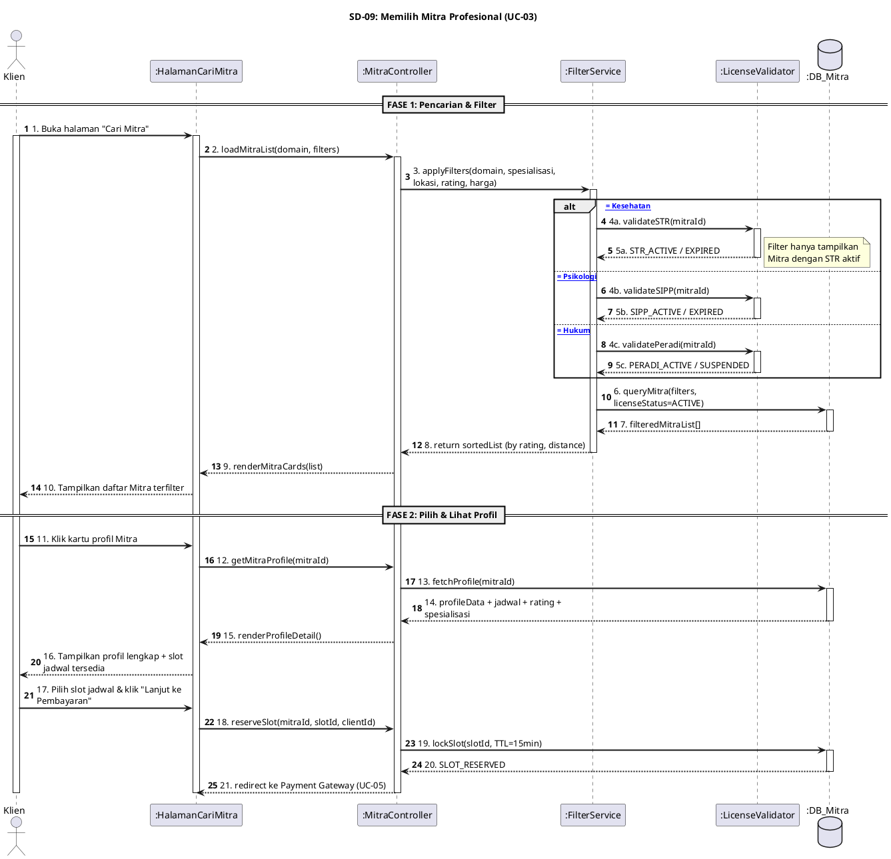
```plantuml
@startuml
autonumber
skinparam sequenceArrowThickness 2
skinparam maxMessageSize 250

title SD-09: Memilih Mitra Profesional (UC-03)

actor "Klien" as K
participant ":HalamanCariMitra" as UI
participant ":MitraController" as MC
participant ":FilterService" as FS
participant ":LicenseValidator" as LV
database ":DB_Mitra" as DB

== FASE 1: Pencarian & Filter ==

K -> UI : 1. Buka halaman "Cari Mitra"
activate K
activate UI
UI -> MC : 2. loadMitraList(domain, filters)
activate MC
MC -> FS : 3. applyFilters(domain, spesialisasi, lokasi, rating, harga)
activate FS

alt [Domain = Kesehatan]
    FS -> LV : 4a. validateSTR(mitraId)
    activate LV
    LV --> FS : 5a. STR_ACTIVE / EXPIRED
    deactivate LV
    note right : Filter hanya tampilkan\nMitra dengan STR aktif
else [Domain = Psikologi]
    FS -> LV : 4b. validateSIPP(mitraId)
    activate LV
    LV --> FS : 5b. SIPP_ACTIVE / EXPIRED
    deactivate LV
else [Domain = Hukum]
    FS -> LV : 4c. validatePeradi(mitraId)
    activate LV
    LV --> FS : 5c. PERADI_ACTIVE / SUSPENDED
    deactivate LV
end

FS -> DB : 6. queryMitra(filters, licenseStatus=ACTIVE)
activate DB
DB --> FS : 7. filteredMitraList[]
deactivate DB
FS --> MC : 8. return sortedList (by rating, distance)
deactivate FS
MC --> UI : 9. renderMitraCards(list)
UI --> K : 10. Tampilkan daftar Mitra terfilter

== FASE 2: Pilih & Lihat Profil ==

K -> UI : 11. Klik kartu profil Mitra
UI -> MC : 12. getMitraProfile(mitraId)
MC -> DB : 13. fetchProfile(mitraId)
activate DB
DB --> MC : 14. profileData + jadwal + rating + spesialisasi
deactivate DB
MC --> UI : 15. renderProfileDetail()
UI --> K : 16. Tampilkan profil lengkap + slot jadwal tersedia

K -> UI : 17. Pilih slot jadwal & klik "Lanjut ke Pembayaran"
UI -> MC : 18. reserveSlot(mitraId, slotId, clientId)
MC -> DB : 19. lockSlot(slotId, TTL=15min)
activate DB
DB --> MC : 20. SLOT_RESERVED
deactivate DB
MC --> UI : 21. redirect ke Payment Gateway (UC-05)

deactivate MC
deactivate UI
deactivate K
@enduml
```
---

### SD-10: Sequence Diagram - Memberikan Ulasan dan Rating (UC-06)
*Diagram ini merepresentasikan alur klien memberikan ulasan setelah sesi konsultasi selesai, termasuk logika domain-specific: wajib isi adverse event jika rating <= 2 (Kes), anonimisasi nama klien untuk review hukum (Huk).*

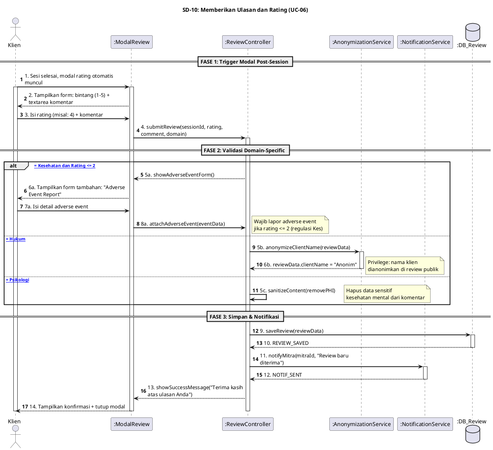
```plantuml
@startuml
autonumber
skinparam sequenceArrowThickness 2
skinparam maxMessageSize 250

title SD-10: Memberikan Ulasan dan Rating (UC-06)

actor "Klien" as K
participant ":ModalReview" as UI
participant ":ReviewController" as RC
participant ":AnonymizationService" as AS
participant ":NotificationService" as NS
database ":DB_Review" as DB

== FASE 1: Trigger Modal Post-Session ==

K -> UI : 1. Sesi selesai, modal rating otomatis muncul
activate K
activate UI
UI --> K : 2. Tampilkan form: bintang (1-5) + textarea komentar

K -> UI : 3. Isi rating (misal: 4) + komentar
UI -> RC : 4. submitReview(sessionId, rating, comment, domain)
activate RC

== FASE 2: Validasi Domain-Specific ==

alt [Domain = Kesehatan dan Rating <= 2]
    RC --> UI : 5a. showAdverseEventForm()
    UI --> K : 6a. Tampilkan form tambahan: "Adverse Event Report"
    K -> UI : 7a. Isi detail adverse event
    UI -> RC : 8a. attachAdverseEvent(eventData)
    note right : Wajib lapor adverse event\njika rating <= 2 (regulasi Kes)
else [Domain = Hukum]
    RC -> AS : 5b. anonymizeClientName(reviewData)
    activate AS
    AS --> RC : 6b. reviewData.clientName = "Anonim"
    deactivate AS
    note right : Privilege: nama klien\ndianonimkan di review publik
else [Domain = Psikologi]
    RC -> RC : 5c. sanitizeContent(removePHI)
    note right : Hapus data sensitif\nkesehatan mental dari komentar
end

== FASE 3: Simpan & Notifikasi ==

RC -> DB : 9. saveReview(reviewData)
activate DB
DB --> RC : 10. REVIEW_SAVED
deactivate DB
RC -> NS : 11. notifyMitra(mitraId, "Review baru diterima")
activate NS
NS --> RC : 12. NOTIF_SENT
deactivate NS
RC --> UI : 13. showSuccessMessage("Terima kasih atas ulasan Anda")
UI --> K : 14. Tampilkan konfirmasi + tutup modal

deactivate RC
deactivate UI
deactivate K
@enduml
```
---

### SD-13: Sequence Diagram - Mengonfirmasi Status Ketersediaan (UC-09)
*Diagram ini merepresentasikan alur mitra mengelola status ketersediaan (online/offline/sibuk), termasuk sinkronisasi ke jadwal RS/Faskes (Kes) dan jadwal sidang pengadilan (Huk).*

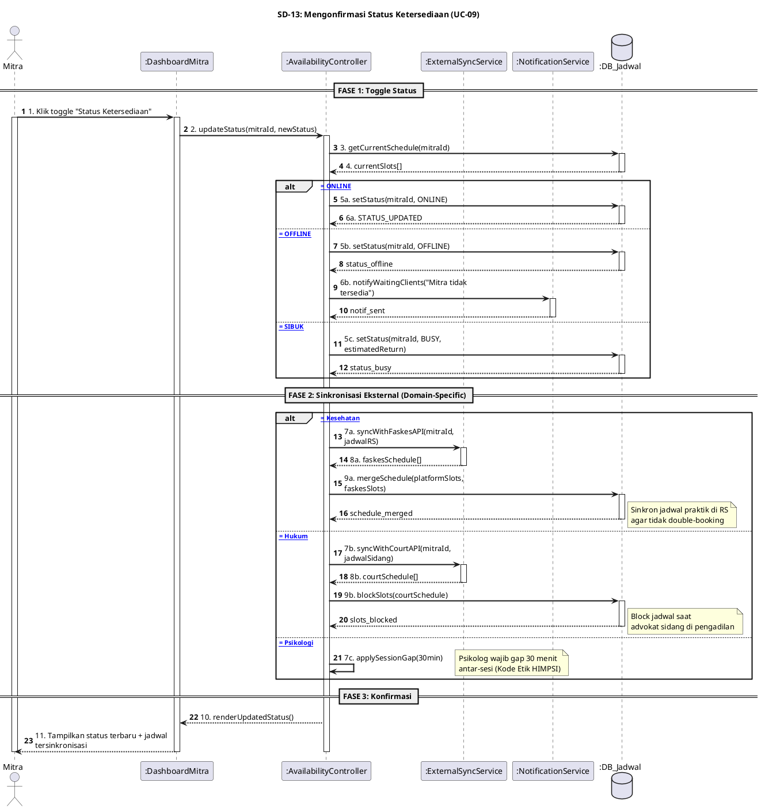
```plantuml
@startuml
autonumber
skinparam sequenceArrowThickness 2
skinparam maxMessageSize 250

title SD-13: Mengonfirmasi Status Ketersediaan (UC-09)

actor "Mitra" as M
participant ":DashboardMitra" as UI
participant ":AvailabilityController" as AC
participant ":ExternalSyncService" as ES
participant ":NotificationService" as NS
database ":DB_Jadwal" as DB

== FASE 1: Toggle Status ==

M -> UI : 1. Klik toggle "Status Ketersediaan"
activate M
activate UI
UI -> AC : 2. updateStatus(mitraId, newStatus)
activate AC

AC -> DB : 3. getCurrentSchedule(mitraId)
activate DB
DB --> AC : 4. currentSlots[]
deactivate DB

alt [newStatus = ONLINE]
    AC -> DB : 5a. setStatus(mitraId, ONLINE)
    activate DB
    DB --> AC : 6a. STATUS_UPDATED
    deactivate DB
else [newStatus = OFFLINE]
    AC -> DB : 5b. setStatus(mitraId, OFFLINE)
    activate DB
    DB --> AC : status_offline
    deactivate DB
    AC -> NS : 6b. notifyWaitingClients("Mitra tidak tersedia")
    activate NS
    NS --> AC : notif_sent
    deactivate NS
else [newStatus = SIBUK]
    AC -> DB : 5c. setStatus(mitraId, BUSY, estimatedReturn)
    activate DB
    DB --> AC : status_busy
    deactivate DB
end

== FASE 2: Sinkronisasi Eksternal (Domain-Specific) ==

alt [Domain = Kesehatan]
    AC -> ES : 7a. syncWithFaskesAPI(mitraId, jadwalRS)
    activate ES
    ES --> AC : 8a. faskesSchedule[]
    deactivate ES
    AC -> DB : 9a. mergeSchedule(platformSlots, faskesSlots)
    activate DB
    DB --> AC : schedule_merged
    deactivate DB
    note right : Sinkron jadwal praktik di RS\nagar tidak double-booking
else [Domain = Hukum]
    AC -> ES : 7b. syncWithCourtAPI(mitraId, jadwalSidang)
    activate ES
    ES --> AC : 8b. courtSchedule[]
    deactivate ES
    AC -> DB : 9b. blockSlots(courtSchedule)
    activate DB
    DB --> AC : slots_blocked
    deactivate DB
    note right : Block jadwal saat\nadvokat sidang di pengadilan
else [Domain = Psikologi]
    AC -> AC : 7c. applySessionGap(30min)
    note right : Psikolog wajib gap 30 menit\nantar-sesi (Kode Etik HIMPSI)
end

== FASE 3: Konfirmasi ==

AC --> UI : 10. renderUpdatedStatus()
UI --> M : 11. Tampilkan status terbaru + jadwal tersinkronisasi

deactivate AC
deactivate UI
deactivate M
@enduml
```
---

### SD-15: Sequence Diagram - Memverifikasi Berkas Kredensial Mitra dan SKTM (UC-13)
*Diagram ini merepresentasikan alur Admin memverifikasi berkas lisensi profesi Mitra serta dokumen SKTM klien Pro Bono, termasuk cross-check ke API Konsil Kedokteran (Kes), HIMPSI (Psi), Peradi (Huk), dan Dukcapil (SKTM).*

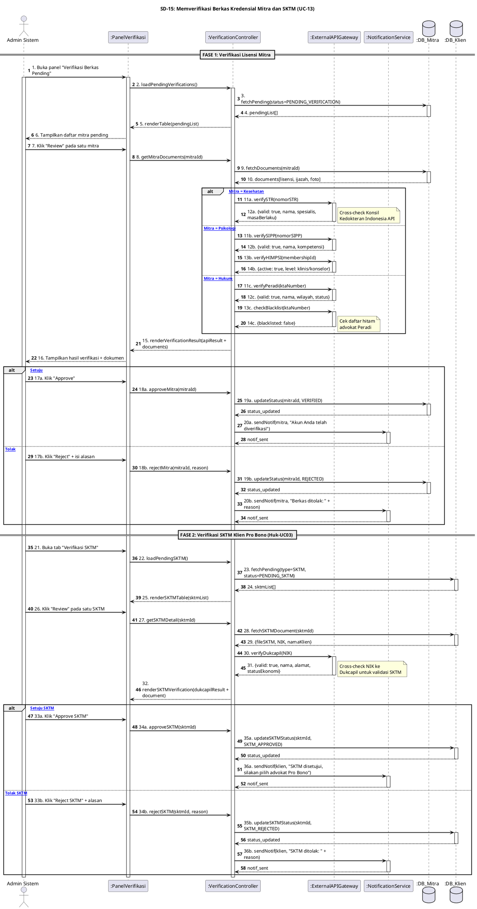
```plantuml
@startuml
autonumber
skinparam sequenceArrowThickness 2
skinparam maxMessageSize 250

title SD-15: Memverifikasi Berkas Kredensial Mitra dan SKTM (UC-13)

actor "Admin Sistem" as A
participant ":PanelVerifikasi" as UI
participant ":VerificationController" as VC
participant ":ExternalAPIGateway" as API
participant ":NotificationService" as NS
database ":DB_Mitra" as DBM
database ":DB_Klien" as DBK

== FASE 1: Verifikasi Lisensi Mitra ==

A -> UI : 1. Buka panel "Verifikasi Berkas Pending"
activate A
activate UI
UI -> VC : 2. loadPendingVerifications()
activate VC
VC -> DBM : 3. fetchPending(status=PENDING_VERIFICATION)
activate DBM
DBM --> VC : 4. pendingList[]
deactivate DBM
VC --> UI : 5. renderTable(pendingList)
UI --> A : 6. Tampilkan daftar mitra pending

A -> UI : 7. Klik "Review" pada satu mitra
UI -> VC : 8. getMitraDocuments(mitraId)
VC -> DBM : 9. fetchDocuments(mitraId)
activate DBM
DBM --> VC : 10. documents[lisensi, ijazah, foto]
deactivate DBM

alt [Domain Mitra = Kesehatan]
    VC -> API : 11a. verifySTR(nomorSTR)
    activate API
    API --> VC : 12a. {valid: true, nama, spesialis, masaBerlaku}
    deactivate API
    note right : Cross-check Konsil\nKedokteran Indonesia API
else [Domain Mitra = Psikologi]
    VC -> API : 11b. verifySIPP(nomorSIPP)
    activate API
    API --> VC : 12b. {valid: true, nama, kompetensi}
    deactivate API
    VC -> API : 13b. verifyHIMPSI(membershipId)
    activate API
    API --> VC : 14b. {active: true, level: klinis/konselor}
    deactivate API
else [Domain Mitra = Hukum]
    VC -> API : 11c. verifyPeradi(ktaNumber)
    activate API
    API --> VC : 12c. {valid: true, nama, wilayah, status}
    deactivate API
    VC -> API : 13c. checkBlacklist(ktaNumber)
    activate API
    API --> VC : 14c. {blacklisted: false}
    deactivate API
    note right : Cek daftar hitam\nadvokat Peradi
end

VC --> UI : 15. renderVerificationResult(apiResult + documents)
UI --> A : 16. Tampilkan hasil verifikasi + dokumen

alt [Admin Setuju]
    A -> UI : 17a. Klik "Approve"
    UI -> VC : 18a. approveMitra(mitraId)
    VC -> DBM : 19a. updateStatus(mitraId, VERIFIED)
    activate DBM
    DBM --> VC : status_updated
    deactivate DBM
    VC -> NS : 20a. sendNotif(mitra, "Akun Anda telah diverifikasi")
    activate NS
    NS --> VC : notif_sent
    deactivate NS
else [Admin Tolak]
    A -> UI : 17b. Klik "Reject" + isi alasan
    UI -> VC : 18b. rejectMitra(mitraId, reason)
    VC -> DBM : 19b. updateStatus(mitraId, REJECTED)
    activate DBM
    DBM --> VC : status_updated
    deactivate DBM
    VC -> NS : 20b. sendNotif(mitra, "Berkas ditolak: " + reason)
    activate NS
    NS --> VC : notif_sent
    deactivate NS
end

== FASE 2: Verifikasi SKTM Klien Pro Bono (Huk-UC03) ==

A -> UI : 21. Buka tab "Verifikasi SKTM"
UI -> VC : 22. loadPendingSKTM()
VC -> DBK : 23. fetchPending(type=SKTM, status=PENDING_SKTM)
activate DBK
DBK --> VC : 24. sktmList[]
deactivate DBK
VC --> UI : 25. renderSKTMTable(sktmList)

A -> UI : 26. Klik "Review" pada satu SKTM
UI -> VC : 27. getSKTMDetail(sktmId)
VC -> DBK : 28. fetchSKTMDocument(sktmId)
activate DBK
DBK --> VC : 29. {fileSKTM, NIK, namaKlien}
deactivate DBK

VC -> API : 30. verifyDukcapil(NIK)
activate API
API --> VC : 31. {valid: true, nama, alamat, statusEkonomi}
deactivate API
note right : Cross-check NIK ke\nDukcapil untuk validasi SKTM

VC --> UI : 32. renderSKTMVerification(dukcapilResult + document)

alt [Admin Setuju SKTM]
    A -> UI : 33a. Klik "Approve SKTM"
    UI -> VC : 34a. approveSKTM(sktmId)
    VC -> DBK : 35a. updateSKTMStatus(sktmId, SKTM_APPROVED)
    activate DBK
    DBK --> VC : status_updated
    deactivate DBK
    VC -> NS : 36a. sendNotif(klien, "SKTM disetujui, silakan pilih advokat Pro Bono")
    activate NS
    NS --> VC : notif_sent
    deactivate NS
else [Admin Tolak SKTM]
    A -> UI : 33b. Klik "Reject SKTM" + alasan
    UI -> VC : 34b. rejectSKTM(sktmId, reason)
    VC -> DBK : 35b. updateSKTMStatus(sktmId, SKTM_REJECTED)
    activate DBK
    DBK --> VC : status_updated
    deactivate DBK
    VC -> NS : 36b. sendNotif(klien, "SKTM ditolak: " + reason)
    activate NS
    NS --> VC : notif_sent
    deactivate NS
end

deactivate VC
deactivate UI
deactivate A
@enduml
```
---

### SD-16: Sequence Diagram - Memantau Laporan Transaksi (UC-16)
*Diagram ini merepresentasikan alur Admin memantau laporan transaksi platform, termasuk filter per domain, perhitungan revenue sharing (Kes 15%, Psi 20%, Huk 25%), dan ekspor audit-ready (XLSX/PDF + hash).*

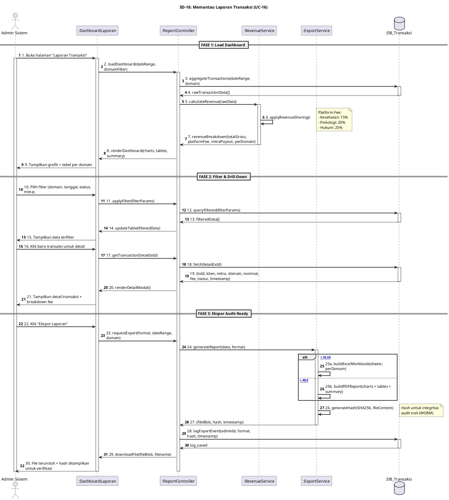
```plantuml
@startuml
autonumber
skinparam sequenceArrowThickness 2
skinparam maxMessageSize 250

title SD-16: Memantau Laporan Transaksi (UC-16)

actor "Admin Sistem" as A
participant ":DashboardLaporan" as UI
participant ":ReportController" as RC
participant ":RevenueService" as RS
participant ":ExportService" as ES
database ":DB_Transaksi" as DB

== FASE 1: Load Dashboard ==

A -> UI : 1. Buka halaman "Laporan Transaksi"
activate A
activate UI
UI -> RC : 2. loadDashboard(dateRange, domainFilter)
activate RC
RC -> DB : 3. aggregateTransactions(dateRange, domain)
activate DB
DB --> RC : 4. rawTransactionData[]
deactivate DB

RC -> RS : 5. calculateRevenue(rawData)
activate RS

RS -> RS : 6. applyRevenueSharing()
note right : Platform Fee:\n- Kesehatan: 15%\n- Psikologi: 20%\n- Hukum: 25%

RS --> RC : 7. revenueBreakdown{totalGross, platformFee, mitraPayout, perDomain}
deactivate RS
RC --> UI : 8. renderDashboard(charts, tables, summary)
UI --> A : 9. Tampilkan grafik + tabel per domain

== FASE 2: Filter & Drill-Down ==

A -> UI : 10. Pilih filter (domain, tanggal, status, mitra)
UI -> RC : 11. applyFilter(filterParams)
RC -> DB : 12. queryFiltered(filterParams)
activate DB
DB --> RC : 13. filteredData[]
deactivate DB
RC --> UI : 14. updateTable(filteredData)
UI --> A : 15. Tampilkan data terfilter

A -> UI : 16. Klik baris transaksi untuk detail
UI -> RC : 17. getTransactionDetail(txId)
RC -> DB : 18. fetchDetail(txId)
activate DB
DB --> RC : 19. {txId, klien, mitra, domain, nominal, fee, status, timestamp}
deactivate DB
RC --> UI : 20. renderDetailModal()
UI --> A : 21. Tampilkan detail transaksi + breakdown fee

== FASE 3: Ekspor Audit-Ready ==

A -> UI : 22. Klik "Ekspor Laporan"
UI -> RC : 23. requestExport(format, dateRange, domain)
RC -> ES : 24. generateReport(data, format)
activate ES

alt [Format = XLSX]
    ES -> ES : 25a. buildExcelWorkbook(sheets: perDomain)
else [Format = PDF]
    ES -> ES : 25b. buildPDFReport(charts + tables + summary)
end

ES -> ES : 26. generateHash(SHA256, fileContent)
note right : Hash untuk integritas\naudit trail (WORM)

ES --> RC : 27. {fileBlob, hash, timestamp}
deactivate ES
RC -> DB : 28. logExportEvent(adminId, format, hash, timestamp)
activate DB
DB --> RC : log_saved
deactivate DB
RC --> UI : 29. downloadFile(fileBlob, filename)
UI --> A : 30. File terunduh + hash ditampilkan untuk verifikasi

deactivate RC
deactivate UI
deactivate A
@enduml
```
---

### SD-18: Sequence Diagram - Mengelola Saldo dan Penarikan Dana Mitra (UC-17)
*Diagram ini merepresentasikan alur pengecekan saldo, pengajuan pencairan dana dengan logika auto-disburse (< Rp 5 juta) vs manual approval (>= Rp 5 juta), validasi NPWP dan rekening BPJS (Kes), serta mekanisme escrow untuk dana pro bono (Huk).*

```plantuml
@startuml
autonumber
skinparam sequenceArrowThickness 2
skinparam maxMessageSize 250

title SD-18: Mengelola Saldo dan Penarikan Dana Mitra (UC-17)

actor "Mitra" as M
actor "Admin Sistem\n(Sub-role Finansial)" as A
participant ":DashboardSaldo" as UI
participant ":WalletController" as WC
participant ":PayoutService" as PS
participant ":ValidationService" as VS
participant ":BankGateway" as BG
participant ":NotificationService" as NS
database ":DB_Wallet" as DB

== FASE 1: Cek Saldo & Riwayat ==

M -> UI : 1. Buka halaman "Saldo Pendapatan"
activate M
activate UI
UI -> WC : 2. getWalletInfo(mitraId)
activate WC
WC -> DB : 3. fetchBalance(mitraId)
activate DB
DB --> WC : 4. {available, pending, frozen, totalEarned}
deactivate DB
WC --> UI : 5. renderSaldoCard(balanceData)
UI --> M : 6. Tampilkan saldo + riwayat penarikan

== FASE 2: Ajukan Penarikan ==

M -> UI : 7. Klik "Tarik Dana" + input nominal
UI -> WC : 8. requestWithdrawal(mitraId, nominal, rekeningTujuan)

WC -> VS : 9. validateWithdrawal(mitraId, nominal)
activate VS

alt [Saldo Tidak Cukup]
    VS --> WC : 10a. INSUFFICIENT_BALANCE
    WC --> UI : 11a. "Saldo tidak mencukupi"
    UI --> M : 12a. Tampilkan error
else [Saldo Cukup]
    VS --> WC : 10b. BALANCE_OK

    WC -> VS : 11b. validateBankAccount(mitraId, domain)

    alt [Domain = Kesehatan atau Psikologi]
        VS -> VS : 12b-kes-psi. validateNPWP(npwp) + validateClinicalAccount(accId)
        note right : Kes/Psi: wajib NPWP\n+ validasi rekening klinis/BPJS
    else [Domain = Hukum]
        VS -> VS : 12b-huk. validateNPWP(npwp) + validateLegalAccount(accId)
        note right : Huk: wajib NPWP\n+ validasi rekening Peradi/BPHN
    end

    VS --> WC : 13b. ACCOUNT_VALID
    deactivate VS

    == FASE 2.5: Gerbang Nominal ==

    WC -> DB : 14. freezeBalance(mitraId, nominal)
    activate DB
    DB --> WC : 15. BALANCE_FROZEN
    deactivate DB

    alt [Nominal < 5.000.000 (Auto-Disburse)]
        WC -> PS : 16a. autoPayout(mitraId, nominal, rekening)
        activate PS
        PS -> BG : 17a. pushWithdrawal(amount, bankAccount)
        activate BG
        BG --> PS : 18a. CALLBACK(status=SUCCESS/FAILED)
        deactivate BG

        alt [Callback SUCCESS]
            PS -> DB : 19a-ok. updateStatus(withdrawalId, SUCCESS)
            activate DB
            DB --> PS : status_updated
            deactivate DB
            PS -> DB : 20a-ok. deductBalance(mitraId, nominal)
            activate DB
            DB --> PS : balance_deducted
            deactivate DB
            PS -> NS : 21a-ok. sendNotif(mitra, "Penarikan Rp X berhasil")
            activate NS
            NS --> PS : notif_sent
            deactivate NS
        else [Callback FAILED / TIMEOUT]
            PS -> DB : 19a-fail. unfreezeBalance(mitraId, nominal)
            activate DB
            DB --> PS : balance_unfrozen
            deactivate DB
            PS -> DB : 20a-fail. updateStatus(withdrawalId, FAILED)
            activate DB
            DB --> PS : status_updated
            deactivate DB
            PS -> NS : 21a-fail. sendNotif(mitra, "Penarikan gagal, saldo dikembalikan")
            activate NS
            NS --> PS : notif_sent
            deactivate NS
        end
        deactivate PS

    else [Nominal >= 5.000.000 (Manual Approval)]
        WC -> DB : 16b. createPendingApproval(withdrawalId, nominal)
        activate DB
        DB --> WC : pending_created
        deactivate DB
        WC -> NS : 17b. sendNotif(admin, "Penarikan >= 5jt menunggu approval")
        activate NS
        NS --> WC : notif_sent
        deactivate NS
        WC --> UI : 18b. "Penarikan dalam antrian persetujuan Admin"
        UI --> M : 19b. Status = PENDING_APPROVAL

        == FASE 3: Admin Approval ==

        A -> UI : 20b. Buka panel "Permintaan Penarikan Dana"
        activate A
        A -> UI : 21b. Review detail penarikan

        alt [Admin Setuju]
            A -> UI : 22b-ok. Klik "Approve & Cairkan"
            UI -> PS : 23b-ok. approveAndDisburse(withdrawalId)
            activate PS
            PS -> BG : 24b-ok. pushWithdrawal(amount, bankAccount)
            activate BG
            BG --> PS : 25b-ok. CALLBACK(status)
            deactivate BG

            alt [SUCCESS]
                PS -> DB : 26b-ok. updateStatus(SUCCESS)
                activate DB
                DB --> PS : status_updated
                deactivate DB
                PS -> DB : 27b-ok. deductBalance(mitraId, nominal)
                activate DB
                DB --> PS : balance_deducted
                deactivate DB
                PS -> NS : 28b-ok. sendNotif(mitra, "Penarikan disetujui & berhasil dicairkan")
                activate NS
                NS --> PS : notif_sent
                deactivate NS
            else [FAILED]
                PS -> DB : 26b-fail. unfreezeBalance(mitraId, nominal)
                activate DB
                DB --> PS : balance_unfrozen
                deactivate DB
                PS -> NS : 27b-fail. sendNotif(mitra, "Pencairan gagal, saldo dikembalikan")
                activate NS
                NS --> PS : notif_sent
                deactivate NS
            end
            deactivate PS

        else [Admin Tolak]
            A -> UI : 22b-no. Klik "Reject" + alasan
            UI -> WC : 23b-no. rejectWithdrawal(withdrawalId, reason)
            WC -> DB : 24b-no. unfreezeBalance(mitraId, nominal)
            activate DB
            DB --> WC : balance_unfrozen
            deactivate DB
            WC -> DB : 25b-no. updateStatus(withdrawalId, REJECTED)
            activate DB
            DB --> WC : status_updated
            deactivate DB
            WC -> NS : 26b-no. sendNotif(mitra, "Penarikan ditolak: " + reason)
            activate NS
            NS --> WC : notif_sent
            deactivate NS
        end
        deactivate A
    end
end

deactivate WC
deactivate UI
deactivate M
@enduml
```
---

### SD-Psikologi: Mengisi Jurnal Mood Harian (Psi-UC01)
*Diagram ini merepresentasikan alur klien memasukkan status emosi hariannya sebagai bagian dari self-care.*

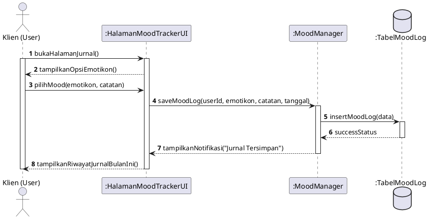
```plantuml
@startuml
autonumber

actor "Klien (User)" as Klien
participant ":HalamanMoodTrackerUI" as UI
participant ":MoodManager" as Manager
database ":TabelMoodLog" as DB

Klien -> UI : bukaHalamanJurnal()
activate Klien
activate UI
UI --> Klien : tampilkanOpsiEmotikon()

Klien -> UI : pilihMood(emotikon, catatan)
UI -> Manager : saveMoodLog(userId, emotikon, catatan, tanggal)
activate Manager

Manager -> DB : insertMoodLog(data)
activate DB
DB --> Manager : successStatus
deactivate DB

Manager --> UI : tampilkanNotifikasi("Jurnal Tersimpan")
deactivate Manager

UI --> Klien : tampilkanRiwayatJurnalBulanIni()
deactivate UI
deactivate Klien
@enduml
```

---

### SD-Hukum: Mengunggah Berkas Perkara (Huk-UC01)
*Diagram ini merepresentasikan alur klien mengunggah berkas kasus rahasia yang dienkripsi agar bisa ditinjau Advokat di ruang chat.*

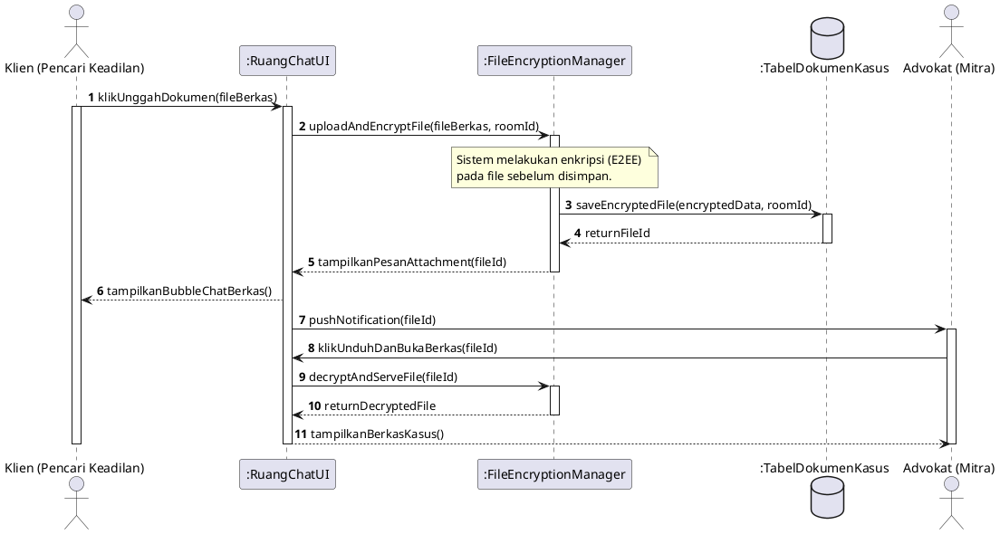
```plantuml
@startuml
autonumber

actor "Klien (Pencari Keadilan)" as Klien
participant ":RuangChatUI" as UI
participant ":FileEncryptionManager" as Manager
database ":TabelDokumenKasus" as DB
actor "Advokat (Mitra)" as Mitra

Klien -> UI : klikUnggahDokumen(fileBerkas)
activate Klien
activate UI

UI -> Manager : uploadAndEncryptFile(fileBerkas, roomId)
activate Manager

note over Manager: Sistem melakukan enkripsi (E2EE) \npada file sebelum disimpan.

Manager -> DB : saveEncryptedFile(encryptedData, roomId)
activate DB
DB --> Manager : returnFileId
deactivate DB

Manager --> UI : tampilkanPesanAttachment(fileId)
deactivate Manager

UI --> Klien : tampilkanBubbleChatBerkas()
UI -> Mitra : pushNotification(fileId)
activate Mitra

Mitra -> UI : klikUnduhDanBukaBerkas(fileId)
UI -> Manager : decryptAndServeFile(fileId)
activate Manager
Manager --> UI : returnDecryptedFile
deactivate Manager
UI --> Mitra : tampilkanBerkasKasus()
deactivate Mitra

deactivate UI
deactivate Klien
@enduml
```

---

### SD-Kesehatan: Menebus Resep & Membeli Obat (Kes-UC01)
*Diagram ini merepresentasikan alur klien menebus resep digital ke apotek mitra dan pengantaran obat oleh kurir.*

```plantuml
@startuml
autonumber
actor "Pasien (Klien)" as Klien
participant ":HalamanResepUI" as UI
participant ":OrderManager" as Manager
database ":TabelOrderObat" as DB
actor "Apotek / Kurir" as Apotek

Klien -> UI : bukaHalamanResep(sessionId)
activate UI
UI -> Manager : getResepDetail(sessionId)
activate Manager
Manager --> UI : returnDataResep
deactivate Manager
UI --> Klien : tampilkanDaftarObatDanHarga()

Klien -> UI : klikTebusResep()
UI -> Manager : createOrder(obatList, userId)
activate Manager
Manager -> DB : insertNewOrder(status: PENDING_PAYMENT)
activate DB
DB --> Manager : return OrderId
deactivate DB

note over UI, DB : Proses Pembayaran (Via Payment Gateway) terjadi di sini

alt Pembayaran Berhasil
    Manager -> DB : updateStatus(PAID)
    activate DB
    DB --> Manager : return Status Updated
    deactivate DB
    Manager -> Apotek : notifikasiPesananBaru(orderId)
    activate Apotek
    Apotek -> Manager : konfirmasiPesananDiproses()
    Manager -> DB : updateStatus(PROCESSING)
    activate DB
    DB --> Manager : return Status Updated
    deactivate DB
    Apotek -> Manager : updateStatusPengiriman(SHIPPED)
    deactivate Apotek
    Manager -> DB : updateStatus(SHIPPED)
    activate DB
    DB --> Manager : return Status Updated
    deactivate DB
    Manager --> UI : tampilkanStatusPengiriman()
    UI --> Klien : melacakPengirimanObat()
else Pembayaran Gagal / Dibatalkan
    Manager -> DB : updateStatus(CANCELLED)
    activate DB
    DB --> Manager : return Status Updated
    deactivate DB
    Manager --> UI : tampilkanPesanGagal("Pembayaran gagal / dibatalkan")
    UI --> Klien : tampilkanPesanGagal()
end

deactivate Manager
deactivate UI
@enduml
```

---

### SD-Kesehatan: Membuat Janji Temu RS Offline (Kes-UC02)
*Diagram ini merepresentasikan alur klien memesan jadwal janji temu fisik di rumah sakit.*

```plantuml
@startuml
autonumber
actor Klien
participant ":JanjiTemuUI" as UI
participant ":BookingManager" as Manager
participant ":SistemRS (Faskes)" as Faskes

Klien -> UI : bukaMenuJanjiTemu()
activate UI
UI -> Manager : fetchDokterDanJadwal()
activate Manager
Manager -> Faskes : getAvailableDoctors()
activate Faskes
Faskes --> Manager : listDokterDanJadwal
deactivate Faskes
Manager --> UI : tampilkanDaftarDokter
deactivate Manager

Klien -> UI : pilihDokter(dokterId)
UI --> Klien : tampilkanJadwalDokter(dokterId)

Klien -> UI : pilihJadwal(rsId, dokterId, waktu)
UI -> Manager : requestBooking(rsId, dokterId, waktu)
activate Manager

Manager -> Faskes : checkAvailability(waktu)
activate Faskes
Faskes --> Manager : returnStatus(tersedia)

alt Jadwal Tersedia
  Manager -> Faskes : confirmBooking(klienId)
  Faskes --> Manager : bookingId
  Manager --> UI : tampilkanTiketBooking(bookingId)
  UI --> Klien : tampilkanTiket()
else Jadwal Penuh
  Faskes --> Manager : returnStatus(penuh)
  deactivate Faskes
  Manager --> UI : tampilkanError("Jadwal penuh, pilih waktu lain")
  UI --> Klien : tampilkanPesanError()
end
deactivate Manager
deactivate UI
@enduml
```

---

### SD-Kesehatan: Melihat Rekam Medis (Kes-UC03)
*Diagram ini merepresentasikan alur penarikan riwayat rekam medis klien atau keluarganya.*

```plantuml
@startuml
autonumber
actor Klien
participant ":RekamMedisUI" as UI
participant ":MedicalRecordManager" as Manager
database ":TabelRekamMedis" as DB

Klien -> UI : bukaMenuRekamMedis()
activate UI
UI -> Manager : fetchFamilyProfiles(klienId)
activate Manager
Manager --> UI : listProfilKeluarga
UI --> Klien : pilihProfil(profilId)

Klien -> UI : klikProfil(profilId)
UI -> Manager : fetchMedicalHistory(profilId)
Manager -> DB : queryHistory(profilId)
activate DB

alt Data Ditemukan
  DB --> Manager : dataRekamMedis
  Manager --> UI : renderMedicalHistory(dataRekamMedis)
  UI --> Klien : tampilkanRiwayat()
else Data Kosong
  DB --> Manager : emptySet
  deactivate DB
  Manager --> UI : renderEmptyState()
  UI --> Klien : tampilkanPesan("Belum ada riwayat")
end
deactivate Manager
deactivate UI
@enduml
```

---

### SD-Psikologi: Mengakses Audio Meditasi (Psi-UC02)
*Diagram ini merepresentasikan alur streaming audio relaksasi.*

```plantuml
@startuml
autonumber
actor Klien
participant ":AudioPlayerUI" as UI
participant ":MediaStreamer" as Streamer
database ":AudioStorage" as Storage

Klien -> UI : bukaMenuMeditasi()
activate UI
UI -> Streamer : fetchAudioCategories()
activate Streamer
Streamer -> Storage : getAudioList()
activate Storage
Storage --> Streamer : listAudioTracks
deactivate Storage
Streamer --> UI : tampilkanDaftarAudio
deactivate Streamer

Klien -> UI : pilihTrek(trackId)
UI --> Klien : tampilkanPlayer(trackId)

Klien -> UI : klikPlay(trackId)
UI -> Streamer : requestStream(trackId, token)
activate Streamer

Streamer -> Storage : getAudioFile(trackId)
activate Storage
Storage --> Streamer : audioDataChunk

alt Streaming Berhasil
  Streamer --> UI : streamAudio(audioDataChunk)
  UI --> Klien : putarAudio()
else Koneksi Putus / File Hilang
  Storage --> Streamer : fileNotFound
  deactivate Storage
  Streamer --> UI : streamError()
  UI --> Klien : tampilkanPesanError("Audio tidak dapat diputar")
end
deactivate Streamer
deactivate UI
@enduml
```

---

### SD-Psikologi: Mengisi Tes Asesmen Psikologi (Psi-UC03)
*Diagram ini merepresentasikan alur pengisian kuesioner psikometri.*

```plantuml
@startuml
autonumber
actor Klien
participant ":AssessmentUI" as UI
participant ":ScoringEngine" as Engine
database ":TabelHasilTes" as DB

Klien -> UI : bukaMenuAsesmen()
activate UI
UI -> Engine : fetchQuestions(DASS21)
activate Engine
Engine --> UI : listPertanyaan
deactivate Engine
UI --> Klien : tampilkanKuesioner

Klien -> UI : jawabSeluruhPertanyaan()
Klien -> UI : submitJawaban(listJawaban)
UI -> Engine : calculateScore(listJawaban)
activate Engine

Engine -> Engine : applyDASS21Algorithm()
Engine -> DB : saveResult(klienId, scoreData)
activate DB
DB --> Engine : savedSuccessfully
deactivate DB

Engine --> UI : returnResult(scoreData, rekomendasi)
deactivate Engine

UI --> Klien : tampilkanHasilTes(tingkatStres)
deactivate UI
@enduml
```

---

### SD-Hukum: Membuat Draf Dokumen Hukum (Huk-UC02)
*Diagram ini merepresentasikan alur merender template hukum oleh advokat.*

```plantuml
@startuml
autonumber
actor Advokat
participant ":LegalDraftingUI" as UI
participant ":DocumentGenerator" as Generator
database ":TemplateDB" as DB

Advokat -> UI : bukaMenuDrafting()
activate UI
UI -> Generator : fetchTemplateList()
activate Generator
Generator -> DB : getAllTemplates()
activate DB
DB --> Generator : listTemplates
deactivate DB
Generator --> UI : tampilkanDaftarTemplate
deactivate Generator

Advokat -> UI : cariDanPilihTemplate(keyword)
UI --> Advokat : tampilkanFormInput(templateId)

Advokat -> UI : isiVariabelTemplate(templateId, dataVariabel)
UI -> Generator : generatePDF(templateId, dataVariabel)
activate Generator

Generator -> DB : fetchTemplate(templateId)
activate DB

alt Template Ditemukan
  DB --> Generator : templateFile
  Generator -> Generator : replaceVariablesAndRenderPDF()
  Generator --> UI : returnPdfURL
  UI --> Advokat : tampilkanPratinjauPDF()
else Template Tidak Ditemukan
  DB --> Generator : notFound
  deactivate DB
  Generator --> UI : returnError()
  UI --> Advokat : tampilkanPesanError("Template tidak tersedia")
end
deactivate Generator
deactivate UI
@enduml
```

---

### SD-Hukum: Melakukan Konsultasi Pro Bono (Huk-UC03)
*Diagram ini merepresentasikan alur validasi SKTM untuk konsultasi gratis.*

```plantuml
@startuml
autonumber
actor Klien
participant ":ProBonoUI" as UI
participant ":VerificationManager" as Manager
participant ":TicketEngine" as Engine

Klien -> UI : unggahSKTM(fileSKTM)
activate UI
UI -> Manager : verifyProBonoEligibility(klienId, fileSKTM)
activate Manager

Manager -> Manager : checkAdvocateQuota()

alt Kuota Tersedia
  Manager -> Engine : generateFreeTicket(klienId)
  activate Engine
  Engine --> Manager : ticketId
  deactivate Engine
  Manager --> UI : redirectKeRuangTunggu(ticketId)
  UI --> Klien : tampilkanRuangTunggu()
else Kuota Habis
  Manager --> UI : returnErrorQuota()
  deactivate Manager
  UI --> Klien : tampilkanPesan("Kuota Pro Bono hari ini habis")
end
deactivate UI
@enduml
```

---

