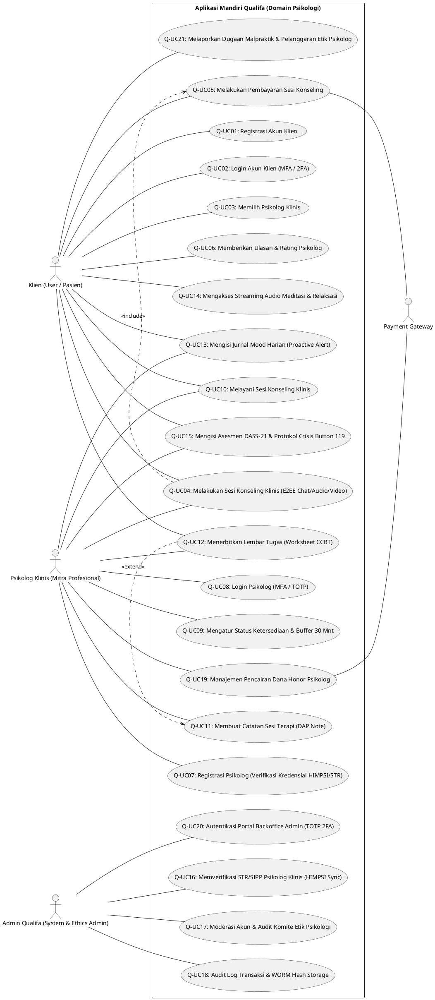

# Kumpulan Kode PlantUML - 100% Siloed Architecture (Justifiqa & Qualifa Standalone Apps)

Dokumen ini berisi kumpulan kode PlantUML untuk diagram Use Case pada dua aplikasi yang **100% berdiri sendiri dan terisolasi total (*Siloed Architecture*)**: **Justifiqa** (Platform Konsultasi & Bantuan Hukum Digital) dan **Qualifa** (Platform Kesehatan Mental & Konseling Psikologi). Tidak ada *shared core engine* atau *single sign-on*; masing-masing memiliki sistem autentikasi, transaksi, dan panel administratif independen.

---

## Cara Import ke Draw.io
1. Buka Draw.io (`app.diagrams.net`).
2. Pada toolbar bagian atas, klik tombol **`+` (Insert)** atau pilih menu **Arrange -> Insert**.
3. Pilih **Advanced -> PlantUML...**.
4. Salin dan tempel salah satu kode di bawah ini, lalu klik **Insert**.

---

### 1. Use Case Diagram - Aplikasi Mandiri Justifiqa (Domain Hukum)
*Representasi sistem mandiri Justifiqa yang mencakup seluruh alur pengguna (Klien, Advokat, Notaris, Admin Justifiqa, Escrow System, CV AI, Payment Gateway) dari registrasi, konsultasi hukum, e-Meterai, pro bono, corporate intake, notary stamping, e-KYC forensik, hingga manajemen administratif independen.*

```plantuml
@startuml
left to right direction
skinparam packageStyle rectangle

actor "Klien (Pencari Keadilan)" as Klien
actor "Advokat / Notaris (Mitra Profesional)" as Mitra
actor "Klien Korporat (Pendirian PT/CV)" as CorpClient
actor "Notaris Terdaftar" as Notaris
actor "Admin Justifiqa (System & Legal Admin)" as Admin
actor "Payment Gateway" as PG
actor "API Mekari Sign (Peruri)" as Mekari
actor "Escrow System" as Escrow
actor "Computer Vision AI (Forensic Verification)" as CVAI

rectangle "Aplikasi Mandiri Justifiqa (Domain Hukum)" {
  ' Client & Partner Core Flows
  usecase "J-UC01: Registrasi Akun Klien (Verifikasi NIK Dukcapil)" as UC01
  usecase "J-UC02: Login Akun Klien (MFA / 2FA)" as UC02
  usecase "J-UC03: Memilih Advokat / Notaris" as UC03
  usecase "J-UC04: Melakukan Konsultasi Hukum (E2EE Chat)" as UC04
  usecase "J-UC05: Melakukan Pembayaran (Escrow System)" as UC05
  usecase "J-UC06: Memberikan Ulasan & Rating Advokat" as UC06
  
  usecase "J-UC07: Registrasi Advokat (Verifikasi Kredensial Peradi/SIPP)" as UC07
  usecase "J-UC08: Login Advokat (MFA / TOTP)" as UC08
  usecase "J-UC09: Mengatur Status Ketersediaan Praktik" as UC09
  usecase "J-UC10: Melayani Sesi Konsultasi Hukum" as UC10
  usecase "J-UC11: Membuat Catatan Hukum (IRAC Note)" as UC11
  usecase "J-UC12: Membuat & Memfinalisasi Draf Kontrak Bermeterai" as UC12
  
  ' Domain Specific Legal Flows
  usecase "J-UC13: Mengunggah Berkas Perkara E2EE (Zero-Knowledge)" as UC13
  usecase "J-UC15: Pengajuan Konsultasi Pro Bono (Verifikasi SKTM)" as UC15
  usecase "J-UC22: Mengisi Saldo Dompet Advokat (Top-Up)" as UC22
  
  ' Phase 2: Corporate Intake, Notary & e-KYC
  usecase "J-UC23: Mendirikan PT/CV Berstandar PPATK (Corporate Intake)" as UC23
  usecase "J-UC24: Notary Stamping & Submission AHU/OSS" as UC24
  usecase "J-UC25: e-KYC Forensik Multi-Pihak (Computer Vision AI)" as UC25
  usecase "J-UC26: Escrow Lock, TTL 7 Hari & Global Halt" as UC26
  usecase "J-UC27: Submission AHU/OSS Rejection Loop & Rekonsiliasi" as UC27
  usecase "J-UC28: WORM Anchoring Dokumen Final & Payout Notaris" as UC28
  
  ' Independent Admin Flows
  usecase "J-UC20: Autentikasi Portal Backoffice Admin (TOTP 2FA)" as UC20
  usecase "J-UC21: Melaporkan Dugaan Pelanggaran Etik Advokat" as UC21
  usecase "J-UC16: Memverifikasi Kredensial & Lisensi Advokat (NIA & BAS)" as UC16
  usecase "J-UC17: Moderasi Akun & Due Process Suspend Flow" as UC17
  usecase "J-UC18: Audit Log Transaksi & WORM Hash Storage" as UC18
  usecase "J-UC19: Manajemen Pencairan Dana Escrow Advokat (PPh 21)" as UC19
  
  UC04 .> UC05 : <<include>>
  UC12 .> UC11 : <<extend>>
  UC12 .> UC22 : <<include>>
  UC15 .> UC04 : <<extend>>
  
  ' Phase 2 Relationships
  UC23 .> UC24 : <<include>>
  UC24 .> UC25 : <<include>>
  UC25 .> UC26 : <<include>>
  UC26 .> UC27 : <<include>>
  UC27 .> UC28 : <<include>>
  UC23 .> UC26 : <<include>>
  UC24 .> UC26 : <<include>>
  UC25 .> UC26 : <<include>>
  
  ' User Access Relationships
  Klien -- UC01
  Klien -- UC02
  Klien -- UC03
  Klien -- UC04
  Klien -- UC05
  Klien -- UC06
  Klien -- UC10
  Klien -- UC13
  Klien -- UC15
  Klien -- UC21
  
  CorpClient -- UC23
  CorpClient -- UC25
  CorpClient -- UC28
  
  Mitra -- UC04
  Mitra -- UC07
  Mitra -- UC08
  Mitra -- UC09
  Mitra -- UC10
  Mitra -- UC11
  Mitra -- UC12
  Mitra -- UC13
  Mitra -- UC15
  Mitra -- UC19
  Mitra -- UC22
  
  Notaris -- UC24
  Notaris -- UC27
  Notaris -- UC28
  
  Admin -- UC20
  Admin -- UC16
  Admin -- UC17
  Admin -- UC18
  
  UC05 -- PG
  UC19 -- PG
  UC22 -- PG
  
  UC23 -- Escrow
  UC24 -- Escrow
  UC26 -- Escrow
  UC28 -- Escrow
  
  UC25 -- CVAI
  UC26 -- CVAI
  
  UC12 -- Mekari
  UC24 -- Mekari
  UC28 -- Mekari
}
@enduml
```

---

### 2. Use Case Diagram - Aplikasi Mandiri Qualifa (Domain Psikologi)
*Representasi sistem mandiri Qualifa yang mencakup seluruh alur pengguna (Klien, Psikolog Klinis, Admin Qualifa, dan Payment Gateway) dari registrasi, konseling klinis, mood tracker, meditasi, protokol krisis 119, hingga manajemen administratif independen.*

