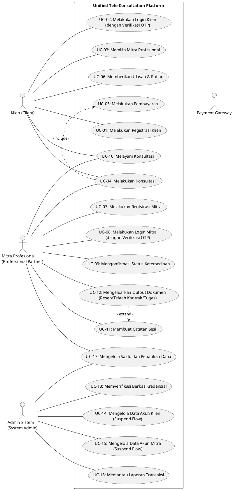
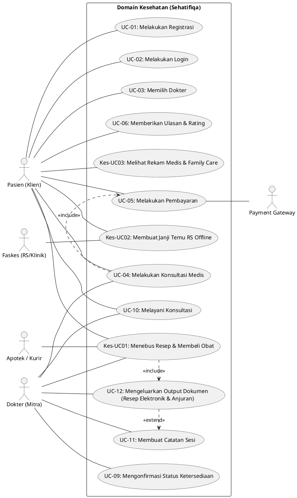
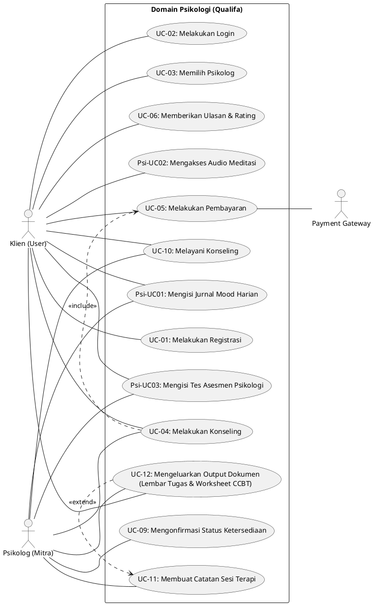
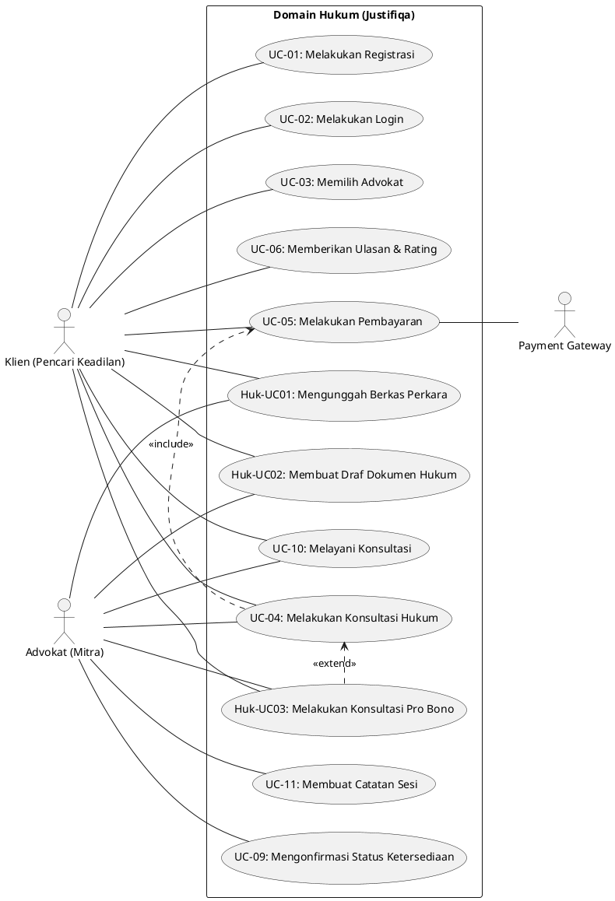

# Kumpulan Kode PlantUML Terpadu - Unified Tele-Consultation Platform

Dokumen ini berisi kumpulan kode PlantUML untuk diagram-diagram utama pada sistem **Unified Tele-Consultation Platform** (Hukum, Psikologi, dan Kesehatan Fisik). Kode-kode ini telah diabstraksikan menggunakan aktor terpadu (*Klien*, *Mitra Profesional*, *Admin Sistem*, dan *Payment Gateway*).

---

## Cara Import ke Draw.io
1. Buka Draw.io (`app.diagrams.net`).
2. Pada toolbar bagian atas, klik tombol **`+` (Insert)** atau pilih menu **Arrange -> Insert**.
3. Pilih **Advanced -> PlantUML...**.
4. Salin dan tempel salah satu kode di bawah ini, lalu klik **Insert**.

---

### 0. Use Case Diagram Terpadu (Unified Use Case Diagram)
*Diagram ini merepresentasikan seluruh 17 Use Case terpadu dengan 4 Aktor Sistem (Admin Sistem mencakup sub-peran Admin Finansial untuk UC-17).*

---

### 0-A. Use Case Diagram - Domain Kesehatan (Sehatifiqa)
*Menampilkan Core UC + UC Spesifik Kesehatan (Tebus Resep, Janji Temu RS, Rekam Medis).*

---

### 0-B. Use Case Diagram - Domain Psikologi (Qualifa)
*Menampilkan Core UC + UC Spesifik Psikologi (Jurnal Mood, Meditasi, Asesmen).*

---

### 0-C. Use Case Diagram - Domain Hukum (Justifiqa)
*Menampilkan Core UC + UC Spesifik Hukum (Unggah Berkas, Draf Hukum, Pro Bono).*

---

