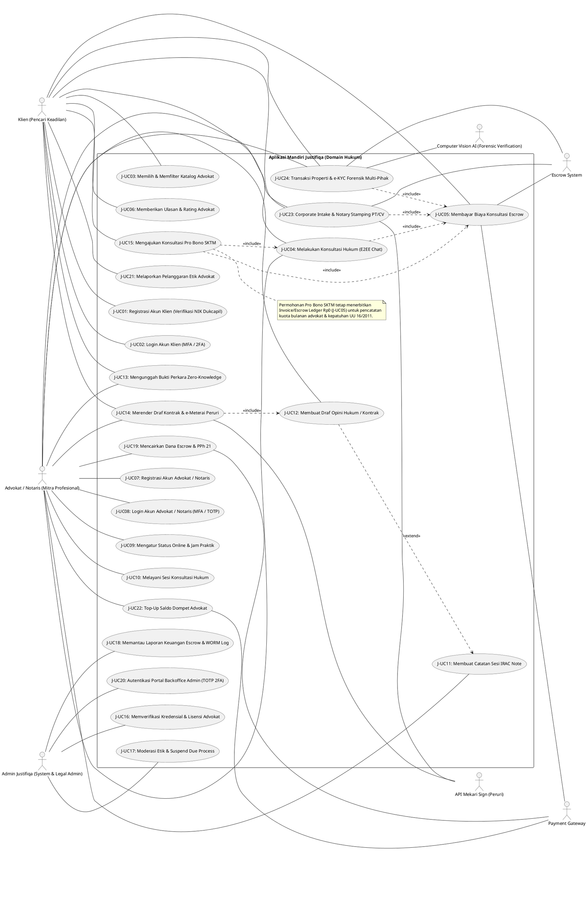

# Kumpulan Kode PlantUML - Justifiqa Standalone Application (Domain Hukum)

Dokumen ini berisi kode PlantUML untuk Use Case Diagram **Aplikasi Mandiri Justifiqa** (Platform Konsultasi, Transaksi, Corporate Intake, & Legal-Tek Digital). Seluruh Use Case di sini selaras 1-to-1 dengan **22 Use Case Kanonik + 2 Target Phase 2** pada `TRACEABILITY_MATRIX.md`.

---

## Cara Import ke Draw.io
1. Buka Draw.io (`app.diagrams.net`).
2. Pada toolbar bagian atas, klik tombol **`+` (Insert)** atau pilih menu **Arrange -> Insert**.
3. Pilih **Advanced -> PlantUML...**.
4. Salin dan tempel kode di bawah ini, lalu klik **Insert**.

---

### Use Case Diagram - Aplikasi Mandiri Justifiqa (Domain Hukum)
*Representasi sistem mandiri Justifiqa yang mencakup seluruh alur pengguna (Klien Hukum, Advokat/Notaris Mitra, Admin Backoffice Justifiqa) beserta sistem eksternal pendukung (Payment Gateway, Escrow System, API Mekari Sign e-Meterai, Computer Vision AI).*

---

**END OF FILE.**
